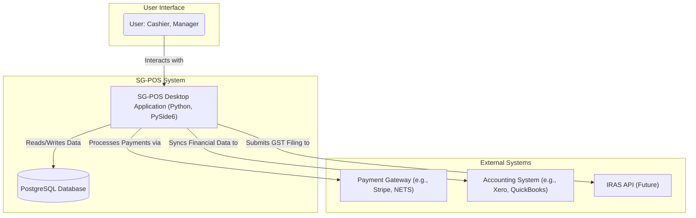
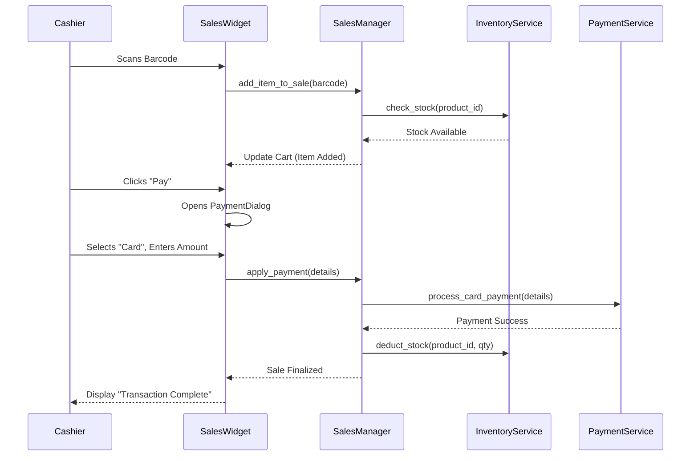

By combining the technical rigor of **Design 18**, the business clarity of **Design 2**, and the pragmatic elements of the other proposals, we will create a comprehensive, fool-proof blueprint.

Here is the super-set SG Point-of-Sale (POS) System PRD.

---

# **Definitive Product Requirements Document (PRD): SG Point-of-Sale System**

**Version:** 2.0 (Super-Set Edition)  
**Date:** June 19, 2024  
**Status:** Approved for Implementation

## **Table of Contents**

1.  [**Executive Summary**](#1-executive-summary)
2.  [**Part 1: Business & Product Vision**](#part-1-business--product-vision)
    1.  [Product Vision & Mission](#21-product-vision--mission)
    2.  [Business Goals & Success Metrics (SMART)](#22-business-goals--success-metrics-smart)
    3.  [Target Market & User Personas](#23-target-market--user-personas)
    4.  [Competitive Landscape & Key Differentiators](#24-competitive-landscape--key-differentiators)
3.  [**Part 2: Functional & Regulatory Requirements**](#part-2-functional--regulatory-requirements)
    1.  [User Stories (Epics)](#31-user-stories-epics)
    2.  [Detailed Functional Requirements](#32-detailed-functional-requirements)
    3.  [Singapore Regulatory & Compliance Requirements](#33-singapore-regulatory--compliance-requirements)
4.  [**Part 3: System & Technical Architecture**](#part-3-system--technical-architecture)
    1.  [Architectural Principles & Philosophy](#41-architectural-principles--philosophy)
    2.  [High-Level System Diagram (C4 Model)](#42-high-level-system-diagram-c4-model)
    3.  [Layered Architecture Deep Dive](#43-layered-architecture-deep-dive)
    4.  [Asynchronous Processing Model](#44-asynchronous-processing-model)
    5.  [Core Design Patterns (DI, Result, DTOs)](#45-core-design-patterns-di-result-dtos)
5.  [**Part 4: Data & Persistence**](#part-4-data--persistence)
    1.  [Database Schema Design & Rationale](#51-database-schema-design--rationale)
    2.  [Detailed Schema (DDL)](#52-detailed-schema-ddl)
    3.  [Data Integrity & Constraints](#53-data-integrity--constraints)
    4.  [Auditing Strategy](#54-auditing-strategy)
6.  [**Part 5: Implementation Blueprint**](#part-5-implementation-blueprint)
    1.  [Codebase File Hierarchy](#61-codebase-file-hierarchy)
    2.  [Key Module & Component Specifications](#62-key-module--component-specifications)
    3.  [User Interaction & Workflow Diagrams](#63-user-interaction--workflow-diagrams)
7.  [**Part 6: Technology & Environments**](#part-6-technology--environments)
    1.  [Technology Stack & Rationale](#71-technology-stack--rationale)
    2.  [Development Environment Setup](#72-development-environment-setup)
    3.  [Production Environment Setup](#73-production-environment-setup)
8.  [**Part 7: Quality, Security, & Operations**](#part-7-quality-security--operations)
    1.  [Non-Functional Requirements (NFRs)](#81-non-functional-requirements-nfrs)
    2.  [Security Architecture & Considerations](#82-security-architecture--considerations)
    3.  [Testing Strategy](#83-testing-strategy)
    4.  [Deployment & CI/CD Strategy](#84-deployment--cicd-strategy)
9.  [**Part 8: Project Management & Future Vision**](#part-8-project-management--future-vision)
    1.  [Future Roadmap](#91-future-roadmap)
    2.  [Risks & Mitigation Strategies](#92-risks--mitigation-strategies)
10. [**Glossary of Terms**](#10-glossary-of-terms)

---

## **1. Executive Summary**

The SG Point-of-Sale (SG-POS) System is an enterprise-grade, cross-platform desktop application meticulously designed for the specific needs of Small to Medium-sized Businesses (SMBs) in Singapore. This document serves as the definitive blueprint for its development, synthesizing the best architectural patterns and functional specifications from all prior proposals.

Built on a robust stack of Python 3.11+, PySide6, and PostgreSQL, SG-POS is engineered for reliability, performance, and compliance. It features a clean, layered architecture with a sophisticated asynchronous model to ensure a fluid user experience. Core design principles include Dependency Injection (DI) for modularity, the Result pattern for predictable error handling, and Data Transfer Objects (DTOs) for clear data contracts between layers.

Functionally, the system offers a comprehensive suite of tools for sales processing, advanced inventory management, customer relationship management (CRM), and integrated accounting. Crucially, it provides native, out-of-the-box compliance with Singapore's regulatory landscape, including Goods & Services Tax (GST) calculations as per IRAS guidelines, multi-currency transaction handling, and adherence to the Personal Data Protection Act (PDPA).

This PRD provides a "no-brainer" guide for the development team, leaving no ambiguity in its technical specifications, business logic, or operational requirements, thereby ensuring the delivery of a market-leading, high-quality product.

---

## **Part 1: Business & Product Vision**

### 2.1. Product Vision & Mission

**Vision:** To be the most trusted and efficient digital backbone for Singapore's SMB retail sector, empowering businesses to thrive through streamlined operations, actionable insights, and effortless compliance.

**Mission:** To deliver a world-class, affordable, and user-centric POS system that seamlessly integrates sales, inventory, and financial management, specifically tailored to the nuances of the Singaporean business environment.

### 2.2. Business Goals & Success Metrics (SMART)

| # | Goal | Specific Metric | Target | Timeframe |
|:---:|:---|:---|:---:|:---:|
| 1 | **Improve Checkout Speed** | End-to-end checkout time for a 5-item transaction. | ≤ 10 seconds (scan to receipt) | Within 3 months of launch |
| 2 | **Ensure GST Compliance** | Number of critical findings in mock IRAS audits. | 0 | Annually |
| 3 | **Boost User Adoption** | Percentage of customers using at least one "advanced" feature (e.g., reporting, CRM). | 75% | Within 6 months of launch |
| 4 | **Maintain High Reliability** | System uptime during retail business hours (8 AM - 10 PM SGT). | ≥ 99.9% | Measured monthly |
| 5 | **Achieve Market Penetration** | Number of active SMB subscribers. | 500 | Within 18 months of launch |

### 2.3. Target Market & User Personas

The system is designed for Singapore-based SMBs with 1-10 outlets and 2-50 employees.

| Persona | Description & Role | Pain Points with Existing Systems | Goals with SG-POS |
| :--- | :--- | :--- | :--- |
| **Chloe, the Cashier** | 23, Part-time student | "The old system is slow, crashes during peak hours, and finding products without a barcode is a nightmare." | "I want to serve customers quickly, handle returns without calling my manager, and avoid making mistakes." |
| **Darren, the Store Manager** | 35, Manages 3 fashion outlets | "I spend hours manually reconciling stock. I never know our exact inventory level in real-time." | "I need a live view of sales and stock across all my stores from one dashboard. I want to automate reordering." |
| **Mei, the Accountant** | 42, Handles finances for the chain | "Exporting data for GST filing is a manual, error-prone copy-paste job. Reconciling payments is a headache." | "I need an IRAS-compliant GST report at the click of a button and a clean export for Xero/QuickBooks." |
| **Mr. Tan, the Owner** | 55, Founder of the retail business | "I feel like I'm flying blind. I don't have good data on what's selling, who my best customers are, or which staff are top performers." | "I need clear, actionable reports to make strategic decisions about pricing, stock, and expansion." |

### 2.4. Competitive Landscape & Key Differentiators

| Competitor Category | Strengths | Weaknesses | SG-POS Differentiator |
| :--- | :--- | :--- | :--- |
| **Global Giants (e.g., Lightspeed, Shopify POS)** | Feature-rich, polished UI | Expensive, not tailored for SG regulations (GST is often an afterthought) | **Native GST & Regulatory Compliance.** Built from the ground up for IRAS. |
| **Local Players (e.g., Qashier, Epos)** | Understand local needs | Often lack architectural sophistication, less scalable, dated UI | **Enterprise-Grade Architecture.** Professional, scalable, and maintainable codebase. |
| **Legacy Desktop Systems** | Familiar to some users | Clunky, poor security, no cloud features, difficult to maintain | **Modern Tech Stack & Offline-First Sync.** Combines desktop reliability with cloud benefits. |

---

## **Part 2: Functional & Regulatory Requirements**

### 3.1. User Stories (Epics)

*   **Epic 1: Flawless Sales & Checkout Experience**
    *   As a Cashier, I want to scan barcodes or search for products instantly so I can serve customers without delay.
    *   As a Cashier, I want to process multiple payment types (cash, NETS, PayNow, credit card) in a single transaction to accommodate customer preferences.
    *   As a Store Manager, I want to process returns and exchanges by looking up the original receipt number to ensure accurate inventory and financial adjustments.
*   **Epic 2: Intelligent Inventory Management**
    *   As a Store Manager, I want the system to automatically deduct stock in real-time as sales are made so that our inventory counts are always accurate.
    *   As an Inventory Manager, I want to receive automated alerts when stock levels fall below a reorder point so I can create purchase orders proactively.
    *   As a Business Owner, I want to view consolidated stock levels across all my outlets to make informed decisions on inter-store transfers.
*   **Epic 3: Effortless GST Compliance & Accounting**
    *   As an Accountant, I want to generate an IRAS-compliant GST F5 report for a given quarter with a single click to simplify tax filing.
    *   As a Business Owner, I want all transactions to automatically generate corresponding double-entry journal records to maintain accurate financial books.
*   **Epic 4: Insightful Business Reporting**
    *   As a Business Owner, I want to view a real-time dashboard with KPIs like daily revenue, average transaction value, and top-selling products.
    *   As a Store Manager, I want to compare sales performance between different staff members to identify training needs and reward top performers.

### 3.2. Detailed Functional Requirements
*(A full feature list would be exhaustive; this section details key functionalities)*

| ID | Feature | Description | Acceptance Criteria |
|:---|:---|:---|:---|
| **FR-S-01** | **Split Tender Payments** | Allow a single transaction total to be paid for using multiple payment methods. | 1. User can select "Split Payment". 2. User can enter amounts for Cash, Card, PayNow, etc. 3. System validates that the sum of partial payments equals the total amount due. 4. Each payment leg is recorded separately. |
| **FR-I-01** | **Automated Reorder Alerts** | The system must monitor stock levels against pre-defined reorder points and generate alerts. | 1. Reorder point can be set per product/variant. 2. An alert/notification is created when `quantity_on_hand` <= `reorder_point`. 3. A dedicated dashboard widget shows all items needing reordering. |
| **FR-C-01** | **Tiered Loyalty Program** | Support multiple customer tiers (e.g., Bronze, Silver, Gold) with different point accrual rates and benefits. | 1. Tiers can be configured in settings. 2. Customers are automatically promoted/demoted based on spending thresholds. 3. Point calculation at checkout correctly applies the tier-specific multiplier. |
| **FR-A-01** | **GST F5 Report Generation** | Generate a report matching the structure of the IRAS GST Form 5. | 1. Report aggregates total standard-rated supplies (Box 1), zero-rated supplies (Box 2), exempt supplies (Box 3), and input tax (Box 5). 2. Data can be filtered by the relevant accounting period. 3. Report can be exported to PDF and CSV. |
| **FR-O-01** | **Offline Transaction Processing** | Core sales functions must remain operational without an active internet connection. | 1. Cashier can process sales, accept cash payments, and print receipts while offline. 2. Offline transactions are stored securely in a local queue. 3. When connectivity is restored, the queue automatically syncs with the central database. |

### 3.3. Singapore Regulatory & Compliance Requirements

| Requirement | Description | System Implementation |
|:---|:---|:---|
| **GST Act & IRAS IAF** | Goods & Services Tax must be calculated, collected, and reported accurately. The system should be capable of producing the IRAS Audit File (IAF). | - GST calculation engine supporting standard (8%), zero, and exempt rates. - `gst_transactions` table to log tax details for every line item. - `GSTManager` module to generate F5/F7 reports and IAF-compliant CSV exports. |
| **PDPA** | The Personal Data Protection Act governs the collection, use, and disclosure of personal data. | - Explicit consent checkboxes during customer registration. - Customer data is encrypted at rest. - Role-based access controls to limit access to PII. - Features to support data access and deletion requests. |
| **Peppol e-Invoicing** | IMDA has adopted the Peppol network for standardized e-invoicing. | - `integrations/peppol_connector.py` module to format B2B invoices in Peppol BIS Billing 3.0 SG format. - Ability to send invoices to businesses via their UEN on the Peppol network. |
| **Payment Services Act** | Regulations governing payment service providers. | - The system will not process payments directly. It will integrate with licensed Payment Service Providers (e.g., Stripe, NETS) via their secure terminals/APIs, ensuring cardholder data is never stored on the POS system itself (PCI-DSS compliance via tokenization). |

---

## **Part 3: System & Technical Architecture**

### 4.1. Architectural Principles & Philosophy

*   **Separation of Concerns (SoC):** The system is built on a strict layered architecture. Each layer has a single, well-defined responsibility, preventing tight coupling and improving maintainability.
*   **Dependency Inversion Principle (DIP):** High-level modules (business logic) do not depend on low-level modules (data access). Both depend on abstractions (interfaces/protocols). This is achieved via Dependency Injection.
*   **Single Responsibility Principle (SRP):** Each class or module has one, and only one, reason to change. For example, a `ProductRepository` only handles data persistence for products; it does not contain pricing logic.
*   **Asynchronous First:** All I/O-bound operations (database queries, network requests, file access) are designed to be asynchronous to prevent blocking the main UI thread, ensuring a smooth and responsive user experience.

### 4.2. High-Level System Diagram (C4 Model)



### 4.3. Layered Architecture Deep Dive

The architecture is composed of four distinct layers:

1.  **Presentation Layer (`app/ui/`)**:
    *   **Responsibility:** All things related to the user interface. Renders widgets, captures user input, and displays data. It is "dumb" and contains no business logic.
    *   **Technologies:** PySide6 (Widgets, Qt Models, Signals & Slots).
    *   **Interaction:** Communicates exclusively with the `ApplicationCore` to delegate actions and receive data updates.

2.  **Business Logic Layer (`app/business_logic/`)**:
    *   **Responsibility:** Orchestrates business workflows and enforces business rules. This is the heart of the application.
    *   **Components:**
        *   **Managers:** High-level classes that coordinate complex operations (e.g., `SalesManager` orchestrates inventory deduction, payment processing, and journal entry creation for a sale).
        *   **Validators:** Classes that encapsulate complex validation rules.
        *   **Calculators:** Components for specific calculations (e.g., `GSTCalculator`).
    *   **Interaction:** Is given a reference to `ApplicationCore` and uses it to access Data Access Layer services.

3.  **Data Access Layer (`app/services/`)**:
    *   **Responsibility:** Provides a clean, abstract API for data persistence. It implements the **Repository Pattern**.
    *   **Components:**
        *   **Services/Repositories:** Classes like `ProductService` or `CustomerRepository` that provide methods like `get_by_id`, `find_by_sku`, `save`.
    *   **Interaction:** Is used by the Business Logic Layer. It translates business objects/DTOs into database operations using the ORM.

4.  **Persistence Layer (`app/models/` & Database Engine)**:
    *   **Responsibility:** Defines the data structures and handles the physical storage.
    *   **Components:**
        *   **SQLAlchemy Models:** Python classes that map to database tables.
        *   **PostgreSQL Engine:** The actual database server.
        *   **Alembic Migrations:** Scripts for versioning the database schema.

### 4.4. Asynchronous Processing Model

The application runs two primary event loops in separate threads to maintain UI responsiveness.

1.  **Main Thread:** Runs the Qt `QApplication` event loop. This thread is exclusively for UI rendering and handling user interactions. It must *never* be blocked by long-running tasks.
2.  **Worker Thread:** Runs a standard Python `asyncio` event loop. All database queries, file I/O, and network requests are executed on this thread as `async` tasks.

**Communication Bridge:** A thread-safe mechanism is used to communicate between the two loops.

*   **UI → Async:** A function like `schedule_task_from_qt(coro, on_done_callback)` will be used. It submits the coroutine to the asyncio loop and optionally attaches a callback to be executed on the UI thread when the task completes.
*   **Async → UI:** The `on_done_callback` uses `QMetaObject.invokeMethod` with `Qt.QueuedConnection` to safely schedule a function call on the main UI thread, passing the result of the async task. This is the only safe way to update widgets from a background thread.

### 4.5. Core Design Patterns (DI, Result, DTOs)

*   **Dependency Injection (DI):** The `ApplicationCore` class acts as a service locator and DI container. It is instantiated once and passed to high-level components (like UI windows and business managers). It provides access to all services and other managers via lazy-loaded properties. This decouples components and makes testing trivial by allowing mock objects to be injected.
    ```python
    # In ApplicationCore
    @property
    def sales_manager(self) -> SalesManager:
        if 'sales' not in self._managers:
            self._managers['sales'] = SalesManager(self)
        return self._managers['sales']
    ```

*   **Result Pattern:** Instead of raising exceptions for predictable business errors (e.g., "Insufficient Stock", "Invalid Customer ID"), methods in the business and service layers will return a `Result` object.
    ```python
    # In result.py
    from typing import TypeVar, Generic, Union
    
    T = TypeVar('T') # Success type
    E = TypeVar('E') # Error type
    
    class Success(Generic[T]): ...
    class Failure(Generic[E]): ...
    
    Result = Union[Success[T], Failure[E]]
    
    # In SalesManager
    def process_sale(...) -> Result[SaleReceipt, SaleProcessingError]:
        if not stock_available:
            return Failure(SaleProcessingError.INSUFFICIENT_STOCK)
        ...
        return Success(sale_receipt)
    ```
    This makes error handling explicit and robust, forcing the calling code to handle failure paths.

*   **Data Transfer Objects (DTOs):** Pydantic models are used to define the data structures passed between layers. This creates a clear, validated "contract." For instance, the UI will construct a `CreateSaleDTO` and pass it to the `SalesManager`, which in turn might get `ProductDTO`s from the `ProductService`. This prevents leaking database ORM models into the business or UI layers.

---

## **Part 4: Data & Persistence**

### 5.1. Database Schema Design & Rationale

*   **Primary Keys:** All primary keys are `UUID`s (`DEFAULT gen_random_uuid()`). This avoids conflicts in multi-master or distributed scenarios and decouples the key from any business meaning.
*   **Foreign Keys:** Referential integrity is strictly enforced with `FOREIGN KEY` constraints and `ON DELETE RESTRICT` as the default to prevent accidental data loss.
*   **Data Types:** `NUMERIC(precision, scale)` is used for all monetary values to avoid floating-point inaccuracies. `TIMESTAMPTZ` is used for all timestamps to ensure timezone correctness.
*   **Auditing:** Critical tables have `created_at` and `updated_at` columns. A separate `audit_logs` table provides a comprehensive, immutable log of changes.
*   **Soft Deletes:** Key entities like `products` and `customers` use an `is_active` flag instead of hard deletion to preserve historical data integrity.

### 5.2. Detailed Schema (DDL)

```sql
-- Enable UUID generation
CREATE EXTENSION IF NOT EXISTS "pgcrypto";

-- === CORE BUSINESS TABLES ===

CREATE TABLE companies (
    id UUID PRIMARY KEY DEFAULT gen_random_uuid(),
    name VARCHAR(255) NOT NULL,
    registration_number VARCHAR(20) UNIQUE NOT NULL,
    gst_registration_number VARCHAR(20),
    address TEXT,
    phone VARCHAR(20),
    created_at TIMESTAMPTZ NOT NULL DEFAULT NOW(),
    updated_at TIMESTAMPTZ NOT NULL DEFAULT NOW()
);

CREATE TABLE users (
    id UUID PRIMARY KEY DEFAULT gen_random_uuid(),
    company_id UUID NOT NULL REFERENCES companies(id),
    username VARCHAR(100) NOT NULL,
    email VARCHAR(255) NOT NULL,
    password_hash VARCHAR(255) NOT NULL,
    full_name VARCHAR(255),
    role VARCHAR(50) NOT NULL CHECK (role IN ('admin', 'manager', 'cashier')),
    is_active BOOLEAN NOT NULL DEFAULT true,
    created_at TIMESTAMPTZ NOT NULL DEFAULT NOW(),
    updated_at TIMESTAMPTZ NOT NULL DEFAULT NOW(),
    UNIQUE(company_id, username),
    UNIQUE(company_id, email)
);

-- === PRODUCT & INVENTORY ===

CREATE TABLE categories (
    id UUID PRIMARY KEY DEFAULT gen_random_uuid(),
    company_id UUID NOT NULL REFERENCES companies(id),
    parent_id UUID REFERENCES categories(id) ON DELETE SET NULL,
    name VARCHAR(255) NOT NULL,
    created_at TIMESTAMPTZ NOT NULL DEFAULT NOW()
);

CREATE TABLE products (
    id UUID PRIMARY KEY DEFAULT gen_random_uuid(),
    company_id UUID NOT NULL REFERENCES companies(id),
    category_id UUID REFERENCES categories(id),
    sku VARCHAR(100) NOT NULL,
    barcode VARCHAR(100),
    name VARCHAR(255) NOT NULL,
    description TEXT,
    cost_price NUMERIC(19, 4) NOT NULL DEFAULT 0,
    selling_price NUMERIC(19, 4) NOT NULL,
    gst_rate NUMERIC(5, 2) NOT NULL DEFAULT 8.00, -- Current SG GST rate
    track_inventory BOOLEAN NOT NULL DEFAULT true,
    reorder_point INT NOT NULL DEFAULT 0,
    is_active BOOLEAN NOT NULL DEFAULT true,
    created_at TIMESTAMPTZ NOT NULL DEFAULT NOW(),
    updated_at TIMESTAMPTZ NOT NULL DEFAULT NOW(),
    UNIQUE(company_id, sku)
);

CREATE TABLE inventory (
    id UUID PRIMARY KEY DEFAULT gen_random_uuid(),
    company_id UUID NOT NULL REFERENCES companies(id),
    product_id UUID NOT NULL REFERENCES products(id),
    quantity_on_hand NUMERIC(15, 4) NOT NULL DEFAULT 0,
    -- outlet_id could be added here for multi-location
    last_updated_at TIMESTAMPTZ NOT NULL DEFAULT NOW(),
    UNIQUE(company_id, product_id)
);

-- === SALES & TRANSACTIONS ===

CREATE TABLE customers (
    id UUID PRIMARY KEY DEFAULT gen_random_uuid(),
    company_id UUID NOT NULL REFERENCES companies(id),
    customer_code VARCHAR(50) NOT NULL,
    name VARCHAR(255) NOT NULL,
    email VARCHAR(255),
    phone VARCHAR(50),
    loyalty_points INT NOT NULL DEFAULT 0,
    is_active BOOLEAN NOT NULL DEFAULT true,
    created_at TIMESTAMPTZ NOT NULL DEFAULT NOW(),
    updated_at TIMESTAMPTZ NOT NULL DEFAULT NOW(),
    UNIQUE(company_id, customer_code)
);

CREATE TABLE sales_transactions (
    id UUID PRIMARY KEY DEFAULT gen_random_uuid(),
    company_id UUID NOT NULL REFERENCES companies(id),
    transaction_number VARCHAR(50) NOT NULL,
    transaction_date TIMESTAMPTZ NOT NULL DEFAULT NOW(),
    customer_id UUID REFERENCES customers(id),
    cashier_id UUID NOT NULL REFERENCES users(id),
    subtotal NUMERIC(19, 2) NOT NULL,
    tax_amount NUMERIC(19, 2) NOT NULL,
    discount_amount NUMERIC(19, 2) NOT NULL DEFAULT 0,
    total_amount NUMERIC(19, 2) NOT NULL,
    status VARCHAR(20) NOT NULL CHECK (status IN ('COMPLETED', 'VOIDED', 'HELD')),
    created_at TIMESTAMPTZ NOT NULL DEFAULT NOW(),
    updated_at TIMESTAMPTZ NOT NULL DEFAULT NOW(),
    UNIQUE(company_id, transaction_number)
);

CREATE TABLE sales_transaction_items (
    id UUID PRIMARY KEY DEFAULT gen_random_uuid(),
    sales_transaction_id UUID NOT NULL REFERENCES sales_transactions(id),
    product_id UUID NOT NULL REFERENCES products(id),
    quantity NUMERIC(15, 4) NOT NULL,
    unit_price NUMERIC(19, 4) NOT NULL, -- Price at time of sale
    cost_price NUMERIC(19, 4) NOT NULL, -- Cost at time of sale for margin analysis
    line_total NUMERIC(19, 2) NOT NULL
);

CREATE TABLE payments (
    id UUID PRIMARY KEY DEFAULT gen_random_uuid(),
    sales_transaction_id UUID NOT NULL REFERENCES sales_transactions(id),
    payment_method VARCHAR(50) NOT NULL CHECK (payment_method IN ('CASH', 'CARD', 'NETS', 'PAYNOW')),
    amount NUMERIC(19, 2) NOT NULL,
    reference_number VARCHAR(100),
    created_at TIMESTAMPTZ NOT NULL DEFAULT NOW()
);

-- === AUDITING ===

CREATE TABLE audit_logs (
    id BIGSERIAL PRIMARY KEY,
    company_id UUID,
    user_id UUID REFERENCES users(id),
    action VARCHAR(50) NOT NULL, -- e.g., 'CREATE_PRODUCT', 'UPDATE_PRICE'
    table_name VARCHAR(100) NOT NULL,
    record_id UUID NOT NULL,
    old_values JSONB,
    new_values JSONB,
    ip_address INET,
    created_at TIMESTAMPTZ NOT NULL DEFAULT NOW()
);
```

### 5.3. Data Integrity & Constraints
*   **CHECK Constraints:** Used to enforce valid values for `enum`-like fields (e.g., `role`, `status`).
*   **Generated Columns:** Could be used for calculated fields like `line_total` to ensure consistency, though application-level calculation is also viable.
*   **Triggers:** An `update_updated_at` trigger will be applied to all tables with an `updated_at` column. An audit trigger will be attached to critical tables (`products`, `sales_transactions`, etc.) to automatically populate the `audit_logs` table.

### 5.4. Auditing Strategy
The `audit_logs` table provides a comprehensive, immutable history of changes.
*   The `old_values` and `new_values` columns will store `JSONB` snapshots of the row before and after the change.
*   A trigger function will capture the `session_user` and other context variables to populate `user_id` and `ip_address`.
*   This creates a fully compliant audit trail required for financial and security reviews.

---

## **Part 5: Implementation Blueprint**

### 6.1. Codebase File Hierarchy

This structure is designed for scalability and clearly reflects the layered architecture.

```
sg-pos-system/
├── app/
│   ├── __init__.py
│   ├── main.py                     # Application entry point
│   ├── core/
│   │   ├── __init__.py
│   │   ├── application_core.py     # DI container
│   │   ├── config.py               # Configuration loading
│   │   ├── exceptions.py           # Custom exception classes
│   │   └── result.py               # Result pattern
│   ├── models/                     # SQLAlchemy ORM models
│   │   ├── __init__.py
│   │   ├── base.py
│   │   └── ... (e.g., product.py, customer.py)
│   ├── services/                   # Data Access Layer (Repositories)
│   │   ├── __init__.py
│   │   ├── product_service.py
│   │   └── ...
│   ├── business_logic/             # Business Logic Layer
│   │   ├── __init__.py
│   │   ├── managers/
│   │   │   ├── __init__.py
│   │   │   ├── sales_manager.py
│   │   │   └── ...
│   │   └── dto/                    # Data Transfer Objects
│   │       ├── __init__.py
│   │       └── product_dto.py
│   ├── ui/                         # Presentation Layer
│   │   ├── __init__.py
│   │   ├── main_window.py
│   │   ├── widgets/
│   │   │   ├── __init__.py
│   │   │   └── sales_widget.py
│   │   └── dialogs/
│   │       ├── __init__.py
│   │       └── payment_dialog.py
│   ├── integrations/               # External API connectors
│   │   └── __init__.py
│   └── utils/                      # Shared utility functions
│       └── __init__.py
├── tests/                          # Test suite
│   ├── unit/
│   ├── integration/
│   └── e2e/
├── scripts/                        # Utility & DB scripts
├── resources/                      # Static assets (icons, QSS)
├── docs/                           # Project documentation
├── migrations/                     # Alembic migrations
├── .env.example
├── pyproject.toml
└── README.md
```

### 6.2. Key Module & Component Specifications

#### **ApplicationCore (`app/core/application_core.py`)**
*   **Responsibility:** The heart of the application's dependency management. It instantiates the database engine, session factory, and provides lazy-loaded access to all business managers and services.
*   **Key Methods/Properties:**
    *   `initialize()`: Sets up DB connections and other core resources.
    *   `get_session()`: Provides a database session for a unit of work.
    *   `@property sales_manager`, `@property product_service`, etc.: Lazy-loaded singletons.

#### **SalesManager (`app/business_logic/managers/sales_manager.py`)**
*   **Responsibility:** Orchestrates the entire sales process.
*   **Key Methods:**
    *   `create_new_sale(...) -> Result[SaleDTO, Error]`: Initiates a transaction.
    *   `add_item_to_sale(...)`: Adds a product, checks inventory.
    *   `apply_payment(...)`: Integrates with the `PaymentService`.
    *   `finalize_sale(...)`: Commits the transaction, updates inventory, creates journal entries.

#### **ProductService (`app/services/product_service.py`)**
*   **Responsibility:** Implements the Repository pattern for `Product` entities.
*   **Key Methods:**
    *   `async get_by_sku(sku: str) -> Optional[Product]`: Fetches a product by its SKU.
    *   `async search(term: str) -> List[Product]`: Performs a text search on products.
    *   `async save(product: Product) -> Product`: Creates or updates a product in the database.

#### **SalesWidget (`app/ui/widgets/sales_widget.py`)**
*   **Responsibility:** The main UI for cashiers. It handles input, displays the cart, and triggers business logic via the `ApplicationCore`.
*   **Key Components:**
    *   `ProductSearchLineEdit`: A custom widget for finding products.
    *   `CartTableView`: Displays items in the current sale.
    *   `PaymentButton`: Opens the `PaymentDialog`.
*   **Interaction:** All button clicks and user inputs are connected to slots that call methods on a manager (e.g., `self.app_core.sales_manager.add_item_to_sale(...)`). The result is then used to update the UI.

### 6.3. User Interaction & Workflow Diagrams

#### **Standard Sale Workflow**



---

## **Part 6: Technology & Environments**

### 7.1. Technology Stack & Rationale

| Component | Technology | Rationale |
|:---|:---|:---|
| **Language** | Python 3.11+ | Modern features, strong typing, vast ecosystem, excellent for business logic. |
| **GUI** | PySide6 (Qt 6) | Professional, high-performance, cross-platform native UI. |
| **Database** | PostgreSQL 15+ | Robust, ACID-compliant, scalable, excellent for financial data. |
| **ORM** | SQLAlchemy 2.0 | Powerful, mature, and provides excellent async support. |
| **DB Migrations** | Alembic | Industry standard for managing SQLAlchemy schema versions. |
| **Async I/O** | asyncio | Native Python library for non-blocking I/O. |
| **Data Validation** | Pydantic | Enforces data contracts (DTOs) with clear, declarative syntax. |
| **Testing** | Pytest | Flexible, powerful testing framework with a rich plugin ecosystem. |
| **Packaging** | Poetry | Manages dependencies and builds reproducible environments. |
| **Code Quality** | Black, Ruff, MyPy | Ensures consistent style, linting, and static type safety. |

### 7.2. Development Environment Setup

1.  **Prerequisites:**
    *   Git
    *   Python 3.11+
    *   Poetry
    *   Docker & Docker Compose (for running PostgreSQL locally)

2.  **Setup Steps:**
    ```bash
    # 1. Clone the repository
    git clone <repo_url> sg-pos-system
    cd sg-pos-system

    # 2. Start the database container
    docker compose up -d db

    # 3. Install project dependencies using Poetry
    poetry install

    # 4. Activate the virtual environment
    poetry shell

    # 5. Run database migrations to set up the schema
    alembic upgrade head

    # 6. (Optional) Seed the database with sample data
    python scripts/seed_data.py

    # 7. Run the application
    python app/main.py
    ```

3.  **IDE Configuration (VS Code Example):**
    *   Install the official Python extension.
    *   Set the Python interpreter to the one managed by Poetry (`.venv/bin/python`).
    *   Configure `black` as the default formatter and `ruff` as the linter.
    *   Configure `pytest` as the test runner.

### 7.3. Production Environment Setup

1.  **Infrastructure Philosophy:** 12-Factor App principles. Configuration via environment variables. Stateless application containers.
2.  **Server Requirements:**
    *   OS: Ubuntu 22.04 LTS or equivalent Linux distribution.
    *   CPU: 4+ cores.
    *   RAM: 8GB minimum, 16GB+ recommended for larger stores.
    *   Storage: SSD with regular backups.
3.  **Deployment Method: Docker**
    *   A multi-stage `Dockerfile` will be used to build a lean production image.
    *   `docker-compose.prod.yml` will define the application service, a PostgreSQL service, and a reverse proxy (like Nginx or Traefik) for potential future web-facing APIs.
4.  **Configuration:**
    *   All secrets (DB passwords, API keys) will be injected as environment variables, sourced from a `.env` file or a secret management system like HashiCorp Vault.
5.  **Database:**
    *   A managed PostgreSQL service (e.g., AWS RDS, DigitalOcean Managed Databases) is recommended for production to handle backups, scaling, and failover automatically.
6.  **Process Management:**
    *   The Docker container will be managed by the Docker daemon, configured to restart automatically on failure. For non-containerized deployments, a `systemd` service file will be used.
7.  **Logging:**
    *   The application will log structured JSON to `stdout`. The container runtime will be configured to forward these logs to a centralized logging service (e.g., ELK Stack, Datadog, Grafana Loki).

---

## **Part 7: Quality, Security, & Operations**

### 8.1. Non-Functional Requirements (NFRs)

| Category | Requirement |
|:---|:---|
| **Performance** | - Core UI interactions must feel instant (<200ms). - A standard sales transaction must complete in under 2 seconds. - Reports with up to 1 year of data must generate in under 15 seconds. |
| **Reliability** | - 99.9% uptime during defined business hours. - Graceful handling of network disconnects (offline mode). - Atomic database transactions to prevent data corruption. |
| **Security** | - All sensitive data (passwords, PII) encrypted at rest and in transit. - Role-based access control (RBAC) enforced at both UI and API levels. - Protection against common vulnerabilities (SQL Injection, etc.). |
| **Scalability** | - The system must support up to 50 concurrent terminals in a single-store setup. - Database schema must be designed to handle 5+ years of transaction data without significant performance degradation. |
| **Usability** | - A new cashier must be able to process a standard sale with less than 30 minutes of training. - The system must be fully navigable via keyboard. |

### 8.2. Security Architecture & Considerations

*   **Authentication:** Passwords will be hashed using `bcrypt`. JWTs (JSON Web Tokens) with short expiry and refresh tokens will be used for session management.
*   **Authorization:** RBAC will be implemented. A middleware or decorator will check user permissions before executing sensitive business logic.
*   **Data Encryption:** Sensitive fields in the database can be encrypted at the application level using libraries like `cryptography`. All network traffic will be over TLS.
*   **Input Sanitization:** All user input will be validated at the DTO level using Pydantic and sanitized before being used in database queries to prevent SQL injection.

### 8.3. Testing Strategy

*   **Unit Tests:** Every function, method, and class will have corresponding unit tests. Business logic in managers and data queries in services will have high coverage (>90%). Mocks will be used to isolate components.
*   **Integration Tests:** These tests will verify the interaction between different layers (e.g., a manager calling a service which then interacts with a real test database). The entire sales workflow will be covered by integration tests.
*   **End-to-End (E2E) Tests:** `pytest-qt` will be used to simulate user interactions on the GUI to test complete user flows from start to finish.
*   **Continuous Integration (CI):** A GitHub Actions workflow will run on every push and pull request. The CI pipeline will automatically run all tests, linting, and static analysis, blocking merges if any checks fail.

### 8.4. Deployment & CI/CD Strategy

1.  **Git Flow:** A feature-branch workflow will be used. All changes are made in a feature branch, a PR is created, it must pass CI checks and a peer review, and then it is merged into the `main` branch.
2.  **Versioning:** Semantic Versioning (Major.Minor.Patch) will be used.
3.  **CI Pipeline (GitHub Actions):**
    *   Trigger: On push to any branch or on PR to `main`.
    *   Jobs:
        1.  **Lint & Format:** Run `black --check` and `ruff`.
        2.  **Static Analysis:** Run `mypy`.
        3.  **Run Tests:** Execute the full `pytest` suite against a test database.
        4.  **Build Docker Image:** If on `main` branch, build and tag the production Docker image.
4.  **Continuous Deployment (CD):**
    *   When a new tag is pushed (e.g., `v1.2.0`), a "Release" workflow is triggered.
    *   This workflow pushes the tagged Docker image to a container registry (e.g., Docker Hub, AWS ECR).
    *   (Optional) It can then automatically trigger a deployment on a staging or production server (e.g., by running `docker compose pull && docker compose up -d` on the server).

---

## **Part 8: Project Management & Future Vision**

### 9.1. Future Roadmap

*   **Phase 1.1 (Post-Launch):**
    *   Integrated E-commerce Connector (Shopify, WooCommerce).
    *   Advanced promotions module (e.g., "Buy One Get One Free").
    *   Mobile companion app for dashboard viewing.
*   **Phase 1.2:**
    *   AI-driven inventory forecasting.
    *   Enhanced CRM with email marketing integration.
    *   Multi-outlet real-time dashboard consolidation.
*   **Phase 2.0:**
    *   Full cloud-native version of the backend.
    *   Plugin/Marketplace API for third-party developers.

### 9.2. Risks & Mitigation Strategies

| Risk | Likelihood | Impact | Mitigation Strategy |
|:---|:---|:---|:---|
| **Scope Creep** | High | Medium | Strictly adhere to this PRD. All changes must go through a formal change request process. |
| **Performance Issues at Scale** | Medium | High | - Proactive performance testing. - Database indexing and query optimization reviews. - Caching layer for read-heavy operations. |
| **Changes in IRAS GST Regulations** | High | High | - GST rates and rules will be stored in configuration, not hardcoded. - The `GSTManager` module is designed to be easily updated to reflect new rules. |
| **Third-Party Payment Gateway Failure** | Medium | Medium | - Implement the Circuit Breaker pattern for API calls. - Support multiple payment gateways to allow for failover. - Robust offline mode to continue cash sales. |

---

## **10. Glossary of Terms**

*   **ACID:** Atomicity, Consistency, Isolation, Durability. Properties guaranteeing database transaction reliability.
*   **DI (Dependency Injection):** A design pattern where components are given their dependencies rather than creating them.
*   **DTO (Data Transfer Object):** An object that carries data between processes or layers.
*   **GST:** Goods & Services Tax.
*   **IRAS:** Inland Revenue Authority of Singapore.
*   **ORM (Object-Relational Mapping):** A technique for converting data between incompatible type systems in object-oriented programming languages.
*   **PDPA:** Personal Data Protection Act (Singapore).
*   **UEN:** Unique Entity Number.

---
**End of Document**
