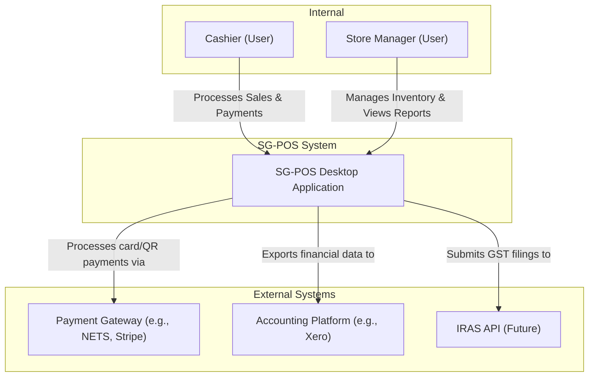
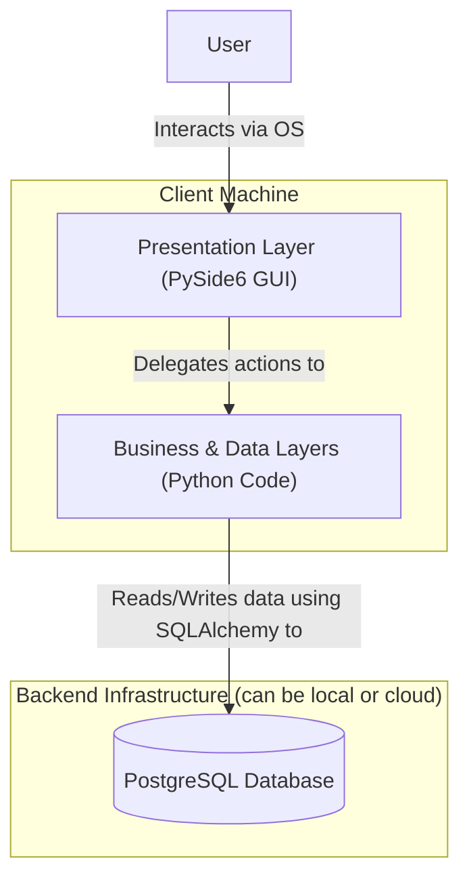

A well-documented architecture is the single most important asset for a development team's success, especially for a project of this scale and complexity. It provides the "constitution" for the codebase, ensuring that as the team grows and the project evolves, the code remains clean, consistent, and maintainable.

I will now create the definitive **Project Architecture Document (PAD)** for the SG-POS System. This document will synthesize the best elements from the previous designs into a single, cohesive, and deeply detailed blueprint. It is designed to be a "living handbook" that developers can refer to throughout the project lifecycle.

---

# **Project Architecture Document (PAD): SG Point-of-Sale System**

**Version:** 2.0 (Super-Set Edition)  
**Date:** June 19, 2024  
**Status:** Approved for Implementation

## **Table of Contents**

1.  [**1. Architectural Philosophy & Guiding Principles**](#1-architectural-philosophy--guiding-principles)
    *   1.1. Core Tenets
    *   1.2. The "Why" Behind Our Choices
2.  [**2. High-Level System Architecture**](#2-high-level-system-architecture)
    *   2.1. System Context Diagram (C4 Model - Level 1)
    *   2.2. Container Diagram (C4 Model - Level 2)
3.  [**3. The Layered Architecture: A Deep Dive**](#3-the-layered-architecture-a-deep-dive)
    *   3.1. Layer Responsibilities & Boundaries
    *   3.2. Communication Flow Between Layers
4.  [**4. Core Architectural Patterns in Practice**](#4-core-architectural-patterns-in-practice)
    *   4.1. Dependency Injection: The `ApplicationCore`
    *   4.2. The Result Pattern: Explicit Error Handling
    *   4.3. Data Transfer Objects (DTOs): Clean Data Contracts
    *   4.4. Asynchronous Model: The UI/Async Bridge
5.  [**5. Codebase File Hierarchy**](#5-codebase-file-hierarchy)
    *   5.1. Visual Directory Tree
    *   5.2. Rationale for the Structure
6.  [**6. Key Module & File Specifications**](#6-key-module--file-specifications)
    *   6.1. Core Infrastructure (`app/core/`)
    *   6.2. Persistence Layer (`app/models/`)
    *   6.3. Data Access Layer (`app/services/`)
    *   6.4. Business Logic Layer (`app/business_logic/`)
    *   6.5. Presentation Layer (`app/ui/`)
7.  [**7. Bash Script to Create Directory Structure**](#7-bash-script-to-create-directory-structure)
8.  [**8. Conclusion**](#8-conclusion)

---

## **1. Architectural Philosophy & Guiding Principles**

This document outlines an architecture that prioritizes **long-term maintainability, developer productivity, and system robustness** over short-term implementation speed. Every decision is made with the goal of creating a codebase that is a pleasure to work on, easy to test, and capable of evolving with future business needs.

### 1.1. Core Tenets

1.  **Strict Separation of Concerns (SoC):** The system is built upon a clean, layered architecture. Each layer has a single, well-defined responsibility and is forbidden from reaching "across" layers, ensuring that changes in one area (e.g., the UI) have minimal impact on others (e.g., the database).
2.  **Dependency Inversion Principle (DIP):** High-level business logic should not depend on low-level data access details. Both should depend on abstractions. This is the foundation of our testable, modular design, primarily achieved through Dependency Injection.
3.  **Explicit Over Implicit:** The codebase should be easy to read and understand. We favor explicit patterns like the **Result Pattern** for error handling over relying on exceptions for control flow. Data contracts between layers are made explicit through **DTOs**.
4.  **Asynchronous First:** To guarantee a fluid and responsive user experience, all potentially blocking I/O operations (database, network, file system) are executed asynchronously in a background thread, leaving the main UI thread free to handle user interactions.
5.  **Testability as a First-Class Citizen:** The architecture is designed from the ground up to be testable. Decoupled components allow for focused unit tests, while well-defined interfaces enable comprehensive integration testing.

### 1.2. The "Why" Behind Our Choices

*   **Why a Layered Architecture?** It prevents the creation of "spaghetti code." By enforcing strict boundaries, we ensure the system can be scaled and modified predictably. A new developer can understand the system's structure by understanding the role of each layer.
*   **Why Dependency Injection?** It breaks hard-coded dependencies between components. The `SalesManager` doesn't need to know *how* to create an `InventoryService`; it just asks the `ApplicationCore` for one. This allows us to easily swap out implementations (e.g., a real `InventoryService` in production vs. a `MockInventoryService` in tests).
*   **Why the Result Pattern?** Traditional exception handling can obscure the possible outcomes of a function. By returning a `Result` object (`Success` or `Failure`), a function's signature explicitly declares its possible failure modes. This forces the calling code to handle errors gracefully and makes the application more robust and predictable.
*   **Why DTOs?** DTOs prevent "leaky abstractions." They stop database-specific ORM models from spreading throughout the application. This means we could, in theory, switch our ORM or even our database without having to refactor the entire business logic and UI layers. They define a stable, versionable API between system layers.

---

## **2. High-Level System Architecture**

### 2.1. System Context Diagram (C4 Model - Level 1)

This diagram shows the SG-POS system as a "black box" and its relationships with users and external systems.



### 2.2. Container Diagram (C4 Model - Level 2)

This diagram zooms into the SG-POS system, showing its high-level components.



---

## **3. The Layered Architecture: A Deep Dive**

### 3.1. Layer Responsibilities & Boundaries

1.  **Presentation Layer (`app/ui/`)**
    *   **Responsibility:** To present data to the user and to collect user input. It is the "view" in an MVC-like pattern.
    *   **It CAN:**
        *   Instantiate and display PySide6 widgets.
        *   Connect UI signals (like button clicks) to slots.
        *   Receive data (as DTOs) and display it in tables, forms, etc.
        *   Perform basic, purely cosmetic input formatting (e.g., formatting a number as currency for display).
    *   **It CANNOT:**
        *   Contain any business rules (e.g., logic for calculating GST).
        *   Access the database directly.
        *   Make external network calls.
        *   Modify data DTOs; it treats them as read-only.

2.  **Business Logic Layer (`app/business_logic/`)**
    *   **Responsibility:** To execute core business processes and enforce business rules. It orchestrates the application's behavior.
    *   **It CAN:**
        *   Contain high-level "Manager" classes that define workflows (e.g., `SalesManager.finalize_sale()`).
        *   Use "Service" classes from the Data Access Layer to fetch and save data.
        *   Perform complex validations and calculations.
        *   Consume and produce DTOs.
    *   **It CANNOT:**
        *   Have any knowledge of UI widgets or PySide6.
        *   Contain SQL or raw database queries.
        *   Handle UI events directly.

3.  **Data Access Layer (`app/services/`)**
    *   **Responsibility:** To provide a simplified, abstract interface for data persistence. It implements the Repository Pattern.
    *   **It CAN:**
        *   Use SQLAlchemy to construct and execute database queries.
        *   Map data between database ORM models and DTOs.
        *   Manage database transactions (begin, commit, rollback).
    *   **It CANNOT:**
        *   Contain business logic. The `ProductService` can fetch a product, but it doesn't know *why* it's being fetched (e.g., for a sale vs. a stock take).
        *   Interact with the UI.

4.  **Persistence Layer (`app/models/` & Database)**
    *   **Responsibility:** To define the structure of the data and ensure its integrity at the lowest level.
    *   **It CAN:**
        *   Define tables, columns, and relationships using SQLAlchemy ORM classes.
        *   Enforce data integrity with database constraints (`NOT NULL`, `UNIQUE`, `CHECK`).
        *   Use triggers for low-level, data-centric automation (like updating an `updated_at` timestamp).
    *   **It CANNOT:**
        *   Contain business logic. Triggers should never be used to implement complex business rules, as this makes the system difficult to test and reason about.

### 3.2. Communication Flow Between Layers

The flow of control is strictly top-down, and the flow of data is typically bottom-up.

`UI -> ApplicationCore -> Business Manager -> Data Service -> ORM Model -> Database`

1.  A user clicks a "Save" button in the **UI**.
2.  The UI slot calls a method on a **Business Manager** (e.g., `app_core.product_manager.create_product(dto)`), which it gets from the `ApplicationCore`. It passes the data collected from the form as a DTO.
3.  The **Business Manager** validates the DTO, applies any business rules, and then calls a method on a **Data Service** (e.g., `product_service.save(product_orm_model)`), passing the data mapped to an ORM model.
4.  The **Data Service** executes the database operation using SQLAlchemy.
5.  The result (e.g., the newly created product with its ID) flows back up the chain.

---

## **4. Core Architectural Patterns in Practice**

### 4.1. Dependency Injection: The `ApplicationCore`

The `ApplicationCore` is the lynchpin of our architecture. It's a singleton-like object that is instantiated once when the application starts.

**Purpose:** To act as a central "service locator" or DI container. It creates, manages, and provides access to all major services and managers.

**Implementation (`app/core/application_core.py`):**
```python
class ApplicationCore:
    """Central DI container providing lazy-loaded access to services."""
    def __init__(self, config):
        self.config = config
        self._db_engine = create_async_engine(config.DATABASE_URL)
        self._session_factory = async_sessionmaker(self._db_engine, class_=AsyncSession)
        
        self._managers = {}
        self._services = {}

    @asynccontextmanager
    async def get_session(self) -> AsyncIterator[AsyncSession]:
        """Provides a database session for a unit of work."""
        async with self._session_factory() as session:
            try:
                yield session
                await session.commit()
            except Exception:
                await session.rollback()
                raise

    @property
    def product_service(self) -> ProductService:
        """Lazy-loaded singleton for ProductService."""
        if "product" not in self._services:
            from app.services.product_service import ProductService
            self._services["product"] = ProductService(self)
        return self._services["product"]

    @property
    def sales_manager(self) -> SalesManager:
        """Lazy-loaded singleton for SalesManager."""
        if "sales" not in self._managers:
            from app.business_logic.managers.sales_manager import SalesManager
            self._managers["sales"] = SalesManager(self)
        return self._managers["sales"]

    # ... similar properties for every other service and manager
```
A manager or service gets its dependencies by accessing properties on the `app_core` instance passed to its constructor.

### 4.2. The Result Pattern: Explicit Error Handling

**Purpose:** To make function outcomes explicit and to handle predictable errors without resorting to exceptions, leading to more robust and readable code.

**Implementation (`app/core/result.py`):**
```python
from typing import TypeVar, Generic, Union, Optional
from dataclasses import dataclass

T = TypeVar('T') # Success type
E = TypeVar('E') # Error type

@dataclass(frozen=True)
class Success(Generic[T]):
    value: T

@dataclass(frozen=True)
class Failure(Generic[E]):
    error: E

Result = Union[Success[T], Failure[E]]

# Example Usage in a Manager
async def create_product(self, dto: ProductCreateDTO) -> Result[ProductDTO, str]:
    if await self.product_service.sku_exists(dto.sku):
        return Failure(f"SKU '{dto.sku}' already exists.")
    
    # ... logic to create product ...
    
    return Success(created_product_dto)

# Example Usage in the UI
result = await self.app_core.product_manager.create_product(dto)
if isinstance(result, Success):
    QMessageBox.information(self, "Success", f"Product '{result.value.name}' created!")
else:
    QMessageBox.critical(self, "Error", result.error)
```

### 4.3. Data Transfer Objects (DTOs): Clean Data Contracts

**Purpose:** To create clear, versionable, and validated data structures for communication between layers. We use `pydantic` for this.

**Implementation (`app/business_logic/dto/product_dto.py`):**
```python
from pydantic import BaseModel, Field
from decimal import Decimal
from uuid import UUID

class ProductDTO(BaseModel):
    """DTO representing a product for use in the business and UI layers."""
    id: UUID
    sku: str
    name: str
    selling_price: Decimal

    class Config:
        orm_mode = True # Allows creating DTO from SQLAlchemy model

class ProductCreateDTO(BaseModel):
    """DTO for creating a new product. No ID yet."""
    sku: str = Field(..., min_length=1, max_length=100)
    name: str = Field(..., min_length=1, max_length=255)
    selling_price: Decimal = Field(..., gt=0)
```
This ensures that the data passed to the `create_product` manager method is already validated.

### 4.4. Asynchronous Model: The UI/Async Bridge

**Purpose:** To run I/O-bound tasks in the background without freezing the UI.

**Implementation (`app/core/async_bridge.py`):**
A dedicated `QThread` runs the `asyncio` event loop. The UI thread communicates with it via a custom signal-slot mechanism.

```python
# A simplified conceptual view
class AsyncWorker(QObject):
    # Signal that carries the result of the async task back to the UI thread
    task_finished = Signal(object, object) # result, error

    def run_task(self, coro, original_sender):
        async def task_wrapper():
            try:
                result = await coro
                self.task_finished.emit(result, None)
            except Exception as e:
                self.task_finished.emit(None, e)
        
        asyncio.run_coroutine_threadsafe(task_wrapper(), self.async_loop)

# In a UI Widget
def on_save_button_clicked(self):
    dto = self.get_data_from_form()
    coro = self.app_core.product_manager.create_product(dto)
    
    # Disable button, show spinner
    self.save_button.setEnabled(False) 
    
    self.async_worker.run_task(coro, self)

@Slot(object, object)
def handle_save_result(self, result, error):
    # This slot is executed on the UI thread
    self.save_button.setEnabled(True) 
    
    if error:
        QMessageBox.critical(self, "Error", str(error))
    else:
        QMessageBox.information(self, "Success", "Product saved!")
```

---

## **5. Codebase File Hierarchy**

### 5.1. Visual Directory Tree

This structure provides a logical map of the entire project, organized by architectural layer and feature.

```
sg-pos-system/
├── app/
│   ├── __init__.py
│   ├── main.py                     # Application entry point & Qt App setup
│   ├── core/
│   │   ├── __init__.py
│   │   ├── application_core.py     # DI container
│   │   ├── config.py               # Handles loading .env and settings
│   │   ├── exceptions.py           # Custom application exceptions
│   │   ├── result.py               # Result[Success, Failure] pattern
│   │   └── async_bridge.py         # Manages the Qt/asyncio interaction
│   ├── models/                     # SQLAlchemy ORM Models (Persistence Layer)
│   │   ├── __init__.py
│   │   ├── base.py                 # Base model with common columns (id, created_at)
│   │   ├── company.py
│   │   ├── user.py
│   │   ├── product.py
│   │   ├── inventory.py
│   │   ├── customer.py
│   │   ├── sales.py
│   │   └── accounting.py
│   ├── services/                   # Data Access Layer
│   │   ├── __init__.py
│   │   ├── base_service.py         # Base class for services (Repositories)
│   │   ├── product_service.py
│   │   ├── inventory_service.py
│   │   ├── sales_service.py
│   │   └── ... (other services)
│   ├── business_logic/             # Business Logic Layer
│   │   ├── __init__.py
│   │   ├── managers/
│   │   │   ├── __init__.py
│   │   │   ├── sales_manager.py
│   │   │   ├── inventory_manager.py
│   │   │   └── ...
│   │   └── dto/                    # Data Transfer Objects
│   │       ├── __init__.py
│   │       ├── product_dto.py
│   │       └── ...
│   ├── ui/                         # Presentation Layer
│   │   ├── __init__.py
│   │   ├── main_window.py          # Main application window shell
│   │   ├── widgets/                # Reusable custom widgets
│   │   │   ├── __init__.py
│   │   │   └── searchable_table_view.py
│   │   ├── views/                  # High-level views/screens
│   │   │   ├── __init__.py
│   │   │   ├── pos_view.py
│   │   │   ├── inventory_view.py
│   │   │   └── ...
│   │   ├── dialogs/                # Modal dialogs
│   │   │   ├── __init__.py
│   │   │   └── payment_dialog.py
│   │   └── resources/
│   │       ├── icons/
│   │       └── styles.qss
│   └── integrations/
│       ├── __init__.py
│       └── stripe_connector.py
├── tests/
│   ├── __init__.py
│   ├── conftest.py                 # Pytest fixtures and setup
│   ├── unit/                       # Unit tests (no DB or network)
│   └── integration/                # Integration tests (with test DB)
├── scripts/
│   ├── database/
│   │   └── schema.sql              # The full DDL schema
│   └── seed_data.py
├── migrations/                     # Alembic migration scripts
├── docs/                           # Project documentation
├── .env.example                    # Template for environment variables
├── pyproject.toml                  # Poetry project definition
└── README.md
```

### 5.2. Rationale for the Structure

*   **Top-Level `app/`:** Standard practice for Python applications, clearly separating application code from project scaffolding like tests and scripts.
*   **Layered Directories:** The `core`, `models`, `services`, `business_logic`, and `ui` directories directly map to the defined architectural layers. This makes the code's structure predictable and easy to navigate.
*   **Separation of DTOs:** Placing DTOs inside the `business_logic` layer reinforces their role as the data contract for that layer. The UI uses them for input, and the services return them as output.
*   **Granular UI Folder:** The `ui` directory is broken down into `widgets`, `views`, and `dialogs` to manage complexity as the UI grows. Reusable components go in `widgets`, while major application screens go in `views`.
*   **Clear Separation of Tests:** The `tests` directory mirrors the `app` structure, making it easy to find the tests for a specific piece of code. The distinction between `unit` and `integration` tests is crucial for running fast feedback cycles (unit tests) versus more thorough checks (integration tests).

---

## **6. Key Module & File Specifications**

This section details the purpose and interfaces of the most critical files in the codebase.

### 6.1. Core Infrastructure (`app/core/`)

| File | Purpose & Description | Key Components & Interfaces |
| :--- | :--- | :--- |
| **`application_core.py`** | **Purpose:** The central DI container. **Description:** Manages the lifecycle and provides access to all major application services and managers. It is the glue that holds the decoupled components together. | **Classes:** `ApplicationCore`. **Interfaces:** Provides `@property` accessors like `app_core.sales_manager`, `app_core.product_service`. Consumes a `Config` object during initialization. |
| **`config.py`** | **Purpose:** Manages all application configuration. **Description:** Loads settings from a `.env` file and environment variables. Provides a strongly-typed way to access configuration values. | **Classes:** `Settings` (Pydantic `BaseSettings`). **Interfaces:** Provides attributes like `config.DATABASE_URL`, `config.LOG_LEVEL`. |
| **`result.py`** | **Purpose:** Defines the Result monad for explicit error handling. **Description:** Contains the `Result`, `Success`, and `Failure` classes. This pattern is used throughout the service and business logic layers. | **Classes:** `Result`, `Success`, `Failure`. **Interfaces:** `Result.is_success()`, `Result.is_failure()`, `.value`, `.error`. |
| **`async_bridge.py`** | **Purpose:** Manages the interaction between the Qt and asyncio event loops. **Description:** Contains the worker `QThread` that runs the asyncio loop and the mechanisms to safely schedule tasks and return results to the UI thread. | **Classes:** `AsyncWorkerThread`. **Interfaces:** A function like `schedule_async_task(coro)` for the UI to call. Emits a Qt `Signal` with the result. |

### 6.2. Persistence Layer (`app/models/`)

| File | Purpose & Description | Key Components & Interfaces |
| :--- | :--- | :--- |
| **`base.py`** | **Purpose:** Defines the declarative base for SQLAlchemy and common mixin classes. **Description:** All ORM models inherit from `Base`. A `TimestampMixin` can be included to automatically add `created_at` and `updated_at` columns. | **Classes:** `Base`, `TimestampMixin`. **Interfaces:** Inherited by all other models. |
| **`product.py`** | **Purpose:** Defines the database schema for products, categories, and variants. **Description:** Contains the SQLAlchemy ORM classes `Product`, `Category`, `ProductVariant`, defining their columns, data types, constraints, and relationships. | **Classes:** `Product`, `Category`, `ProductVariant`. **Interfaces:** Used by `SQLAlchemy` and accessed via `ProductService`. |
| **`sales.py`** | **Purpose:** Defines the schema for sales transactions, line items, and payments. **Description:** Contains the `SalesTransaction`, `SalesTransactionItem`, and `Payment` ORM models. | **Classes:** `SalesTransaction`, `SalesTransactionItem`, `Payment`. **Interfaces:** Used by `SQLAlchemy` and accessed via `SalesService` and `PaymentService`. |

### 6.3. Data Access Layer (`app/services/`)

| File | Purpose & Description | Key Components & Interfaces |
| :--- | :--- | :--- |
| **`base_service.py`** | **Purpose:** An abstract base class for repositories. **Description:** Can define common methods like `get_by_id`, `get_all`, `delete` to reduce boilerplate code in concrete service implementations. | **Classes:** `BaseService`. **Interfaces:** Defines methods to be implemented by child services. |
| **`product_service.py`** | **Purpose:** Implements the Repository pattern for `Product` data. **Description:** Handles all direct database interactions for products. This includes creating, reading, updating, and deleting product records. It maps data from ORM models to DTOs. | **Classes:** `ProductService`. **Interfaces:** `async get_product_by_sku(sku) -> Result[ProductDTO, DbError]`, `async save_product(dto) -> Result[ProductDTO, DbError]`. Consumes ORM models and produces DTOs. |
| **`sales_service.py`** | **Purpose:** Implements the Repository pattern for sales data. **Description:** Manages the persistence of `SalesTransaction` aggregates. It ensures that sales and their related line items and payments are saved atomically. | **Classes:** `SalesService`. **Interfaces:** `async create_transaction_with_items(...) -> Result[SalesTransaction, DbError]`. |

### 6.4. Business Logic Layer (`app/business_logic/`)

| File | Purpose & Description | Key Components & Interfaces |
| :--- | :--- | :--- |
| **`managers/sales_manager.py`** | **Purpose:** Orchestrates the entire business process of making a sale. **Description:** This is a high-level manager that coordinates multiple services. When a sale is finalized, it calls the `InventoryService` to deduct stock, the `SalesService` to save the transaction, and the `AccountingService` to create journal entries, all within a single unit of work. | **Classes:** `SalesManager`. **Interfaces:** `async finalize_sale(dto) -> Result[FinalizedSaleDTO, SaleError]`. **Dependencies:** `InventoryService`, `SalesService`, `PaymentService`, `AccountingService`. |
| **`managers/inventory_manager.py`** | **Purpose:** Manages all business logic related to inventory. **Description:** Handles logic for stock adjustments, checks for sufficient stock before a sale, and triggers reorder alerts. | **Classes:** `InventoryManager`. **Interfaces:** `async check_availability(product_id, qty) -> Result[bool, InventoryError]`, `async adjust_stock(...)`. **Dependencies:** `InventoryService`, `ProductService`. |
| **`dto/product_dto.py`** | **Purpose:** Defines the data contract for product information. **Description:** Contains Pydantic models like `ProductDTO` and `ProductCreateDTO`. These models are used by the UI to send data to the business layer and by the business layer to send data to the UI. | **Classes:** `ProductDTO`, `ProductCreateDTO`. **Interfaces:** These classes *are* the interface. They define the required fields, data types, and validation rules. |

### 6.5. Presentation Layer (`app/ui/`)

| File | Purpose & Description | Key Components & Interfaces |
| :--- | :--- | :--- |
| **`main_window.py`** | **Purpose:** The main application window or shell. **Description:** It hosts all other views and widgets. It's responsible for the main menu, toolbar, and switching between different application screens (e.g., POS, Inventory, Reports). | **Classes:** `MainWindow(QMainWindow)`. **Interfaces:** Contains slots to switch views (e.g., `@Slot() def show_pos_view()`). It holds an instance of `ApplicationCore` to pass to its child views. |
| **`views/pos_view.py`** | **Purpose:** The primary Point-of-Sale screen. **Description:** This is the main interface used by cashiers. It contains the product search, the shopping cart display, and payment buttons. All its logic is delegated to business managers. | **Classes:** `POSView(QWidget)`. **Interfaces:** Emits Qt `Signal`s for user actions (e.g., `product_scanned = Signal(str)`). Has Qt `Slot`s to receive and display results from async tasks (e.g., `@Slot(ProductDTO) def display_product_info(...)`). |
| **`dialogs/payment_dialog.py`** | **Purpose:** A modal dialog for handling payments. **Description:** It allows the cashier to select a payment method, enter the amount tendered, and process the payment. It encapsulates the payment part of the workflow. | **Classes:** `PaymentDialog(QDialog)`. **Interfaces:** `exec()` returns `QDialog.Accepted` or `QDialog.Rejected`. It provides a public method or property to retrieve the payment details entered by the user. |

---

## **7. Bash Script to Create Directory Structure**

This script will create the complete file hierarchy for the project, including empty `__init__.py` files to define Python packages. Run this in the root of your new project directory.

```bash
#!/bin/bash

# =============================================================================
# SG-POS Project Directory Structure Creation Script
# =============================================================================
# This script creates the complete folder structure and placeholder files
# as defined in the Project Architecture Document.

echo "Creating SG-POS project structure..."

# Top-level directories
mkdir -p app \
    tests/unit \
    tests/integration \
    tests/e2e \
    scripts/database \
    migrations/versions \
    docs \
    resources

# App core structure
mkdir -p app/core \
    app/models \
    app/services \
    app/business_logic/managers \
    app/business_logic/dto \
    app/ui/views \
    app/ui/widgets \
    app/ui/dialogs \
    app/ui/resources/icons \
    app/integrations

# Create __init__.py files to make directories Python packages
find app -type d -exec touch {}/__init__.py \;
find tests -type d -exec touch {}/__init__.py \;

# Create key placeholder files
touch app/main.py
touch app/core/application_core.py
touch app/core/config.py
touch app/core/exceptions.py
touch app/core/result.py
touch app/core/async_bridge.py

touch app/models/base.py
touch app/services/base_service.py

touch app/ui/main_window.py
touch app/ui/resources/styles.qss

touch tests/conftest.py

touch .env.example
touch pyproject.toml
touch README.md
touch alembic.ini
touch .gitignore

echo "Project structure created successfully."
echo "Next steps:"
echo "1. Populate pyproject.toml with project metadata and dependencies."
echo "2. Populate .env.example with required environment variables."
echo "3. Configure alembic.ini to point to your database."

```

## **8. Conclusion**

This Project Architecture Document provides a comprehensive and detailed blueprint for the development of the SG-POS system. It establishes a strong foundation based on modern software engineering principles, ensuring the final product will be robust, scalable, maintainable, and fit for purpose in the demanding Singaporean retail market.

By adhering to the layered architecture, core patterns, and defined interfaces outlined herein, the development team can work collaboratively and efficiently, with a clear and shared understanding of the system's design and goals. This document will serve as the guiding star for all technical decisions throughout the project lifecycle.
