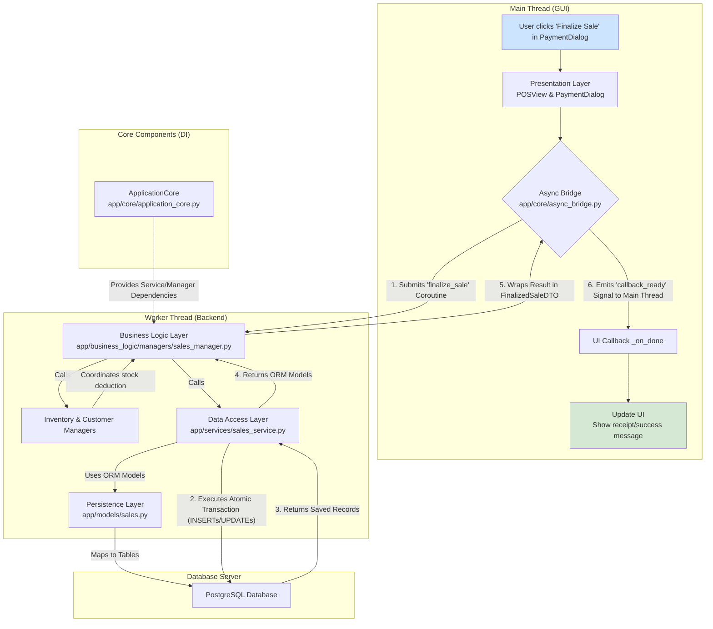

<p align="center">
  
</p>

<h1 align="center">SG Point-of-Sale (SG-POS) System</h1>

<p align="center">
  <strong>An enterprise-grade, open-source Point-of-Sale system, meticulously engineered for Singapore's SMB retail landscape.</strong>
</p>

<p align="center">
  <!-- Badges -->
  <a href="#">
    
  </a>
  <a href="https://github.com/your-org/sg-pos-system/blob/main/LICENSE">
    
  </a>
  <a href="https://www.python.org/">
    
  </a>
  <a href="https://www.qt.io/">
    
  </a>
  <a href="https://www.postgresql.org/">
    
  </a>
  <a href="https://github.com/psf/black">
    
  </a>
</p>

---

## 📖 Table of Contents

*   [1. Introduction: What is SG-POS?](#1-introduction-what-is-sg-pos)
*   [2. Current Features & Status](#2-current-features--status)
*   [3. Architectural Deep Dive](#3-architectural-deep-dive)
    *   [The Layered Architecture](#the-layered-architecture)
    *   [Module Interaction Flowchart](#module-interaction-flowchart)
*   [4. Codebase Deep Dive](#4-codebase-deep-dive)
    *   [Project File Hierarchy](#project-file-hierarchy)
    *   [Key File & Directory Descriptions](#key-file--directory-descriptions)
*   [5. Technology Stack](#5-technology-stack)
*   [6. Developer Setup & Deployment Guide](#6-developer-setup--deployment-guide)
    *   [Prerequisites](#prerequisites)
    *   [Step-by-Step Setup Guide](#step-by-step-setup-guide)
*   [7. Running the Test Suite](#7-running-the-test-suite)
*   [8. User Guide: Running the Application](#8-user-guide-running-the-application)
*   [9. Project Roadmap](#9-project-roadmap)
    *   [Immediate Next Steps (v1.6+)](#immediate-next-steps-v16)
    *   [Long-Term Vision (v2.0+)](#long-term-vision-v20)
*   [10. How to Contribute](#10-how-to-contribute)
*   [11. License](#11-license)

---

## **1. Introduction: What is SG-POS?**

**SG-POS** is a free and open-source Point-of-Sale system, engineered from the ground up to address the specific operational and regulatory challenges faced by Small to Medium-sized Businesses (SMBs) in Singapore. It aims to provide the power and polish of expensive enterprise systems in an accessible, modern, and maintainable package.

This project is built with an obsessive focus on quality, both in the user experience and, most importantly, in the engineering. It serves not only as a functional tool but also as a reference implementation for professional-grade Python application architecture, featuring a non-blocking UI, a clean, layered design, and robust data integrity practices. The system is designed to be the central hub for a retail business, managing everything from the customer-facing checkout process to backend inventory control, procurement, and financial reporting.

---

## **2. Current Features & Status**

The application is in a **stable** state, with a robust architecture and a wide range of functional core features. The UI has been significantly enhanced for a better user experience, and a foundational automated test suite is now in place to guarantee reliability.

| Feature Area                      | Status                  | Notes                                                                                                                              |
| --------------------------------- | ----------------------- | ---------------------------------------------------------------------------------------------------------------------------------- |
| **Dashboard**                     | ✅ **Functional**       | A new dashboard view provides at-a-glance KPIs for daily sales, transactions, new customers, and low-stock items.                   |
| **Sales & Checkout**              | ✅ **Functional**       | Core sales processing, cart management, split-tender payment collection, and receipt data generation are fully working.                |
| **Customer Management**           | ✅ **Functional**       | Full CRUD (Create, Read, Update, Deactivate) operations for customers. Table view provides loading and empty-state feedback.        |
| **Product Management**            | ✅ **Functional**       | Full CRUD operations for products, with responsive, debounced searching. Table view provides loading and empty-state feedback.        |
| **User & Role Management**        | ✅ **Functional**       | Full CRUD operations for users, including multi-role assignment. Table view provides loading and empty-state feedback.                |
| **Payment Methods Management**    | ✅ **Functional**       | A new UI in Settings allows for full CRUD operations on payment methods, replacing the previous placeholder.                           |
| **Inventory Management**          | ✅ **Functional**       | All inventory tables (summary, POs, movements) now provide clear loading/empty state feedback. All core functions are stable.       |
| **Purchase Orders & Stock-ins**   | ✅ **Functional**       | Creation of Purchase Orders and receiving of items (full or partial) against a PO are fully implemented and update stock levels correctly. |
| **Reporting & Analytics**         | ✅ **Functional**       | Backend correctly generates data for all reports. The UI displays reports and allows for PDF/CSV export.                             |
| **Automated Testing**             | ✅ **Foundational**     | A comprehensive unit test suite now covers all business logic managers and key services, running against an isolated in-memory database. |

---

## **3. Architectural Deep Dive**

SG-POS is built on a set of robust architectural principles designed for maintainability and scalability.

### The Layered Architecture

Our architecture strictly separates the application into four logical layers, ensuring that each part of the codebase has a single, well-defined responsibility:

1.  **Presentation Layer (`app/ui`):** Built with PySide6, this layer is responsible *only* for what the user sees and how they interact with it. It contains no business logic. When a user acts, the UI packages the input into a DTO and hands it to the Business Logic Layer via the application's core.

2.  **Business Logic Layer (`app/business_logic`):** The brain of the application. **Managers** (e.g., `SalesManager`) orchestrate workflows, enforce business rules, and make decisions. They use **DTOs** (Data Transfer Objects) as clean data contracts for communication with the UI.

3.  **Data Access Layer (`app/services`):** Implements the **Repository Pattern**. It provides a clean, abstract API for all database operations, hiding SQL complexity. Each service (e.g., `ProductService`) is responsible for querying a specific database entity.

4.  **Persistence Layer (`app/models`):** Defines the database schema using SQLAlchemy ORM models, which map directly to the PostgreSQL tables. This is the only layer aware of the database's table and column structure.

### Module Interaction Flowchart

The flow of control and data is unidirectional and decoupled, ensuring a responsive UI and testable components. The `ApplicationCore` acts as a Dependency Injection (DI) container, providing services and managers to the components that need them. The following diagram illustrates the flow for finalizing a sale.



This flow ensures that the UI (main thread) is never blocked. The `Async Bridge` offloads the heavy work (steps D, E, F, G, J) to a background thread, and the UI is only updated via a safe callback once all the work is complete.

---

## **4. Codebase Deep Dive**

A well-organized file structure is paramount for navigating and maintaining a complex codebase. The SG-POS project adheres to a standard, logical layout that reinforces the architectural layers.

### Project File Hierarchy

```
sg-pos-system/
│
├── .env.example                # Template for environment variables
├── .gitignore                  # Specifies files/directories to ignore in Git
├── alembic.ini                 # Configuration for Alembic database migrations
├── docker-compose.dev.yml      # Defines the PostgreSQL database service for Docker
├── pyproject.toml              # Project metadata, dependencies, and tool settings (Poetry)
│
├── app/                        # --- Main Application Source Code ---
│   ├── __init__.py
│   ├── main.py                 # Application entry point; initializes core and UI
│   │
│   ├── core/                   # Architectural backbone and cross-cutting concerns
│   ├── business_logic/         # Business Logic Layer
│   │   ├── dto/                # Data Transfer Objects (Pydantic models)
│   │   └── managers/           # Business workflow and rule orchestrators
│   ├── models/                 # Persistence Layer
│   ├── services/               # Data Access Layer
│   └── ui/                     # Presentation Layer
│       ├── dialogs/            # QDialog classes for specific tasks
│       ├── resources/          # QSS stylesheets, icons, etc.
│       ├── views/              # Main QWidget screens (Dashboard, POS, etc.)
│       └── widgets/            # Reusable custom widgets (KpiWidget, ManagedTableView)
│
├── migrations/                 # Alembic auto-generated migration scripts
│   ├── versions/
│   └── env.py
│
├── scripts/                    # Utility scripts for development
│   └── database/
│       ├── schema.sql          # A complete, plain SQL snapshot of the target schema
│       └── seed_data.py        # Script to populate a fresh database with initial data
│
└── tests/                      # Automated Test Suite
    ├── conftest.py             # Pytest fixtures and test environment setup
    ├── factories.py            # factory-boy definitions for creating test data
    └── unit/                   # Unit tests, mirroring the `app` directory structure
```

### Key File & Directory Descriptions

| Path                             | Description                                                                                              |
| -------------------------------- | -------------------------------------------------------------------------------------------------------- |
| `pyproject.toml`                 | **Project Definition.** Manages all dependencies (e.g., `PySide6`, `SQLAlchemy`), project metadata, and development tool configurations (`pytest`, `black`, `ruff`).     |
| `docker-compose.dev.yml`         | **Database Service.** Defines and configures the PostgreSQL database container for local development.        |
| `alembic.ini` / `migrations/`    | **Database Migrations.** Configuration and scripts for managing database schema evolution using Alembic. This allows for safe, version-controlled updates to the database structure. |
| `app/main.py`                    | **Application Entry Point.** The script to run. It initializes the `ApplicationCore`, creates the `MainWindow`, and starts the Qt event loop.        |
| `app/core/`                      | **The Backbone.** Contains the application's most critical, non-domain-specific code. This includes the `ApplicationCore` (the Dependency Injection container), the `async_bridge` for non-blocking UI operations, `config.py` for loading environment settings, and the `Result` pattern for robust error handling. |
| `app/models/`                    | **Persistence Layer.** Defines all SQLAlchemy ORM models, mirroring the database tables. Each file corresponds to a domain (e.g., `product.py`, `sales.py`), and each class within is a table. This is the single source of truth for the database schema.               |
| `app/services/`                  | **Data Access Layer.** Implements the Repository pattern; contains all database query logic. Services are responsible for translating high-level requests (e.g., "find product by SKU") into SQLAlchemy queries. They abstract all database complexity from the rest of the application.         |
| `app/business_logic/managers/`   | **Business Logic Layer.** The brain of the application. Managers orchestrate complex workflows (e.g., finalizing a sale involves inventory, payments, and sales records), enforce business rules (e.g., stock levels cannot be negative), and coordinate with multiple services.        |
| `app/business_logic/dto/`        | **Data Contracts.** Contains all Pydantic models used as Data Transfer Objects. These DTOs define the shape of data passed between the UI and the Business Logic Layer, creating a clean, validated, and decoupled interface.           |
| `app/ui/views/`                  | **Main UI Screens.** The primary user-facing views like the `DashboardView`, `POSView`, and data management screens (`ProductView`, `CustomerView`). Each view is a self-contained `QWidget`. |
| `app/ui/widgets/`                | **Reusable Components.** Contains custom widgets designed to be used across multiple views to ensure a consistent look and feel. The `ManagedTableView` (which provides loading/empty states) and `KpiWidget` (for the dashboard) are key examples that significantly enhance the UX. |
| `tests/`                         | **Automated Tests.** The complete unit test suite. `conftest.py` configures the test environment to use a fast, in-memory SQLite database, ensuring tests are isolated and reliable. `factories.py` provides tools to easily generate test data. |

---

## **5. Technology Stack**

This project uses a modern, professional-grade technology stack chosen for performance, reliability, and developer productivity.

| Category          | Technology                                         | Rationale                                                                                                   |
| ----------------- | -------------------------------------------------- | ----------------------------------------------------------------------------------------------------------- |
| **Language**      | Python 3.11+                                       | Modern features, performance improvements, and strong ecosystem.                                            |
| **GUI Framework** | PySide6 (Qt 6)                                     | The gold standard for professional, high-performance, cross-platform desktop applications in Python.        |
| **Database**      | PostgreSQL 16+                                     | Unmatched reliability, scalability, and feature set for handling critical business and financial data.      |
| **ORM**           | SQLAlchemy 2.0                                     | Industry-leading Object-Relational Mapper with powerful features and excellent async support.               |
| **DB Migrations** | Alembic                                            | The standard for managing database schema changes with SQLAlchemy.                                          |
| **Async**         | `asyncio`, `greenlet`                              | Python's native concurrency library, augmented with `greenlet` for seamless SQLAlchemy async operations.     |
| **Testing**       | `pytest`, `pytest-asyncio`, `aiosqlite`            | A powerful and flexible testing ecosystem for testing all aspects of the application against an in-memory DB. |
| **Packaging**     | Poetry                                             | Modern, reliable dependency management and packaging that guarantees reproducible environments.             |
| **Code Quality**  | Black (Formatter), Ruff (Linter), MyPy (Type Checker)| A trifecta of tools to enforce code style, catch bugs early, and ensure long-term maintainability.          |

---

## **6. Developer Setup & Deployment Guide**

This guide provides step-by-step instructions to set up a complete local development environment for the SG-POS application from scratch.

### Prerequisites

*   **Git:** For version control. [Install Git](https://git-scm.com/book/en/v2/Getting-Started-Installing-Git).
*   **Python 3.11+:** Make sure it's installed and available in your system's `PATH`. [Install Python](https://www.python.org/downloads/).
*   **Poetry:** For managing dependencies. See the [official installation guide](https://python-poetry.org/docs/#installation).
*   **Docker & Docker Compose:** To run the PostgreSQL database in a container. [Install Docker Desktop](https://www.docker.com/products/docker-desktop/).

### Step-by-Step Setup Guide

1.  **Clone the Repository**
    Open your terminal or command prompt and clone the project from GitHub.
    ```bash
    git clone https://github.com/your-org/sg-pos-system.git
    cd sg-pos-system
    ```

2.  **Configure Environment Variables**
    The application uses a `.env.dev` file for local configuration. Copy the provided template. The default values are already configured to connect to the Docker database.
    ```bash
    cp .env.example .env.dev
    ```

3.  **Start the Database Server**
    This command reads the `docker-compose.dev.yml` file, downloads the official PostgreSQL image, and starts the database server in a container. It will run in the background and expose the database on `localhost:5432`.
    ```bash
    docker compose -f docker-compose.dev.yml up -d
    ```
    You can check that it's running with `docker ps`.

4.  **Install Project Dependencies**
    This command reads the `pyproject.toml` file, creates a dedicated virtual environment for the project, and installs all production and development packages (like `pytest` and `black`).
    ```bash
    poetry install
    ```

5.  **Activate the Virtual Environment**
    To use the installed packages, you must activate the virtual environment created by Poetry. All subsequent commands must be run inside this environment.
    ```bash
    poetry shell
    ```
    Your command prompt should now be prefixed with the environment name (e.g., `(sg-pos-system-py3.11)`).

6.  **Apply Database Migrations**
    This is a critical step. The command connects to the running PostgreSQL database and uses Alembic to create all the necessary tables, indexes, and constraints within the `sgpos` schema.
    ```bash
    alembic upgrade head
    ```

7.  **Seed Initial Data (Crucial First-Time Step)**
    A fresh database is empty. This script populates it with the essential data required to run the application, including the default company, an admin user, and the main outlet.
    ```bash
    python scripts/database/seed_data.py
    ```

8.  **Run the Application**
    You are now ready to launch the POS system. The main window should appear.
    ```bash
    python app/main.py
    ```

## 7. Running the Test Suite
A key feature of this codebase is its comprehensive and reliable test suite. Running the tests is a critical step to ensure that your changes have not introduced any regressions.

*   **Run all tests:** To ensure the entire application logic is sound, run the following command from the project root (inside the `poetry shell`):
  ```bash
  pytest
  ```
  This will discover and run all tests in the `tests/` directory against an isolated, in-memory SQLite database, providing fast and reliable feedback.

*   **Check Test Coverage:** To see which parts of the application are covered by tests, you can generate a report in your terminal or as a more detailed HTML report:
  ```bash
  # For a quick summary in the terminal
  pytest --cov=app

  # For a detailed, browsable HTML report
  pytest --cov=app --cov-report=html
  ```
  After running the second command, open the generated `htmlcov/index.html` file in your browser to explore coverage line by line.

## **8. User Guide: Running the Application**

Once the application is running, here is a brief guide on how to use its core features:

*   **Navigation:** Use the menu bar at the top of the window (`Dashboard`, `POS`, `Data Management`, etc.) to switch between the different sections of the application. The application uses lazy-loading, so views are only created the first time you navigate to them, ensuring a fast startup.
*   **Dashboard:** The Dashboard is the first view you might want to check. Navigate via `Dashboard > Show Dashboard`. It provides a live look at today's sales, transaction counts, and other key metrics. It automatically refreshes with the latest data each time you view it.
*   **Making a Sale:**
    1.  Navigate to `POS > Sales Screen`. This is the default view on startup.
    2.  Use the product search bar to find an item by its SKU or name and click **"Add to Cart"**. The item will appear in the cart on the left.
    3.  Once all items are added, click the green **"PAY"** button.
    4.  In the `Process Payment` dialog, select a payment method, enter the amount tendered, and click **"Add Payment"**. You can add multiple payments for split-tender transactions.
    5.  Once the balance is zero or less, click **"Finalize Sale"**. A success message will appear, and the cart will be cleared for the next transaction.
*   **Managing Data (Products, Customers, etc.):**
    1.  Navigate to a management screen like `Data Management > Products`.
    2.  The view will show a "Loading..." message and then display the data. If no data exists, it will show an informative "No products found" message. This stateful feedback is consistent across all data views.
    3.  Use the **"Add New"**, **"Edit Selected"**, and **"Deactivate Selected"** buttons to manage records. Double-clicking a row is a shortcut for editing.
*   **Settings:**
    1.  Navigate to `Settings > Application Settings`.
    2.  Here you can manage Company Information, add or edit Users and their roles, and manage Payment Methods.

## **9. Project Roadmap**

With the core features and UI/UX baseline established, the project is well-positioned for future growth.

### Immediate Next Steps (v1.6+)

*   **Expand Test Coverage:** Continue to build out the test suite, focusing on the data access (service) layer and adding basic UI tests with `pytest-qt` to validate signal/slot connections and dialog behavior.
*   **Advanced Promotions Module:** Implement logic for complex discounts (e.g., "Buy One Get One", tiered discounts, customer-group-specific pricing). This would involve new models and a dedicated `PromotionManager`.
*   **Global Status Bar:** Add a `QStatusBar` to the `MainWindow` to provide non-intrusive feedback for operations like saving data or connection status, improving the user's awareness of background activities.
*   **Refine Dashboard:** Add more KPIs and simple charts (e.g., a bar chart for weekly sales) to the dashboard. This would involve enhancing the `ReportService` with more aggregation queries.
*   **Improve Search UX:** Implement the debouncing `QTimer` pattern (currently in `ProductView`) across all other searchable views (`CustomerView`, `InventoryView`) to improve performance and reduce database load.

### Long-Term Vision (v2.0+)

*   **Multi-Location Inventory:** Build features for transferring stock between different outlets, including transfer orders and in-transit tracking. This would require significant additions to the `InventoryManager` and new UI views.
*   **Full Accounting Module:** Expand the accounting models to support a full double-entry ledger, accounts payable/receivable, and automated journal entries from sales and purchases. This would transform the application into a lightweight ERP system.
*   **E-commerce Connector:** Develop an integration with platforms like Shopify or WooCommerce to sync products, orders, and inventory levels in real-time. This would likely involve creating a new `integrations` sub-package.
*   **Cloud Backend:** Architect a cloud-based version of the backend logic, exposing it via a REST or GraphQL API. This would enable the creation of a mobile companion app (for stock-takes or mobile sales) and a web-based reporting dashboard for business owners to access from anywhere.
*   **Enhanced Hardware Support:** Add direct support for receipt printers, cash drawers, and barcode scanners using libraries that interface with serial or USB ports.

---

## **10. How to Contribute**

We welcome contributions from the community! Whether you're fixing a bug, adding a new feature, or improving documentation, your help is valued. Please see the [`CONTRIBUTING.md`](CONTRIBUTING.md) file for detailed guidelines on our development process and how to submit a pull request. All participants are expected to adhere to our [`CODE_OF_CONDUCT.md`](CODE_OF_CONDUCT.md).

---

## **11. License**

This project is licensed under the **MIT License**. You are free to use, modify, and distribute this software, but it is provided "as is" without warranty. See the `LICENSE` file for full details.
