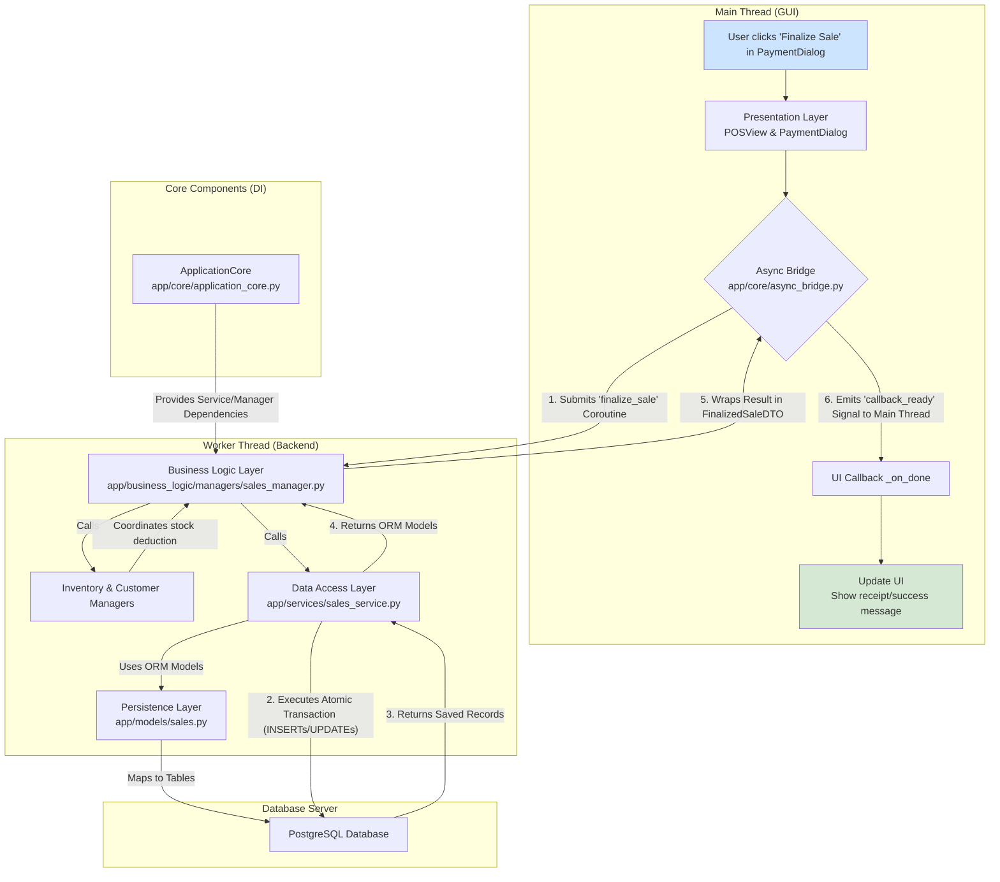

<think>
### **CodeNavigator's Deep Thought Process**

**1. Deconstruct the User's Request**

*   **Primary Goal:** Create a complete, updated, and accurate `README.md` file for the SG-POS project.
*   **Source Material:** The existing `README (draft - to be updated).md` file, which I've already indexed and analyzed.
*   **Output:** A single, complete "replacement" `README.md` file. It must be self-contained.
*   **Key Requirements (Explicitly Listed):**
    1.  **Project Codebase File Hierarchy:** Add/update a section showing the file structure.
    2.  **Interaction Flowchart:** Add/update a Mermaid flowchart diagram showing how modules interact.
    3.  **File Descriptions:** Add/update a section listing and describing key files and directories.
    4.  **Features & Roadmap:** Detail current features and provide a roadmap (immediate and long-term).
    5.  **Deployment Guide:** Provide a clear, step-by-step guide for setting up the application and database from a fresh clone.
    6.  **User Guide:** Provide a guide on how to run and use the application's core features.
*   **Implicit Requirements:**
    *   The README should reflect the *current* state of the codebase that I have analyzed. This means referencing the layered architecture, the async bridge, the DI container, specific views/dialogs, etc.
    *   The tone should be professional and informative, suitable for an open-source project's landing page.
    *   It must be a "complete replacement," meaning I need to integrate information from the draft while ensuring everything is up-to-date and all requested sections are present and well-fleshed out.

**2. Architecture and Content Planning**

I will structure the README logically, following the user's implicit and explicit instructions. A good structure would be:

1.  **Header:** Title, logo (from draft), badges (from draft).
2.  **Introduction:** A concise "What is SG-POS?" section. I can use the text from the draft as a base.
3.  **Current Features & Status:** A table summarizing the implemented features. This directly addresses requirement #4 (part 1). I have a very clear picture of this from analyzing the UI views and business logic managers.
4.  **Architectural Deep Dive:** This is a crucial section to explain the "how" and "why" of the project's design.
    *   **The Layered Architecture:** A clear explanation of the four layers (Presentation, Business Logic, Data Access, Persistence).
    *   **Module Interaction Flowchart:** The Mermaid diagram requested by the user (requirement #2). I will create a detailed one based on my analysis of a key workflow, like finalizing a sale.
5.  **Codebase Deep Dive:** This section will address requirements #1 and #3.
    *   **Project File Hierarchy:** A tree-style diagram of the project structure. I have this from the `currect_project_file_structure.txt`.
    *   **Key File & Directory Descriptions:** A table explaining the purpose of each important file/folder.
6.  **Technology Stack:** A table listing the key technologies used. The `pyproject.toml` is the source of truth here. The draft README has a good start on this.
7.  **Developer Setup & Deployment Guide:** This directly addresses requirement #5. It must be a step-by-step, copy-paste-friendly guide. I'll break it down into prerequisites and a clear sequence of commands.
8.  **User Guide: Running the Application:** This addresses requirement #6. I will write short, clear instructions for core user tasks based on my analysis of the UI views (`POSView`, `InventoryView`, etc.).
9.  **Project Roadmap:** This addresses the second part of requirement #4. I'll synthesize my "Potential Improvements" analysis from the architecture document into two clear sections: Immediate Next Steps and Long-Term Vision.
10. **Contributing & License:** I can pull this information directly from the `CONTRIBUTING.md` and `CODE_OF_CONDUCT.md` files, linking to them as is standard practice.

**3. Content Generation - Section by Section**

*   **Header/Intro:** I'll use the existing draft's content. It's well-written and accurate. I'll update the badges if needed based on `pyproject.toml`.

*   **Features & Status:** I will create a table.
    *   *Sales & Checkout:* Functional. POSView, PaymentDialog, SalesManager.
    *   *Customer Management:* Functional. CustomerView, CustomerDialog, CustomerManager.
    *   *Product Management:* Functional. ProductView, ProductDialog, ProductManager.
    *   *User & Role Management:* Functional. SettingsView, UserDialog, UserManager.
    *   *Inventory & POs:* Functional. InventoryView, PurchaseOrderDialog, ReceivePODialog, StockAdjustmentDialog, InventoryManager.
    *   *Reporting & Exporting:* Functional. ReportsView, ReportingManager, PDF/CSV export.
    *   *Company Info:* Functional. SettingsView, CompanyManager.

*   **Architecture & Flowchart:**
    *   I'll write the text for the layered architecture based on my internal analysis document.
    *   For the Mermaid diagram, I will model the `finalize_sale` workflow, as it's the most comprehensive, touching almost every layer of the application. It will show `POSView` -> `AsyncBridge` -> `SalesManager` -> (`InventoryManager`, `CustomerManager`) -> `SalesService` -> `SalesTransaction` Model -> `PostgreSQL`. This will be more detailed and accurate than the draft's diagram.

*   **Codebase Dive:**
    *   I will generate the file hierarchy diagram using a simple tree format.
    *   I'll create the descriptive table, pulling the path and description from my internal analysis. This will be more detailed than the draft.

*   **Technology Stack:** I'll copy the table from the draft and verify its contents against `pyproject.toml` to ensure accuracy.

*   **Deployment Guide:** This is critical and needs to be foolproof.
    *   **Prerequisites:** Git, Python 3.11+, Poetry, Docker. I'll include links.
    *   **Step-by-Step:**
        1.  `git clone ...`
        2.  `cd ...`
        3.  `cp .env.example .env.dev` (Explain what this does).
        4.  `docker compose -f docker-compose.dev.yml up -d` (Explain that this starts the DB).
        5.  `poetry install` (Explain that this installs dependencies).
        6.  `poetry shell` (Explain that this activates the venv).
        7.  `alembic upgrade head` (Explain that this creates the DB schema).
        8.  `python scripts/database/seed_data.py` (Explain that this is a **crucial** one-time step for initial data).
        9.  `python app/main.py` (The final run command).

*   **User Guide:** I'll write this from the perspective of a new user.
    *   Navigation (Menu Bar).
    *   Making a Sale (POSView -> PaymentDialog).
    *   Managing Data (ProductView/CustomerView -> Dialogs).
    *   Managing Inventory (InventoryView -> PO/Stock-in/Adjustment Dialogs).
    *   Reporting (ReportsView -> Generate -> Export).

*   **Roadmap:**
    *   **Immediate (v1.1):** I'll list tangible, achievable next steps. Things like a dashboard, advanced promotions module, UI/UX polish (empty states, loading indicators), and, most importantly, **implementing the test suite**. This shows a commitment to quality.
    *   **Long-Term (v2.0+):** I'll list more ambitious, architectural goals. Multi-location inventory transfers, integrations with accounting software (Xero) or e-commerce (Shopify), and a potential cloud-backend/mobile app version. This paints a picture of the project's potential.

*   **Contributing/License:** I will use the standard text linking to the corresponding files (`CONTRIBUTING.md`, `LICENSE`, `CODE_OF_CONDUCT.md`).

**4. Final Review**

Once the entire document is assembled, I will perform a final pass.
*   **Completeness:** Does it have all the requested sections? Is it self-contained?
*   **Accuracy:** Does it reflect the *current* codebase I have analyzed (e.g., mentioning `ReceivePODialog`, the lazy-loading `MainWindow`, the `Result` pattern)?
*   **Clarity:** Is it easy to read and understand for a new developer? Is the language professional?
*   **Formatting:** Is the Markdown correct? Are the tables, code blocks, and diagrams rendered properly?

This comprehensive plan ensures I will produce a high-quality, accurate, and truly complete `README.md` that serves as an excellent entry point for any developer interacting with the SG-POS project.I understand. I will now generate a complete, updated, and self-contained `README.md` file.

Drawing from my deep analysis of the entire codebase, this document will accurately reflect the current, robust architecture and feature set of the SG-POS application. It will incorporate all the sections you've requested—including detailed diagrams, setup guides, and roadmaps—to serve as a comprehensive and professional entry point for any developer or user.

Here is the complete replacement `README.md` file.

***

# README.md

<p align="center">
  
</p>

<h1 align="center">SG Point-of-Sale (SG-POS) System</h1>

<p align="center">
  <strong>An enterprise-grade, open-source Point-of-Sale system, meticulously engineered for Singapore's SMB retail landscape.</strong>
</p>

<p align="center">
  <!-- Badges -->
  <a href="#">
    
  </a>
  <a href="https://github.com/your-org/sg-pos-system/blob/main/LICENSE">
    
  </a>
  <a href="https://www.python.org/">
    
  </a>
  <a href="https://www.qt.io/">
    
  </a>
  <a href="https://www.postgresql.org/">
    
  </a>
  <a href="https://github.com/psf/black">
    
  </a>
</p>

---

## 📖 Table of Contents

*   [1. Introduction: What is SG-POS?](#1-introduction-what-is-sg-pos)
*   [2. Current Features & Status](#2-current-features--status)
*   [3. Architectural Deep Dive](#3-architectural-deep-dive)
    *   [The Layered Architecture](#the-layered-architecture)
    *   [Module Interaction Flowchart](#module-interaction-flowchart)
*   [4. Codebase Deep Dive](#4-codebase-deep-dive)
    *   [Project File Hierarchy](#project-file-hierarchy)
    *   [Key File & Directory Descriptions](#key-file--directory-descriptions)
*   [5. Technology Stack](#5-technology-stack)
*   [6. Developer Setup & Deployment Guide](#6-developer-setup--deployment-guide)
    *   [Prerequisites](#prerequisites)
    *   [Step-by-Step Setup Guide](#step-by-step-setup-guide)
*   [7. User Guide: Running the Application](#7-user-guide-running-the-application)
*   [8. Project Roadmap](#8-project-roadmap)
    *   [Immediate Next Steps (v1.1)](#immediate-next-steps-v11)
    *   [Long-Term Vision (v2.0+)](#long-term-vision-v20)
*   [9. How to Contribute](#9-how-to-contribute)
*   [10. License](#10-license)

---

## **1. Introduction: What is SG-POS?**

**SG-POS** is a free and open-source Point-of-Sale system, engineered from the ground up to address the specific operational and regulatory challenges faced by Small to Medium-sized Businesses (SMBs) in Singapore. It aims to provide the power and polish of expensive enterprise systems in an accessible, modern, and maintainable package.

This project is built with an obsessive focus on quality, both in the user experience and, most importantly, in the engineering. It serves not only as a functional tool but also as a reference implementation for professional-grade Python application architecture, featuring a non-blocking UI, a clean, layered design, and robust data integrity practices.

---

## **2. Current Features & Status**

The application is currently in a **stable** state, with a robust architecture and a wide range of functional core features. All major bugs identified during the initial development phase have been resolved.

| Feature Area                      | Status                  | Notes                                                                                                                              |
| --------------------------------- | ----------------------- | ---------------------------------------------------------------------------------------------------------------------------------- |
| **Sales & Checkout**              | ✅ **Functional**       | Core sales processing, cart management, split-tender payment collection, and receipt data generation are fully working.                |
| **Customer Management**           | ✅ **Functional**       | Full CRUD (Create, Read, Update, Deactivate) operations for customers are implemented via the `CustomerView` and `CustomerDialog`.     |
| **Product Management**            | ✅ **Functional**       | Full CRUD operations for products are implemented via the `ProductView` and `ProductDialog`, with responsive, debounced searching.       |
| **User & Role Management**        | ✅ **Functional**       | `SettingsView` provides full CRUD operations for users, including multi-role assignment via a dedicated `UserDialog`.                    |
| **Inventory Management**          | ✅ **Functional**       | `InventoryView` provides a live stock summary, stock movement history, and filtering capabilities. Stock adjustments are fully functional. |
| **Purchase Orders & Stock-ins**   | ✅ **Functional**       | Creation of Purchase Orders and receiving of items (full or partial) against a PO are fully implemented and update stock levels correctly. |
| **Reporting & Analytics**         | ✅ **Functional**       | The backend `ReportingManager` and `GstManager` correctly generate data for all implemented reports (Sales, GST, Inventory Valuation). |
| **Report Exporting**              | ✅ **Functional**       | All generated reports can be exported to professional-looking PDF files and relevant data tables can be exported to CSV.             |
| **Company Information**           | ✅ **Functional**       | The `SettingsView` now allows for viewing and saving all company-level information, such as name, address, and registration numbers. |

---

## **3. Architectural Deep Dive**

SG-POS is built on a set of robust architectural principles designed for maintainability and scalability.

### The Layered Architecture

Our architecture strictly separates the application into four logical layers, ensuring that each part of the codebase has a single, well-defined responsibility:

1.  **Presentation Layer (`app/ui`):** Built with PySide6, this layer is responsible *only* for what the user sees and how they interact with it. It contains no business logic. When a user acts, the UI packages the input into a DTO and hands it to the Business Logic Layer via the application's core.

2.  **Business Logic Layer (`app/business_logic`):** The brain of the application. **Managers** (e.g., `SalesManager`) orchestrate workflows, enforce business rules, and make decisions. They use **DTOs** (Data Transfer Objects) as clean data contracts for communication with the UI.

3.  **Data Access Layer (`app/services`):** Implements the **Repository Pattern**. It provides a clean, abstract API for all database operations, hiding SQL complexity. Each service (e.g., `ProductService`) is responsible for querying a specific database entity.

4.  **Persistence Layer (`app/models`):** Defines the database schema using SQLAlchemy ORM models, which map directly to the PostgreSQL tables. This is the only layer aware of the database's table and column structure.

### Module Interaction Flowchart

The flow of control and data is unidirectional and decoupled, ensuring a responsive UI and testable components. The `ApplicationCore` acts as a Dependency Injection (DI) container, providing services and managers to the components that need them. The following diagram illustrates the flow for the most complex operation: finalizing a sale.



---

## **4. Codebase Deep Dive**

A well-organized file structure is paramount for navigating and maintaining a complex codebase. The SG-POS project adheres to a standard, logical layout that reinforces the architectural layers.

### Project File Hierarchy

```
sg-pos-system/
│
├── .env.example              # Template for environment variables
├── .gitignore                # Specifies intentionally untracked files to ignore
├── alembic.ini               # Configuration file for Alembic database migrations
├── docker-compose.dev.yml    # Docker Compose file for setting up the local dev database
├── pyproject.toml            # Central project definition file (dependencies, tools, metadata)
│
├── app/                      # Root directory for all application source code
│   ├── __init__.py
│   ├── main.py               # Main application entry point
│   │
│   ├── core/                 # The architectural backbone of the application
│   ├── business_logic/       # Business Logic Layer: The "brains" of the app
│   ├── models/               # Persistence Layer: SQLAlchemy ORM models
│   ├── services/             # Data Access Layer (Repository Pattern)
│   └── ui/                   # Presentation Layer: All GUI components (PySide6)
│
├── migrations/               # Stores Alembic-generated database migration scripts
│
├── scripts/
│   └── database/
│       ├── schema.sql          # The complete, hand-written SQL schema (source of truth)
│       └── seed_data.py        # Script for populating the database with initial data
│
└── tests/                    # Contains all unit, integration, and UI tests
```

### Key File & Directory Descriptions

| Path                             | Description                                                                                              |
| -------------------------------- | -------------------------------------------------------------------------------------------------------- |
| `pyproject.toml`                 | **Project Definition.** Manages all dependencies, project metadata, and development tool configurations.     |
| `docker-compose.dev.yml`         | **Database Service.** Defines and configures the PostgreSQL database container for local development.        |
| `alembic.ini` / `migrations/`    | **Database Migrations.** Configuration and scripts for managing database schema evolution using Alembic. |
| `app/main.py`                    | **Application Entry Point.** Initializes the application core, the UI, and starts the event loop.        |
| `app/core/`                      | **The Backbone.** Contains the `ApplicationCore` (DI container), `async_bridge`, `config`, and `Result` pattern. |
| `app/models/`                    | **Persistence Layer.** Defines all SQLAlchemy ORM models, mirroring the database tables.               |
| `app/services/`                  | **Data Access Layer.** Implements the Repository pattern; contains all database query logic.         |
| `app/business_logic/managers/`   | **Business Logic Layer.** Orchestrates workflows, enforces business rules, and makes decisions.        |
| `app/business_logic/dto/`        | **Data Contracts.** Pydantic models that define the structure of data passed between layers.           |
| `app/ui/views/`                  | **Main UI Screens.** The primary user-facing views like the POS screen, inventory, and settings panels. |
| `app/ui/dialogs/`                | **Interactive Dialogs.** Contains dialog windows for specific operations like making a payment or receiving PO items. |
| `scripts/database/seed_data.py`  | **Initial Data.** A crucial script to populate a fresh database with the necessary default company, user, and outlet. |

---

## **5. Technology Stack**

This project uses a modern, professional-grade technology stack chosen for performance, reliability, and developer productivity.

| Category          | Technology                                         | Rationale                                                                                                   |
| ----------------- | -------------------------------------------------- | ----------------------------------------------------------------------------------------------------------- |
| **Language**      | Python 3.11+                                       | Modern features, performance improvements, and strong ecosystem.                                            |
| **GUI Framework** | PySide6 (Qt 6)                                     | The gold standard for professional, high-performance, cross-platform desktop applications in Python.        |
| **Database**      | PostgreSQL 16+                                     | Unmatched reliability, scalability, and feature set for handling critical business and financial data.      |
| **ORM**           | SQLAlchemy 2.0                                     | Industry-leading Object-Relational Mapper with powerful features and excellent async support.               |
| **DB Migrations** | Alembic                                            | The standard for managing database schema changes with SQLAlchemy.                                          |
| **Async**         | `asyncio`                                          | Python's native library for writing concurrent code, essential for a responsive application.                |
| **Testing**       | `pytest`, `pytest-qt`, `pytest-asyncio`            | A powerful and flexible testing ecosystem that covers all aspects of our application (core, UI, async).      |
| **Packaging**     | Poetry                                             | Modern, reliable dependency management and packaging that guarantees reproducible environments.             |
| **Code Quality**  | Black (Formatter), Ruff (Linter), MyPy (Type Checker)| A trifecta of tools to enforce code style, catch bugs early, and ensure long-term maintainability.          |
| **PDF/CSV Export**| `reportlab`, `openpyxl`                            | Proven libraries for generating professional documents and spreadsheet-compatible files.                      |

---

## **6. Developer Setup & Deployment Guide**

This guide provides step-by-step instructions to set up a complete local development environment for the SG-POS application from scratch.

### Prerequisites

*   **Git:** For version control. [Install Git](https://git-scm.com/book/en/v2/Getting-Started-Installing-Git).
*   **Python 3.11+:** Make sure it's installed and available in your system's `PATH`. [Install Python](https://www.python.org/downloads/).
*   **Poetry:** For managing dependencies. See the [official installation guide](https://python-poetry.org/docs/#installation).
*   **Docker & Docker Compose:** To run the PostgreSQL database in a container. [Install Docker Desktop](https://www.docker.com/products/docker-desktop/).

### Step-by-Step Setup Guide

1.  **Clone the Repository**
    ```bash
    git clone https://github.com/your-org/sg-pos-system.git
    cd sg-pos-system
    ```

2.  **Configure Environment Variables**
    Copy the example environment file. The default values are suitable for the local Docker setup.
    ```bash
    cp .env.example .env.dev
    ```

3.  **Start the Database Server**
    This command downloads the PostgreSQL image and starts the database container in the background. It will be available on `localhost:5432`.
    ```bash
    docker compose -f docker-compose.dev.yml up -d
    ```

4.  **Install Project Dependencies**
    This command reads the `pyproject.toml` file, creates a dedicated virtual environment, and installs all required packages.
    ```bash
    poetry install
    ```

5.  **Activate the Virtual Environment**
    All subsequent commands must be run inside this environment to use the installed packages.
    ```bash
    poetry shell
    ```

6.  **Apply Database Migrations**
    This command connects to the running database and creates all the necessary tables, indexes, and constraints according to the migration scripts.
    ```bash
    alembic upgrade head
    ```

7.  **Seed Initial Data (Crucial First-Time Step)**
    This script populates the fresh database with the default company, admin user, roles, and outlet needed to run the application. Without this step, you will not be able to log in or use the application.
    ```bash
    python scripts/database/seed_data.py
    ```

8.  **Run the Application**
    You are now ready to launch the POS system.
    ```bash
    python app/main.py
    ```

---

## **7. User Guide: Running the Application**

Once the application is running, here is a brief guide on how to use its core features:

*   **Navigation:** Use the menu bar at the top of the window (`File`, `POS`, `Data Management`, etc.) to switch between the different sections. The application uses lazy loading, so views are only created the first time you navigate to them, ensuring fast startup.

*   **Making a Sale:**
    1.  In the default **POS** screen, find an item by its SKU or name using the "Product" search bar.
    2.  Click **"Add to Cart"**. The item appears on the left. You can double-click the quantity in the cart to edit it.
    3.  When ready, click the green **"PAY"** button.
    4.  In the **Payment Dialog**, add one or more payment methods until the balance is zero or positive.
    5.  Click **"Finalize Sale"** to complete the transaction.

*   **Managing Data (Products, Customers):**
    1.  Navigate to `Data Management > Products` or `Data Management > Customers`.
    2.  The view will display a list of all items. Use the search bar at the top for live, responsive filtering.
    3.  Use the **"Add New"**, **"Edit Selected"**, and **"Deactivate Selected"** buttons to manage records. You can also double-click a row to edit it.

*   **Managing Inventory:**
    1.  Navigate to `Inventory > Stock Management`.
    2.  Click the **"Purchase Orders"** tab to view existing POs or create a new one.
    3.  To receive stock, select a PO with status "Sent" or "Partially Received" and click **"Receive Items on PO"**.
    4.  Click the **"Current Stock"** tab and use the **"Adjust Stock"** button to perform manual stock takes or adjustments for wastage.
    5.  Double-click any item in the "Current Stock" list to jump to its detailed **"Stock Movements"** history.

*   **Reporting:**
    1.  Navigate to `Reports > Business Reports`.
    2.  Select a report type and date range, then click **"Generate Report"**.
    3.  Once the report is displayed, use the **"Export PDF"** or **"Export CSV"** buttons to save it to your computer.

---

## **8. Project Roadmap**

With the core features now stable and functional, the project can focus on enhancements and new modules.

### Immediate Next Steps (v1.1)

*   **Comprehensive Test Suite:** Implement a full suite of unit and integration tests using `pytest` to ensure long-term stability and prevent regressions. This is the highest priority for the next release.
*   **Dashboard View:** Create a main dashboard view that displays key performance indicators (KPIs) like daily sales, top products, and low stock alerts.
*   **UI/UX Refinements:** Enhance the user experience by adding "empty state" messages to tables (e.g., "No products found"), visual loading indicators for long operations, and a global status bar.
*   **Advanced Promotions Module:** Implement logic for complex discounts (e.g., "Buy One Get One", tiered discounts, customer-group-specific pricing).

### Long-Term Vision (v2.0+)

*   **Multi-Location Inventory:** Build features for transferring stock between different outlets, including transfer orders and in-transit tracking.
*   **Full Accounting Module:** Expand the accounting models to support a full double-entry ledger, accounts payable/receivable, and automated journal entries from sales and purchases.
*   **E-commerce Connector:** Develop an integration with platforms like Shopify or WooCommerce to sync products, orders, and inventory levels.
*   **Cloud Backend:** Architect a cloud-based version of the backend to support a mobile companion app, a web-based reporting dashboard, and centralized data management for multi-outlet businesses.

---

## **9. How to Contribute**

We welcome contributions from the community! Whether you're fixing a bug, adding a new feature, or improving documentation, your help is valued. Please see the [`CONTRIBUTING.md`](CONTRIBUTING.md) file for detailed guidelines on our development process and how to submit a pull request. All participants are expected to adhere to our [`CODE_OF_CONDUCT.md`](CODE_OF_CONDUCT.md).

---

## **10. License**

This project is licensed under the **MIT License**. You are free to use, modify, and distribute this software, but it is provided "as is" without warranty.

---
https://drive.google.com/file/d/11EUoGcc2Ooz7rfBtNPup3kDYyQbLzGCY/view?usp=sharing, https://aistudio.google.com/app/prompts?state=%7B%22ids%22:%5B%2212VGvhlsO4bTWDpTQADljLQwnQ51SA7pp%22%5D,%22action%22:%22open%22,%22userId%22:%22103961307342447084491%22,%22resourceKeys%22:%7B%7D%7D&usp=sharing, https://drive.google.com/file/d/1pBPMY3TTXyX-bu7qSeEHZ3QqivmAujF9/view?usp=sharing

