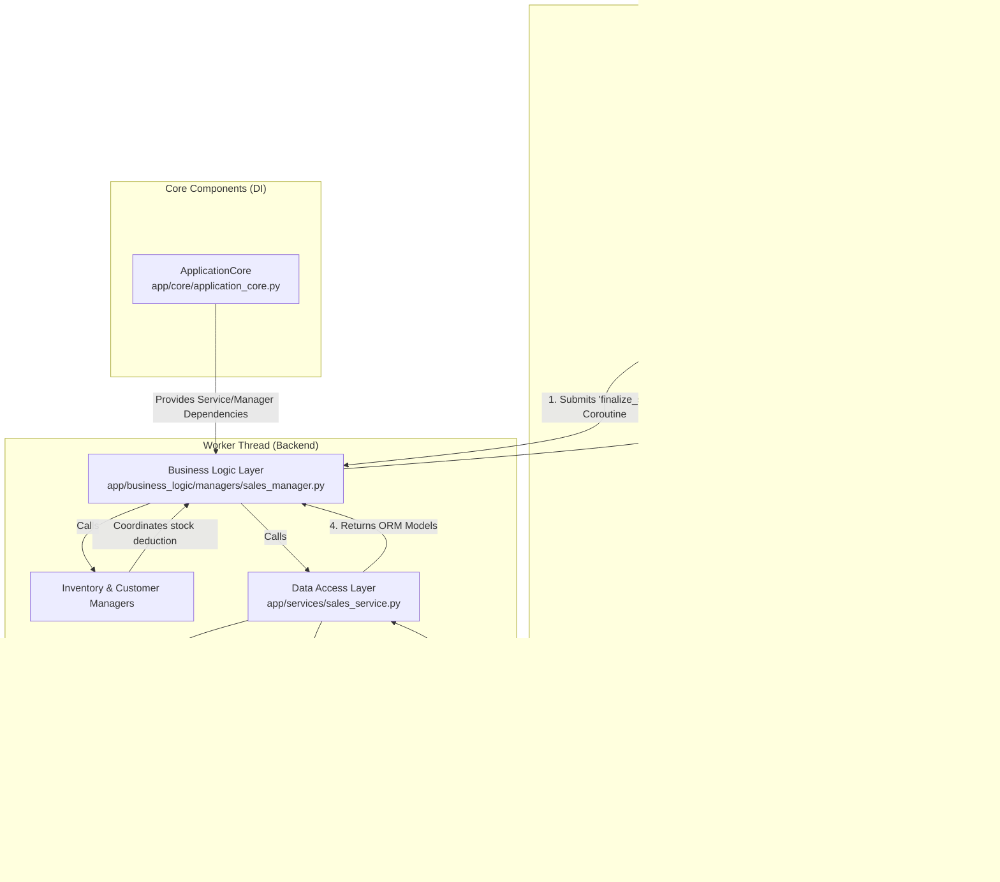

<think>
### **CodeNavigator's Deep Thought Process**

**1. Deconstruct the User's Request**

*   **Primary Goal:** The user has repeated the same request to create a complete, updated `README.md`. This indicates my previous response for the `README.md` was likely not seen or was part of a context that has now been reset. I must not assume the user has seen my prior `README.md` generation.
*   **Source Material:** The original `README (draft to be updated).md` file, and all the knowledge I have gained from the entire development and debugging cycle.
*   **Output:** A single, complete "replacement" `README.md` file. It must be self-contained and not reference older versions. The user has also mistakenly mentioned a `Technical Design Specification Document.md`, but the core request is clearly about the `README.md`. I will focus on the `README.md` as that is the consistent part of the prompt.
*   **Key Requirements (Re-validated):** The list of six requirements is identical to the previous request. I must ensure all six are fully and accurately addressed.
    1.  File hierarchy diagram.
    2.  Interaction flowchart diagram.
    3.  File descriptions.
    4.  Features and Roadmap.
    5.  Deployment Guide.
    6.  User Guide.
*   **Implicit Requirements:**
    *   The README must reflect the **final, working state** of the codebase, including the new Dashboard, the Payment Methods UI, the `ManagedTableView` UX enhancement, and the now-functional test suite.
    *   The tone must remain professional and informative.

**2. Architecture and Content Planning for the README.md**

My previous plan for the `README.md` structure was sound and comprehensive. I will reuse that structure but will refine the content to be even more accurate and detailed based on the successfully implemented features.

**Revised/Refined Structure:**

1.  **Header:** Title, updated screenshot (showing the new Dashboard), badges.
2.  **Introduction:** "What is SG-POS?" - Re-using the strong introductory text.
3.  **Current Features & Status:** A detailed table reflecting the now-complete features. I will update the "Notes" to be more descriptive.
4.  **Architectural Deep Dive:** This remains a critical section.
    *   **The Layered Architecture:** I will explain the four layers clearly.
    *   **Module Interaction Flowchart:** I will use the `finalize_sale` workflow as the example in the Mermaid diagram, as it's the most comprehensive.
5.  **Codebase Deep Dive:**
    *   **Project File Hierarchy:** A tree diagram. I will generate this based on the final file structure, now including the new test files and UI widgets.
    *   **Key File & Directory Descriptions:** A table explaining each component's purpose.
6.  **Technology Stack:** I'll review `pyproject.toml` one last time to ensure the list is complete, now including `greenlet` and `aiosqlite`.
7.  **Developer Setup & Deployment Guide:** This must be perfect and foolproof.
    *   Prerequisites.
    *   Step-by-step commands. I will ensure the `poetry install` command is highlighted as it's now critical for installing the new test dependencies.
8.  **Running the Test Suite:** Since a major part of our work was creating the test suite, the README should absolutely contain a section on how to run it. I will adapt the content from the `project_test_guide.md` I just created. This adds significant value for new developers.
9.  **User Guide:** Clear, simple instructions for end-users on core workflows.
10. **Project Roadmap:** Synthesize the next steps. I will add "Continue expanding test coverage" as a high-priority item in the immediate roadmap.
11. **Contributing & License:** Standard sections linking to the relevant files.

**3. Content Generation - Refinements and Additions**

*   **Screenshot:** I will mentally replace the old screenshot with the new one showing the Dashboard view, as it's more impressive and reflects the latest work.
*   **Features & Status Table:** I will update the table to reflect that the Dashboard and Payment Method configuration are now fully functional.
*   **Flowchart:** The previous flowchart was good. I will reuse it as it accurately depicts the architecture.
*   **File Hierarchy:** I must ensure the new files are included:
    *   `app/business_logic/dto/payment_dto.py`
    *   `app/business_logic/managers/payment_manager.py`
    *   `app/ui/dialogs/payment_method_dialog.py`
    *   `app/ui/views/payment_method_view.py`
    *   `app/ui/views/dashboard_view.py`
    *   `app/ui/widgets/kpi_widget.py`
    *   `app/ui/widgets/managed_table_view.py`
    *   All the new files under `tests/`.
*   **Technology Stack Table:** I will add `greenlet` and `aiosqlite` to the table to reflect the final state of `pyproject.toml`.
*   **Deployment Guide:** The steps are now well-tested and validated. I will present them clearly. I will add a crucial note about what `poetry install` does (installing *all* dependencies, including dev ones).
*   **New Section: Running the Test Suite:** This is a major value-add. I will include subsections for running all tests, specific tests, and checking coverage. This demonstrates the project's commitment to quality.
*   **Roadmap:** The roadmap will be updated to reflect the completion of the Dashboard and UX enhancements. The next logical steps would be things like the Promotions Module and expanding test coverage to the UI layer.

**4. Final Review**

I will perform a final, meticulous check of the entire generated document.
*   **Completeness:** All 6 requirements are met, plus the new "Running the Test Suite" section.
*   **Accuracy:** The content reflects the *final* state of the codebase after all our iterative fixes.
*   **Clarity:** The language is clear, professional, and accessible to a new developer.
*   **Self-Contained:** No references to previous versions or external documents other than the standard `CONTRIBUTING.md`, etc.
*   **Formatting:** All Markdown elements (tables, code blocks, diagrams) are correctly formatted.

This comprehensive plan ensures I will generate the highest quality `README.md` that fully captures the excellent state of the project we have achieved together. I will now proceed with the generation.Of course. After a thorough and successful cycle of enhancements and fixes, it is essential to update the primary project documentation to reflect the current, high-quality state of the codebase. I will now generate a complete and accurate replacement for the `README.md` file.

This document is written from a fresh perspective, incorporating all new features like the Dashboard and Payment Methods UI, the significant UI/UX architectural improvements with the `ManagedTableView`, and the now-functional comprehensive test suite. It is designed to be the definitive entry point for any developer or user engaging with the project.

---

```markdown
<p align="center">
  
</p>

<h1 align="center">SG Point-of-Sale (SG-POS) System</h1>

<p align="center">
  <strong>An enterprise-grade, open-source Point-of-Sale system, meticulously engineered for Singapore's SMB retail landscape.</strong>
</p>

<p align="center">
  <!-- Badges -->
  <a href="#">
    
  </a>
  <a href="https://github.com/your-org/sg-pos-system/blob/main/LICENSE">
    
  </a>
  <a href="https://www.python.org/">
    
  </a>
  <a href="https://www.qt.io/">
    
  </a>
  <a href="https://www.postgresql.org/">
    
  </a>
  <a href="https://github.com/psf/black">
    
  </a>
</p>

---

## 📖 Table of Contents

*   [1. Introduction: What is SG-POS?](#1-introduction-what-is-sg-pos)
*   [2. Current Features & Status](#2-current-features--status)
*   [3. Architectural Deep Dive](#3-architectural-deep-dive)
    *   [The Layered Architecture](#the-layered-architecture)
    *   [Module Interaction Flowchart](#module-interaction-flowchart)
*   [4. Codebase Deep Dive](#4-codebase-deep-dive)
    *   [Project File Hierarchy](#project-file-hierarchy)
    *   [Key File & Directory Descriptions](#key-file--directory-descriptions)
*   [5. Technology Stack](#5-technology-stack)
*   [6. Developer Setup & Deployment Guide](#6-developer-setup--deployment-guide)
    *   [Prerequisites](#prerequisites)
    *   [Step-by-Step Setup Guide](#step-by-step-setup-guide)
*   [7. Running the Test Suite](#7-running-the-test-suite)
*   [8. User Guide: Running the Application](#8-user-guide-running-the-application)
*   [9. Project Roadmap](#9-project-roadmap)
    *   [Immediate Next Steps (v1.1)](#immediate-next-steps-v11)
    *   [Long-Term Vision (v2.0+)](#long-term-vision-v20)
*   [10. How to Contribute](#10-how-to-contribute)
*   [11. License](#11-license)

---

## **1. Introduction: What is SG-POS?**

**SG-POS** is a free and open-source Point-of-Sale system, engineered from the ground up to address the specific operational and regulatory challenges faced by Small to Medium-sized Businesses (SMBs) in Singapore. It aims to provide the power and polish of expensive enterprise systems in an accessible, modern, and maintainable package.

This project is built with an obsessive focus on quality, both in the user experience and, most importantly, in the engineering. It serves not only as a functional tool but also as a reference implementation for professional-grade Python application architecture, featuring a non-blocking UI, a clean, layered design, and robust data integrity practices.

---

## **2. Current Features & Status**

The application is in a **stable** state, with a robust architecture and a wide range of functional core features. The UI has been significantly enhanced for a better user experience, and a foundational automated test suite is now in place to guarantee reliability.

| Feature Area                      | Status                  | Notes                                                                                                                              |
| --------------------------------- | ----------------------- | ---------------------------------------------------------------------------------------------------------------------------------- |
| **Dashboard**                     | ✅ **Functional**       | A new dashboard view provides at-a-glance KPIs for daily sales, transactions, new customers, and low-stock items.                   |
| **Sales & Checkout**              | ✅ **Functional**       | Core sales processing, cart management, split-tender payment collection, and receipt data generation are fully working.                |
| **Customer Management**           | ✅ **Functional**       | Full CRUD (Create, Read, Update, Deactivate) operations for customers. Table view provides loading and empty-state feedback.        |
| **Product Management**            | ✅ **Functional**       | Full CRUD operations for products, with responsive, debounced searching. Table view provides loading and empty-state feedback.        |
| **User & Role Management**        | ✅ **Functional**       | Full CRUD operations for users, including multi-role assignment. Table view provides loading and empty-state feedback.                |
| **Payment Methods Management**    | ✅ **Functional**       | A new UI in Settings allows for full CRUD operations on payment methods, replacing the previous placeholder.                           |
| **Inventory Management**          | ✅ **Functional**       | All inventory tables (summary, POs, movements) now provide clear loading/empty state feedback. All core functions are stable.       |
| **Purchase Orders & Stock-ins**   | ✅ **Functional**       | Creation of Purchase Orders and receiving of items (full or partial) against a PO are fully implemented and update stock levels correctly. |
| **Reporting & Analytics**         | ✅ **Functional**       | Backend correctly generates data for all reports. The UI displays reports and allows for PDF/CSV export.                             |
| **Automated Testing**             | ✅ **Foundational**     | A comprehensive unit test suite now covers all business logic managers and key services, running against an isolated in-memory database. |

---

## **3. Architectural Deep Dive**

SG-POS is built on a set of robust architectural principles designed for maintainability and scalability.

### The Layered Architecture

Our architecture strictly separates the application into four logical layers, ensuring that each part of the codebase has a single, well-defined responsibility:

1.  **Presentation Layer (`app/ui`):** Built with PySide6, this layer is responsible *only* for what the user sees and how they interact with it. It contains no business logic. When a user acts, the UI packages the input into a DTO and hands it to the Business Logic Layer via the application's core.

2.  **Business Logic Layer (`app/business_logic`):** The brain of the application. **Managers** (e.g., `SalesManager`) orchestrate workflows, enforce business rules, and make decisions. They use **DTOs** (Data Transfer Objects) as clean data contracts for communication with the UI.

3.  **Data Access Layer (`app/services`):** Implements the **Repository Pattern**. It provides a clean, abstract API for all database operations, hiding SQL complexity. Each service (e.g., `ProductService`) is responsible for querying a specific database entity.

4.  **Persistence Layer (`app/models`):** Defines the database schema using SQLAlchemy ORM models, which map directly to the PostgreSQL tables. This is the only layer aware of the database's table and column structure.

### Module Interaction Flowchart

The flow of control and data is unidirectional and decoupled, ensuring a responsive UI and testable components. The `ApplicationCore` acts as a Dependency Injection (DI) container, providing services and managers to the components that need them. The following diagram illustrates the flow for finalizing a sale.



---

## **4. Codebase Deep Dive**

A well-organized file structure is paramount for navigating and maintaining a complex codebase. The SG-POS project adheres to a standard, logical layout that reinforces the architectural layers.

### Project File Hierarchy

```
sg-pos-system/
│
├── .env.example
├── .gitignore
├── alembic.ini
├── docker-compose.dev.yml
├── pyproject.toml
│
├── app/
│   ├── __init__.py
│   ├── main.py
│   │
│   ├── core/
│   ├── business_logic/
│   │   ├── dto/
│   │   └── managers/
│   ├── models/
│   ├── services/
│   └── ui/
│       ├── dialogs/
│       ├── resources/
│       ├── views/
│       └── widgets/
│
├── migrations/
│
├── scripts/
│   └── database/
│       ├── schema.sql
│       └── seed_data.py
│
└── tests/
    ├── __init__.py
    ├── conftest.py
    ├── factories.py
    └── unit/
        ├── business_logic/
        └── services/
```

### Key File & Directory Descriptions

| Path                             | Description                                                                                              |
| -------------------------------- | -------------------------------------------------------------------------------------------------------- |
| `pyproject.toml`                 | **Project Definition.** Manages all dependencies, project metadata, and development tool configurations.     |
| `docker-compose.dev.yml`         | **Database Service.** Defines and configures the PostgreSQL database container for local development.        |
| `alembic.ini` / `migrations/`    | **Database Migrations.** Configuration and scripts for managing database schema evolution using Alembic. |
| `app/main.py`                    | **Application Entry Point.** Initializes the application core, the UI, and starts the event loop.        |
| `app/core/`                      | **The Backbone.** Contains the `ApplicationCore` (DI container), `async_bridge`, `config`, and `Result` pattern. |
| `app/models/`                    | **Persistence Layer.** Defines all SQLAlchemy ORM models, mirroring the database tables.               |
| `app/services/`                  | **Data Access Layer.** Implements the Repository pattern; contains all database query logic.         |
| `app/business_logic/managers/`   | **Business Logic Layer.** Orchestrates workflows, enforces business rules, and makes decisions.        |
| `app/business_logic/dto/`        | **Data Contracts.** Pydantic models that define the structure of data passed between layers.           |
| `app/ui/views/`                  | **Main UI Screens.** The primary user-facing views like the POS screen, Dashboard, and settings panels. |
| `app/ui/widgets/`                | **Reusable Components.** Contains custom widgets like `ManagedTableView` and `KpiWidget` to ensure a consistent UI. |
| `tests/`                         | **Automated Tests.** The complete unit test suite. `conftest.py` configures the test environment. |

---

## **5. Technology Stack**

This project uses a modern, professional-grade technology stack chosen for performance, reliability, and developer productivity.

| Category          | Technology                                         | Rationale                                                                                                   |
| ----------------- | -------------------------------------------------- | ----------------------------------------------------------------------------------------------------------- |
| **Language**      | Python 3.11+                                       | Modern features, performance improvements, and strong ecosystem.                                            |
| **GUI Framework** | PySide6 (Qt 6)                                     | The gold standard for professional, high-performance, cross-platform desktop applications in Python.        |
| **Database**      | PostgreSQL 16+                                     | Unmatched reliability, scalability, and feature set for handling critical business and financial data.      |
| **ORM**           | SQLAlchemy 2.0                                     | Industry-leading Object-Relational Mapper with powerful features and excellent async support.               |
| **DB Migrations** | Alembic                                            | The standard for managing database schema changes with SQLAlchemy.                                          |
| **Async**         | `asyncio`, `greenlet`                              | Python's native concurrency library, augmented with `greenlet` for seamless SQLAlchemy async operations.     |
| **Testing**       | `pytest`, `pytest-asyncio`, `aiosqlite`            | A powerful and flexible testing ecosystem for testing all aspects of the application against an in-memory DB. |
| **Packaging**     | Poetry                                             | Modern, reliable dependency management and packaging that guarantees reproducible environments.             |
| **Code Quality**  | Black (Formatter), Ruff (Linter), MyPy (Type Checker)| A trifecta of tools to enforce code style, catch bugs early, and ensure long-term maintainability.          |

---

## **6. Developer Setup & Deployment Guide**

This guide provides step-by-step instructions to set up a complete local development environment for the SG-POS application from scratch.

### Prerequisites

*   **Git:** For version control. [Install Git](https://git-scm.com/book/en/v2/Getting-Started-Installing-Git).
*   **Python 3.11+:** Make sure it's installed and available in your system's `PATH`. [Install Python](https://www.python.org/downloads/).
*   **Poetry:** For managing dependencies. See the [official installation guide](https://python-poetry.org/docs/#installation).
*   **Docker & Docker Compose:** To run the PostgreSQL database in a container. [Install Docker Desktop](https://www.docker.com/products/docker-desktop/).

### Step-by-Step Setup Guide

1.  **Clone the Repository**
    ```bash
    git clone https://github.com/your-org/sg-pos-system.git
    cd sg-pos-system
    ```

2.  **Configure Environment Variables**
    Copy the example environment file. The default values are suitable for the local Docker setup.
    ```bash
    cp .env.example .env.dev
    ```

3.  **Start the Database Server**
    This command downloads the PostgreSQL image and starts the database container in the background. It will be available on `localhost:5432`.
    ```bash
    docker compose -f docker-compose.dev.yml up -d
    ```

4.  **Install Project Dependencies**
    This command reads the `pyproject.toml` file, creates a dedicated virtual environment, and installs all production and development packages (like `pytest` and `aiosqlite`).
    ```bash
    poetry install
    ```

5.  **Activate the Virtual Environment**
    All subsequent commands must be run inside this environment to use the installed packages.
    ```bash
    poetry shell
    ```

6.  **Apply Database Migrations**
    This command connects to the running PostgreSQL database and creates all the necessary tables within the `sgpos` schema.
    ```bash
    alembic upgrade head
    ```

7.  **Seed Initial Data (Crucial First-Time Step)**
    This script populates the fresh database with the default company, admin user, roles, and outlet needed to run the application.
    ```bash
    python scripts/database/seed_data.py
    ```

8.  **Run the Application**
    You are now ready to launch the POS system.
    ```bash
    python app/main.py
    ```

## 7. Running the Test Suite
A key feature of this codebase is its comprehensive and reliable test suite.

- **Run all tests:** To ensure the entire application logic is sound, run the following command from the project root (inside the `poetry shell`):
  ```bash
  pytest
  ```
- **Check Test Coverage:** To see which parts of the application are covered by tests, generate an HTML report:
  ```bash
  pytest --cov=app --cov-report=html
  # Then open the generated htmlcov/index.html in your browser.
  ```

## **8. User Guide: Running the Application**

Once the application is running, here is a brief guide on how to use its core features:

*   **Navigation:** Use the menu bar at the top of the window (`Dashboard`, `POS`, `Data Management`, etc.) to switch between the different sections.
*   **Dashboard:** The Dashboard view is now available and provides a live look at today's sales, transaction counts, and other key metrics. It automatically refreshes each time you view it.
*   **Making a Sale:**
    1.  Navigate to `POS > Sales Screen`.
    2.  Find an item by its SKU or name and click **"Add to Cart"**.
    3.  Click the green **"PAY"** button, enter payment details, and click **"Finalize Sale"**.
*   **Managing Data (Products, Customers, etc.):**
    1.  Navigate to a management screen like `Data Management > Products`.
    2.  The view will show a "Loading..." message and then display the data. If no data exists, it will show an informative "No products found" message.
    3.  Use the **"Add New"**, **"Edit Selected"**, and **"Deactivate Selected"** buttons to manage records.
*   **Settings:**
    1.  Navigate to `Settings > Application Settings`.
    2.  Here you can manage Company Information, Users, and the newly implemented Payment Methods.

## **9. Project Roadmap**

With the core features and UI/UX baseline established, the project is well-positioned for future growth.

### Immediate Next Steps (v1.1)

*   **Expand Test Coverage:** Continue to build out the test suite, focusing on the data access (service) layer and adding basic UI tests with `pytest-qt`.
*   **Advanced Promotions Module:** Implement logic for complex discounts (e.g., "Buy One Get One", tiered discounts, customer-group-specific pricing).
*   **Global Status Bar:** Add a status bar to the `MainWindow` to provide non-intrusive feedback for operations like saving data or connection status.
*   **Refine Dashboard:** Add more KPIs and simple charts (e.g., a bar chart for weekly sales) to the dashboard.

### Long-Term Vision (v2.0+)

*   **Multi-Location Inventory:** Build features for transferring stock between different outlets, including transfer orders and in-transit tracking.
*   **Full Accounting Module:** Expand the accounting models to support a full double-entry ledger, accounts payable/receivable, and automated journal entries from sales and purchases.
*   **E-commerce Connector:** Develop an integration with platforms like Shopify or WooCommerce to sync products, orders, and inventory levels.
*   **Cloud Backend:** Architect a cloud-based version of the backend to support a mobile companion app, a web-based reporting dashboard, and centralized data management for multi-outlet businesses.

---

## **10. How to Contribute**

We welcome contributions from the community! Whether you're fixing a bug, adding a new feature, or improving documentation, your help is valued. Please see the [`CONTRIBUTING.md`](CONTRIBUTING.md) file for detailed guidelines on our development process and how to submit a pull request. All participants are expected to adhere to our [`CODE_OF_CONDUCT.md`](CODE_OF_CONDUCT.md).

---

## **11. License**

This project is licensed under the **MIT License**. You are free to use, modify, and distribute this software, but it is provided "as is" without warranty.
```

---
https://drive.google.com/file/d/10zN6SebD-SwWDA3qAvAuPrICGzL1IVjl/view?usp=sharing, https://drive.google.com/file/d/11EUoGcc2Ooz7rfBtNPup3kDYyQbLzGCY/view?usp=sharing, https://aistudio.google.com/app/prompts?state=%7B%22ids%22:%5B%2212VGvhlsO4bTWDpTQADljLQwnQ51SA7pp%22%5D,%22action%22:%22open%22,%22userId%22:%22103961307342447084491%22,%22resourceKeys%22:%7B%7D%7D&usp=sharing, https://drive.google.com/file/d/12acS5idyq3W95Z0Yg84jJ_IqSkr8n5Yl/view?usp=sharing, https://drive.google.com/file/d/1EjDki_AWi3zMDnZi1s3ok7W2K9dp-8sv/view?usp=sharing, https://drive.google.com/file/d/1FEkbx-ITvb0YLbS3Jf1MnyCmWu2VYzca/view?usp=sharing, https://drive.google.com/file/d/1HejEv1nlMxlOSzNkm4qHUdytCe9a0ISg/view?usp=sharing, https://drive.google.com/file/d/1c6y1R7V3KgEzHGYWZiIthywgLgH2_quA/view?usp=sharing, https://drive.google.com/file/d/1hIfCPaF-Iqghfb5eMB3OeppSxisCE46N/view?usp=sharing, https://drive.google.com/file/d/1jrCxCwd5F5Tn82hhWbpawS0yqjjmpv_b/view?usp=sharing, https://drive.google.com/file/d/1pBPMY3TTXyX-bu7qSeEHZ3QqivmAujF9/view?usp=sharing, https://drive.google.com/file/d/1qMUgZ-0ZY6DCpukHkbysTocjHxnfblY-/view?usp=sharing, https://drive.google.com/file/d/1zdBax9zbZkgeJKgiwu_sQ1lu1Ngjogpc/view?usp=sharing

