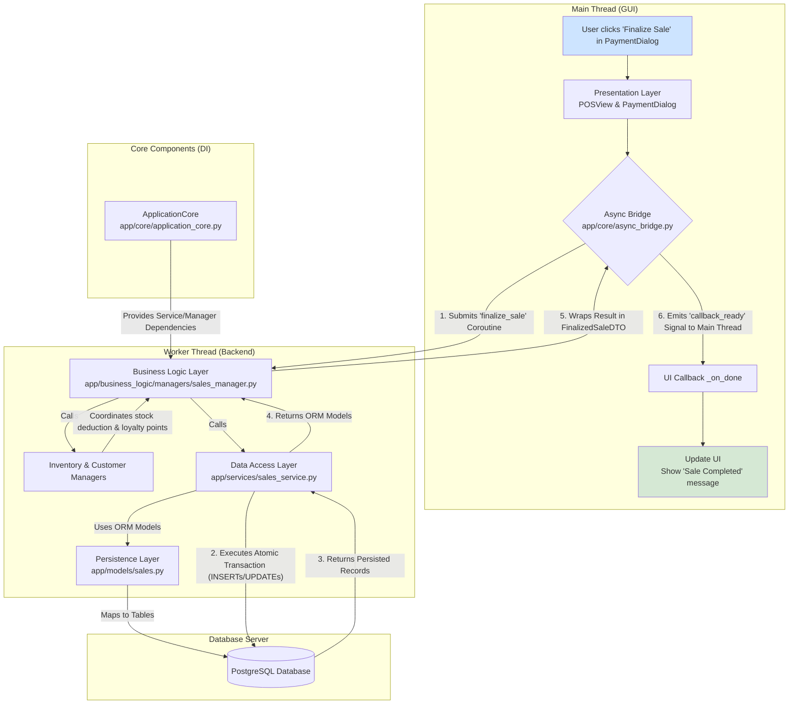

# 'README (draft to be updated to reflect the current codebase more accurately).md'
```md
<p align="center">
  
</p>

<h1 align="center">SG Point-of-Sale (SG-POS) System</h1>

<p align="center">
  <strong>An enterprise-grade, open-source Point-of-Sale system, meticulously engineered for Singapore's SMB retail landscape.</strong>
</p>

<p align="center">
  <a href="#">
    
  </a>
  <a href="#">
    
  </a>
  <a href="https://www.python.org/">
    
  </a>
  <a href="https://www.qt.io/">
    
  </a>
  <a href="https://www.postgresql.org/">
    
  </a>
  <a href="https://github.com/psf/black">
    
  </a>
</p>

---

## 📖 Table of Contents

*   [1. Introduction: What is SG-POS?](#1-introduction-what-is-sg-pos)
*   [2. Current Features & Status](#2-current-features--status)
*   [3. Architectural Deep Dive](#3-architectural-deep-dive)
    *   [3.1 The Layered Architecture](#31-the-layered-architecture)
    *   [3.2 Module Interaction Flowchart](#32-module-interaction-flowchart)
*   [4. Codebase Deep Dive](#4-codebase-deep-dive)
    *   [4.1 Project File Hierarchy](#41-project-file-hierarchy)
    *   [4.2 Key File & Directory Descriptions](#42-key-file--directory-descriptions)
*   [5. Technology Stack](#5-technology-stack)
*   [6. Developer & Deployment Guide](#6-developer--deployment-guide)
    *   [6.1 Prerequisites](#61-prerequisites)
    *   [6.2 Step 1: Database Server Setup (Docker)](#62-step-1-database-server-setup-docker)
    *   [6.3 Step 2: POS Application Setup](#63-step-2-pos-application-setup)
*   [7. Running the Test Suite](#7-running-the-test-suite)
*   [8. User Guide: Running the Application](#8-user-guide-running-the-application)
*   [9. Project Roadmap](#9-project-roadmap)
    *   [9.1 Immediate Next Steps (v1.1+)](#91-immediate-next-steps-v11)
    *   [9.2 Long-Term Vision (v2.0+)](#92-long-term-vision-v20)
*   [10. How to Contribute](#10-how-to-contribute)
*   [11. License](#11-license)

---

## **1. Introduction: What is SG-POS?**

**SG-POS** is a free and open-source Point-of-Sale system, engineered from the ground up to address the specific operational and regulatory challenges faced by Small to Medium-sized Businesses (SMBs) in Singapore. It aims to provide the power and polish of expensive enterprise systems in an accessible, modern, and maintainable package.

This project is built with an obsessive focus on quality, both in the user experience and, most importantly, in the engineering. It serves not only as a functional tool but also as a reference implementation for professional-grade Python application architecture, featuring a non-blocking UI, a clean, layered design, and robust data integrity practices. The system is designed to be the central hub for a retail business, managing everything from the customer-facing checkout process to backend inventory control, procurement, and financial reporting.

The codebase has recently undergone a significant architectural hardening to resolve a series of subtle but critical asynchronous bugs. The resulting system is now exceptionally stable, with a data access layer that correctly handles atomic transactions and prevents the UI-freezing issues that can plague complex desktop applications.

---

## **2. Current Features & Status**

The application is in a **stable** state, with a robust architecture and a wide range of functional core features. The UI has been significantly enhanced for a better user experience, and a foundational automated test suite is now in place to guarantee reliability.

| Feature Area                      | Status                  | Notes                                                                                                                              |
| --------------------------------- | ----------------------- | ---------------------------------------------------------------------------------------------------------------------------------- |
| **Dashboard**                     | ✅ **Functional**       | A new dashboard view provides at-a-glance KPIs for daily sales, transactions, new customers, and low-stock items.                   |
| **Sales & Checkout**              | ✅ **Functional & Stable** | Core sales processing, cart management, and split-tender payment collection are fully working. The entire workflow is now robust and error-free. |
| **Customer Management**           | ✅ **Functional**       | Full CRUD (Create, Read, Update, Deactivate) operations for customers. Table view provides clear loading and empty-state feedback.        |
| **Product Management**            | ✅ **Functional**       | Full CRUD operations for products, with responsive, debounced searching. Table view provides clear loading and empty-state feedback.        |
| **User & Role Management**        | ✅ **Functional & Stable** | Full CRUD operations for users, including multi-role assignment. All previous bugs related to user creation have been resolved.       |
| **Payment Methods Management**    | ✅ **Functional**       | A dedicated UI in Settings allows for full CRUD operations on payment methods, replacing the previous placeholder.                     |
| **Inventory Management**          | ✅ **Functional**       | All inventory tables (summary, POs, movements) now provide clear loading/empty state feedback. All core functions are stable.       |
| **Purchase Orders & Stock-ins**   | ✅ **Functional**       | Creation of Purchase Orders and receiving of items (full or partial) against a PO are fully implemented and update stock levels correctly. |
| **Reporting & Analytics**         | ✅ **Functional & Stable**| Backend correctly generates data for all reports. The UI displays reports and allows for PDF/CSV export. All precision-related bugs fixed. |
| **Automated Testing**             | ✅ **Foundational**     | A comprehensive unit test suite now covers all business logic managers and key services, running against an isolated in-memory database. |

---

## **3. Architectural Deep Dive**

SG-POS is built on a set of robust architectural principles designed for maintainability and scalability.

### **3.1 The Layered Architecture**

Our architecture strictly separates the application into four logical layers, ensuring that each part of the codebase has a single, well-defined responsibility. This design was instrumental in diagnosing and fixing the recent complex bugs, as it allowed for targeted analysis of each layer's responsibilities.

1.  **Presentation Layer (`app/ui`):** Built with PySide6, this layer is responsible *only* for what the user sees and how they interact with it. It contains no business logic. When a user acts, the UI packages the input into a DTO and hands it to the Business Logic Layer via the application's core.

2.  **Business Logic Layer (`app/business_logic`):** The brain of the application. **Managers** (e.g., `SalesManager`) orchestrate workflows, enforce business rules, and make decisions. They use **DTOs** (Data Transfer Objects) as clean data contracts for communication with the UI.

3.  **Data Access Layer (`app/services`):** Implements the **Repository Pattern**. It provides a clean, abstract API for all database operations, hiding SQL complexity. Each service (e.g., `ProductService`) is responsible for querying a specific database entity. After the recent refactoring, all service methods are fully **transaction-aware**, allowing them to participate safely in larger units of work controlled by the managers.

4.  **Persistence Layer (`app/models`):** Defines the database schema using SQLAlchemy ORM models, which map directly to the PostgreSQL tables. This is the only layer aware of the database's table and column structure.

### **3.2 Module Interaction Flowchart**

The flow of control and data is unidirectional and decoupled, ensuring a responsive UI and testable components. The `ApplicationCore` acts as a Dependency Injection (DI) container, providing services and managers to the components that need them. The following diagram illustrates the flow for finalizing a sale, showcasing the robust, multi-layered approach.



This flow guarantees that the UI (main thread) is never blocked. The `Async Bridge` offloads the heavy work (steps D, E, F, G, J) to a background thread, and the UI is only updated via a safe callback once all the work is complete. The recent bug fixes perfected this flow, especially in step D, ensuring that all data for the final DTO is prepared safely before step C is signaled.

---

## **4. Codebase Deep Dive**

A well-organized file structure is paramount for navigating and maintaining a complex codebase. The SG-POS project adheres to a standard, logical layout that reinforces the architectural layers.

### **4.1 Project File Hierarchy**

```
sg-pos-system/
│
├── .env.example                # Template for environment variables
├── .gitignore                  # Specifies files/directories to ignore in Git
├── alembic.ini                 # Configuration for Alembic database migrations
├── docker-compose.dev.yml      # Defines the PostgreSQL database service for Docker
├── pyproject.toml              # Project metadata, dependencies, and tool settings (Poetry)
│
├── app/                        # --- Main Application Source Code ---
│   ├── __init__.py
│   ├── main.py                 # Application entry point; initializes core and UI
│   │
│   ├── core/                   # Architectural backbone and cross-cutting concerns
│   ├── business_logic/         # Business Logic Layer
│   │   ├── dto/                # Data Transfer Objects (Pydantic models)
│   │   └── managers/           # Business workflow and rule orchestrators
│   ├── models/                 # Persistence Layer (SQLAlchemy ORM Models)
│   ├── services/               # Data Access Layer (Repositories)
│   └── ui/                     # Presentation Layer (PySide6 GUI)
│       ├── dialogs/            # QDialog classes for specific tasks
│       ├── resources/          # QSS stylesheets, icons, etc.
│       ├── views/              # Main QWidget screens (Dashboard, POS, etc.)
│       └── widgets/            # Reusable custom widgets (KpiWidget, ManagedTableView)
│
├── migrations/                 # Alembic auto-generated migration scripts
│   ├── versions/
│   └── env.py
│
├── scripts/                    # Utility scripts for development
│   └── database/
│       ├── schema.sql          # A complete, plain SQL snapshot of the target schema
│       └── seed_data.py        # Script to populate a fresh database with initial data
│
└── tests/                      # Automated Test Suite
    ├── conftest.py             # Pytest fixtures and test environment setup
    ├── factories.py            # factory-boy definitions for creating test data
    └── unit/                   # Unit tests, mirroring the `app` directory structure
```

### **4.2 Key File & Directory Descriptions**

| Path                             | Description                                                                                              |
| -------------------------------- | -------------------------------------------------------------------------------------------------------- |
| `pyproject.toml`                 | **Project Definition.** Manages all dependencies (e.g., `PySide6`, `SQLAlchemy`), project metadata, and development tool configurations (`pytest`, `black`, `ruff`).     |
| `docker-compose.dev.yml`         | **Database Service.** Defines and configures the PostgreSQL database container for local development.        |
| `migrations/` & `alembic.ini`    | **Database Migrations.** Configuration and scripts for managing database schema evolution. A corrected initial migration ensures that new setups are perfectly aligned with the application models. |
| `app/main.py`                    | **Application Entry Point.** The script to run. It initializes the `ApplicationCore`, creates the `MainWindow`, and starts the Qt event loop.        |
| `app/core/`                      | **The Backbone.** Contains the application's most critical, non-domain-specific code. This includes the `ApplicationCore` (the Dependency Injection container), the `async_bridge` for non-blocking UI operations, `config.py` for loading environment settings, and the `Result` pattern for robust error handling. |
| `app/models/`                    | **Persistence Layer.** Defines all SQLAlchemy ORM models, mirroring the database tables. This is the single source of truth for the database schema.               |
| `app/services/`                  | **Data Access Layer.** Implements the Repository pattern; contains all database query logic. The recent refactoring has made all services transaction-aware, a key stability improvement. |
| `app/business_logic/managers/`   | **Business Logic Layer.** The brain of the application. Managers orchestrate complex workflows (e.g., finalizing a sale involves inventory, payments, and sales records), enforce business rules, and coordinate with multiple services. Recent fixes have perfected the transaction and data-handling logic in the `SalesManager`. |
| `app/business_logic/dto/`        | **Data Contracts.** Contains all Pydantic models used as Data Transfer Objects. These DTOs define the shape of data passed between the UI and the Business Logic Layer, creating a clean, validated, and decoupled interface.           |
| `app/ui/views/`                  | **Main UI Screens.** The primary user-facing views like the `DashboardView`, `POSView`, and data management screens (`ProductView`, `CustomerView`). Each view is a self-contained `QWidget`. |
| `app/ui/widgets/`                | **Reusable Components.** Contains custom widgets designed to be used across multiple views to ensure a consistent look and feel. The `ManagedTableView` (which provides loading/empty states) and `KpiWidget` (for the dashboard) are key examples that significantly enhance the UX. |
| `tests/`                         | **Automated Tests.** The complete unit test suite. `conftest.py` configures the test environment to use a fast, in-memory SQLite database, ensuring tests are isolated and reliable. |

---

## **5. Technology Stack**

This project uses a modern, professional-grade technology stack chosen for performance, reliability, and developer productivity.

| Category          | Technology                                         | Rationale                                                                                                   |
| ----------------- | -------------------------------------------------- | ----------------------------------------------------------------------------------------------------------- |
| **Language**      | Python 3.11+                                       | Modern features, performance improvements, and strong ecosystem.                                            |
| **GUI Framework** | PySide6 (Qt 6)                                     | The gold standard for professional, high-performance, cross-platform desktop applications in Python.        |
| **Database**      | PostgreSQL 16+                                     | Unmatched reliability, scalability, and feature set for handling critical business and financial data.      |
| **ORM**           | SQLAlchemy 2.0                                     | Industry-leading Object-Relational Mapper with powerful features and excellent async support.               |
| **DB Migrations** | Alembic                                            | The standard for managing database schema changes with SQLAlchemy.                                          |
| **Async**         | `asyncio`, `greenlet`                              | Python's native concurrency library, augmented with `greenlet` for seamless SQLAlchemy async operations.     |
| **Testing**       | `pytest`, `pytest-asyncio`, `aiosqlite`            | A powerful and flexible testing ecosystem for testing all aspects of the application against an in-memory DB. |
| **Packaging**     | Poetry                                             | Modern, reliable dependency management and packaging that guarantees reproducible environments.             |
| **Code Quality**  | Black (Formatter), Ruff (Linter), MyPy (Type Checker)| A trifecta of tools to enforce code style, catch bugs early, and ensure long-term maintainability.          |

---

## **6. Developer & Deployment Guide**

This guide provides step-by-step instructions to set up a complete local development environment for the SG-POS application from scratch. It covers both the database server and the POS application itself.

### **6.1 Prerequisites**

Before you begin, ensure you have the following software installed on your system:

*   **Git:** For cloning the repository. [Install Git](https://git-scm.com/book/en/v2/Getting-Started-Installing-Git).
*   **Python 3.11+:** The application is built on modern Python features. [Install Python](https://www.python.org/downloads/).
*   **Poetry:** For managing dependencies and the virtual environment. [Official Installation Guide](https://python-poetry.org/docs/#installation).
*   **Docker & Docker Compose:** To easily run the PostgreSQL database in a container. [Install Docker Desktop](https://www.docker.com/products/docker-desktop/).

### **6.2 Step 1: Database Server Setup (Docker)**

The database is run as a containerized service using Docker, which simplifies setup and ensures a consistent environment.

1.  **Clone the Repository**
    Open your terminal or command prompt, navigate to your desired workspace directory, and clone the project from GitHub.
    ```bash
    git clone https://github.com/your-org/sg-pos-system.git
    cd sg-pos-system
    ```

2.  **Configure the Environment**
    The application and Docker service read configuration from a `.env.dev` file. Copy the provided template to create your local version. The default values are pre-configured to work together.
    ```bash
    cp .env.example .env.dev
    ```
    *Note: For production, you would create a separate `.env.production` file with strong, unique passwords and keys.*

3.  **Start the Database Container**
    This command starts the PostgreSQL database server in the background. Docker will automatically pull the `postgres:16-alpine` image if you don't have it locally.
    ```bash
    docker-compose -f docker-compose.dev.yml up -d
    ```
    To verify the database is running, use `docker ps`. You should see a container named `sgpos_dev_db`.

### **6.3 Step 2: POS Application Setup**

With the database server running, you can now set up and run the Python application.

1.  **Install Dependencies**
    From the project's root directory (`sg-pos-system/`), run the following command. Poetry will create a dedicated virtual environment and install all necessary packages defined in `pyproject.toml`.
    ```bash
    poetry install
    ```

2.  **Activate the Virtual Environment**
    To use the installed packages, you must activate the virtual environment. All subsequent commands in the terminal must be run inside this shell.
    ```bash
    poetry shell
    ```
    Your command prompt should now be prefixed with the environment name (e.g., `(sg-pos-system-py3.11)`).

3.  **Apply Database Migrations**
    This is a **critical first-time step**. It connects to the running PostgreSQL container and uses Alembic to create all the necessary tables, indexes, and constraints. The corrected initial migration file ensures the schema is created perfectly.
    ```bash
    alembic upgrade head
    ```

4.  **Seed Initial Data**
    A fresh database is empty. This script populates it with the essential data required to run the application, including the default company, an admin user, and the main outlet.
    ```bash
    python scripts/database/seed_data.py
    ```

5.  **Run the Application**
    You are now ready to launch the SG-POS system. The main window should appear, fully functional.
    ```bash
    python app/main.py
    ```

## **7. Running the Test Suite**

A key feature of this codebase is its comprehensive and reliable test suite. Running the tests is a critical step to ensure that your changes have not introduced any regressions.

*   **Run all tests:** To ensure the entire application logic is sound, run the following command from the project root (inside the `poetry shell`):
    ```bash
    pytest
    ```
    This will discover and run all tests in the `tests/` directory against an isolated, in-memory SQLite database, providing fast and reliable feedback.

*   **Check Test Coverage:** To see which parts of the application are covered by tests, you can generate a report in your terminal or as a more detailed HTML report:
    ```bash
    # For a quick summary in the terminal
    pytest --cov=app

    # For a detailed, browsable HTML report
    pytest --cov=app --cov-report=html
    ```
    After running the second command, open the generated `htmlcov/index.html` file in your browser to explore coverage line by line.

## **8. User Guide: Running the Application**

Once the application is running, here is a brief guide on how to use its core features:

*   **Navigation:** Use the menu bar at the top of the window (`Dashboard`, `POS`, `Data Management`, etc.) to switch between the different sections of the application. The application uses lazy-loading, so views are only created the first time you navigate to them, ensuring a fast startup.
*   **Dashboard:** The Dashboard is the first view you might want to check. Navigate via `Dashboard > Show Dashboard`. It provides a live look at today's sales, transaction counts, and other key metrics. It automatically refreshes with the latest data each time you view it.
*   **Making a Sale:**
    1.  Navigate to `POS > Sales Screen`. This is the default view on startup.
    2.  Use the product search bar to find an item by its SKU or name and click **"Add to Cart"**. The item will appear in the cart on the left.
    3.  Once all items are added, click the green **"PAY"** button.
    4.  In the `Process Payment` dialog, select a payment method, enter the amount tendered, and click **"Add Payment"**. You can add multiple payments for split-tender transactions.
    5.  Once the balance is zero or less, click **"Finalize Sale"**. A success message will appear, and the cart will be cleared for the next transaction.
*   **Managing Data (Products, Customers, etc.):**
    1.  Navigate to a management screen like `Data Management > Products`.
    2.  The view will show a "Loading..." message and then display the data. If no data exists, it will show an informative "No products found" message. This stateful feedback is consistent across all data views.
    3.  Use the **"Add New"**, **"Edit Selected"**, and **"Deactivate Selected"** buttons to manage records. Double-clicking a row is a shortcut for editing.
*   **Settings:**
    1.  Navigate to `Settings > Application Settings`.
    2.  Here you can manage Company Information, add or edit Users and their roles, and manage Payment Methods.

## **9. Project Roadmap**

With the core features and UI/UX baseline established, the project is well-positioned for future growth.

### **9.1 Immediate Next Steps (v1.1+)**

*   **Expand Test Coverage:** Continue to build out the test suite, focusing on the data access (service) layer and adding basic UI tests with `pytest-qt` to validate signal/slot connections and dialog behavior.
*   **Advanced Promotions Module:** Implement logic for complex discounts (e.g., "Buy One Get One", tiered discounts, customer-group-specific pricing). This would involve new models and a dedicated `PromotionManager`.
*   **Global Status Bar:** Add a `QStatusBar` to the `MainWindow` to provide non-intrusive feedback for operations like saving data or connection status, improving the user's awareness of background activities.
*   **Refine Dashboard:** Add more KPIs and simple charts (e.g., a bar chart for weekly sales) to the dashboard. This would involve enhancing the `ReportService` with more aggregation queries.
*   **Improve Search UX:** Implement the debouncing `QTimer` pattern (currently in `ProductView` and `CustomerView`) across all other searchable views (`InventoryView`) to improve performance and reduce database load.

### **9.2 Long-Term Vision (v2.0+)**

*   **Multi-Location Inventory:** Build features for transferring stock between different outlets, including transfer orders and in-transit tracking. This would require significant additions to the `InventoryManager` and new UI views.
*   **Full Accounting Module:** Expand the accounting models to support a full double-entry ledger, accounts payable/receivable, and automated journal entries from sales and purchases. This would transform the application into a lightweight ERP system.
*   **E-commerce Connector:** Develop an integration with platforms like Shopify or WooCommerce to sync products, orders, and inventory levels in real-time. This would likely involve creating a new `integrations` sub-package.
*   **Cloud Backend:** Architect a cloud-based version of the backend logic, exposing it via a REST or GraphQL API. This would enable the creation of a mobile companion app (for stock-takes or mobile sales) and a web-based reporting dashboard for business owners to access from anywhere.
*   **Enhanced Hardware Support:** Add direct support for receipt printers, cash drawers, and barcode scanners using libraries that interface with serial or USB ports.

---

## **10. How to Contribute**

We welcome contributions from the community! Whether you're fixing a bug, adding a new feature, or improving documentation, your help is valued. Please see the [`CONTRIBUTING.md`](CONTRIBUTING.md) file for detailed guidelines on our development process and how to submit a pull request. All participants are expected to adhere to our [`CODE_OF_CONDUCT.md`](CODE_OF_CONDUCT.md).

---

## **11. License**

This project is licensed under the **MIT License**. You are free to use, modify, and distribute this software, but it is provided "as is" without warranty.

```

# app/business_logic/managers/customer_manager.py
```py
# File: app/business_logic/managers/customer_manager.py
"""Business Logic Manager for Customer operations."""
from __future__ import annotations
from typing import TYPE_CHECKING, List, Optional
from uuid import UUID
from decimal import Decimal

from app.core.result import Result, Success, Failure
from app.business_logic.managers.base_manager import BaseManager
from app.business_logic.dto.customer_dto import CustomerDTO, CustomerCreateDTO, CustomerUpdateDTO
from app.models.customer import Customer

if TYPE_CHECKING:
    from app.core.application_core import ApplicationCore
    from app.services.customer_service import CustomerService
    from sqlalchemy.ext.asyncio import AsyncSession

class CustomerManager(BaseManager):
    """Orchestrates business logic for customers."""

    @property
    def customer_service(self) -> "CustomerService":
        return self.core.customer_service

    async def create_customer(self, company_id: UUID, dto: CustomerCreateDTO) -> Result[CustomerDTO, str]:
        """
        Creates a new customer.
        Business rule: Customer code and email must be unique for the company.
        """
        async with self.core.get_session() as session:
            existing_result = await self.customer_service.get_by_code(company_id, dto.customer_code, session)
            if isinstance(existing_result, Failure):
                return existing_result
            if existing_result.value is not None:
                return Failure(f"Business Rule Error: Customer with code '{dto.customer_code}' already exists.")

            if dto.email:
                email_check_result = await self.customer_service.get_by_email(company_id, dto.email, session)
                if isinstance(email_check_result, Failure):
                    return email_check_result
                if email_check_result.value is not None:
                    return Failure(f"Business Rule Error: Customer with email '{dto.email}' already exists.")

            new_customer = Customer(company_id=company_id, **dto.dict())
            
            create_result = await self.customer_service.create(new_customer, session)
            if isinstance(create_result, Failure):
                return create_result

            return Success(CustomerDTO.from_orm(create_result.value))

    async def update_customer(self, customer_id: UUID, dto: CustomerUpdateDTO) -> Result[CustomerDTO, str]:
        """Updates an existing customer."""
        async with self.core.get_session() as session:
            customer_result = await self.customer_service.get_by_id(customer_id, session)
            if isinstance(customer_result, Failure):
                return customer_result
            
            customer = customer_result.value
            if not customer:
                return Failure("Customer not found.")

            if dto.customer_code != customer.customer_code:
                existing_result = await self.customer_service.get_by_code(customer.company_id, dto.customer_code, session)
                if isinstance(existing_result, Failure):
                    return existing_result
                if existing_result.value is not None and existing_result.value.id != customer_id:
                    return Failure(f"Business Rule Error: New customer code '{dto.customer_code}' is already in use by another customer.")
            
            if dto.email and dto.email != customer.email:
                email_check_result = await self.customer_service.get_by_email(customer.company_id, dto.email, session)
                if isinstance(email_check_result, Failure):
                    return email_check_result
                if email_check_result.value is not None and email_check_result.value.id != customer_id:
                    return Failure(f"Business Rule Error: New email '{dto.email}' is already in use by another customer.")

            for field, value in dto.dict(exclude_unset=True).items():
                setattr(customer, field, value)

            update_result = await self.customer_service.update(customer, session)
            if isinstance(update_result, Failure):
                return update_result
            
            return Success(CustomerDTO.from_orm(update_result.value))

    async def get_customer(self, customer_id: UUID, session: Optional["AsyncSession"] = None) -> Result[CustomerDTO, str]:
        """Retrieves a single customer by ID."""
        # FIX: Pass the session down to the service layer.
        result = await self.customer_service.get_by_id(customer_id, session)
        if isinstance(result, Failure):
            return result
        
        customer = result.value
        if not customer:
            return Failure("Customer not found.")
            
        return Success(CustomerDTO.from_orm(customer))

    async def get_all_customers(self, company_id: UUID, limit: int = 100, offset: int = 0) -> Result[List[CustomerDTO], str]:
        """Retrieves all customers for a given company."""
        result = await self.customer_service.get_all(company_id, limit, offset)
        if isinstance(result, Failure):
            return result
        
        return Success([CustomerDTO.from_orm(c) for c in result.value])
    
    async def search_customers(self, company_id: UUID, term: str, limit: int = 100, offset: int = 0) -> Result[List[CustomerDTO], str]:
        """Searches for customers by code, name, email, or phone."""
        result = await self.customer_service.search(company_id, term, limit, offset)
        if isinstance(result, Failure):
            return result
        
        return Success([CustomerDTO.from_orm(c) for c in result.value])

    async def deactivate_customer(self, customer_id: UUID) -> Result[bool, str]:
        """Deactivates a customer (soft delete)."""
        async with self.core.get_session() as session:
            customer_result = await self.customer_service.get_by_id(customer_id, session)
            if isinstance(customer_result, Failure):
                return customer_result
            
            customer = customer_result.value
            if not customer:
                return Failure("Customer not found.")
            
            customer.is_active = False
            update_result = await self.customer_service.update(customer, session)
            if isinstance(update_result, Failure):
                return update_result
            
            return Success(True)

    async def add_loyalty_points_for_sale(self, customer_id: UUID, sale_total: Decimal, session: "AsyncSession") -> Result[int, str]:
        """
        Calculates and adds loyalty points for a completed sale.
        This method MUST be called with an existing session from a parent transaction.
        It modifies the customer object and relies on the calling transaction to commit the change.
        """
        loyalty_rate = Decimal("10.00")
        points_to_add = int(sale_total // loyalty_rate)
        
        if points_to_add <= 0:
            return Success(0)

        # FIX: Fetch the customer using the provided session.
        customer_result = await self.customer_service.get_by_id(customer_id, session)
        if isinstance(customer_result, Failure):
            return customer_result
        
        customer = customer_result.value
        if not customer:
            return Failure(f"Customer with ID {customer_id} not found.")
        
        # FIX: Modify the object. The Unit of Work in the parent session will detect
        # this change and include it in the final COMMIT. No explicit update call is needed.
        customer.loyalty_points += points_to_add
            
        return Success(customer.loyalty_points)

```

# app/business_logic/managers/inventory_manager.py
```py
# File: app/business_logic/managers/inventory_manager.py
"""Business Logic Manager for orchestrating Inventory operations."""
from __future__ import annotations
from typing import TYPE_CHECKING, List, Dict, Any, Optional
from uuid import UUID
from decimal import Decimal
import uuid as uuid_pkg

from app.core.result import Result, Success, Failure
from app.business_logic.managers.base_manager import BaseManager
from app.business_logic.dto.inventory_dto import (
    StockAdjustmentDTO, PurchaseOrderCreateDTO, PurchaseOrderDTO,
    InventorySummaryDTO, StockMovementDTO, SupplierDTO, PurchaseOrderItemDTO
)
from app.models.inventory import StockMovement, PurchaseOrder, PurchaseOrderItem
from app.models.product import Product
from sqlalchemy.orm import selectinload

if TYPE_CHECKING:
    from app.core.application_core import ApplicationCore
    from app.services.inventory_service import InventoryService
    from app.services.product_service import ProductService
    from app.services.supplier_service import SupplierService
    from app.services.purchase_order_service import PurchaseOrderService
    from app.services.user_service import UserService
    from app.services.company_service import OutletService
    from sqlalchemy.ext.asyncio import AsyncSession


class InventoryManager(BaseManager):
    """Handles high-level inventory workflows like stock takes, adjustments, and purchase orders."""
    
    @property
    def inventory_service(self) -> "InventoryService": return self.core.inventory_service
    @property
    def product_service(self) -> "ProductService": return self.core.product_service
    @property
    def supplier_service(self) -> "SupplierService": return self.core.supplier_service
    @property
    def purchase_order_service(self) -> "PurchaseOrderService": return self.core.purchase_order_service
    @property
    def user_service(self) -> "UserService": return self.core.user_service
    @property
    def outlet_service(self) -> "OutletService": return self.core.outlet_service

    async def adjust_stock(self, dto: StockAdjustmentDTO) -> Result[None, str]:
        """Performs a stock adjustment for one or more products, creating an auditable stock movement record for each change."""
        try:
            async with self.core.get_session() as session:
                for item_dto in dto.items:
                    current_stock_result = await self.inventory_service.get_stock_level(dto.outlet_id, item_dto.product_id, item_dto.variant_id, session)
                    if isinstance(current_stock_result, Failure): raise Exception(f"Failed to get current stock for {item_dto.product_id}: {current_stock_result.error}")
                    
                    quantity_change = item_dto.counted_quantity - current_stock_result.value
                    if quantity_change == 0: continue

                    adjust_result = await self.inventory_service.adjust_stock_level(dto.outlet_id, item_dto.product_id, item_dto.variant_id, quantity_change, session)
                    if isinstance(adjust_result, Failure): raise Exception(f"Failed to update inventory for {item_dto.product_id}: {adjust_result.error}")

                    movement = StockMovement(
                        company_id=dto.company_id, outlet_id=dto.outlet_id, product_id=item_dto.product_id,
                        variant_id=item_dto.variant_id, movement_type='ADJUSTMENT_IN' if quantity_change > 0 else 'ADJUSTMENT_OUT',
                        quantity_change=quantity_change, notes=dto.notes, created_by_user_id=dto.user_id, reference_type="STOCK_ADJUSTMENT"
                    )
                    log_result = await self.inventory_service.log_movement(movement, session)
                    if isinstance(log_result, Failure): raise Exception(f"Failed to log stock movement for {item_dto.product_id}: {log_result.error}")
            return Success(None)
        except Exception as e:
            return Failure(str(e))

    async def deduct_stock_for_sale(self, company_id: UUID, outlet_id: UUID, sale_items: List[Dict[str, Any]], cashier_id: UUID, session: AsyncSession) -> Result[List[StockMovement], str]:
        """Deduct stock for a finalized sale. Called by SalesManager within its atomic transaction."""
        stock_movements = []
        for item_data in sale_items:
            product: Product = item_data['product']
            if not product.track_inventory: continue
            
            adjust_result = await self.inventory_service.adjust_stock_level(
                outlet_id, product.id, item_data.get('variant_id'), -item_data['quantity'], session
            )
            if isinstance(adjust_result, Failure): return Failure(f"Insufficient stock for {product.sku}: {adjust_result.error}")

            movement = StockMovement(
                company_id=company_id, outlet_id=outlet_id, product_id=product.id, variant_id=item_data.get('variant_id'),
                movement_type='SALE', quantity_change=-item_data['quantity'], created_by_user_id=cashier_id, reference_type="SALES_TRANSACTION"
            )
            stock_movements.append(movement)
            log_result = await self.inventory_service.log_movement(movement, session)
            if isinstance(log_result, Failure): return Failure(f"Failed to log sale stock movement for {product.sku}: {log_result.error}")
        return Success(stock_movements)

    async def create_purchase_order(self, dto: PurchaseOrderCreateDTO) -> Result[PurchaseOrderDTO, str]:
        """Creates a new purchase order, including its line items."""
        try:
            async with self.core.get_session() as session:
                # FIX: Pass the session to all service calls within the transaction block.
                supplier_result = await self.supplier_service.get_by_id(dto.supplier_id, session)
                if isinstance(supplier_result, Failure) or supplier_result.value is None: raise Exception("Supplier not found.")

                po_total_amount = Decimal("0.0")
                po_items: List[PurchaseOrderItem] = []
                for item_dto in dto.items:
                    product_result = await self.product_service.get_by_id(item_dto.product_id, session)
                    if isinstance(product_result, Failure) or product_result.value is None: raise Exception(f"Product {item_dto.product_id} not found.")
                    po_items.append(PurchaseOrderItem(**item_dto.dict()))
                    po_total_amount += item_dto.quantity_ordered * item_dto.unit_cost

                po_number = dto.po_number or f"PO-{uuid_pkg.uuid4().hex[:8].upper()}"
                new_po = PurchaseOrder(
                    company_id=dto.company_id, outlet_id=dto.outlet_id, supplier_id=dto.supplier_id, po_number=po_number,
                    order_date=dto.order_date, expected_delivery_date=dto.expected_delivery_date, notes=dto.notes,
                    total_amount=po_total_amount.quantize(Decimal("0.01")), items=po_items, status='SENT'
                )
                save_po_result = await self.purchase_order_service.create_full_purchase_order(new_po, session)
                if isinstance(save_po_result, Failure): raise Exception(save_po_result.error)

                return await self._create_po_dto(save_po_result.value, supplier_result.value.name, session)
        except Exception as e:
            return Failure(f"Failed to create purchase order: {e}")

    async def receive_purchase_order_items(self, po_id: UUID, items_received: List[Dict[str, Any]], user_id: UUID) -> Result[None, str]:
        """Records the receipt of items against a purchase order."""
        try:
            async with self.core.get_session() as session:
                po = await session.get(PurchaseOrder, po_id, options=[selectinload(PurchaseOrder.items).selectinload(PurchaseOrderItem.product)])
                if not po: raise Exception(f"Purchase Order {po_id} not found.")
                if po.status not in ['SENT', 'PARTIALLY_RECEIVED']: raise Exception(f"Cannot receive items for PO in '{po.status}' status.")

                for received_item in items_received:
                    po_item = next((item for item in po.items if item.product_id == received_item['product_id']), None)
                    if not po_item: raise Exception(f"Product {received_item['product_id']} not found in PO {po_id}.")
                    
                    quantity_received = received_item['quantity_received']
                    if po_item.quantity_received + quantity_received > po_item.quantity_ordered: raise Exception(f"Received quantity for {po_item.product.sku} exceeds ordered quantity.")

                    po_item.quantity_received += quantity_received
                    adjust_res = await self.inventory_service.adjust_stock_level(po.outlet_id, po_item.product_id, po_item.variant_id, quantity_received, session)
                    if isinstance(adjust_res, Failure): raise Exception(adjust_res.error)

                    movement = StockMovement(
                        company_id=po.company_id, outlet_id=po.outlet_id, product_id=po_item.product_id, variant_id=po_item.variant_id,
                        movement_type='PURCHASE', quantity_change=quantity_received, notes=f"Received via PO {po.po_number}",
                        created_by_user_id=user_id, reference_type="PURCHASE_ORDER", reference_id=po.id
                    )
                    log_res = await self.inventory_service.log_movement(movement, session)
                    if isinstance(log_res, Failure): raise Exception(log_res.error)
                
                po.status = 'RECEIVED' if all(item.quantity_received >= item.quantity_ordered for item in po.items) else 'PARTIALLY_RECEIVED'
                return Success(None)
        except Exception as e:
            return Failure(f"Failed to receive PO items: {e}")

    async def get_inventory_summary(self, company_id: UUID, outlet_id: Optional[UUID] = None, limit: int = 100, offset: int = 0, search_term: Optional[str] = None) -> Result[List[InventorySummaryDTO], str]:
        """Retrieves a summary of inventory levels for display."""
        summary_result = await self.inventory_service.get_inventory_summary(company_id, outlet_id, limit, offset, search_term)
        if isinstance(summary_result, Failure): return summary_result
        return Success([InventorySummaryDTO(**row) for row in summary_result.value])

    async def get_all_suppliers(self, company_id: UUID) -> Result[List[SupplierDTO], str]:
        """Retrieves all active suppliers for a given company."""
        result = await self.supplier_service.get_all_active_suppliers(company_id)
        if isinstance(result, Failure): return result
        return Success([SupplierDTO.from_orm(s) for s in result.value])
    
    async def get_all_purchase_orders(self, company_id: UUID, outlet_id: Optional[UUID] = None) -> Result[List[PurchaseOrderDTO], str]:
        """Retrieves all purchase orders for a given company, optionally filtered by outlet."""
        po_results = await self.purchase_order_service.get_all_with_supplier(company_id, outlet_id)
        if isinstance(po_results, Failure):
            return po_results

        po_dtos: List[PurchaseOrderDTO] = []
        for po in po_results.value:
            supplier_name = po.supplier.name if po.supplier else "Unknown Supplier"
            po_dto_res = await self._create_po_dto(po, supplier_name)
            if isinstance(po_dto_res, Success):
                po_dtos.append(po_dto_res.value)
        return Success(po_dtos)
        
    async def get_stock_movements_for_product(self, company_id: UUID, product_id: UUID) -> Result[List[StockMovementDTO], str]:
        """
        Retrieves the movement history for a specific product.
        """
        result = await self.inventory_service.get_movements_for_product(company_id, product_id)
        if isinstance(result, Failure):
            return result
        
        return Success([StockMovementDTO(**row) for row in result.value])

    async def _create_po_dto(self, po: PurchaseOrder, supplier_name: str, session: Optional["AsyncSession"] = None) -> Result[PurchaseOrderDTO, str]:
        """Helper to construct a PurchaseOrderDTO from an ORM object."""
        items_dto: List[PurchaseOrderItemDTO] = []
        if po.items:
            product_ids = [item.product_id for item in po.items]
            # FIX: Pass session to service call
            products_res = await self.product_service.get_by_ids(product_ids, session)
            if isinstance(products_res, Failure): return products_res
            products_map = {p.id: p for p in products_res.value}

            for item in po.items:
                product = products_map.get(item.product_id)
                if not product: continue

                items_dto.append(
                    PurchaseOrderItemDTO(
                        id=item.id, product_id=item.product_id, variant_id=item.variant_id,
                        product_name=product.name, sku=product.sku, quantity_ordered=item.quantity_ordered,
                        quantity_received=item.quantity_received, unit_cost=item.unit_cost,
                        line_total=(item.quantity_ordered * item.unit_cost).quantize(Decimal("0.01"))
                    )
                )

        return Success(PurchaseOrderDTO(
            id=po.id, company_id=po.company_id, outlet_id=po.outlet_id, supplier_id=po.supplier_id,
            supplier_name=supplier_name, po_number=po.po_number, order_date=po.order_date,
            expected_delivery_date=po.expected_delivery_date, status=po.status, notes=po.notes,
            total_amount=po.total_amount, items=items_dto
        ))

```

# app/business_logic/managers/reporting_manager.py
```py
# File: app/business_logic/managers/reporting_manager.py
"""Business Logic Manager for generating business reports and analytics."""
from __future__ import annotations
import csv
from typing import TYPE_CHECKING, List, Optional, Any
from datetime import date
from decimal import Decimal
import uuid

from app.core.result import Result, Success, Failure
from app.business_logic.managers.base_manager import BaseManager
from app.business_logic.dto.reporting_dto import (
    DashboardStatsDTO, SalesSummaryReportDTO, SalesByPeriodDTO, ProductPerformanceDTO,
    InventoryValuationReportDTO, InventoryValuationItemDTO, GstReportDTO
)
from reportlab.platypus import SimpleDocTemplate, Paragraph, Spacer, Table, TableStyle
from reportlab.lib.styles import getSampleStyleSheet, ParagraphStyle
from reportlab.lib import colors
from reportlab.lib.units import inch

if TYPE_CHECKING:
    from app.core.application_core import ApplicationCore
    from app.services.report_service import ReportService
    from app.services.company_service import OutletService

class ReportingManager(BaseManager):
    """Orchestrates the creation and exportation of business intelligence reports."""
    @property
    def report_service(self) -> "ReportService": return self.core.report_service
    @property
    def outlet_service(self) -> "OutletService": return self.core.outlet_service

    async def generate_dashboard_stats(self, company_id: uuid.UUID) -> Result[DashboardStatsDTO, str]:
        """Generates the aggregated statistics for the main dashboard."""
        raw_data_result = await self.report_service.get_dashboard_stats_raw_data(company_id)
        if isinstance(raw_data_result, Failure):
            return raw_data_result
        
        return Success(DashboardStatsDTO(**raw_data_result.value))

    async def generate_sales_summary_report(self, company_id: uuid.UUID, start_date: date, end_date: date) -> Result[SalesSummaryReportDTO, str]:
        """Generates a comprehensive sales summary report."""
        sales_data_res = await self.report_service.get_sales_summary_raw_data(company_id, start_date, end_date)
        if isinstance(sales_data_res, Failure): return sales_data_res
        
        product_perf_res = await self.report_service.get_product_performance_raw_data(company_id, start_date, end_date)
        if isinstance(product_perf_res, Failure): product_perf_res.value = [] # Continue if this part fails
        
        sales_by_period = [SalesByPeriodDTO(
            period=row["period"], total_sales=row["total_sales"], transaction_count=row["transaction_count"],
            average_transaction_value=(row["total_sales"] / row["transaction_count"] if row["transaction_count"] > 0 else Decimal(0))
        ) for row in sales_data_res.value]
        
        top_products = []
        for p_data in product_perf_res.value:
            revenue = p_data.get('total_revenue', Decimal(0))
            cost = p_data.get('total_cost', Decimal(0))
            margin = revenue - cost
            # FIX: Explicitly round the calculated percentage to 2 decimal places before passing it to the DTO.
            # This is done using quantize(), the correct method for Decimal objects.
            margin_pct = ((margin / revenue * 100) if revenue > 0 else Decimal(0)).quantize(Decimal("0.01"))
            top_products.append(ProductPerformanceDTO(
                product_id=p_data['product_id'], sku=p_data['sku'], name=p_data['name'],
                quantity_sold=p_data['quantity_sold'], total_revenue=revenue, total_cost=cost,
                gross_margin=margin, gross_margin_percentage=margin_pct
            ))
            
        return Success(SalesSummaryReportDTO(
            start_date=start_date, end_date=end_date,
            total_revenue=sum(s.total_sales for s in sales_by_period),
            total_transactions=sum(s.transaction_count for s in sales_by_period),
            total_discount_amount=sum(row.get("total_discount_amount", Decimal(0)) for row in sales_data_res.value),
            total_tax_collected=sum(row.get("total_tax_collected", Decimal(0)) for row in sales_data_res.value),
            sales_by_period=sales_by_period, top_performing_products=top_products
        ))

    async def generate_inventory_valuation_report(self, company_id: uuid.UUID, outlet_id: Optional[uuid.UUID] = None) -> Result[InventoryValuationReportDTO, str]:
        """Generates a report showing the current value of inventory."""
        raw_data_res = await self.report_service.get_inventory_valuation_raw_data(company_id, outlet_id)
        if isinstance(raw_data_res, Failure): return raw_data_res
        
        items_data = raw_data_res.value
        valuation_items = [InventoryValuationItemDTO(**item) for item in items_data]

        outlet_name = "All Outlets"
        if outlet_id:
            outlet_res = await self.outlet_service.get_by_id(outlet_id)
            if isinstance(outlet_res, Success) and outlet_res.value: outlet_name = outlet_res.value.name

        return Success(InventoryValuationReportDTO(
            as_of_date=date.today(), outlet_id=outlet_id or uuid.uuid4(), outlet_name=outlet_name,
            total_inventory_value=sum(v.total_value for v in valuation_items),
            total_distinct_items=len(valuation_items), items=valuation_items
        ))

    async def export_report_to_pdf(self, report_data: Any, file_path: str) -> Result[str, str]:
        """Exports the provided report data DTO to a PDF file."""
        try:
            if isinstance(report_data, SalesSummaryReportDTO):
                self._create_sales_summary_pdf(report_data, file_path)
            elif isinstance(report_data, InventoryValuationReportDTO):
                self._create_inventory_valuation_pdf(report_data, file_path)
            elif isinstance(report_data, GstReportDTO):
                self._create_gst_report_pdf(report_data, file_path)
            else:
                return Failure("Unsupported report type for PDF export.")
            return Success(f"Report successfully exported to {file_path}")
        except Exception as e:
            return Failure(f"Failed to export PDF: {e}")

    async def export_report_to_csv(self, report_data: Any, file_path: str) -> Result[str, str]:
        """Exports the provided report data DTO to a CSV file."""
        try:
            if isinstance(report_data, SalesSummaryReportDTO):
                self._create_product_performance_csv(report_data, file_path)
            elif isinstance(report_data, InventoryValuationReportDTO):
                self._create_inventory_valuation_csv(report_data, file_path)
            else:
                return Failure("Unsupported report type for CSV export.")
            return Success(f"Report successfully exported to {file_path}")
        except Exception as e:
            return Failure(f"Failed to export CSV: {e}")

    # --- Private PDF Creation Helpers ---
    def _create_sales_summary_pdf(self, data: SalesSummaryReportDTO, file_path: str):
        doc = SimpleDocTemplate(file_path, rightMargin=inch/2, leftMargin=inch/2, topMargin=inch/2, bottomMargin=inch/2)
        styles = getSampleStyleSheet()
        story = [Paragraph("Sales Summary Report", styles['h1']), Spacer(1, 0.2*inch)]
        
        summary_text = f"Period: {data.start_date.strftime('%d %b %Y')} to {data.end_date.strftime('%d %b %Y')}<br/>" \
                       f"Total Revenue: S${data.total_revenue:.2f}<br/>" \
                       f"Total Transactions: {data.total_transactions}"
        story.append(Paragraph(summary_text, styles['Normal']))
        story.append(Spacer(1, 0.2*inch))

        story.append(Paragraph("Sales by Period", styles['h2']))
        sales_by_period_headers = ["Date", "Total Sales (S$)", "Transactions", "Avg. Tx Value (S$)"]
        table_data = [sales_by_period_headers] + [[p.period.strftime('%Y-%m-%d'), f"{p.total_sales:.2f}", str(p.transaction_count), f"{p.average_transaction_value:.2f}"] for p in data.sales_by_period]
        story.append(self._create_styled_table(table_data))
        story.append(Spacer(1, 0.2*inch))

        story.append(Paragraph("Top Performing Products", styles['h2']))
        product_perf_headers = ["SKU", "Product Name", "Qty Sold", "Revenue (S$)", "Margin (S$)", "Margin (%)"]
        table_data_2 = [product_perf_headers] + [[p.sku, p.name, f"{p.quantity_sold:.2f}", f"{p.total_revenue:.2f}", f"{p.gross_margin:.2f}", f"{p.gross_margin_percentage:.2f}%"] for p in data.top_performing_products]
        story.append(self._create_styled_table(table_data_2))
        
        doc.build(story)

    def _create_inventory_valuation_pdf(self, data: InventoryValuationReportDTO, file_path: str):
        doc = SimpleDocTemplate(file_path, rightMargin=inch/2, leftMargin=inch/2, topMargin=inch/2, bottomMargin=inch/2)
        styles = getSampleStyleSheet()
        story = [Paragraph("Inventory Valuation Report", styles['h1']), Spacer(1, 0.2*inch)]
        
        summary_text = f"As of Date: {data.as_of_date.strftime('%d %b %Y')}<br/>" \
                       f"Outlet: {data.outlet_name}<br/>" \
                       f"Total Inventory Value: S${data.total_inventory_value:.2f}"
        story.append(Paragraph(summary_text, styles['Normal']))
        story.append(Spacer(1, 0.2*inch))

        inv_val_headers = ["SKU", "Product Name", "Qty On Hand", "Cost Price (S$)", "Total Value (S$)"]
        table_data = [inv_val_headers] + [[i.sku, i.name, f"{i.quantity_on_hand:.4f}", f"{i.cost_price:.4f}", f"{i.total_value:.2f}"] for i in data.items]
        story.append(self._create_styled_table(table_data))
        doc.build(story)
    
    def _create_gst_report_pdf(self, data: GstReportDTO, file_path: str):
        doc = SimpleDocTemplate(file_path, rightMargin=inch, leftMargin=inch, topMargin=inch, bottomMargin=inch)
        styles = getSampleStyleSheet()
        story = [Paragraph("GST Form 5 Summary", styles['h1']), Spacer(1, 0.2*inch)]
        
        company_info = f"Company: {data.company_name} (GST Reg No: {data.company_gst_reg_no or 'N/A'})<br/>" \
                       f"Period: {data.start_date.strftime('%d %b %Y')} to {data.end_date.strftime('%d %b %Y')}"
        story.append(Paragraph(company_info, styles['Normal']))
        story.append(Spacer(1, 0.2*inch))

        gst_data = [
            ["Box 1: Standard-Rated Supplies", f"S${data.box_1_standard_rated_supplies:.2f}"],
            ["Box 6: Output Tax Due", f"S${data.box_6_output_tax_due:.2f}"],
            ["Box 5: Taxable Purchases", f"S${data.box_5_taxable_purchases:.2f}"],
            ["Box 7: Input Tax Claimed", f"S${data.box_7_input_tax_claimed:.2f}"],
            ["", ""],
            [f"Net GST {'Payable' if data.box_13_net_gst_payable >=0 else 'Claimable'}", f"S${abs(data.box_13_net_gst_payable):.2f}"]
        ]
        story.append(self._create_styled_table(gst_data, align_right_cols=[1]))
        doc.build(story)

    def _create_styled_table(self, data: List[List[Any]], align_right_cols: List[int] = []) -> Table:
        style = TableStyle([
            ('BACKGROUND', (0,0), (-1,0), colors.grey),
            ('TEXTCOLOR', (0,0), (-1,0), colors.whitesmoke),
            ('ALIGN', (0,0), (-1,-1), 'CENTER'),
            ('FONTNAME', (0,0), (-1,0), 'Helvetica-Bold'),
            ('BOTTOMPADDING', (0,0), (-1,0), 12),
            ('BACKGROUND', (0,1), (-1,-1), colors.beige),
            ('GRID', (0,0), (-1,-1), 1, colors.black)
        ])
        for col_idx in align_right_cols:
            style.add('ALIGN', (col_idx, 1), (col_idx, -1), 'RIGHT')
        
        table = Table(data)
        table.setStyle(style)
        return table

    # --- Private CSV Creation Helpers ---
    def _create_product_performance_csv(self, data: SalesSummaryReportDTO, file_path: str):
        with open(file_path, 'w', newline='', encoding='utf-8') as f:
            writer = csv.writer(f)
            headers = ["SKU", "Product Name", "Qty Sold", "Revenue (S$)", "Margin (S$)", "Margin (%)"]
            writer.writerow(headers)
            for p in data.top_performing_products:
                writer.writerow([p.sku, p.name, f"{p.quantity_sold:.4f}", f"{p.total_revenue:.2f}", f"{p.gross_margin:.2f}", f"{p.gross_margin_percentage:.2f}"])

    def _create_inventory_valuation_csv(self, data: InventoryValuationReportDTO, file_path: str):
        with open(file_path, 'w', newline='', encoding='utf-8') as f:
            writer = csv.writer(f)
            writer.writerow(["As of Date", data.as_of_date.strftime('%Y-%m-%d')])
            writer.writerow(["Outlet Name", data.outlet_name])
            writer.writerow(["Total Value (S$)", f"{data.total_inventory_value:.2f}"])
            writer.writerow([])
            headers = ["SKU", "Product Name", "Qty On Hand", "Cost Price (S$)", "Total Value (S$)"]
            writer.writerow(headers)
            for i in data.items:
                writer.writerow([i.sku, i.name, f"{i.quantity_on_hand:.4f}", f"{i.cost_price:.4f}", f"{i.total_value:.2f}"])

```

# app/business_logic/managers/sales_manager.py
```py
# File: app/business_logic/managers/sales_manager.py
"""
Business Logic Manager for orchestrating the entire sales workflow.
"""
from __future__ import annotations
from decimal import Decimal
import uuid
from datetime import datetime
from typing import TYPE_CHECKING, List, Dict, Any, Optional

from sqlalchemy import select
from sqlalchemy.orm import selectinload

from app.core.result import Result, Success, Failure
from app.business_logic.managers.base_manager import BaseManager
from app.business_logic.dto.sales_dto import SaleCreateDTO, FinalizedSaleDTO, SalesTransactionItemDTO
from app.models.sales import SalesTransaction, SalesTransactionItem, Payment
from app.models.inventory import StockMovement
from app.models.product import Product


if TYPE_CHECKING:
    from app.core.application_core import ApplicationCore
    from app.services.sales_service import SalesService
    from app.services.product_service import ProductService
    from app.services.user_service import UserService
    from app.business_logic.managers.inventory_manager import InventoryManager
    from app.business_logic.managers.customer_manager import CustomerManager
    from sqlalchemy.ext.asyncio import AsyncSession


class SalesManager(BaseManager):
    """Orchestrates the business logic for creating and finalizing sales."""

    @property
    def sales_service(self) -> "SalesService":
        return self.core.sales_service

    @property
    def product_service(self) -> "ProductService":
        return self.core.product_service
    
    @property
    def user_service(self) -> "UserService":
        return self.core.user_service

    @property
    def inventory_manager(self) -> "InventoryManager":
        return self.core.inventory_manager

    @property
    def customer_manager(self) -> "CustomerManager":
        return self.core.customer_manager


    async def _calculate_totals(self, cart_items: List[Dict[str, Any]]) -> Result[Dict[str, Any], str]:
        """
        Internal helper to calculate subtotal, tax, and total from cart items with product details.
        """
        subtotal = Decimal("0.0")
        tax_amount = Decimal("0.0")
        items_with_details: List[Dict[str, Any]] = [] 
        
        for item_data in cart_items:
            product = item_data["product"]
            quantity = item_data["quantity"]
            unit_price = item_data["unit_price_override"] if item_data["unit_price_override"] is not None else product.selling_price
            
            line_subtotal = (quantity * unit_price).quantize(Decimal("0.01"))
            subtotal += line_subtotal
            
            item_tax = (line_subtotal * (product.gst_rate / Decimal("100.0"))).quantize(Decimal("0.01"))
            tax_amount += item_tax

            items_with_details.append({
                "product_id": product.id,
                "variant_id": item_data.get("variant_id"),
                "product_name": product.name,
                "sku": product.sku,
                "quantity": quantity,
                "unit_price": unit_price,
                "cost_price": product.cost_price,
                "line_total": line_subtotal,
                "gst_rate": product.gst_rate,
                "product": product
            })

        total_amount = subtotal + tax_amount
        return Success({
            "subtotal": subtotal.quantize(Decimal("0.01")),
            "tax_amount": tax_amount.quantize(Decimal("0.01")),
            "total_amount": total_amount.quantize(Decimal("0.01")),
            "items_with_details": items_with_details
        })

    async def finalize_sale(self, dto: SaleCreateDTO) -> Result[FinalizedSaleDTO, str]:
        """
        Processes a complete sales transaction atomically.
        """
        try:
            total_payment = sum(p.amount for p in dto.payments).quantize(Decimal("0.01"))
            
            product_ids = [item.product_id for item in dto.cart_items]
            fetched_products_result = await self.product_service.get_by_ids(product_ids)
            if isinstance(fetched_products_result, Failure):
                return fetched_products_result
            
            products_map = {p.id: p for p in fetched_products_result.value}
            if len(products_map) != len(product_ids):
                return Failure("One or more products in the cart could not be found.")

            detailed_cart_items = []
            for item_dto in dto.cart_items:
                detailed_cart_items.append({
                    "product": products_map[item_dto.product_id],
                    "quantity": item_dto.quantity,
                    "unit_price_override": item_dto.unit_price_override,
                    "variant_id": item_dto.variant_id
                })

            totals_result = await self._calculate_totals(detailed_cart_items)
            if isinstance(totals_result, Failure):
                return totals_result
            
            calculated_totals = totals_result.value
            total_amount_due = calculated_totals["total_amount"]

            if total_payment < total_amount_due:
                return Failure(f"Payment amount (S${total_payment:.2f}) is less than the total amount due (S${total_amount_due:.2f}).")

            change_due = (total_payment - total_amount_due).quantize(Decimal("0.01"))
            
            final_dto_data = {}

            async with self.core.get_session() as session:
                inventory_deduction_result = await self.inventory_manager.deduct_stock_for_sale(
                    dto.company_id, dto.outlet_id, calculated_totals["items_with_details"], dto.cashier_id, session
                )
                if isinstance(inventory_deduction_result, Failure):
                    return inventory_deduction_result
                
                stock_movements: List[StockMovement] = inventory_deduction_result.value

                transaction_number = f"SALE-{uuid.uuid4().hex[:8].upper()}"
                sale = SalesTransaction(
                    company_id=dto.company_id, outlet_id=dto.outlet_id, cashier_id=dto.cashier_id,
                    customer_id=dto.customer_id, transaction_number=transaction_number,
                    subtotal=calculated_totals["subtotal"], tax_amount=calculated_totals["tax_amount"],
                    total_amount=total_amount_due, notes=dto.notes, status="COMPLETED"
                )
                
                sale.items = [SalesTransactionItem(**{k: v for k, v in item_data.items() if k in SalesTransactionItem.__table__.columns}) for item_data in calculated_totals["items_with_details"]]
                sale.payments = [Payment(**p_info.dict()) for p_info in dto.payments]
                
                saved_sale_result = await self.sales_service.create_full_transaction(sale, session)
                if isinstance(saved_sale_result, Failure):
                    return saved_sale_result
                
                persisted_sale = saved_sale_result.value
                
                for movement in stock_movements:
                    movement.reference_id = persisted_sale.id
                
                if dto.customer_id:
                    loyalty_result = await self.customer_manager.add_loyalty_points_for_sale(dto.customer_id, persisted_sale.total_amount, session)
                    if isinstance(loyalty_result, Failure):
                        print(f"WARNING: Failed to update loyalty points for customer {dto.customer_id}: {loyalty_result.error}")

                customer_name = None
                if dto.customer_id:
                    customer_res = await self.customer_manager.get_customer(dto.customer_id, session)
                    if isinstance(customer_res, Success) and customer_res.value:
                         customer_name = customer_res.value.name
                
                cashier_res = await self.user_service.get_by_id_with_roles(dto.cashier_id, session)
                cashier_name = cashier_res.value.full_name if isinstance(cashier_res, Success) and cashier_res.value else "Unknown"
                
                # FIX: Manually construct the item DTOs from the data we know is available,
                # avoiding any reliance on lazy-loading from the ORM objects.
                final_items_dto = []
                # `calculated_totals["items_with_details"]` has the full product info we need.
                # We merge this with the persisted `SalesTransactionItem` data.
                persisted_items_map = {item.product_id: item for item in persisted_sale.items}
                
                for item_detail in calculated_totals["items_with_details"]:
                    product_id = item_detail["product_id"]
                    if product_id in persisted_items_map:
                        persisted_item = persisted_items_map[product_id]
                        final_items_dto.append(
                            SalesTransactionItemDTO(
                                product_id=product_id,
                                product_name=item_detail["product_name"],
                                sku=item_detail["sku"],
                                quantity=persisted_item.quantity,
                                unit_price=persisted_item.unit_price,
                                line_total=persisted_item.line_total,
                                gst_rate=item_detail["gst_rate"]
                            )
                        )

                final_dto_data = {
                    "transaction_id": persisted_sale.id,
                    "transaction_number": persisted_sale.transaction_number,
                    "transaction_date": persisted_sale.transaction_date,
                    "subtotal": persisted_sale.subtotal,
                    "tax_amount": persisted_sale.tax_amount,
                    "discount_amount": persisted_sale.discount_amount,
                    "rounding_adjustment": persisted_sale.rounding_adjustment,
                    "total_amount": persisted_sale.total_amount,
                    "amount_paid": total_payment,
                    "change_due": change_due,
                    "customer_name": customer_name,
                    "cashier_name": cashier_name,
                    "items": final_items_dto
                }

            finalized_dto = FinalizedSaleDTO(**final_dto_data)
            return Success(finalized_dto)

        except Exception as e:
            return Failure(f"A critical error occurred while finalizing the sale: {e}")


```

# app/business_logic/managers/user_manager.py
```py
# File: app/business_logic/managers/user_manager.py
"""Business Logic Manager for User, Role, and Permission operations."""
from __future__ import annotations
from typing import TYPE_CHECKING, List, Optional
from uuid import UUID
import bcrypt

from app.core.result import Result, Success, Failure
from app.business_logic.managers.base_manager import BaseManager
from app.business_logic.dto.user_dto import UserDTO, UserCreateDTO, UserUpdateDTO, RoleDTO
from app.models import User, Role, UserRole
from sqlalchemy.orm import selectinload
from sqlalchemy import select

if TYPE_CHECKING:
    from app.core.application_core import ApplicationCore
    from app.services.user_service import UserService, RoleService

class UserManager(BaseManager):
    """Orchestrates business logic for users and roles."""
    @property
    def user_service(self) -> "UserService": return self.core.user_service
    @property
    def role_service(self) -> "RoleService": return self.core.role_service

    def _hash_password(self, password: str) -> str:
        """Hashes a password using bcrypt."""
        return bcrypt.hashpw(password.encode('utf-8'), bcrypt.gensalt()).decode('utf-8')

    def _verify_password(self, plain_password: str, hashed_password: str) -> bool:
        """Verifies a plain password against a hashed one."""
        return bcrypt.checkpw(plain_password.encode('utf-8'), hashed_password.encode('utf-8'))

    async def create_user(self, company_id: UUID, dto: UserCreateDTO) -> Result[UserDTO, str]:
        """Creates a new user and assigns roles."""
        # Use a single session for all checks and creations
        async with self.core.get_session() as session:
            try:
                user_res = await self.user_service.get_by_username(company_id, dto.username, session)
                if isinstance(user_res, Failure): return user_res
                if user_res.value: return Failure(f"Username '{dto.username}' already exists.")

                hashed_password = self._hash_password(dto.password)
                new_user = User(company_id=company_id, password_hash=hashed_password, **dto.dict(exclude={'password', 'roles'}))
                session.add(new_user)
                await session.flush() # Flush to get the new_user.id

                for role_id in dto.roles:
                    # TODO: Check if role_id is valid for the company
                    user_role = UserRole(
                        user_id=new_user.id,
                        role_id=role_id,
                        outlet_id=self.core.current_outlet_id
                    )
                    session.add(user_role)
                
                await session.flush()
                
                # FIX: Instead of refreshing, fetch the fully loaded user object using the service
                # This ensures all nested relationships needed for the DTO are eagerly loaded.
                hydrated_user_result = await self.user_service.get_by_id_with_roles(new_user.id, session)
                if isinstance(hydrated_user_result, Failure):
                    # This should be unlikely but is handled for robustness
                    return Failure(f"Failed to retrieve newly created user: {hydrated_user_result.error}")
                if not hydrated_user_result.value:
                    return Failure("Failed to retrieve newly created user, it may have been deleted immediately.")
                
                # Now it's safe to create the DTO
                return Success(UserDTO.from_orm(hydrated_user_result.value))
            except Exception as e:
                # The session will automatically roll back due to the context manager
                return Failure(f"Database error creating user: {e}")

    async def update_user(self, user_id: UUID, dto: UserUpdateDTO) -> Result[UserDTO, str]:
        """Updates an existing user's details, password, and roles."""
        async with self.core.get_session() as session:
            try:
                # FIX: Fetch the user with all necessary relationships eagerly loaded at the start.
                user_result = await self.user_service.get_by_id_with_roles(user_id, session)
                if isinstance(user_result, Failure): return user_result
                
                user = user_result.value
                if not user:
                    return Failure("User not found.")

                update_data = dto.dict(exclude_unset=True, exclude={'password', 'roles'})
                for key, value in update_data.items():
                    setattr(user, key, value)
                
                if dto.password:
                    user.password_hash = self._hash_password(dto.password)

                existing_role_map = {ur.role_id: ur for ur in user.user_roles}
                target_role_ids = set(dto.roles)
                
                roles_to_remove = [user_role for role_id, user_role in existing_role_map.items() if role_id not in target_role_ids]
                for user_role in roles_to_remove:
                    await session.delete(user_role)

                for role_id in target_role_ids:
                    if role_id not in existing_role_map:
                        new_assignment = UserRole(
                            user_id=user.id,
                            role_id=role_id,
                            outlet_id=self.core.current_outlet_id
                        )
                        session.add(new_assignment)
                
                # FIX: No session.refresh is needed. The user object is already in the session,
                # "dirty", and fully loaded. The commit at the end of the `with` block will handle persistence.
                
                # It's safe to create the DTO because `user` was loaded with all relationships.
                return Success(UserDTO.from_orm(user))
            except Exception as e:
                return Failure(f"Database error updating user: {e}")

    async def deactivate_user(self, user_id: UUID) -> Result[bool, str]:
        """Deactivates a user (soft delete)."""
        # This operation does not need a transaction as it's a single update.
        user_res = await self.user_service.get_by_id(user_id)
        if isinstance(user_res, Failure): return user_res
        
        user = user_res.value
        if not user: return Failure("User not found.")
        
        user.is_active = False
        update_result = await self.user_service.update(user)
        if isinstance(update_result, Failure): return update_result
        
        return Success(True)

    async def get_all_users(self, company_id: UUID) -> Result[List[UserDTO], str]:
        """Retrieves all users for a given company with their roles eagerly loaded."""
        # FIX: Call the new, specific service method to ensure eager loading.
        res = await self.user_service.get_all_with_roles(company_id)
        if isinstance(res, Failure): return res
        # It's safe to create DTOs from this list.
        return Success([UserDTO.from_orm(u) for u in res.value])

    async def get_all_roles(self, company_id: UUID) -> Result[List[RoleDTO], str]:
        """Retrieves all roles for a given company."""
        res = await self.role_service.get_all(company_id)
        if isinstance(res, Failure): return res
        return Success([RoleDTO.from_orm(r) for r in res.value])

```

# app/services/base_service.py
```py
# File: app/services/base_service.py
"""
Abstract Base Class for all data services (Repositories).

This provides a consistent interface and reusable logic for common CRUD
operations, reducing boilerplate code in concrete service implementations.
"""
from __future__ import annotations
from typing import TYPE_CHECKING, Type, TypeVar, List, Optional, Any, AsyncIterator
from uuid import UUID
import sqlalchemy as sa
from sqlalchemy.future import select
from contextlib import asynccontextmanager

from app.core.result import Result, Success, Failure
from app.core.exceptions import CoreException 

if TYPE_CHECKING:
    from app.core.application_core import ApplicationCore
    from app.models.base import Base
    from sqlalchemy.ext.asyncio import AsyncSession

ModelType = TypeVar("ModelType", bound="Base")

class BaseService:
    """
    Implements the Repository pattern for a given SQLAlchemy model.
    Provides generic CRUD operations.
    """
    def __init__(self, core: "ApplicationCore", model: Type[ModelType]):
        if not isinstance(model, type):
            raise ValueError("Model must be a SQLAlchemy model class.")
        self.core = core
        self.model = model

    @asynccontextmanager
    async def _get_session_context(self, session: Optional[AsyncSession]) -> AsyncIterator[AsyncSession]:
        """Provides a session, either the one passed in or a new one."""
        if session:
            yield session
        else:
            async with self.core.get_session() as new_session:
                yield new_session

    async def get_by_id(self, record_id: UUID, session: Optional[AsyncSession] = None) -> Result[ModelType | None, str]:
        """Fetches a single record by its primary key (ID)."""
        try:
            async with self._get_session_context(session) as active_session:
                record = await active_session.get(self.model, record_id)
                return Success(record)
        except Exception as e:
            return Failure(f"Database error fetching {self.model.__tablename__} by ID: {e}")

    async def get_by_ids(self, record_ids: List[UUID], session: Optional[AsyncSession] = None) -> Result[List[ModelType], str]:
        """Fetches multiple records by a list of primary keys (IDs)."""
        if not record_ids:
            return Success([])
        try:
            async with self._get_session_context(session) as active_session:
                stmt = select(self.model).where(self.model.id.in_(record_ids))
                result = await active_session.execute(stmt)
                records = result.scalars().all()
                return Success(records)
        except Exception as e:
            return Failure(f"Database error fetching {self.model.__tablename__} by IDs: {e}")

    async def get_all(
        self,
        company_id: UUID,
        limit: int = 100,
        offset: int = 0,
        options: Optional[List] = None,
        session: Optional[AsyncSession] = None,
        order_by_column: Optional[str] = None,
        **filter_conditions: Any
    ) -> Result[List[ModelType], str]:
        """Fetches all records for the model with pagination and dynamic filtering."""
        try:
            async with self._get_session_context(session) as active_session:
                stmt = select(self.model).where(self.model.company_id == company_id).offset(offset).limit(limit)
                
                for key, value in filter_conditions.items():
                    if hasattr(self.model, key):
                        stmt = stmt.where(getattr(self.model, key) == value)

                if options:
                    stmt = stmt.options(*options)

                if order_by_column and hasattr(self.model, order_by_column):
                    stmt = stmt.order_by(getattr(self.model, order_by_column))

                result = await active_session.execute(stmt)
                records = result.scalars().unique().all()
                return Success(records)
        except Exception as e:
            return Failure(f"Database error fetching all {self.model.__tablename__}: {e}")

    async def create(self, model_instance: ModelType, session: Optional[AsyncSession] = None) -> Result[ModelType, str]:
        """Saves a new model instance to the database."""
        try:
            async with self._get_session_context(session) as active_session:
                active_session.add(model_instance)
                await active_session.flush()
                await active_session.refresh(model_instance)
                return Success(model_instance)
        except sa.exc.IntegrityError as e:
            return Failure(f"Data integrity error creating {self.model.__tablename__}: Duplicate entry or missing reference. Details: {e.orig}")
        except Exception as e:
            return Failure(f"Database error creating {self.model.__tablename__}: {e}")

    async def update(self, model_instance: ModelType, session: Optional[AsyncSession] = None) -> Result[ModelType, str]:
        """Updates an existing model instance in the database."""
        try:
            async with self._get_session_context(session) as active_session:
                merged_instance = await active_session.merge(model_instance)
                await active_session.flush()
                # FIX: Remove the redundant and problematic refresh call.
                # The merged_instance is already up-to-date within the transaction.
                return Success(merged_instance)
        except Exception as e:
            return Failure(f"Database error updating {self.model.__tablename__}: {e}")

    async def delete(self, record_id: UUID, session: Optional[AsyncSession] = None) -> Result[bool, str]:
        """Deletes a record by its ID."""
        try:
            async with self._get_session_context(session) as active_session:
                record = await active_session.get(self.model, record_id)
                if record:
                    await active_session.delete(record)
                    return Success(True)
                return Success(False)
        except sa.exc.IntegrityError as e:
            return Failure(f"Cannot delete {self.model.__tablename__}: It is referenced by other records. (Integrity error: {e.orig})")
        except Exception as e:
            return Failure(f"Database error deleting {self.model.__tablename__}: {e}")

```

# app/services/company_service.py
```py
# File: app/services/company_service.py
"""Data Access Service (Repository) for Company and Outlet entities."""
from __future__ import annotations
from typing import TYPE_CHECKING, List, Optional
from uuid import UUID
import sqlalchemy as sa
from sqlalchemy.future import select

from app.core.result import Result, Success, Failure
from app.models import Company, Outlet
from app.services.base_service import BaseService

if TYPE_CHECKING:
    from app.core.application_core import ApplicationCore
    from sqlalchemy.ext.asyncio import AsyncSession

class CompanyService(BaseService):
    """Handles database interactions for Company models."""
    def __init__(self, core: "ApplicationCore"):
        super().__init__(core, Company)

    async def get_by_registration_number(self, registration_number: str, session: Optional[AsyncSession] = None) -> Result[Company | None, str]:
        """Fetches a company by its unique registration number."""
        try:
            async with self._get_session_context(session) as active_session:
                stmt = select(self.model).where(self.model.registration_number == registration_number)
                result = await active_session.execute(stmt)
                return Success(result.scalar_one_or_none())
        except Exception as e:
            return Failure(f"Database error fetching company by registration number: {e}")

    async def get_by_gst_number(self, gst_number: str, session: Optional[AsyncSession] = None) -> Result[Company | None, str]:
        """Fetches a company by its unique GST registration number."""
        try:
            async with self._get_session_context(session) as active_session:
                stmt = select(self.model).where(self.model.gst_registration_number == gst_number)
                result = await active_session.execute(stmt)
                return Success(result.scalar_one_or_none())
        except Exception as e:
            return Failure(f"Database error fetching company by GST number: {e}")


class OutletService(BaseService):
    """Handles database interactions for Outlet models."""
    def __init__(self, core: "ApplicationCore"):
        super().__init__(core, Outlet)

    async def get_all_by_company(self, company_id: UUID, session: Optional[AsyncSession] = None) -> Result[List[Outlet], str]:
        """Fetches all active outlets for a specific company."""
        try:
            async with self._get_session_context(session) as active_session:
                stmt = select(Outlet).where(Outlet.company_id == company_id, Outlet.is_active == True).order_by(Outlet.name)
                result = await active_session.execute(stmt)
                return Success(result.scalars().all())
        except Exception as e:
            return Failure(f"Database error fetching outlets for company {company_id}: {e}")

```

# app/services/customer_service.py
```py
# File: app/services/customer_service.py
"""Data Access Service (Repository) for Customer entities."""
from __future__ import annotations
from typing import TYPE_CHECKING, List, Optional
from uuid import UUID
import sqlalchemy as sa
from sqlalchemy.future import select
from sqlalchemy import or_

from app.core.result import Result, Success, Failure
from app.models.customer import Customer
from app.services.base_service import BaseService

if TYPE_CHECKING:
    from app.core.application_core import ApplicationCore
    from sqlalchemy.ext.asyncio import AsyncSession

class CustomerService(BaseService):
    """Handles all database interactions for the Customer model."""

    def __init__(self, core: "ApplicationCore"):
        super().__init__(core, Customer)

    async def get_by_code(self, company_id: UUID, code: str, session: Optional[AsyncSession] = None) -> Result[Customer | None, str]:
        """Fetches a customer by their unique code for a given company."""
        try:
            async with self._get_session_context(session) as active_session:
                stmt = select(Customer).where(
                    Customer.company_id == company_id,
                    Customer.customer_code == code
                )
                result = await active_session.execute(stmt)
                customer = result.scalar_one_or_none()
                return Success(customer)
        except Exception as e:
            return Failure(f"Database error fetching customer by code: {e}")

    async def get_by_email(self, company_id: UUID, email: str, session: Optional[AsyncSession] = None) -> Result[Customer | None, str]:
        """Fetches a customer by their unique email for a given company."""
        try:
            async with self._get_session_context(session) as active_session:
                stmt = select(Customer).where(
                    Customer.company_id == company_id,
                    Customer.email == email
                )
                result = await active_session.execute(stmt)
                customer = result.scalar_one_or_none()
                return Success(customer)
        except Exception as e:
            return Failure(f"Database error fetching customer by email: {e}")

    async def search(self, company_id: UUID, term: str, limit: int = 100, offset: int = 0, session: Optional[AsyncSession] = None) -> Result[List[Customer], str]:
        """Searches for active customers by code, name, email, or phone."""
        try:
            async with self._get_session_context(session) as active_session:
                search_pattern = f"%{term}%"
                stmt = select(self.model).where(
                    self.model.company_id == company_id,
                    self.model.is_active == True,
                    or_(
                        self.model.customer_code.ilike(search_pattern),
                        self.model.name.ilike(search_pattern),
                        self.model.email.ilike(search_pattern),
                        self.model.phone.ilike(search_pattern)
                    )
                ).offset(offset).limit(limit)

                result = await active_session.execute(stmt)
                records = result.scalars().all()
                return Success(records)
        except Exception as e:
            return Failure(f"Database error searching customers: {e}")

    async def create_customer(self, customer: Customer, session: Optional[AsyncSession] = None) -> Result[Customer, str]:
        """Saves a new customer instance to the database."""
        return await self.create(customer, session)

    async def update_customer(self, customer: Customer, session: Optional[AsyncSession] = None) -> Result[Customer, str]:
        """Updates an existing customer instance in the database."""
        return await self.update(customer, session)

```

# app/services/inventory_service.py
```py
# File: app/services/inventory_service.py
"""Data Access Service (Repository) for Inventory operations."""
from __future__ import annotations
from typing import TYPE_CHECKING, List, Optional
from uuid import UUID
from decimal import Decimal
import sqlalchemy as sa
from sqlalchemy.future import select

from app.core.result import Result, Success, Failure
from app.models.inventory import Inventory, StockMovement
from app.models.product import Product
from app.models.user import User
from app.models.company import Outlet
from app.services.base_service import BaseService

if TYPE_CHECKING:
    from app.core.application_core import ApplicationCore
    from sqlalchemy.ext.asyncio import AsyncSession

class InventoryService(BaseService):
    """
    Handles direct database interactions for inventory levels and stock movements.
    """
    def __init__(self, core: "ApplicationCore"):
        super().__init__(core, Inventory)

    async def get_stock_level(self, outlet_id: UUID, product_id: UUID, variant_id: Optional[UUID], session: Optional[AsyncSession] = None) -> Result[Decimal, str]:
        """Gets the current quantity_on_hand for a product/variant at an outlet."""
        try:
            async with self._get_session_context(session) as active_session:
                stmt = select(Inventory.quantity_on_hand).where(
                    Inventory.outlet_id == outlet_id,
                    Inventory.product_id == product_id,
                    Inventory.variant_id == variant_id
                )
                result = await active_session.execute(stmt)
                quantity = result.scalar_one_or_none()
                return Success(quantity if quantity is not None else Decimal("0"))
        except Exception as e:
            return Failure(f"Database error getting stock level: {e}")

    async def adjust_stock_level(self, outlet_id: UUID, product_id: UUID, variant_id: Optional[UUID], quantity_change: Decimal, session: AsyncSession) -> Result[Decimal, str]:
        """
        Adjusts the stock level for a product. MUST be called within an existing transaction.
        This method does not manage its own session.
        """
        try:
            stmt = select(Inventory).where(
                Inventory.outlet_id == outlet_id,
                Inventory.product_id == product_id,
                Inventory.variant_id == variant_id
            ).with_for_update()
            
            result = await session.execute(stmt)
            inventory_item = result.scalar_one_or_none()

            if inventory_item:
                inventory_item.quantity_on_hand += quantity_change
            else:
                inventory_item = Inventory(
                    outlet_id=outlet_id,
                    product_id=product_id,
                    variant_id=variant_id,
                    quantity_on_hand=quantity_change
                )
                session.add(inventory_item)
            
            if inventory_item.quantity_on_hand < 0:
                raise ValueError("Stock quantity cannot be negative.")

            await session.flush()
            return Success(inventory_item.quantity_on_hand)
        except ValueError as ve:
            return Failure(str(ve))
        except Exception as e:
            return Failure(f"Failed to adjust stock level: {e}")

    async def log_movement(self, movement: StockMovement, session: AsyncSession) -> Result[StockMovement, str]:
        """
        Logs a stock movement record. MUST be called within an existing transaction.
        This method does not manage its own session.
        """
        try:
            session.add(movement)
            await session.flush()
            return Success(movement)
        except Exception as e:
            return Failure(f"Failed to log stock movement: {e}")

    async def get_inventory_summary(self, company_id: UUID, outlet_id: Optional[UUID], limit: int, offset: int, search_term: Optional[str], session: Optional[AsyncSession] = None) -> Result[List[dict], str]:
        """Retrieves a summary of inventory levels for display."""
        try:
            async with self._get_session_context(session) as active_session:
                stmt = select(
                    Product.id.label("product_id"),
                    Product.name.label("product_name"),
                    Product.sku,
                    Product.barcode,
                    Product.reorder_point,
                    Product.is_active,
                    Product.cost_price,
                    Product.selling_price,
                    sa.func.coalesce(Inventory.quantity_on_hand, Decimal('0.0')).label("quantity_on_hand"),
                    sa.text("(SELECT name FROM sgpos.categories WHERE id = products.category_id) AS category_name")
                ).select_from(Product).outerjoin(Inventory, sa.and_(
                    Inventory.product_id == Product.id,
                    Inventory.outlet_id == outlet_id
                )).where(Product.company_id == company_id)

                if search_term:
                    search_pattern = f"%{search_term}%"
                    stmt = stmt.where(sa.or_(
                        Product.sku.ilike(search_pattern),
                        Product.name.ilike(search_pattern)
                    ))
                
                stmt = stmt.order_by(Product.name).offset(offset).limit(limit)
                result = await active_session.execute(stmt)
                return Success([row._asdict() for row in result.all()])
        except Exception as e:
            return Failure(f"Database error getting inventory summary: {e}")

    async def get_movements_for_product(self, company_id: UUID, product_id: UUID, session: Optional[AsyncSession] = None) -> Result[List[dict], str]:
        """
        Retrieves the movement history for a specific product, enriched with user and product details.
        """
        try:
            async with self._get_session_context(session) as active_session:
                stmt = (
                    select(
                        StockMovement.id,
                        StockMovement.product_id,
                        StockMovement.variant_id,
                        Product.name.label("product_name"),
                        Product.sku,
                        Outlet.name.label("outlet_name"),
                        StockMovement.movement_type,
                        StockMovement.quantity_change,
                        StockMovement.reference_id,
                        StockMovement.notes,
                        User.full_name.label("created_by_user_name"),
                        StockMovement.created_at
                    )
                    .join(Product, StockMovement.product_id == Product.id)
                    .join(Outlet, StockMovement.outlet_id == Outlet.id)
                    .outerjoin(User, StockMovement.created_by_user_id == User.id)
                    .where(
                        StockMovement.company_id == company_id,
                        StockMovement.product_id == product_id
                    )
                    .order_by(StockMovement.created_at.desc())
                )
                result = await active_session.execute(stmt)
                return Success([row._asdict() for row in result.all()])
        except Exception as e:
            return Failure(f"Database error getting stock movements for product: {e}")

```

# app/services/payment_service.py
```py
# File: app/services/payment_service.py
"""Data Access Service (Repository) for Payment methods and Payments."""
from __future__ import annotations
from typing import TYPE_CHECKING, List, Optional
from uuid import UUID
import sqlalchemy as sa
from sqlalchemy.future import select

from app.core.result import Result, Success, Failure
from app.models.sales import PaymentMethod, Payment
from app.services.base_service import BaseService

if TYPE_CHECKING:
    from app.core.application_core import ApplicationCore
    from sqlalchemy.ext.asyncio import AsyncSession

class PaymentMethodService(BaseService):
    """
    Handles database interactions for PaymentMethod models.
    Inherits generic CRUD from BaseService.
    """
    def __init__(self, core: "ApplicationCore"):
        super().__init__(core, PaymentMethod)

    async def get_by_name(self, company_id: UUID, name: str, session: Optional[AsyncSession] = None) -> Result[PaymentMethod | None, str]:
        """Fetches a payment method by its name for a given company."""
        try:
            async with self._get_session_context(session) as active_session:
                stmt = select(PaymentMethod).where(
                    PaymentMethod.company_id == company_id,
                    PaymentMethod.name == name
                )
                result = await active_session.execute(stmt)
                method = result.scalar_one_or_none()
                return Success(method)
        except Exception as e:
            return Failure(f"Database error fetching payment method by name '{name}': {e}")
    
    async def get_all_active_methods(self, company_id: UUID, session: Optional[AsyncSession] = None) -> Result[List[PaymentMethod], str]:
        """Fetches all active payment methods for a given company."""
        try:
            async with self._get_session_context(session) as active_session:
                stmt = select(PaymentMethod).where(
                    PaymentMethod.company_id == company_id,
                    PaymentMethod.is_active == True
                ).order_by(PaymentMethod.name)
                result = await active_session.execute(stmt)
                methods = result.scalars().all()
                return Success(methods)
        except Exception as e:
            return Failure(f"Database error fetching active payment methods: {e}")

class PaymentService(BaseService):
    """
    Handles database interactions for Payment models.
    For now, mostly used for retrieving, as creation is part of SalesService.
    """
    def __init__(self, core: "ApplicationCore"):
        super().__init__(core, Payment)

    # TODO: Add methods for retrieving payments, e.g., by sales_transaction_id

```

# app/services/product_service.py
```py
# File: app/services/product_service.py
"""Data Access Service (Repository) for Product entities."""
from __future__ import annotations
from typing import TYPE_CHECKING, List, Optional
from uuid import UUID
import sqlalchemy as sa
from sqlalchemy.future import select
from sqlalchemy import or_

from app.core.result import Result, Success, Failure
from app.models.product import Product
from app.services.base_service import BaseService

if TYPE_CHECKING:
    from app.core.application_core import ApplicationCore
    from sqlalchemy.ext.asyncio import AsyncSession

class ProductService(BaseService):
    """Handles all database interactions for the Product model."""

    def __init__(self, core: "ApplicationCore"):
        super().__init__(core, Product)

    async def get_by_sku(self, company_id: UUID, sku: str, session: Optional[AsyncSession] = None) -> Result[Product | None, str]:
        """Fetches a product by its unique SKU for a given company."""
        try:
            async with self._get_session_context(session) as active_session:
                stmt = select(Product).where(
                    Product.company_id == company_id,
                    Product.sku == sku
                )
                result = await active_session.execute(stmt)
                product = result.scalar_one_or_none()
                return Success(product)
        except Exception as e:
            return Failure(f"Database error fetching product by SKU: {e}")

    async def search(self, company_id: UUID, term: str, limit: int = 100, offset: int = 0, session: Optional[AsyncSession] = None) -> Result[List[Product], str]:
        """Searches for active products by SKU, barcode, or name for a given company."""
        try:
            async with self._get_session_context(session) as active_session:
                search_pattern = f"%{term}%"
                stmt = select(self.model).where(
                    self.model.company_id == company_id,
                    self.model.is_active == True,
                    or_(
                        self.model.sku.ilike(search_pattern),
                        self.model.name.ilike(search_pattern),
                        self.model.barcode.ilike(search_pattern)
                    )
                ).offset(offset).limit(limit)
                
                result = await active_session.execute(stmt)
                records = result.scalars().all()
                return Success(records)
        except Exception as e:
            return Failure(f"Database error searching products: {e}")

    async def create_product(self, product: Product, session: Optional[AsyncSession] = None) -> Result[Product, str]:
        """Saves a new product instance to the database."""
        return await self.create(product, session)

    async def update_product(self, product: Product, session: Optional[AsyncSession] = None) -> Result[Product, str]:
        """Updates an existing product instance in the database."""
        return await self.update(product, session)

```

# app/services/purchase_order_service.py
```py
# File: app/services/purchase_order_service.py
"""Data Access Service (Repository) for Purchase Order entities."""
from __future__ import annotations
from typing import TYPE_CHECKING, List, Optional
from uuid import UUID
import sqlalchemy as sa
from sqlalchemy.future import select
from sqlalchemy.orm import selectinload, joinedload

from app.core.result import Result, Success, Failure
from app.models.inventory import PurchaseOrder
from app.services.base_service import BaseService

if TYPE_CHECKING:
    from app.core.application_core import ApplicationCore
    from sqlalchemy.ext.asyncio import AsyncSession

class PurchaseOrderService(BaseService):
    """
    Handles all database interactions for the PurchaseOrder model.
    Inherits generic CRUD from BaseService.
    """
    def __init__(self, core: "ApplicationCore"):
        super().__init__(core, PurchaseOrder)
        
    async def create_full_purchase_order(self, po: PurchaseOrder, session: AsyncSession) -> Result[PurchaseOrder, str]:
        """
        Saves a complete PurchaseOrder object, including its items, within a provided session.
        This method MUST be called within an existing transaction.
        Args:
            po: The complete PurchaseOrder ORM instance to save.
            session: The active SQLAlchemy AsyncSession from the calling manager.
        Returns:
            A Success containing the saved PurchaseOrder, or a Failure with an error.
        """
        try:
            session.add(po)
            await session.flush()
            await session.refresh(po, attribute_names=['items']) 
            return Success(po)
        except sa.exc.IntegrityError as e:
            return Failure(f"Data integrity error creating purchase order: {e.orig}")
        except Exception as e:
            return Failure(f"Database error saving full purchase order: {e}")

    async def get_all_with_supplier(self, company_id: UUID, outlet_id: Optional[UUID] = None, limit: int = 100, offset: int = 0, session: Optional[AsyncSession] = None) -> Result[List[PurchaseOrder], str]:
        """
        Fetches all purchase orders with their supplier information eagerly loaded
        using a JOIN for optimal performance.
        """
        try:
            async with self._get_session_context(session) as active_session:
                stmt = select(self.model).where(
                    self.model.company_id == company_id
                ).options(
                    joinedload(self.model.supplier)
                ).order_by(
                    self.model.order_date.desc()
                ).offset(offset).limit(limit)

                if outlet_id:
                    stmt = stmt.where(self.model.outlet_id == outlet_id)

                result = await active_session.execute(stmt)
                records = result.scalars().unique().all()
                return Success(records)
        except Exception as e:
            return Failure(f"Database error fetching purchase orders with supplier: {e}")

    async def get_open_purchase_orders(self, company_id: UUID, outlet_id: Optional[UUID] = None, session: Optional[AsyncSession] = None) -> Result[List[PurchaseOrder], str]:
        """
        Fetches open/pending purchase orders for a company, optionally filtered by outlet.
        """
        try:
            async with self._get_session_context(session) as active_session:
                stmt = select(PurchaseOrder).where(
                    PurchaseOrder.company_id == company_id,
                    PurchaseOrder.status.in_(['SENT', 'PARTIALLY_RECEIVED'])
                ).options(selectinload(PurchaseOrder.items))
                
                if outlet_id:
                    stmt = stmt.where(PurchaseOrder.outlet_id == outlet_id)
                
                result = await active_session.execute(stmt)
                pos = result.scalars().unique().all()
                return Success(pos)
        except Exception as e:
            return Failure(f"Database error fetching open purchase orders: {e}")

```

# app/services/sales_service.py
```py
# File: app/services/sales_service.py
"""Data Access Service (Repository) for Sales entities."""
from __future__ import annotations
from typing import TYPE_CHECKING
import sqlalchemy as sa

from app.core.result import Result, Success, Failure
from app.models.sales import SalesTransaction
from app.services.base_service import BaseService

if TYPE_CHECKING:
    from app.core.application_core import ApplicationCore
    from sqlalchemy.ext.asyncio import AsyncSession

class SalesService(BaseService):
    """
    Handles all database interactions for sales-related models.
    It encapsulates the atomic persistence of SalesTransaction and its related entities.
    """

    def __init__(self, core: "ApplicationCore"):
        super().__init__(core, SalesTransaction)

    async def create_full_transaction(self, transaction: SalesTransaction, session: AsyncSession) -> Result[SalesTransaction, str]:
        """
        Saves a complete SalesTransaction object, including its items and payments,
        within a provided session. This method only adds to the session and flushes;
        it does not commit or refresh, leaving that to the calling manager's Unit of Work.
        Args:
            transaction: The complete SalesTransaction ORM instance to save.
            session: The active SQLAlchemy AsyncSession from the calling manager.
        Returns:
            A Success containing the stateful SalesTransaction object, or a Failure.
        """
        try:
            # Add the entire object graph to the session.
            # Cascades will handle adding items and payments.
            session.add(transaction)
            
            # Flush the session to send the INSERT statements to the DB.
            # This generates primary keys and validates constraints without committing.
            await session.flush() 
            
            # Return the instance. It is now persistent within the session's context.
            return Success(transaction)
        except sa.exc.IntegrityError as e:
            # The transaction will be rolled back by the manager's context.
            return Failure(f"Data integrity error creating sales transaction: {e.orig}")
        except Exception as e:
            # The transaction will be rolled back by the manager's context.
            return Failure(f"Database error saving full transaction: {e}")

```

# app/services/supplier_service.py
```py
# File: app/services/supplier_service.py
"""Data Access Service (Repository) for Supplier entities."""
from __future__ import annotations
from typing import TYPE_CHECKING, List, Optional
from uuid import UUID
import sqlalchemy as sa
from sqlalchemy.future import select

from app.core.result import Result, Success, Failure
from app.models.product import Supplier
from app.services.base_service import BaseService

if TYPE_CHECKING:
    from app.core.application_core import ApplicationCore
    from sqlalchemy.ext.asyncio import AsyncSession

class SupplierService(BaseService):
    """
    Handles all database interactions for the Supplier model.
    Inherits generic CRUD from BaseService.
    """
    def __init__(self, core: "ApplicationCore"):
        super().__init__(core, Supplier)
    
    async def get_by_name(self, company_id: UUID, name: str, session: Optional[AsyncSession] = None) -> Result[Supplier | None, str]:
        """Fetches a supplier by its unique name for a given company."""
        try:
            async with self._get_session_context(session) as active_session:
                stmt = select(Supplier).where(
                    Supplier.company_id == company_id,
                    Supplier.name == name
                )
                result = await active_session.execute(stmt)
                supplier = result.scalar_one_or_none()
                return Success(supplier)
        except Exception as e:
            return Failure(f"Database error fetching supplier by name '{name}': {e}")
    
    async def get_all_active_suppliers(self, company_id: UUID, session: Optional[AsyncSession] = None) -> Result[List[Supplier], str]:
        """Fetches all active suppliers for a given company."""
        try:
            async with self._get_session_context(session) as active_session:
                stmt = select(Supplier).where(
                    Supplier.company_id == company_id,
                    Supplier.is_active == True
                ).order_by(Supplier.name)
                result = await active_session.execute(stmt)
                suppliers = result.scalars().all()
                return Success(suppliers)
        except Exception as e:
            return Failure(f"Database error fetching active suppliers: {e}")

    async def search(self, company_id: UUID, term: str, limit: int = 100, offset: int = 0, session: Optional[AsyncSession] = None) -> Result[List[Supplier], str]:
        """
        Searches for suppliers by name, contact person, email, or phone.
        """
        try:
            async with self._get_session_context(session) as active_session:
                search_pattern = f"%{term}%"
                stmt = select(Supplier).where(
                    Supplier.company_id == company_id,
                    Supplier.is_active == True,
                    sa.or_(
                        Supplier.name.ilike(search_pattern),
                        Supplier.contact_person.ilike(search_pattern),
                        Supplier.email.ilike(search_pattern),
                        Supplier.phone.ilike(search_pattern)
                    )
                ).offset(offset).limit(limit)
                result = await active_session.execute(stmt)
                suppliers = result.scalars().all()
                return Success(suppliers)
        except Exception as e:
            return Failure(f"Database error searching suppliers: {e}")

```

# app/services/user_service.py
```py
# File: app/services/user_service.py
"""Data Access Service for User and Role entities."""
from __future__ import annotations
from typing import TYPE_CHECKING, List, Optional
from uuid import UUID
import sqlalchemy as sa
from sqlalchemy.future import select
from sqlalchemy.orm import selectinload

from app.core.result import Result, Success, Failure
from app.models import User, Role, UserRole, Permission, RolePermission
from app.services.base_service import BaseService

if TYPE_CHECKING:
    from app.core.application_core import ApplicationCore
    from sqlalchemy.ext.asyncio import AsyncSession

class UserService(BaseService):
    """Handles database interactions for the User model."""
    def __init__(self, core: "ApplicationCore"):
        super().__init__(core, User)

    async def get_by_username(self, company_id: UUID, username: str, session: Optional[AsyncSession] = None) -> Result[Optional[User], str]:
        try:
            async with self._get_session_context(session) as active_session:
                stmt = select(User).where(User.company_id == company_id, User.username == username).options(selectinload(User.user_roles).selectinload(UserRole.role))
                result = await active_session.execute(stmt)
                return Success(result.scalar_one_or_none())
        except Exception as e:
            return Failure(f"Database error fetching user by username: {e}")

    async def get_by_id_with_roles(self, user_id: UUID, session: Optional[AsyncSession] = None) -> Result[Optional[User], str]:
        """Gets a user by ID and eagerly loads their roles."""
        try:
            async with self._get_session_context(session) as active_session:
                stmt = select(User).where(User.id == user_id).options(selectinload(User.user_roles).selectinload(UserRole.role))
                result = await active_session.execute(stmt)
                return Success(result.scalar_one_or_none())
        except Exception as e:
            return Failure(f"Database error fetching user with roles: {e}")

    # NEW METHOD: Eagerly loads roles for a list of users.
    async def get_all_with_roles(self, company_id: UUID, limit: int = 100, offset: int = 0, session: Optional[AsyncSession] = None) -> Result[List[User], str]:
        """
        Fetches all users for a company with their roles eagerly loaded to prevent
        N+1 query problems and lazy-loading errors.
        """
        try:
            async with self._get_session_context(session) as active_session:
                stmt = (
                    select(self.model)
                    .where(self.model.company_id == company_id)
                    .options(selectinload(User.user_roles).selectinload(UserRole.role))
                    .order_by(self.model.username)
                    .offset(offset)
                    .limit(limit)
                )
                result = await active_session.execute(stmt)
                records = result.scalars().unique().all()
                return Success(records)
        except Exception as e:
            return Failure(f"Database error fetching all users with roles: {e}")


class RoleService(BaseService):
    """Handles database interactions for the Role model."""
    def __init__(self, core: "ApplicationCore"):
        super().__init__(core, Role)
    
    async def get_all_with_permissions(self, company_id: UUID, session: Optional[AsyncSession] = None) -> Result[List[Role], str]:
        try:
            async with self._get_session_context(session) as active_session:
                stmt = select(Role).where(Role.company_id == company_id).options(selectinload(Role.role_permissions).selectinload(RolePermission.permission))
                result = await active_session.execute(stmt)
                return Success(result.scalars().unique().all())
        except Exception as e:
            return Failure(f"Database error fetching roles: {e}")

```

# migrations/versions/d5a6759ef2f7_initial_schema_setup.py
```py
# File: migrations/versions/d5a6759ef2f7_initial_schema_setup.py
"""
Initial schema setup - Corrected to match current ORM models.

This migration creates all tables for the SG-POS system as defined in the
app/models/ directory. It ensures that all columns, data types, constraints,
and relationships are correctly established in a new database.

This version fixes the following discrepancies from a typical auto-generated file:
- Adds the missing 'reference_type' column to the 'stock_movements' table.
- Corrects the unique constraints on 'purchase_order_items' and 'sales_transaction_items' to include 'variant_id'.
- Adds correct CHECK constraints for status enums on various tables.
- Corrects the CHECK constraint on 'journal_entry_lines' to accurately reflect accounting principles (debit or credit, not both).
- Removes the erroneous 'updated_at' column from the immutable 'payments' table.
- Adds the correct server-side default for products.gst_rate.

Revision ID: d5a6759ef2f7
Revises: 
Create Date: 2025-06-21 09:30:00.000000
"""
from alembic import op
import sqlalchemy as sa
from sqlalchemy.dialects import postgresql

# revision identifiers, used by Alembic.
revision = 'd5a6759ef2f7'
down_revision = None
branch_labels = None
depends_on = None


def upgrade() -> None:
    # Ensure the target schema exists before creating tables within it.
    op.execute("CREATE SCHEMA IF NOT EXISTS sgpos")

    # ### Table Creation - Order respects Foreign Key dependencies ###

    # --- Group 1: Tables with no or self-referencing dependencies ---
    op.create_table('companies',
        sa.Column('id', sa.UUID(), nullable=False),
        sa.Column('name', sa.String(length=255), nullable=False),
        sa.Column('registration_number', sa.String(length=20), nullable=False),
        sa.Column('gst_registration_number', sa.String(length=20), nullable=True),
        sa.Column('address', sa.Text(), nullable=True),
        sa.Column('phone', sa.String(length=20), nullable=True),
        sa.Column('email', sa.String(length=255), nullable=True),
        sa.Column('base_currency', sa.String(length=3), nullable=False, server_default='SGD'),
        sa.Column('fiscal_year_start', sa.Date(), nullable=True),
        sa.Column('is_active', sa.Boolean(), nullable=False, server_default=sa.text('true')),
        sa.Column('created_at', sa.DateTime(timezone=True), server_default=sa.text('now()'), nullable=False),
        sa.Column('updated_at', sa.DateTime(timezone=True), server_default=sa.text('now()'), nullable=False),
        sa.PrimaryKeyConstraint('id', name=op.f('pk_companies')),
        sa.UniqueConstraint('gst_registration_number', name=op.f('uq_companies_gst_registration_number')),
        sa.UniqueConstraint('registration_number', name=op.f('uq_companies_registration_number')),
        schema='sgpos'
    )
    op.create_table('permissions',
        sa.Column('id', sa.UUID(), nullable=False),
        sa.Column('action', sa.String(length=100), nullable=False),
        sa.Column('resource', sa.String(length=100), nullable=False),
        sa.Column('description', sa.Text(), nullable=True),
        sa.PrimaryKeyConstraint('id', name=op.f('pk_permissions')),
        sa.UniqueConstraint('action', 'resource', name='uq_permission_action_resource'),
        schema='sgpos'
    )

    # --- Group 2: Tables depending on Group 1 ---
    op.create_table('outlets',
        sa.Column('id', sa.UUID(), nullable=False),
        sa.Column('company_id', sa.UUID(), nullable=False),
        sa.Column('code', sa.String(length=50), nullable=False),
        sa.Column('name', sa.String(length=255), nullable=False),
        sa.Column('address', sa.Text(), nullable=True),
        sa.Column('phone', sa.String(length=20), nullable=True),
        sa.Column('is_active', sa.Boolean(), nullable=False, server_default=sa.text('true')),
        sa.Column('created_at', sa.DateTime(timezone=True), server_default=sa.text('now()'), nullable=False),
        sa.Column('updated_at', sa.DateTime(timezone=True), server_default=sa.text('now()'), nullable=False),
        sa.ForeignKeyConstraint(['company_id'], ['sgpos.companies.id'], name=op.f('fk_outlets_company_id_companies'), ondelete='RESTRICT'),
        sa.PrimaryKeyConstraint('id', name=op.f('pk_outlets')),
        sa.UniqueConstraint('company_id', 'code', name='uq_outlet_company_code'),
        schema='sgpos'
    )
    op.create_index(op.f('ix_outlets_company_id'), 'outlets', ['company_id'], unique=False, schema='sgpos')

    op.create_table('users',
        sa.Column('id', sa.UUID(), nullable=False),
        sa.Column('company_id', sa.UUID(), nullable=False),
        sa.Column('username', sa.String(length=100), nullable=False),
        sa.Column('email', sa.String(length=255), nullable=False),
        sa.Column('password_hash', sa.String(length=255), nullable=False),
        sa.Column('full_name', sa.String(length=255), nullable=True),
        sa.Column('is_active', sa.Boolean(), nullable=False, server_default=sa.text('true')),
        sa.Column('last_login_at', sa.DateTime(timezone=True), nullable=True),
        sa.Column('created_at', sa.DateTime(timezone=True), server_default=sa.text('now()'), nullable=False),
        sa.Column('updated_at', sa.DateTime(timezone=True), server_default=sa.text('now()'), nullable=False),
        sa.ForeignKeyConstraint(['company_id'], ['sgpos.companies.id'], name=op.f('fk_users_company_id_companies'), ondelete='RESTRICT'),
        sa.PrimaryKeyConstraint('id', name=op.f('pk_users')),
        sa.UniqueConstraint('company_id', 'email', name='uq_user_company_email'),
        sa.UniqueConstraint('company_id', 'username', name='uq_user_company_username'),
        schema='sgpos'
    )
    op.create_index(op.f('ix_users_company_id'), 'users', ['company_id'], unique=False, schema='sgpos')

    op.create_table('roles',
        sa.Column('id', sa.UUID(), nullable=False),
        sa.Column('company_id', sa.UUID(), nullable=False),
        sa.Column('name', sa.String(length=50), nullable=False),
        sa.Column('description', sa.Text(), nullable=True),
        sa.Column('is_system_role', sa.Boolean(), nullable=False, server_default=sa.text('false')),
        sa.ForeignKeyConstraint(['company_id'], ['sgpos.companies.id'], name=op.f('fk_roles_company_id_companies'), ondelete='RESTRICT'),
        sa.PrimaryKeyConstraint('id', name=op.f('pk_roles')),
        sa.UniqueConstraint('company_id', 'name', name='uq_role_company_name'),
        schema='sgpos'
    )

    op.create_table('categories',
        sa.Column('id', sa.UUID(), nullable=False),
        sa.Column('company_id', sa.UUID(), nullable=False),
        sa.Column('parent_id', sa.UUID(), nullable=True),
        sa.Column('name', sa.String(length=255), nullable=False),
        sa.Column('created_at', sa.DateTime(timezone=True), server_default=sa.text('now()'), nullable=False),
        sa.Column('updated_at', sa.DateTime(timezone=True), server_default=sa.text('now()'), nullable=False),
        sa.ForeignKeyConstraint(['company_id'], ['sgpos.companies.id'], name=op.f('fk_categories_company_id_companies'), ondelete='RESTRICT'),
        sa.ForeignKeyConstraint(['parent_id'], ['sgpos.categories.id'], name=op.f('fk_categories_parent_id_categories'), ondelete='SET NULL'),
        sa.PrimaryKeyConstraint('id', name=op.f('pk_categories')),
        sa.UniqueConstraint('company_id', 'name', name='uq_category_company_name'),
        schema='sgpos'
    )
    op.create_index(op.f('ix_categories_company_id'), 'categories', ['company_id'], unique=False, schema='sgpos')

    op.create_table('suppliers',
        sa.Column('id', sa.UUID(), nullable=False),
        sa.Column('company_id', sa.UUID(), nullable=False),
        sa.Column('name', sa.String(length=255), nullable=False),
        sa.Column('contact_person', sa.String(length=255), nullable=True),
        sa.Column('email', sa.String(length=255), nullable=True),
        sa.Column('phone', sa.String(length=50), nullable=True),
        sa.Column('address', sa.Text(), nullable=True),
        sa.Column('is_active', sa.Boolean(), nullable=False, server_default=sa.text('true')),
        sa.Column('created_at', sa.DateTime(timezone=True), server_default=sa.text('now()'), nullable=False),
        sa.Column('updated_at', sa.DateTime(timezone=True), server_default=sa.text('now()'), nullable=False),
        sa.ForeignKeyConstraint(['company_id'], ['sgpos.companies.id'], name=op.f('fk_suppliers_company_id_companies'), ondelete='RESTRICT'),
        sa.PrimaryKeyConstraint('id', name=op.f('pk_suppliers')),
        sa.UniqueConstraint('company_id', 'name', name='uq_supplier_company_name'),
        schema='sgpos'
    )
    op.create_index(op.f('ix_suppliers_company_id'), 'suppliers', ['company_id'], unique=False, schema='sgpos')

    op.create_table('customers',
        sa.Column('id', sa.UUID(), nullable=False),
        sa.Column('company_id', sa.UUID(), nullable=False),
        sa.Column('customer_code', sa.String(length=50), nullable=False),
        sa.Column('name', sa.String(length=255), nullable=False),
        sa.Column('email', sa.String(length=255), nullable=True),
        sa.Column('phone', sa.String(length=50), nullable=True),
        sa.Column('address', sa.Text(), nullable=True),
        sa.Column('loyalty_points', sa.Integer(), nullable=False, server_default=sa.text('0')),
        sa.Column('credit_limit', sa.Numeric(precision=19, scale=2), nullable=False, server_default=sa.text('0')),
        sa.Column('is_active', sa.Boolean(), nullable=False, server_default=sa.text('true')),
        sa.Column('created_at', sa.DateTime(timezone=True), server_default=sa.text('now()'), nullable=False),
        sa.Column('updated_at', sa.DateTime(timezone=True), server_default=sa.text('now()'), nullable=False),
        sa.ForeignKeyConstraint(['company_id'], ['sgpos.companies.id'], name=op.f('fk_customers_company_id_companies'), ondelete='RESTRICT'),
        sa.PrimaryKeyConstraint('id', name=op.f('pk_customers')),
        sa.UniqueConstraint('company_id', 'customer_code', name='uq_customer_company_code'),
        sa.UniqueConstraint('company_id', 'email', name='uq_customer_company_email'),
        schema='sgpos'
    )
    op.create_index(op.f('ix_customers_company_id'), 'customers', ['company_id'], unique=False, schema='sgpos')

    op.create_table('chart_of_accounts',
        sa.Column('id', sa.UUID(), nullable=False),
        sa.Column('company_id', sa.UUID(), nullable=False),
        sa.Column('account_code', sa.String(length=20), nullable=False),
        sa.Column('account_name', sa.String(length=255), nullable=False),
        sa.Column('account_type', sa.String(length=50), nullable=False),
        sa.Column('parent_id', sa.UUID(), nullable=True),
        sa.Column('is_active', sa.Boolean(), nullable=False, server_default=sa.text('true')),
        sa.Column('created_at', sa.DateTime(timezone=True), server_default=sa.text('now()'), nullable=False),
        sa.Column('updated_at', sa.DateTime(timezone=True), server_default=sa.text('now()'), nullable=False),
        sa.CheckConstraint("account_type IN ('ASSET', 'LIABILITY', 'EQUITY', 'REVENUE', 'EXPENSE')", name=op.f('ck_chart_of_accounts_chk_account_type')),
        sa.ForeignKeyConstraint(['company_id'], ['sgpos.companies.id'], name=op.f('fk_chart_of_accounts_company_id_companies')),
        sa.ForeignKeyConstraint(['parent_id'], ['sgpos.chart_of_accounts.id'], name=op.f('fk_chart_of_accounts_parent_id_chart_of_accounts')),
        sa.PrimaryKeyConstraint('id', name=op.f('pk_chart_of_accounts')),
        sa.UniqueConstraint('company_id', 'account_code', name='uq_coa_company_code'),
        schema='sgpos'
    )
    op.create_index(op.f('ix_chart_of_accounts_company_id'), 'chart_of_accounts', ['company_id'], unique=False, schema='sgpos')
    op.create_index(op.f('ix_chart_of_accounts_parent_id'), 'chart_of_accounts', ['parent_id'], unique=False, schema='sgpos')

    op.create_table('payment_methods',
        sa.Column('id', sa.UUID(), nullable=False),
        sa.Column('company_id', sa.UUID(), nullable=False),
        sa.Column('name', sa.String(length=100), nullable=False),
        sa.Column('type', sa.String(length=50), nullable=False),
        sa.Column('is_active', sa.Boolean(), nullable=False, server_default=sa.text('true')),
        sa.Column('created_at', sa.DateTime(timezone=True), server_default=sa.text('now()'), nullable=False),
        sa.Column('updated_at', sa.DateTime(timezone=True), server_default=sa.text('now()'), nullable=False),
        sa.CheckConstraint("type IN ('CASH', 'CARD', 'NETS', 'PAYNOW', 'VOUCHER', 'STORE_CREDIT')", name=op.f('ck_payment_methods_chk_payment_method_type')),
        sa.ForeignKeyConstraint(['company_id'], ['sgpos.companies.id'], name=op.f('fk_payment_methods_company_id_companies')),
        sa.PrimaryKeyConstraint('id', name=op.f('pk_payment_methods')),
        sa.UniqueConstraint('company_id', 'name', name='uq_payment_methods_company_name'),
        schema='sgpos'
    )

    op.create_table('audit_logs',
        sa.Column('id', sa.BigInteger(), nullable=False),
        sa.Column('company_id', sa.UUID(), nullable=True),
        sa.Column('user_id', sa.UUID(), nullable=True),
        sa.Column('action', sa.String(length=50), nullable=False),
        sa.Column('table_name', sa.String(length=100), nullable=False),
        sa.Column('record_id', sa.UUID(), nullable=False),
        sa.Column('old_values', postgresql.JSONB(astext_type=sa.Text()), nullable=True),
        sa.Column('new_values', postgresql.JSONB(astext_type=sa.Text()), nullable=True),
        sa.Column('ip_address', postgresql.INET(), nullable=True),
        sa.Column('created_at', sa.DateTime(timezone=True), nullable=False, server_default=sa.text('now()')),
        sa.ForeignKeyConstraint(['company_id'], ['sgpos.companies.id'], name=op.f('fk_audit_logs_company_id_companies')),
        sa.ForeignKeyConstraint(['user_id'], ['sgpos.users.id'], name=op.f('fk_audit_logs_user_id_users'), ondelete='SET NULL'),
        sa.PrimaryKeyConstraint('id', name=op.f('pk_audit_logs')),
        schema='sgpos'
    )
    op.create_index(op.f('ix_audit_logs_company_id'), 'audit_logs', ['company_id'], unique=False, schema='sgpos')
    op.create_index(op.f('ix_audit_logs_record_id'), 'audit_logs', ['record_id'], unique=False, schema='sgpos')
    op.create_index(op.f('ix_audit_logs_user_id'), 'audit_logs', ['user_id'], unique=False, schema='sgpos')

    # --- Group 3: Tables depending on Group 2 ---
    op.create_table('products',
        sa.Column('id', sa.UUID(), nullable=False),
        sa.Column('company_id', sa.UUID(), nullable=False),
        sa.Column('category_id', sa.UUID(), nullable=True),
        sa.Column('supplier_id', sa.UUID(), nullable=True),
        sa.Column('sku', sa.String(length=100), nullable=False),
        sa.Column('barcode', sa.String(length=100), nullable=True),
        sa.Column('name', sa.String(length=255), nullable=False),
        sa.Column('description', sa.Text(), nullable=True),
        sa.Column('cost_price', sa.Numeric(precision=19, scale=4), nullable=False, server_default=sa.text('0')),
        sa.Column('selling_price', sa.Numeric(precision=19, scale=4), nullable=False),
        sa.Column('gst_rate', sa.Numeric(precision=5, scale=2), nullable=False, server_default=sa.text('9.00')),
        sa.Column('track_inventory', sa.Boolean(), nullable=False, server_default=sa.text('true')),
        sa.Column('reorder_point', sa.Integer(), nullable=False, server_default=sa.text('0')),
        sa.Column('is_active', sa.Boolean(), nullable=False, server_default=sa.text('true')),
        sa.Column('created_at', sa.DateTime(timezone=True), server_default=sa.text('now()'), nullable=False),
        sa.Column('updated_at', sa.DateTime(timezone=True), server_default=sa.text('now()'), nullable=False),
        sa.ForeignKeyConstraint(['category_id'], ['sgpos.categories.id'], name=op.f('fk_products_category_id_categories')),
        sa.ForeignKeyConstraint(['company_id'], ['sgpos.companies.id'], name=op.f('fk_products_company_id_companies'), ondelete='RESTRICT'),
        sa.ForeignKeyConstraint(['supplier_id'], ['sgpos.suppliers.id'], name=op.f('fk_products_supplier_id_suppliers')),
        sa.PrimaryKeyConstraint('id', name=op.f('pk_products')),
        sa.UniqueConstraint('company_id', 'sku', name='uq_product_company_sku'),
        schema='sgpos'
    )
    op.create_index(op.f('ix_products_barcode'), 'products', ['barcode'], unique=False, schema='sgpos')
    op.create_index(op.f('ix_products_category_id'), 'products', ['category_id'], unique=False, schema='sgpos')
    op.create_index(op.f('ix_products_company_id'), 'products', ['company_id'], unique=False, schema='sgpos')
    op.create_index(op.f('ix_products_supplier_id'), 'products', ['supplier_id'], unique=False, schema='sgpos')

    op.create_table('journal_entries',
        sa.Column('id', sa.UUID(), nullable=False),
        sa.Column('company_id', sa.UUID(), nullable=False),
        sa.Column('entry_number', sa.String(length=50), nullable=False),
        sa.Column('entry_date', sa.Date(), nullable=False),
        sa.Column('description', sa.Text(), nullable=True),
        sa.Column('reference_type', sa.String(length=50), nullable=True),
        sa.Column('reference_id', sa.UUID(), nullable=True),
        sa.Column('status', sa.String(length=20), nullable=False, server_default='POSTED'),
        sa.Column('created_by_user_id', sa.UUID(), nullable=False),
        sa.Column('created_at', sa.DateTime(timezone=True), server_default=sa.text('now()'), nullable=False),
        sa.Column('updated_at', sa.DateTime(timezone=True), server_default=sa.text('now()'), nullable=False),
        sa.CheckConstraint("status IN ('DRAFT', 'POSTED', 'VOID')", name=op.f('ck_journal_entries_chk_journal_entry_status')),
        sa.ForeignKeyConstraint(['company_id'], ['sgpos.companies.id'], name=op.f('fk_journal_entries_company_id_companies')),
        sa.ForeignKeyConstraint(['created_by_user_id'], ['sgpos.users.id'], name=op.f('fk_journal_entries_created_by_user_id_users')),
        sa.PrimaryKeyConstraint('id', name=op.f('pk_journal_entries')),
        sa.UniqueConstraint('company_id', 'entry_number', name='uq_journal_entry_company_number'),
        schema='sgpos'
    )
    op.create_index(op.f('ix_journal_entries_company_id'), 'journal_entries', ['company_id'], unique=False, schema='sgpos')
    op.create_index(op.f('ix_journal_entries_created_by_user_id'), 'journal_entries', ['created_by_user_id'], unique=False, schema='sgpos')

    op.create_table('role_permissions',
        sa.Column('role_id', sa.UUID(), nullable=False),
        sa.Column('permission_id', sa.UUID(), nullable=False),
        sa.ForeignKeyConstraint(['permission_id'], ['sgpos.permissions.id'], name=op.f('fk_role_permissions_permission_id_permissions'), ondelete='CASCADE'),
        sa.ForeignKeyConstraint(['role_id'], ['sgpos.roles.id'], name=op.f('fk_role_permissions_role_id_roles'), ondelete='CASCADE'),
        sa.PrimaryKeyConstraint('role_id', 'permission_id', name=op.f('pk_role_permissions')),
        schema='sgpos'
    )

    op.create_table('user_roles',
        sa.Column('user_id', sa.UUID(), nullable=False),
        sa.Column('role_id', sa.UUID(), nullable=False),
        sa.Column('outlet_id', sa.UUID(), nullable=False),
        sa.ForeignKeyConstraint(['outlet_id'], ['sgpos.outlets.id'], name=op.f('fk_user_roles_outlet_id_outlets'), ondelete='CASCADE'),
        sa.ForeignKeyConstraint(['role_id'], ['sgpos.roles.id'], name=op.f('fk_user_roles_role_id_roles'), ondelete='CASCADE'),
        sa.ForeignKeyConstraint(['user_id'], ['sgpos.users.id'], name=op.f('fk_user_roles_user_id_users'), ondelete='CASCADE'),
        sa.PrimaryKeyConstraint('user_id', 'role_id', 'outlet_id', name=op.f('pk_user_roles')),
        schema='sgpos'
    )

    op.create_table('purchase_orders',
        sa.Column('id', sa.UUID(), nullable=False),
        sa.Column('company_id', sa.UUID(), nullable=False),
        sa.Column('outlet_id', sa.UUID(), nullable=False),
        sa.Column('supplier_id', sa.UUID(), nullable=False),
        sa.Column('po_number', sa.String(length=50), nullable=False),
        sa.Column('order_date', sa.DateTime(timezone=True), nullable=False, server_default=sa.text('now()')),
        sa.Column('expected_delivery_date', sa.DateTime(timezone=True), nullable=True),
        sa.Column('status', sa.String(length=20), nullable=False, server_default='DRAFT'),
        sa.Column('notes', sa.Text(), nullable=True),
        sa.Column('total_amount', sa.Numeric(precision=19, scale=2), nullable=False, server_default=sa.text('0')),
        sa.Column('created_at', sa.DateTime(timezone=True), server_default=sa.text('now()'), nullable=False),
        sa.Column('updated_at', sa.DateTime(timezone=True), server_default=sa.text('now()'), nullable=False),
        sa.CheckConstraint("status IN ('DRAFT', 'SENT', 'PARTIALLY_RECEIVED', 'RECEIVED', 'CANCELLED')", name=op.f('ck_purchase_orders_chk_purchase_order_status')),
        sa.ForeignKeyConstraint(['company_id'], ['sgpos.companies.id'], name=op.f('fk_purchase_orders_company_id_companies')),
        sa.ForeignKeyConstraint(['outlet_id'], ['sgpos.outlets.id'], name=op.f('fk_purchase_orders_outlet_id_outlets')),
        sa.ForeignKeyConstraint(['supplier_id'], ['sgpos.suppliers.id'], name=op.f('fk_purchase_orders_supplier_id_suppliers')),
        sa.PrimaryKeyConstraint('id', name=op.f('pk_purchase_orders')),
        sa.UniqueConstraint('company_id', 'po_number', name='uq_purchase_order_company_po_number'),
        schema='sgpos'
    )
    op.create_index(op.f('ix_purchase_orders_company_id'), 'purchase_orders', ['company_id'], unique=False, schema='sgpos')
    op.create_index(op.f('ix_purchase_orders_outlet_id'), 'purchase_orders', ['outlet_id'], unique=False, schema='sgpos')
    op.create_index(op.f('ix_purchase_orders_supplier_id'), 'purchase_orders', ['supplier_id'], unique=False, schema='sgpos')

    op.create_table('sales_transactions',
        sa.Column('id', sa.UUID(), nullable=False),
        sa.Column('company_id', sa.UUID(), nullable=False),
        sa.Column('outlet_id', sa.UUID(), nullable=False),
        sa.Column('transaction_number', sa.String(length=50), nullable=False),
        sa.Column('transaction_date', sa.DateTime(timezone=True), nullable=False, server_default=sa.text('now()')),
        sa.Column('customer_id', sa.UUID(), nullable=True),
        sa.Column('cashier_id', sa.UUID(), nullable=False),
        sa.Column('subtotal', sa.Numeric(precision=19, scale=2), nullable=False),
        sa.Column('tax_amount', sa.Numeric(precision=19, scale=2), nullable=False),
        sa.Column('discount_amount', sa.Numeric(precision=19, scale=2), nullable=False, server_default=sa.text('0')),
        sa.Column('rounding_adjustment', sa.Numeric(precision=19, scale=2), nullable=False, server_default=sa.text('0')),
        sa.Column('total_amount', sa.Numeric(precision=19, scale=2), nullable=False),
        sa.Column('status', sa.String(length=20), nullable=False),
        sa.Column('notes', sa.Text(), nullable=True),
        sa.Column('created_at', sa.DateTime(timezone=True), server_default=sa.text('now()'), nullable=False),
        sa.Column('updated_at', sa.DateTime(timezone=True), server_default=sa.text('now()'), nullable=False),
        sa.CheckConstraint("status IN ('COMPLETED', 'VOIDED', 'HELD')", name=op.f('ck_sales_transactions_chk_sales_transaction_status')),
        sa.ForeignKeyConstraint(['cashier_id'], ['sgpos.users.id'], name=op.f('fk_sales_transactions_cashier_id_users')),
        sa.ForeignKeyConstraint(['company_id'], ['sgpos.companies.id'], name=op.f('fk_sales_transactions_company_id_companies'), ondelete='RESTRICT'),
        sa.ForeignKeyConstraint(['customer_id'], ['sgpos.customers.id'], name=op.f('fk_sales_transactions_customer_id_customers')),
        sa.ForeignKeyConstraint(['outlet_id'], ['sgpos.outlets.id'], name=op.f('fk_sales_transactions_outlet_id_outlets')),
        sa.PrimaryKeyConstraint('id', name=op.f('pk_sales_transactions')),
        sa.UniqueConstraint('company_id', 'transaction_number', name='uq_sales_transaction_company_number'),
        schema='sgpos'
    )
    op.create_index(op.f('ix_sales_transactions_cashier_id'), 'sales_transactions', ['cashier_id'], unique=False, schema='sgpos')
    op.create_index(op.f('ix_sales_transactions_company_id'), 'sales_transactions', ['company_id'], unique=False, schema='sgpos')
    op.create_index(op.f('ix_sales_transactions_customer_id'), 'sales_transactions', ['customer_id'], unique=False, schema='sgpos')
    op.create_index(op.f('ix_sales_transactions_outlet_id'), 'sales_transactions', ['outlet_id'], unique=False, schema='sgpos')

    # --- Group 4: Tables depending on Group 3 ---
    op.create_table('product_variants',
        sa.Column('id', sa.UUID(), nullable=False),
        sa.Column('product_id', sa.UUID(), nullable=False),
        sa.Column('sku_suffix', sa.String(length=100), nullable=False),
        sa.Column('barcode', sa.String(length=100), nullable=True),
        sa.Column('attributes', postgresql.JSONB(astext_type=sa.Text()), nullable=False),
        sa.Column('cost_price_override', sa.Numeric(precision=19, scale=4), nullable=True),
        sa.Column('selling_price_override', sa.Numeric(precision=19, scale=4), nullable=True),
        sa.Column('is_active', sa.Boolean(), nullable=False, server_default=sa.text('true')),
        sa.Column('created_at', sa.DateTime(timezone=True), server_default=sa.text('now()'), nullable=False),
        sa.Column('updated_at', sa.DateTime(timezone=True), server_default=sa.text('now()'), nullable=False),
        sa.ForeignKeyConstraint(['product_id'], ['sgpos.products.id'], name=op.f('fk_product_variants_product_id_products'), ondelete='CASCADE'),
        sa.PrimaryKeyConstraint('id', name=op.f('pk_product_variants')),
        sa.UniqueConstraint('product_id', 'sku_suffix', name='uq_product_variant_sku_suffix'),
        schema='sgpos'
    )
    op.create_index(op.f('ix_product_variants_product_id'), 'product_variants', ['product_id'], unique=False, schema='sgpos')

    op.create_table('journal_entry_lines',
        sa.Column('id', sa.UUID(), nullable=False),
        sa.Column('journal_entry_id', sa.UUID(), nullable=False),
        sa.Column('account_id', sa.UUID(), nullable=False),
        sa.Column('debit_amount', sa.Numeric(precision=19, scale=2), nullable=False, server_default=sa.text('0')),
        sa.Column('credit_amount', sa.Numeric(precision=19, scale=2), nullable=False, server_default=sa.text('0')),
        sa.Column('description', sa.Text(), nullable=True),
        sa.Column('created_at', sa.DateTime(timezone=True), server_default=sa.text('now()'), nullable=False),
        sa.Column('updated_at', sa.DateTime(timezone=True), server_default=sa.text('now()'), nullable=False),
        sa.CheckConstraint('(debit_amount > 0 AND credit_amount = 0) OR (credit_amount > 0 AND debit_amount = 0)', name='debit_or_credit_check'),
        sa.ForeignKeyConstraint(['account_id'], ['sgpos.chart_of_accounts.id'], name=op.f('fk_journal_entry_lines_account_id_chart_of_accounts')),
        sa.ForeignKeyConstraint(['journal_entry_id'], ['sgpos.journal_entries.id'], name=op.f('fk_journal_entry_lines_journal_entry_id_journal_entries'), ondelete='CASCADE'),
        sa.PrimaryKeyConstraint('id', name=op.f('pk_journal_entry_lines')),
        schema='sgpos'
    )
    op.create_index(op.f('ix_journal_entry_lines_account_id'), 'journal_entry_lines', ['account_id'], unique=False, schema='sgpos')
    op.create_index(op.f('ix_journal_entry_lines_journal_entry_id'), 'journal_entry_lines', ['journal_entry_id'], unique=False, schema='sgpos')

    op.create_table('payments',
        sa.Column('id', sa.UUID(), nullable=False),
        sa.Column('sales_transaction_id', sa.UUID(), nullable=False),
        sa.Column('payment_method_id', sa.UUID(), nullable=False),
        sa.Column('amount', sa.Numeric(precision=19, scale=2), nullable=False),
        sa.Column('reference_number', sa.String(length=100), nullable=True),
        sa.Column('created_at', sa.DateTime(timezone=True), nullable=False, server_default=sa.text('now()')),
        sa.ForeignKeyConstraint(['payment_method_id'], ['sgpos.payment_methods.id'], name=op.f('fk_payments_payment_method_id_payment_methods')),
        sa.ForeignKeyConstraint(['sales_transaction_id'], ['sgpos.sales_transactions.id'], name=op.f('fk_payments_sales_transaction_id_sales_transactions'), ondelete='CASCADE'),
        sa.PrimaryKeyConstraint('id', name=op.f('pk_payments')),
        schema='sgpos'
    )
    op.create_index(op.f('ix_payments_payment_method_id'), 'payments', ['payment_method_id'], unique=False, schema='sgpos')
    op.create_index(op.f('ix_payments_sales_transaction_id'), 'payments', ['sales_transaction_id'], unique=False, schema='sgpos')

    # --- Group 5: Tables depending on Group 4 ---
    op.create_table('inventory',
        sa.Column('id', sa.UUID(), nullable=False),
        sa.Column('outlet_id', sa.UUID(), nullable=False),
        sa.Column('product_id', sa.UUID(), nullable=False),
        sa.Column('variant_id', sa.UUID(), nullable=True),
        sa.Column('quantity_on_hand', sa.Numeric(precision=15, scale=4), nullable=False, server_default=sa.text('0')),
        sa.Column('created_at', sa.DateTime(timezone=True), server_default=sa.text('now()'), nullable=False),
        sa.Column('updated_at', sa.DateTime(timezone=True), server_default=sa.text('now()'), nullable=False),
        sa.ForeignKeyConstraint(['outlet_id'], ['sgpos.outlets.id'], name=op.f('fk_inventory_outlet_id_outlets'), ondelete='RESTRICT'),
        sa.ForeignKeyConstraint(['product_id'], ['sgpos.products.id'], name=op.f('fk_inventory_product_id_products'), ondelete='RESTRICT'),
        sa.ForeignKeyConstraint(['variant_id'], ['sgpos.product_variants.id'], name=op.f('fk_inventory_variant_id_product_variants'), ondelete='RESTRICT'),
        sa.PrimaryKeyConstraint('id', name=op.f('pk_inventory')),
        sa.UniqueConstraint('outlet_id', 'product_id', 'variant_id', name='uq_inventory_outlet_product_variant'),
        schema='sgpos'
    )
    op.create_index(op.f('ix_inventory_outlet_id'), 'inventory', ['outlet_id'], unique=False, schema='sgpos')
    op.create_index(op.f('ix_inventory_product_id'), 'inventory', ['product_id'], unique=False, schema='sgpos')
    op.create_index(op.f('ix_inventory_variant_id'), 'inventory', ['variant_id'], unique=False, schema='sgpos')

    op.create_table('purchase_order_items',
        sa.Column('id', sa.UUID(), nullable=False),
        sa.Column('purchase_order_id', sa.UUID(), nullable=False),
        sa.Column('product_id', sa.UUID(), nullable=False),
        sa.Column('variant_id', sa.UUID(), nullable=True),
        sa.Column('quantity_ordered', sa.Numeric(precision=15, scale=4), nullable=False),
        sa.Column('quantity_received', sa.Numeric(precision=15, scale=4), nullable=False, server_default=sa.text('0')),
        sa.Column('unit_cost', sa.Numeric(precision=19, scale=4), nullable=False),
        sa.Column('created_at', sa.DateTime(timezone=True), server_default=sa.text('now()'), nullable=False),
        sa.Column('updated_at', sa.DateTime(timezone=True), server_default=sa.text('now()'), nullable=False),
        sa.ForeignKeyConstraint(['product_id'], ['sgpos.products.id'], name=op.f('fk_purchase_order_items_product_id_products')),
        sa.ForeignKeyConstraint(['purchase_order_id'], ['sgpos.purchase_orders.id'], name=op.f('fk_purchase_order_items_purchase_order_id_purchase_orders'), ondelete='CASCADE'),
        sa.ForeignKeyConstraint(['variant_id'], ['sgpos.product_variants.id'], name=op.f('fk_purchase_order_items_variant_id_product_variants')),
        sa.PrimaryKeyConstraint('id', name=op.f('pk_purchase_order_items')),
        sa.UniqueConstraint('purchase_order_id', 'product_id', 'variant_id', name='uq_po_item_po_product_variant'),
        schema='sgpos'
    )
    op.create_index(op.f('ix_purchase_order_items_product_id'), 'purchase_order_items', ['product_id'], unique=False, schema='sgpos')
    op.create_index(op.f('ix_purchase_order_items_purchase_order_id'), 'purchase_order_items', ['purchase_order_id'], unique=False, schema='sgpos')

    op.create_table('sales_transaction_items',
        sa.Column('id', sa.UUID(), nullable=False),
        sa.Column('sales_transaction_id', sa.UUID(), nullable=False),
        sa.Column('product_id', sa.UUID(), nullable=False),
        sa.Column('variant_id', sa.UUID(), nullable=True),
        sa.Column('quantity', sa.Numeric(precision=15, scale=4), nullable=False),
        sa.Column('unit_price', sa.Numeric(precision=19, scale=4), nullable=False),
        sa.Column('cost_price', sa.Numeric(precision=19, scale=4), nullable=False),
        sa.Column('line_total', sa.Numeric(precision=19, scale=2), nullable=False),
        sa.ForeignKeyConstraint(['product_id'], ['sgpos.products.id'], name=op.f('fk_sales_transaction_items_product_id_products')),
        sa.ForeignKeyConstraint(['sales_transaction_id'], ['sgpos.sales_transactions.id'], name=op.f('fk_sales_transaction_items_sales_transaction_id_sales_transactions'), ondelete='CASCADE'),
        sa.ForeignKeyConstraint(['variant_id'], ['sgpos.product_variants.id'], name=op.f('fk_sales_transaction_items_variant_id_product_variants')),
        sa.PrimaryKeyConstraint('id', name=op.f('pk_sales_transaction_items')),
        sa.UniqueConstraint('sales_transaction_id', 'product_id', 'variant_id', name='uq_sales_item_transaction_product_variant'),
        schema='sgpos'
    )
    op.create_index(op.f('ix_sales_transaction_items_product_id'), 'sales_transaction_items', ['product_id'], unique=False, schema='sgpos')
    op.create_index(op.f('ix_sales_transaction_items_sales_transaction_id'), 'sales_transaction_items', ['sales_transaction_id'], unique=False, schema='sgpos')

    op.create_table('stock_movements',
        sa.Column('id', sa.UUID(), nullable=False),
        sa.Column('company_id', sa.UUID(), nullable=False),
        sa.Column('outlet_id', sa.UUID(), nullable=False),
        sa.Column('product_id', sa.UUID(), nullable=False),
        sa.Column('variant_id', sa.UUID(), nullable=True),
        sa.Column('movement_type', sa.String(length=50), nullable=False),
        sa.Column('quantity_change', sa.Numeric(precision=15, scale=4), nullable=False),
        sa.Column('reference_id', sa.UUID(), nullable=True),
        sa.Column('reference_type', sa.String(length=50), nullable=True),
        sa.Column('notes', sa.Text(), nullable=True),
        sa.Column('created_by_user_id', sa.UUID(), nullable=True),
        sa.Column('created_at', sa.DateTime(timezone=True), nullable=False, server_default=sa.text('now()')),
        sa.CheckConstraint("movement_type IN ('SALE', 'RETURN', 'PURCHASE', 'ADJUSTMENT_IN', 'ADJUSTMENT_OUT', 'TRANSFER_IN', 'TRANSFER_OUT')", name=op.f('ck_stock_movements_chk_stock_movement_type')),
        sa.ForeignKeyConstraint(['company_id'], ['sgpos.companies.id'], name=op.f('fk_stock_movements_company_id_companies')),
        sa.ForeignKeyConstraint(['created_by_user_id'], ['sgpos.users.id'], name=op.f('fk_stock_movements_created_by_user_id_users')),
        sa.ForeignKeyConstraint(['outlet_id'], ['sgpos.outlets.id'], name=op.f('fk_stock_movements_outlet_id_outlets')),
        sa.ForeignKeyConstraint(['product_id'], ['sgpos.products.id'], name=op.f('fk_stock_movements_product_id_products')),
        sa.ForeignKeyConstraint(['variant_id'], ['sgpos.product_variants.id'], name=op.f('fk_stock_movements_variant_id_product_variants')),
        sa.PrimaryKeyConstraint('id', name=op.f('pk_stock_movements')),
        schema='sgpos'
    )
    op.create_index(op.f('ix_stock_movements_company_id'), 'stock_movements', ['company_id'], unique=False, schema='sgpos')
    op.create_index(op.f('ix_stock_movements_created_by_user_id'), 'stock_movements', ['created_by_user_id'], unique=False, schema='sgpos')
    op.create_index(op.f('ix_stock_movements_outlet_id'), 'stock_movements', ['outlet_id'], unique=False, schema='sgpos')
    op.create_index(op.f('ix_stock_movements_product_id'), 'stock_movements', ['product_id'], unique=False, schema='sgpos')
    op.create_index(op.f('ix_stock_movements_reference_id'), 'stock_movements', ['reference_id'], unique=False, schema='sgpos')
    # ### end Alembic commands ###


def downgrade() -> None:
    # ### commands auto generated by Alembic, adjusted for dependency order ###
    op.drop_index(op.f('ix_stock_movements_reference_id'), table_name='stock_movements', schema='sgpos')
    op.drop_index(op.f('ix_stock_movements_product_id'), table_name='stock_movements', schema='sgpos')
    op.drop_index(op.f('ix_stock_movements_outlet_id'), table_name='stock_movements', schema='sgpos')
    op.drop_index(op.f('ix_stock_movements_created_by_user_id'), table_name='stock_movements', schema='sgpos')
    op.drop_index(op.f('ix_stock_movements_company_id'), table_name='stock_movements', schema='sgpos')
    op.drop_table('stock_movements', schema='sgpos')
    op.drop_index(op.f('ix_sales_transaction_items_sales_transaction_id'), table_name='sales_transaction_items', schema='sgpos')
    op.drop_index(op.f('ix_sales_transaction_items_product_id'), table_name='sales_transaction_items', schema='sgpos')
    op.drop_table('sales_transaction_items', schema='sgpos')
    op.drop_index(op.f('ix_purchase_order_items_purchase_order_id'), table_name='purchase_order_items', schema='sgpos')
    op.drop_index(op.f('ix_purchase_order_items_product_id'), table_name='purchase_order_items', schema='sgpos')
    op.drop_table('purchase_order_items', schema='sgpos')
    op.drop_index(op.f('ix_inventory_variant_id'), table_name='inventory', schema='sgpos')
    op.drop_index(op.f('ix_inventory_product_id'), table_name='inventory', schema='sgpos')
    op.drop_index(op.f('ix_inventory_outlet_id'), table_name='inventory', schema='sgpos')
    op.drop_table('inventory', schema='sgpos')
    op.drop_index(op.f('ix_payments_sales_transaction_id'), table_name='payments', schema='sgpos')
    op.drop_index(op.f('ix_payments_payment_method_id'), table_name='payments', schema='sgpos')
    op.drop_table('payments', schema='sgpos')
    op.drop_index(op.f('ix_journal_entry_lines_journal_entry_id'), table_name='journal_entry_lines', schema='sgpos')
    op.drop_index(op.f('ix_journal_entry_lines_account_id'), table_name='journal_entry_lines', schema='sgpos')
    op.drop_table('journal_entry_lines', schema='sgpos')
    op.drop_index(op.f('ix_product_variants_product_id'), table_name='product_variants', schema='sgpos')
    op.drop_table('product_variants', schema='sgpos')
    op.drop_index(op.f('ix_sales_transactions_outlet_id'), table_name='sales_transactions', schema='sgpos')
    op.drop_index(op.f('ix_sales_transactions_customer_id'), table_name='sales_transactions', schema='sgpos')
    op.drop_index(op.f('ix_sales_transactions_company_id'), table_name='sales_transactions', schema='sgpos')
    op.drop_index(op.f('ix_sales_transactions_cashier_id'), table_name='sales_transactions', schema='sgpos')
    op.drop_table('sales_transactions', schema='sgpos')
    op.drop_index(op.f('ix_purchase_orders_supplier_id'), table_name='purchase_orders', schema='sgpos')
    op.drop_index(op.f('ix_purchase_orders_outlet_id'), table_name='purchase_orders', schema='sgpos')
    op.drop_index(op.f('ix_purchase_orders_company_id'), table_name='purchase_orders', schema='sgpos')
    op.drop_table('purchase_orders', schema='sgpos')
    op.drop_table('user_roles', schema='sgpos')
    op.drop_table('role_permissions', schema='sgpos')
    op.drop_index(op.f('ix_journal_entries_created_by_user_id'), table_name='journal_entries', schema='sgpos')
    op.drop_index(op.f('ix_journal_entries_company_id'), table_name='journal_entries', schema='sgpos')
    op.drop_table('journal_entries', schema='sgpos')
    op.drop_index(op.f('ix_products_supplier_id'), table_name='products', schema='sgpos')
    op.drop_index(op.f('ix_products_company_id'), table_name='products', schema='sgpos')
    op.drop_index(op.f('ix_products_category_id'), table_name='products', schema='sgpos')
    op.drop_index(op.f('ix_products_barcode'), table_name='products', schema='sgpos')
    op.drop_table('products', schema='sgpos')
    op.drop_index(op.f('ix_audit_logs_user_id'), table_name='audit_logs', schema='sgpos')
    op.drop_index(op.f('ix_audit_logs_record_id'), table_name='audit_logs', schema='sgpos')
    op.drop_index(op.f('ix_audit_logs_company_id'), table_name='audit_logs', schema='sgpos')
    op.drop_table('audit_logs', schema='sgpos')
    op.drop_table('payment_methods', schema='sgpos')
    op.drop_index(op.f('ix_chart_of_accounts_parent_id'), table_name='chart_of_accounts', schema='sgpos')
    op.drop_index(op.f('ix_chart_of_accounts_company_id'), table_name='chart_of_accounts', schema='sgpos')
    op.drop_table('chart_of_accounts', schema='sgpos')
    op.drop_index(op.f('ix_customers_company_id'), table_name='customers', schema='sgpos')
    op.drop_table('customers', schema='sgpos')
    op.drop_index(op.f('ix_suppliers_company_id'), table_name='suppliers', schema='sgpos')
    op.drop_table('suppliers', schema='sgpos')
    op.drop_index(op.f('ix_categories_company_id'), table_name='categories', schema='sgpos')
    op.drop_table('categories', schema='sgpos')
    op.drop_table('roles', schema='sgpos')
    op.drop_index(op.f('ix_users_company_id'), table_name='users', schema='sgpos')
    op.drop_table('users', schema='sgpos')
    op.drop_index(op.f('ix_outlets_company_id'), table_name='outlets', schema='sgpos')
    op.drop_table('outlets', schema='sgpos')
    op.drop_table('permissions', schema='sgpos')
    op.drop_table('companies', schema='sgpos')
    
    # Finally, drop the schema itself for a complete teardown
    op.execute("DROP SCHEMA IF EXISTS sgpos CASCADE")
    # ### end Alembic commands ###

```

