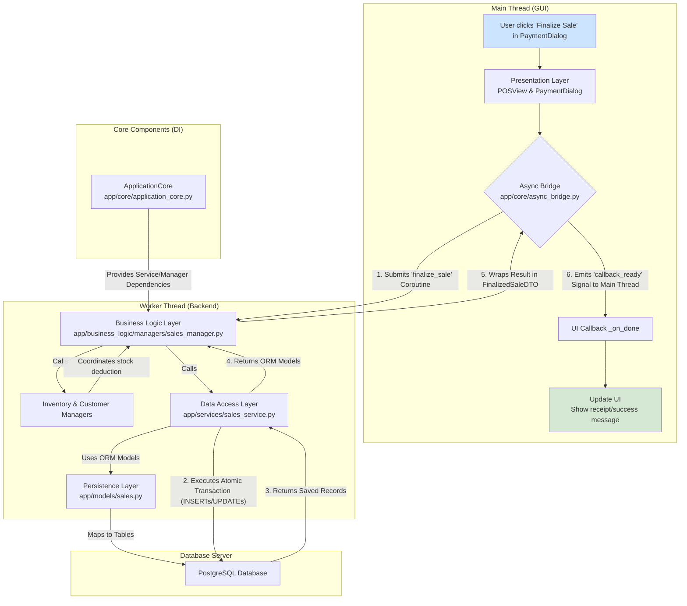

# pyproject.toml
```toml
# pyproject.toml
[tool.poetry]
# --- Project Metadata ---
# This information is used for packaging the application and for display on
# package indexes like PyPI if the project is ever published.
name = "sg-pos-system"
version = "1.0.0"
description = "An enterprise-grade, open-source Point-of-Sale system, meticulously engineered for Singapore's SMB retail landscape."
authors = ["Your Name <you@example.com>"]
license = "MIT"
readme = "README.md"
homepage = "https://github.com/your-org/sg-pos-system"
repository = "https://github.com/your-org/sg-pos-system"
documentation = "https://github.com/your-org/sg-pos-system/blob/main/docs/index.md"
keywords = ["pos", "point-of-sale", "retail", "singapore", "gst", "pyside6", "qt6", "python"]

# --- Python Version Constraint ---
# Specifies that this project is compatible with Python 3.11 and any later minor versions,
# but not Python 4.0. This aligns with the PRD's technology stack choice.
[tool.poetry.dependencies]
python = ">=3.11,<3.14"

# --- Core Production Dependencies ---
# These are the essential packages required for the application to run in production.

# GUI Framework
PySide6 = "^6.9.0"         # The core Qt6 bindings for Python.

# Database & ORM
SQLAlchemy = {version = "^2.0.30", extras = ["asyncio"]} # The industry-standard ORM, with asyncio support.
alembic = "^1.13.1"        # For database schema migrations.
asyncpg = "^0.29.0"        # High-performance asyncio driver for PostgreSQL.
greenlet = "^3.0.3"        # Required for SQLAlchemy's async bridge.

# Data Validation & Settings
pydantic = "^2.7.1"        # For Data Transfer Objects (DTOs) and core validation.
pydantic-settings = "^2.2.1" # Added for settings management with Pydantic v2.
python-dotenv = "^1.0.0"   # For loading environment variables from .env files.

# Security
bcrypt = "^4.1.2"          # For secure password hashing.
cryptography = "^42.0.7"   # For any custom encryption needs.

# Logging
structlog = "^24.2.0"       # For structured, context-aware logging.

# External Integrations & Utilities
aiohttp = "^3.9.5"         # Asynchronous HTTP client for API integrations.
reportlab = "^4.1.0"       # For generating PDF receipts and reports.
openpyxl = "^3.1.2"        # For exporting data to Excel (.xlsx) files.
qrcode = {version = "^7.4.2", extras = ["pil"]} # For generating QR codes (e.g., for PayNow).


# --- Development Group Dependencies ---
# These packages are only installed in development environments (`poetry install --with dev`).
# This keeps the production installation lean and clean.
[tool.poetry.group.dev.dependencies]
psycopg2-binary = "^2.9.10" # Synchronous driver for Alembic
aiosqlite = "^0.20.0"      # Async driver for SQLite test database

# Testing Framework
pytest = "^8.2.0"             # The primary testing framework.
pytest-qt = "^4.2.0"          # For testing PySide6 UI components.
pytest-asyncio = "^0.23.0"    # For testing asyncio code.
pytest-cov = "^5.0.0"         # For measuring test coverage.
factory-boy = "^3.3.0"        # For creating test data fixtures.

# Code Quality & Formatting
black = "^24.4.2"            # The uncompromising code formatter.
ruff = "^0.4.4"               # An extremely fast Python linter, replacing flake8, isort, etc.
mypy = "^1.10.0"              # Static type checker for Python.
pre-commit = "^3.7.0"         # For managing and maintaining pre-commit hooks.

# Documentation
Sphinx = "^7.3.1"             # The standard documentation generator for Python projects.
myst-parser = "^2.0.0"        # To write Sphinx documentation in Markdown.
sphinx-rtd-theme = "^2.0.0"   # A popular theme for Sphinx docs.

# Interactive Development
ipython = "^8.24.0"           # A better interactive Python shell.


# ==============================================================================
# Tool Configurations
# ------------------------------------------------------------------------------
# Centralizing tool configurations here makes the project easier to manage.
# ==============================================================================

# --- Black (Code Formatter) Configuration ---
[tool.black]
line-length = 88
target-version = ['py311']
include = '\.pyi?$'
exclude = '''
/(
    \.git
  | \.hg
  | \.mypy_cache
  | \.tox
  | \.venv
  | _build
  | buck-out
  | build
  | dist
  | migrations
)/
'''

# --- Ruff (Linter) Configuration ---
# Ruff is configured to be strict and to replace multiple older tools.
[tool.ruff]
line-length = 88
target-version = "py311"

# Select a broad range of rules to enforce high code quality.
# See all rules here: https://docs.astral.sh/ruff/rules/
select = [
    "E",  # pycodestyle errors
    "W",  # pycodestyle warnings
    "F",  # pyflakes
    "I",  # isort (import sorting)
    "B",  # flake8-bugbear (finds likely bugs)
    "C4", # flake8-comprehensions
    "UP", # pyupgrade (modernizes syntax)
    "S",  # bandit (security linter)
    "SIM",# flake8-simplify
]
ignore = ["E501"] # Ignored by black formatter anyway.

[tool.ruff.mccabe]
max-complexity = 10 # Keep functions simple and readable.

# --- MyPy (Static Type Checker) Configuration ---
# Enforces strict type checking for robust code.
[tool.mypy]
python_version = "3.11"
warn_return_any = true
warn_unused_configs = true
disallow_untyped_defs = true
disallow_incomplete_defs = true
check_untyped_defs = true
disallow_untyped_calls = true
strict_optional = true
show_error_codes = true
exclude = ["migrations/"]


# --- Pytest Configuration ---
[tool.pytest.ini_options]
minversion = "7.0"
addopts = "-ra -q --cov=app --cov-report=term-missing"
testpaths = ["tests"]
python_files = "test_*.py"
asyncio_mode = "auto" # Automatically handle asyncio tests.
qt_api = "pyside6"    # Specify the Qt binding for pytest-qt.


# ==============================================================================
# Build System Configuration
# ------------------------------------------------------------------------------
# This section is required by PEP 517 and tells tools like pip how to build
# the project package. For Poetry, this is standard boilerplate.
# ==============================================================================

[build-system]
requires = ["poetry-core>=1.0.0"]
build-backend = "poetry.core.masonry.api"

```

# app/ui/dialogs/payment_method_dialog.py
```py
# File: app/ui/dialogs/payment_method_dialog.py
"""A QDialog for creating and editing PaymentMethod entities."""
from __future__ import annotations
from typing import Optional, Any
import uuid

from PySide6.QtWidgets import (
    QDialog, QVBoxLayout, QFormLayout, QLineEdit,
    QCheckBox, QDialogButtonBox, QMessageBox, QComboBox
)
from PySide6.QtCore import Slot, Signal, QObject

from app.core.application_core import ApplicationCore
from app.core.result import Success, Failure
from app.business_logic.dto.payment_dto import (
    PaymentMethodCreateDTO, PaymentMethodUpdateDTO, PaymentMethodDTO, PaymentMethodType
)

class PaymentMethodDialog(QDialog):
    """A dialog for creating or editing a payment method."""
    operation_completed = Signal()

    def __init__(self, core: ApplicationCore, method: Optional[PaymentMethodDTO] = None, parent: Optional[QObject] = None):
        super().__init__(parent)
        self.core = core
        self.method = method
        self.is_edit_mode = method is not None

        self.setWindowTitle("Edit Payment Method" if self.is_edit_mode else "Add New Payment Method")
        self.setMinimumWidth(400)

        self._setup_ui()
        self._connect_signals()

        if self.is_edit_mode:
            self._populate_form()

    def _setup_ui(self):
        """Initializes the UI widgets and layout."""
        self.name_input = QLineEdit()
        self.type_combo = QComboBox()
        # Populate the combo box from the PaymentMethodType enum
        for member in PaymentMethodType:
            self.type_combo.addItem(member.name.replace('_', ' ').title(), member.value)
        
        self.is_active_checkbox = QCheckBox("Is Active")

        form_layout = QFormLayout()
        form_layout.addRow("Method Name:", self.name_input)
        form_layout.addRow("Method Type:", self.type_combo)
        form_layout.addRow(self.is_active_checkbox)
        
        self.button_box = QDialogButtonBox(QDialogButtonBox.Save | QDialogButtonBox.Cancel)
        self.button_box.button(QDialogButtonBox.Save).setText("Save Method")
        
        main_layout = QVBoxLayout(self)
        main_layout.addLayout(form_layout)
        main_layout.addWidget(self.button_box)

        if not self.is_edit_mode:
            self.is_active_checkbox.setChecked(True)

    def _connect_signals(self):
        self.button_box.accepted.connect(self._on_save)
        self.button_box.rejected.connect(self.reject)

    def _populate_form(self):
        """Populates the form fields with existing data in edit mode."""
        if self.method:
            self.name_input.setText(self.method.name)
            self.is_active_checkbox.setChecked(self.method.is_active)
            # Find the index in the combo box that matches the method's type
            index = self.type_combo.findData(self.method.type)
            if index >= 0:
                self.type_combo.setCurrentIndex(index)

    def _get_dto(self) -> PaymentMethodCreateDTO | PaymentMethodUpdateDTO:
        """Constructs a DTO from the current form data."""
        common_data = {
            "name": self.name_input.text().strip(),
            "type": self.type_combo.currentData(role=Qt.UserRole), # Get the enum value
            "is_active": self.is_active_checkbox.isChecked(),
        }
        if self.is_edit_mode:
            return PaymentMethodUpdateDTO(**common_data)
        else:
            return PaymentMethodCreateDTO(**common_data)

    @Slot()
    def _on_save(self):
        """Handles the save action, triggering the async operation."""
        if not self.name_input.text().strip():
            QMessageBox.warning(self, "Validation Error", "Method name cannot be empty.")
            return

        dto = self._get_dto()
        
        if self.is_edit_mode:
            coro = self.core.payment_method_manager.update_payment_method(self.method.id, dto)
            success_msg = f"Payment method '{dto.name}' updated successfully!"
        else:
            coro = self.core.payment_method_manager.create_payment_method(self.core.current_company_id, dto)
            success_msg = f"Payment method '{dto.name}' created successfully!"

        self.button_box.button(QDialogButtonBox.Save).setEnabled(False)
        
        def on_done(result: Any, error: Optional[Exception]):
            self.button_box.button(QDialogButtonBox.Save).setEnabled(True)
            if error or isinstance(result, Failure):
                QMessageBox.critical(self, "Operation Failed", f"Could not save payment method:\n{error or result.error}")
            elif isinstance(result, Success):
                QMessageBox.information(self, "Success", success_msg)
                self.operation_completed.emit()
                self.accept()

        self.core.async_worker.run_task(coro, on_done_callback=on_done)

```

# app/ui/views/customer_view.py
```py
# File: app/ui/views/customer_view.py
"""The main view for managing customers."""
import uuid
from typing import List, Any, Optional

from PySide6.QtWidgets import (
    QWidget, QVBoxLayout, QHBoxLayout, QPushButton, QTableView,
    QMessageBox, QLineEdit, QHeaderView, QSizePolicy
)
from PySide6.QtCore import Slot, Signal, QAbstractTableModel, QModelIndex, Qt, QObject

from app.core.application_core import ApplicationCore
from app.core.result import Success, Failure
from app.business_logic.dto.customer_dto import CustomerDTO
from app.ui.dialogs.customer_dialog import CustomerDialog
from app.core.async_bridge import AsyncWorker
from app.ui.widgets.managed_table_view import ManagedTableView

class CustomerTableModel(QAbstractTableModel):
    """A Qt Table Model for displaying CustomerDTOs."""
    
    HEADERS = ["Code", "Name", "Email", "Phone", "Loyalty Points", "Credit Limit", "Active"]

    def __init__(self, customers: List[CustomerDTO], parent: Optional[QObject] = None):
        super().__init__(parent)
        self._customers = customers

    def rowCount(self, parent: QModelIndex = QModelIndex()) -> int:
        return len(self._customers)

    def columnCount(self, parent: QModelIndex = QModelIndex()) -> int:
        return len(self.HEADERS)

    def headerData(self, section: int, orientation: Qt.Orientation, role: int = Qt.ItemDataRole.DisplayRole) -> Any:
        if role == Qt.ItemDataRole.DisplayRole and orientation == Qt.Orientation.Horizontal:
            return self.HEADERS[section]
        return None

    def data(self, index: QModelIndex, role: int = Qt.ItemDataRole.DisplayRole) -> Any:
        if not index.isValid():
            return None
        
        customer = self._customers[index.row()]
        col = index.column()

        if role == Qt.ItemDataRole.DisplayRole:
            if col == 0: return customer.customer_code
            if col == 1: return customer.name
            if col == 2: return customer.email or "N/A"
            if col == 3: return customer.phone or "N/A"
            if col == 4: return str(customer.loyalty_points)
            if col == 5: return f"S${customer.credit_limit:.2f}"
            if col == 6: return "Yes" if customer.is_active else "No"
        
        if role == Qt.ItemDataRole.TextAlignmentRole:
            if col in [4, 5]: # Loyalty points, credit limit
                return Qt.AlignmentFlag.AlignRight | Qt.AlignmentFlag.AlignVCenter
            if col == 6: # Active
                return Qt.AlignmentFlag.AlignCenter | Qt.AlignmentFlag.AlignVCenter
        
        return None

    def get_customer_at_row(self, row: int) -> Optional[CustomerDTO]:
        """Returns the CustomerDTO at the given row index."""
        if 0 <= row < len(self._customers):
            return self._customers[row]
        return None

    def refresh_data(self, new_customers: List[CustomerDTO]):
        """Updates the model with new data and notifies views."""
        self.beginResetModel()
        self._customers = new_customers
        self.endResetModel()

class CustomerView(QWidget):
    """A view widget to display and manage the customer list."""
    
    def __init__(self, core: ApplicationCore, parent: Optional[QObject] = None):
        super().__init__(parent)
        self.core = core
        self.async_worker: AsyncWorker = core.async_worker

        self._setup_ui()
        self._connect_signals()
        self._load_customers()

    def _setup_ui(self):
        """Initializes the UI widgets and layout."""
        top_layout = QHBoxLayout()
        self.search_input = QLineEdit()
        self.search_input.setPlaceholderText("Search customers by code, name, email, or phone...")
        self.add_button = QPushButton("Add New Customer")
        self.edit_button = QPushButton("Edit Selected")
        self.delete_button = QPushButton("Deactivate Selected")

        top_layout.addWidget(self.search_input, 1)
        top_layout.addStretch()
        top_layout.addWidget(self.add_button)
        top_layout.addWidget(self.edit_button)
        top_layout.addWidget(self.delete_button)
        
        self.managed_table = ManagedTableView()
        self.customer_model = CustomerTableModel([])
        self.managed_table.set_model(self.customer_model)
        
        table = self.managed_table.table()
        table.horizontalHeader().setSectionResizeMode(QHeaderView.ResizeMode.Stretch)
        table.setSelectionBehavior(QTableView.SelectionBehavior.SelectRows)
        table.setSelectionMode(QTableView.SelectionMode.SingleSelection)
        table.setSortingEnabled(True)

        main_layout = QVBoxLayout(self)
        main_layout.addLayout(top_layout)
        main_layout.addWidget(self.managed_table)

        self.setSizePolicy(QSizePolicy.Policy.Expanding, QSizePolicy.Policy.Expanding)


    def _connect_signals(self):
        """Connects UI signals to slots."""
        self.add_button.clicked.connect(self._on_add_customer)
        self.edit_button.clicked.connect(self._on_edit_customer)
        self.delete_button.clicked.connect(self._on_deactivate_customer)
        self.search_input.textChanged.connect(self._on_search_customers)
        self.managed_table.table().doubleClicked.connect(self._on_edit_customer)

    def _get_selected_customer(self) -> Optional[CustomerDTO]:
        """Helper to get the currently selected customer from the table."""
        selected_indexes = self.managed_table.table().selectionModel().selectedRows()
        if selected_indexes:
            row = selected_indexes[0].row()
            return self.customer_model.get_customer_at_row(row)
        return None

    @Slot()
    def _load_customers(self, search_term: str = ""):
        """Loads customer data asynchronously into the table model."""
        company_id = self.core.current_company_id
        self.managed_table.show_loading()

        def _on_done(result: Any, error: Optional[Exception]):
            if error or isinstance(result, Failure):
                self.customer_model.refresh_data([])
                self.managed_table.show_empty(f"Error loading customers: {error or result.error}")
                QMessageBox.critical(self, "Load Error", f"Failed to load customers: {error or result.error}")
            elif isinstance(result, Success):
                customers = result.value
                self.customer_model.refresh_data(customers)
                if customers:
                    self.managed_table.show_table()
                else:
                    self.managed_table.show_empty("No customers found.")
        
        coro = self.core.customer_manager.search_customers(company_id, search_term) if search_term else self.core.customer_manager.get_all_customers(company_id)
        self.async_worker.run_task(coro, on_done_callback=_on_done)

    @Slot()
    def _on_add_customer(self):
        """Opens the dialog to add a new customer."""
        dialog = CustomerDialog(self.core, parent=self)
        dialog.customer_operation_completed.connect(self._handle_customer_dialog_result)
        dialog.exec()

    @Slot()
    def _on_edit_customer(self):
        """Opens the dialog to edit the selected customer."""
        selected_customer = self._get_selected_customer()
        if not selected_customer:
            QMessageBox.information(self, "No Selection", "Please select a customer to edit.")
            return

        dialog = CustomerDialog(self.core, customer=selected_customer, parent=self)
        dialog.customer_operation_completed.connect(self._handle_customer_dialog_result)
        dialog.exec()

    @Slot()
    def _on_deactivate_customer(self):
        """Deactivates the selected customer."""
        selected_customer = self._get_selected_customer()
        if not selected_customer:
            QMessageBox.information(self, "No Selection", "Please select a customer to deactivate.")
            return
        
        reply = QMessageBox.question(self, "Confirm Deactivation",
                                    f"Are you sure you want to deactivate customer '{selected_customer.name}' (Code: {selected_customer.customer_code})?",
                                    QMessageBox.Yes | QMessageBox.No)
        if reply == QMessageBox.No:
            return

        def _on_done(result: Any, error: Optional[Exception]):
            if error or isinstance(result, Failure):
                QMessageBox.warning(self, "Deactivation Failed", f"Could not deactivate customer: {error or result.error}")
            elif isinstance(result, Success) and result.value:
                QMessageBox.information(self, "Success", f"Customer '{selected_customer.name}' deactivated.")
                self._load_customers(search_term=self.search_input.text())
        
        coro = self.core.customer_manager.deactivate_customer(selected_customer.id)
        self.async_worker.run_task(coro, on_done_callback=_on_done)

    @Slot(str)
    def _on_search_customers(self, text: str):
        """Triggers customer search based on input text."""
        # Note: A debounce timer like in ProductView could be added here for better performance on large datasets.
        # For now, we load on every text change.
        self._load_customers(search_term=text)

    @Slot(bool, str)
    def _handle_customer_dialog_result(self, success: bool, message: str):
        """Slot to handle results from CustomerDialog and refresh the view."""
        if success:
            self._load_customers(search_term=self.search_input.text())

```

# app/ui/views/inventory_view.py
```py
# File: app/ui/views/inventory_view.py
"""Main View for Inventory Management."""
from __future__ import annotations
from typing import List, Any, Optional, Dict
import uuid

from PySide6.QtWidgets import (
    QWidget, QVBoxLayout, QHBoxLayout, QPushButton,
    QTableView, QLabel, QLineEdit, QHeaderView, QSizePolicy, QMessageBox,
    QTabWidget
)
from PySide6.QtCore import Slot, Signal, QAbstractTableModel, QModelIndex, Qt, QObject, QPoint
from PySide6.QtGui import QAction, QCursor

from app.core.application_core import ApplicationCore
from app.core.result import Success, Failure
from app.business_logic.dto.inventory_dto import InventorySummaryDTO, PurchaseOrderDTO, StockMovementDTO
from app.ui.dialogs.stock_adjustment_dialog import StockAdjustmentDialog
from app.ui.dialogs.purchase_order_dialog import PurchaseOrderDialog
from app.ui.dialogs.receive_po_dialog import ReceivePODialog
from app.core.async_bridge import AsyncWorker
from app.ui.widgets.managed_table_view import ManagedTableView

class InventoryTableModel(QAbstractTableModel):
    HEADERS = ["SKU", "Name", "Category", "On Hand", "Reorder Pt.", "Cost", "Selling Price", "Active"]
    def __init__(self, items: List[InventorySummaryDTO], parent: Optional[QObject] = None): super().__init__(parent); self._items = items
    def rowCount(self, p=QModelIndex()): return len(self._items)
    def columnCount(self, p=QModelIndex()): return len(self.HEADERS)
    def headerData(self, s, o, r=Qt.DisplayRole):
        if r == Qt.DisplayRole and o == Qt.Horizontal: return self.HEADERS[s]
    def data(self, i, r=Qt.DisplayRole):
        if not i.isValid(): return
        item = self._items[i.row()]
        col = i.column()
        if r == Qt.DisplayRole:
            if col == 0: return item.sku
            if col == 1: return item.name
            if col == 2: return item.category_name or "N/A"
            if col == 3: return str(item.quantity_on_hand)
            if col == 4: return str(item.reorder_point)
            if col == 5: return f"S${item.cost_price:.2f}"
            if col == 6: return f"S${item.selling_price:.2f}"
            if col == 7: return "Yes" if item.is_active else "No"
        if r == Qt.TextAlignmentRole:
            if col in [3, 4, 5, 6]: return Qt.AlignRight | Qt.AlignVCenter
            if col == 7: return Qt.AlignCenter
    def get_item_at_row(self, r): return self._items[r] if 0 <= r < len(self._items) else None
    def refresh_data(self, new_items): self.beginResetModel(); self._items = new_items; self.endResetModel()

class PurchaseOrderTableModel(QAbstractTableModel):
    HEADERS = ["PO Number", "Supplier", "Order Date", "Expected", "Total (S$)", "Status"]
    def __init__(self, pos: List[PurchaseOrderDTO], parent: Optional[QObject] = None): super().__init__(parent); self._pos = pos
    def rowCount(self, p=QModelIndex()): return len(self._pos)
    def columnCount(self, p=QModelIndex()): return len(self.HEADERS)
    def headerData(self, s, o, r=Qt.DisplayRole):
        if r == Qt.DisplayRole and o == Qt.Horizontal: return self.HEADERS[s]
    def data(self, i, r=Qt.DisplayRole):
        if not i.isValid(): return
        po = self._pos[i.row()]
        col = i.column()
        if r == Qt.DisplayRole:
            if col == 0: return po.po_number
            if col == 1: return po.supplier_name
            if col == 2: return po.order_date.strftime("%Y-%m-%d")
            if col == 3: return po.expected_delivery_date.strftime("%Y-%m-%d") if po.expected_delivery_date else "N/A"
            if col == 4: return f"{po.total_amount:.2f}"
            if col == 5: return po.status.replace('_', ' ').title()
        if r == Qt.TextAlignmentRole:
            if col == 4: return Qt.AlignRight | Qt.AlignVCenter
            if col == 5: return Qt.AlignCenter
    def get_po_at_row(self, r): return self._pos[r] if 0 <= r < len(self._pos) else None
    def refresh_data(self, new_pos): self.beginResetModel(); self._pos = new_pos; self.endResetModel()

class StockMovementTableModel(QAbstractTableModel):
    HEADERS = ["Date", "Product", "SKU", "Type", "Change", "User", "Notes"]
    def __init__(self, movements: List[StockMovementDTO], parent: Optional[QObject] = None): super().__init__(parent); self._movements = movements
    def rowCount(self, p=QModelIndex()): return len(self._movements)
    def columnCount(self, p=QModelIndex()): return len(self.HEADERS)
    def headerData(self, s, o, r=Qt.DisplayRole):
        if r == Qt.DisplayRole and o == Qt.Horizontal: return self.HEADERS[s]
    def data(self, i, r=Qt.DisplayRole):
        if not i.isValid(): return
        m = self._movements[i.row()]
        col = i.column()
        if r == Qt.DisplayRole:
            if col == 0: return m.created_at.strftime("%Y-%m-%d %H:%M")
            if col == 1: return m.product_name
            if col == 2: return m.sku
            if col == 3: return m.movement_type.replace('_', ' ').title()
            if col == 4: change = m.quantity_change; return f"+{change}" if change > 0 else str(change)
            if col == 5: return m.created_by_user_name or "System"
            if col == 6: return m.notes or "N/A"
        if r == Qt.TextAlignmentRole and col == 4: return Qt.AlignRight | Qt.AlignVCenter
    def refresh_data(self, new_m): self.beginResetModel(); self._movements = new_m; self.endResetModel()

class InventoryView(QWidget):
    """A view to display stock levels and initiate inventory operations."""
    def __init__(self, core: ApplicationCore, parent: Optional[QObject] = None):
        super().__init__(parent)
        self.core = core
        self.async_worker: AsyncWorker = core.async_worker
        self.company_id = self.core.current_company_id
        self.outlet_id = self.core.current_outlet_id
        self.user_id = self.core.current_user_id
        self._setup_ui()
        self._connect_signals()
        self._on_tab_changed(0) # Trigger initial load for the first tab

    def _setup_ui(self):
        self.tab_widget = QTabWidget()
        self.inventory_summary_tab = self._create_inventory_summary_tab()
        self.purchase_orders_tab = self._create_purchase_orders_tab()
        self.stock_movements_tab = self._create_stock_movements_tab()
        self.tab_widget.addTab(self.inventory_summary_tab, "Current Stock")
        self.tab_widget.addTab(self.purchase_orders_tab, "Purchase Orders")
        self.tab_widget.addTab(self.stock_movements_tab, "Stock Movements")
        main_layout = QVBoxLayout(self)
        main_layout.addWidget(self.tab_widget)
        self.setSizePolicy(QSizePolicy.Expanding, QSizePolicy.Expanding)

    def _create_inventory_summary_tab(self) -> QWidget:
        tab = QWidget(); layout = QVBoxLayout(tab); top_layout = QHBoxLayout()
        self.inventory_search_input = QLineEdit(); self.inventory_search_input.setPlaceholderText("Search product...")
        self.adjust_stock_button = QPushButton("Adjust Stock")
        top_layout.addWidget(self.inventory_search_input, 1); top_layout.addStretch(); top_layout.addWidget(self.adjust_stock_button)
        
        self.inventory_managed_table = ManagedTableView()
        self.inventory_model = InventoryTableModel([])
        self.inventory_managed_table.set_model(self.inventory_model)
        
        table = self.inventory_managed_table.table()
        table.horizontalHeader().setSectionResizeMode(QHeaderView.ResizeMode.Stretch)
        table.setSelectionBehavior(QTableView.SelectionBehavior.SelectRows)
        table.setSelectionMode(QTableView.SelectionMode.SingleSelection)
        
        layout.addLayout(top_layout)
        layout.addWidget(self.inventory_managed_table)
        return tab

    def _create_purchase_orders_tab(self) -> QWidget:
        tab = QWidget(); layout = QVBoxLayout(tab); top_layout = QHBoxLayout()
        self.new_po_button = QPushButton("New Purchase Order")
        self.receive_po_button = QPushButton("Receive Items on PO")
        top_layout.addStretch(); top_layout.addWidget(self.new_po_button); top_layout.addWidget(self.receive_po_button)
        
        self.po_managed_table = ManagedTableView()
        self.po_model = PurchaseOrderTableModel([])
        self.po_managed_table.set_model(self.po_model)
        
        table = self.po_managed_table.table()
        table.horizontalHeader().setSectionResizeMode(QHeaderView.ResizeMode.Stretch)
        table.setSelectionBehavior(QTableView.SelectionBehavior.SelectRows)
        table.setSelectionMode(QTableView.SelectionMode.SingleSelection)
        
        layout.addLayout(top_layout)
        layout.addWidget(self.po_managed_table)
        return tab

    def _create_stock_movements_tab(self) -> QWidget:
        tab = QWidget(); layout = QVBoxLayout(tab)
        
        self.movements_managed_table = ManagedTableView()
        self.movements_model = StockMovementTableModel([])
        self.movements_managed_table.set_model(self.movements_model)
        self.movements_managed_table.table().horizontalHeader().setSectionResizeMode(QHeaderView.ResizeMode.Stretch)
        
        self.movements_title_label = QLabel("Click on a product in 'Current Stock' to see its history.")
        self.movements_title_label.setStyleSheet("font-size: 14px; padding: 5px;")
        
        layout.addWidget(self.movements_title_label)
        layout.addWidget(self.movements_managed_table)
        return tab

    def _connect_signals(self):
        self.tab_widget.currentChanged.connect(self._on_tab_changed)
        self.inventory_search_input.textChanged.connect(self._on_inventory_search)
        self.adjust_stock_button.clicked.connect(self._on_adjust_stock)
        self.inventory_managed_table.table().doubleClicked.connect(self._on_view_product_stock_history)
        self.new_po_button.clicked.connect(self._on_new_po)
        self.po_managed_table.table().doubleClicked.connect(self._on_receive_po_items) # Allow double-click to receive
        self.receive_po_button.clicked.connect(self._on_receive_po_items)

    @Slot(int)
    def _on_tab_changed(self, index: int):
        if index == 0: self._load_inventory_summary()
        elif index == 1: self._load_purchase_orders()
        elif index == 2:
            self.movements_title_label.setText("Click on a product in 'Current Stock' to see its history.")
            self.movements_model.refresh_data([])
            self.movements_managed_table.show_empty("Select a product to view its movements.")

    def _load_inventory_summary(self, search_term: str = ""):
        self.inventory_managed_table.show_loading()
        def _on_done(r, e):
            if e or isinstance(r, Failure):
                self.inventory_model.refresh_data([])
                self.inventory_managed_table.show_empty(f"Error: {e or r.error}")
            elif isinstance(r, Success):
                self.inventory_model.refresh_data(r.value)
                self.inventory_managed_table.show_table() if r.value else self.inventory_managed_table.show_empty("No inventory items found.")
        self.async_worker.run_task(self.core.inventory_manager.get_inventory_summary(self.company_id, self.outlet_id, search_term=search_term), on_done_callback=_on_done)

    @Slot(str)
    def _on_inventory_search(self, text: str): self._load_inventory_summary(search_term=text)

    @Slot()
    def _on_adjust_stock(self):
        dialog = StockAdjustmentDialog(self.core, self.outlet_id, self.user_id, parent=self)
        dialog.operation_completed.connect(self._load_inventory_summary)
        dialog.exec()

    @Slot(QModelIndex)
    def _on_view_product_stock_history(self, index: QModelIndex):
        item = self.inventory_model.get_item_at_row(index.row())
        if not item: return
        self.tab_widget.setCurrentWidget(self.stock_movements_tab)
        self._load_stock_movements(product_id=item.product_id, product_name=item.product_name)

    def _load_purchase_orders(self):
        self.po_managed_table.show_loading()
        def _on_done(r, e):
            if e or isinstance(r, Failure):
                self.po_model.refresh_data([])
                self.po_managed_table.show_empty(f"Error: {e or r.error}")
            elif isinstance(r, Success):
                self.po_model.refresh_data(r.value)
                self.po_managed_table.show_table() if r.value else self.po_managed_table.show_empty("No purchase orders found.")
        self.async_worker.run_task(self.core.inventory_manager.get_all_purchase_orders(self.company_id, self.outlet_id), on_done_callback=_on_done)

    @Slot()
    def _on_new_po(self):
        dialog = PurchaseOrderDialog(self.core, self.outlet_id, parent=self)
        dialog.po_operation_completed.connect(self._load_purchase_orders)
        dialog.exec()

    @Slot()
    def _on_receive_po_items(self):
        selected_index = self.po_managed_table.table().currentIndex()
        if not selected_index.isValid():
            QMessageBox.information(self, "No Selection", "Please select a Purchase Order to receive items.")
            return
        
        selected_po = self.po_model.get_po_at_row(selected_index.row())
        if not selected_po: return

        if selected_po.status not in ['SENT', 'PARTIALLY_RECEIVED']:
            QMessageBox.warning(self, "Invalid Status", f"Cannot receive items for a PO with status '{selected_po.status.replace('_', ' ').title()}'.")
            return

        dialog = ReceivePODialog(selected_po, self)
        dialog.items_to_receive.connect(self._process_po_receipt)
        dialog.exec()

    @Slot(list)
    def _process_po_receipt(self, items_to_receive: List[Dict[str, Any]]):
        selected_po = self.po_model.get_po_at_row(self.po_managed_table.table().currentIndex().row())
        if not selected_po: return

        self.receive_po_button.setEnabled(False)
        
        def _on_done(result: Any, error: Optional[Exception]):
            self.receive_po_button.setEnabled(True)
            if error or isinstance(result, Failure):
                QMessageBox.critical(self, "Receiving Failed", f"Could not process receipt: {error or result.error}")
            elif isinstance(result, Success):
                QMessageBox.information(self, "Success", "Items received successfully.")
                self._load_purchase_orders()
                if self.tab_widget.currentIndex() == 0: # If user is looking at stock, refresh it
                    self._load_inventory_summary()

        coro = self.core.inventory_manager.receive_purchase_order_items(
            selected_po.id, items_to_receive, self.user_id
        )
        self.async_worker.run_task(coro, on_done_callback=_on_done)

    def _load_stock_movements(self, product_id: Optional[uuid.UUID] = None, product_name: str = "product"):
        if not product_id:
            self.movements_model.refresh_data([])
            self.movements_managed_table.show_empty("Select a product to view its movements.")
            return

        self.movements_title_label.setText(f"Stock Movement History for: {product_name} ({product_id})")
        self.movements_managed_table.show_loading()

        def _on_done(r, e):
            if e or isinstance(r, Failure):
                self.movements_model.refresh_data([])
                self.movements_managed_table.show_empty(f"Error: {e or r.error}")
            elif isinstance(r, Success):
                self.movements_model.refresh_data(r.value)
                self.movements_managed_table.show_table() if r.value else self.movements_managed_table.show_empty("No movement history for this item.")
        
        self.async_worker.run_task(self.core.inventory_manager.get_stock_movements_for_product(self.company_id, product_id), on_done_callback=_on_done)

```

# app/ui/views/settings_view.py
```py
# File: app/ui/views/settings_view.py
"""A view for managing application and company settings."""
from __future__ import annotations
from typing import Optional, Any, List
import uuid

from PySide6.QtWidgets import (
    QWidget, QVBoxLayout, QTabWidget, QFormLayout, QLabel,
    QLineEdit, QPushButton, QMessageBox, QTableView, QHBoxLayout, QHeaderView
)
from PySide6.QtCore import Slot, Signal, QAbstractTableModel, QModelIndex, Qt, QObject

from app.core.application_core import ApplicationCore
from app.core.result import Success, Failure
from app.business_logic.dto.company_dto import CompanyDTO, CompanyUpdateDTO
from app.business_logic.dto.user_dto import UserDTO, UserCreateDTO, UserUpdateDTO, RoleDTO
from app.core.async_bridge import AsyncWorker
from app.ui.dialogs.user_dialog import UserDialog
from app.ui.views.payment_method_view import PaymentMethodView
from app.ui.widgets.managed_table_view import ManagedTableView

class UserTableModel(QAbstractTableModel):
    HEADERS = ["Username", "Full Name", "Email", "Role(s)", "Active"]
    def __init__(self, users: List[UserDTO], parent: Optional[QObject] = None):
        super().__init__(parent)
        self._users = users
    def rowCount(self, p=QModelIndex()): return len(self._users)
    def columnCount(self, p=QModelIndex()): return len(self.HEADERS)
    def headerData(self, s, o, r=Qt.DisplayRole):
        if r == Qt.DisplayRole and o == Qt.Horizontal: return self.HEADERS[s]
    def data(self, i, r=Qt.DisplayRole):
        if not i.isValid(): return
        user, col = self._users[i.row()], i.column()
        if r == Qt.DisplayRole:
            if col == 0: return user.username
            if col == 1: return user.full_name or "N/A"
            if col == 2: return user.email
            if col == 3: return ", ".join(role.name for role in user.roles) if user.roles else "No Roles"
            if col == 4: return "Yes" if user.is_active else "No"
    def get_user_at_row(self, r): return self._users[r] if 0 <= r < len(self._users) else None
    def refresh_data(self, new_users: List[UserDTO]): self.beginResetModel(); self._users = new_users; self.endResetModel()

class SettingsView(QWidget):
    """UI for administrators to configure the system."""
    def __init__(self, core: ApplicationCore, parent: Optional[QObject] = None):
        super().__init__(parent)
        self.core = core
        self.async_worker: AsyncWorker = core.async_worker
        self.company_id = self.core.current_company_id
        self._setup_ui()
        self._connect_signals()
        
        # Load data for the initially visible tab
        self._load_company_info()
        self.tab_widget.currentChanged.connect(self._on_tab_changed)


    def _setup_ui(self):
        self.tab_widget = QTabWidget()
        self.tab_widget.addTab(self._create_company_tab(), "Company Information")
        self.tab_widget.addTab(self._create_users_tab(), "User Management")
        self.tab_widget.addTab(self._create_payment_methods_tab(), "Payment Methods")
        main_layout = QVBoxLayout(self); main_layout.addWidget(self.tab_widget)

    def _create_company_tab(self) -> QWidget:
        tab = QWidget(); layout = QFormLayout(tab)
        self.company_name_input = QLineEdit()
        self.company_reg_no_input = QLineEdit()
        self.company_gst_no_input = QLineEdit()
        self.company_address_input = QLineEdit()
        self.company_phone_input = QLineEdit()
        self.company_email_input = QLineEdit()
        self.company_save_button = QPushButton("Save Company Information")
        layout.addRow("Company Name:", self.company_name_input)
        layout.addRow("Registration No.:", self.company_reg_no_input)
        layout.addRow("GST Reg. No.:", self.company_gst_no_input)
        layout.addRow("Address:", self.company_address_input)
        layout.addRow("Phone:", self.company_phone_input)
        layout.addRow("Email:", self.company_email_input)
        layout.addWidget(self.company_save_button)
        return tab
        
    def _create_users_tab(self) -> QWidget:
        tab = QWidget(); layout = QVBoxLayout(tab)
        buttons_layout = QHBoxLayout()
        self.add_user_button = QPushButton("Add New User")
        self.edit_user_button = QPushButton("Edit Selected User")
        self.deactivate_user_button = QPushButton("Deactivate Selected")
        buttons_layout.addStretch()
        buttons_layout.addWidget(self.add_user_button)
        buttons_layout.addWidget(self.edit_user_button)
        buttons_layout.addWidget(self.deactivate_user_button)

        self.user_managed_table = ManagedTableView()
        self.user_model = UserTableModel([])
        self.user_managed_table.set_model(self.user_model)
        
        table = self.user_managed_table.table()
        table.horizontalHeader().setSectionResizeMode(QHeaderView.Stretch)
        table.setSelectionBehavior(QTableView.SelectRows)
        table.setSelectionMode(QTableView.SingleSelection)
        
        layout.addLayout(buttons_layout)
        layout.addWidget(self.user_managed_table)
        return tab

    def _create_payment_methods_tab(self) -> QWidget:
        payment_method_view = PaymentMethodView(self.core)
        return payment_method_view

    def _connect_signals(self):
        self.company_save_button.clicked.connect(self._on_save_company_info)
        self.add_user_button.clicked.connect(self._on_add_user)
        self.edit_user_button.clicked.connect(self._on_edit_user)
        self.deactivate_user_button.clicked.connect(self._on_deactivate_user)
        self.user_managed_table.table().doubleClicked.connect(self._on_edit_user)

    @Slot(int)
    def _on_tab_changed(self, index: int):
        """Load data for the newly selected tab."""
        if index == 0:
            self._load_company_info()
        elif index == 1:
            self._load_users()
        # The payment methods tab's view loads its own data upon creation.

    @Slot()
    def _load_company_info(self):
        self.company_save_button.setEnabled(False)
        def _on_done(result: Any, error: Optional[Exception]):
            self.company_save_button.setEnabled(True)
            if error or isinstance(result, Failure):
                QMessageBox.critical(self, "Load Error", f"Failed to load company info: {error or result.error}")
            elif isinstance(result, Success) and result.value:
                dto: CompanyDTO = result.value
                self.company_name_input.setText(dto.name)
                self.company_reg_no_input.setText(dto.registration_number)
                self.company_gst_no_input.setText(dto.gst_registration_number or "")
                self.company_address_input.setText(dto.address or "")
                self.company_phone_input.setText(dto.phone or "")
                self.company_email_input.setText(dto.email or "")

        self.async_worker.run_task(self.core.company_manager.get_company(self.company_id), on_done_callback=_on_done)

    @Slot()
    def _on_save_company_info(self):
        dto = CompanyUpdateDTO(
            name=self.company_name_input.text().strip(),
            registration_number=self.company_reg_no_input.text().strip(),
            gst_registration_number=self.company_gst_no_input.text().strip() or None,
            address=self.company_address_input.text().strip() or None,
            phone=self.company_phone_input.text().strip() or None,
            email=self.company_email_input.text().strip() or None,
        )

        self.company_save_button.setEnabled(False)
        def _on_done(result: Any, error: Optional[Exception]):
            self.company_save_button.setEnabled(True)
            if error or isinstance(result, Failure):
                QMessageBox.critical(self, "Save Error", f"Failed to save company info: {error or result.error}")
            elif isinstance(result, Success):
                QMessageBox.information(self, "Success", "Company information saved successfully.")
                self._load_company_info()

        self.async_worker.run_task(self.core.company_manager.update_company(self.company_id, dto), on_done_callback=_on_done)

    @Slot()
    def _load_users(self):
        self.user_managed_table.show_loading()
        def _on_done(r, e):
            if e or isinstance(r, Failure):
                self.user_model.refresh_data([])
                self.user_managed_table.show_empty(f"Error: {e or r.error}")
            elif isinstance(r, Success):
                self.user_model.refresh_data(r.value)
                if r.value:
                    self.user_managed_table.show_table()
                else:
                    self.user_managed_table.show_empty("No users found.")
        self.async_worker.run_task(self.core.user_manager.get_all_users(self.company_id), on_done_callback=_on_done)

    @Slot()
    def _on_add_user(self):
        dialog = UserDialog(self.core, parent=self)
        dialog.user_operation_completed.connect(self._handle_user_operation_completed)
        dialog.exec()
    
    @Slot()
    def _on_edit_user(self):
        selected_user = self.user_model.get_user_at_row(self.user_managed_table.table().currentIndex().row())
        if not selected_user:
            QMessageBox.information(self, "No Selection", "Please select a user to edit.")
            return
        dialog = UserDialog(self.core, user=selected_user, parent=self)
        dialog.user_operation_completed.connect(self._handle_user_operation_completed)
        dialog.exec()

    @Slot()
    def _on_deactivate_user(self):
        selected_user = self.user_model.get_user_at_row(self.user_managed_table.table().currentIndex().row())
        if not selected_user:
            QMessageBox.information(self, "No Selection", "Please select a user to deactivate.")
            return
        
        reply = QMessageBox.question(self, "Confirm Deactivation", f"Are you sure you want to deactivate '{selected_user.username}'?", QMessageBox.Yes | QMessageBox.No)
        if reply == QMessageBox.No: return

        def _on_done(result: Any, error: Optional[Exception]):
            if error or isinstance(result, Failure):
                QMessageBox.critical(self, "Error", f"Failed to deactivate user: {error or result.error}")
            else:
                QMessageBox.information(self, "Success", "User deactivated successfully.")
                self._load_users()
        
        self.async_worker.run_task(self.core.user_manager.deactivate_user(selected_user.id), on_done_callback=_on_done)

    @Slot(bool, str)
    def _handle_user_operation_completed(self, success: bool, message: str):
        if success:
            self._load_users()

```

# app/ui/views/dashboard_view.py
```py
# File: app/ui/views/dashboard_view.py
"""The main dashboard view for displaying Key Performance Indicators (KPIs)."""
from __future__ import annotations
from typing import Optional, Any
from decimal import Decimal

from PySide6.QtWidgets import (
    QWidget, QVBoxLayout, QLabel, QSizePolicy, QGridLayout
)
from PySide6.QtCore import Qt, QObject, Slot

from app.core.application_core import ApplicationCore
from app.core.result import Success, Failure
from app.business_logic.dto.reporting_dto import DashboardStatsDTO
from app.ui.widgets.kpi_widget import KpiWidget

class DashboardView(QWidget):
    """A view widget to display a dashboard of business KPIs."""
    
    def __init__(self, core: ApplicationCore, parent: Optional[QObject] = None):
        super().__init__(parent)
        self.core = core
        self.async_worker = core.async_worker
        
        self._setup_ui()
        self._connect_signals()
        
    def showEvent(self, event):
        """Overrides QWidget.showEvent to trigger data loading when the view becomes visible."""
        super().showEvent(event)
        # Load data every time the dashboard is shown to ensure it's fresh.
        self._load_data()

    def _setup_ui(self):
        """Initializes the UI widgets and layout."""
        main_layout = QVBoxLayout(self)
        main_layout.setSpacing(20)
        main_layout.setContentsMargins(20, 20, 20, 20)
        
        title = QLabel("Dashboard")
        title.setStyleSheet("font-size: 28px; font-weight: bold; padding-bottom: 10px;")
        
        # Grid layout for KPIs
        kpi_layout = QGridLayout()
        kpi_layout.setSpacing(20)

        self.sales_kpi = KpiWidget("Today's Sales")
        self.transactions_kpi = KpiWidget("Today's Transactions")
        self.customers_kpi = KpiWidget("New Customers (Month)")
        self.low_stock_kpi = KpiWidget("Low Stock Items")
        self.low_stock_kpi.set_value_color("#E74C3C") # Use a warning color for low stock

        kpi_layout.addWidget(self.sales_kpi, 0, 0)
        kpi_layout.addWidget(self.transactions_kpi, 0, 1)
        kpi_layout.addWidget(self.customers_kpi, 1, 0)
        kpi_layout.addWidget(self.low_stock_kpi, 1, 1)

        main_layout.addWidget(title)
        main_layout.addLayout(kpi_layout)
        main_layout.addStretch()
        
        self.setSizePolicy(QSizePolicy.Policy.Expanding, QSizePolicy.Policy.Expanding)
        
    def _connect_signals(self):
        """Connect UI signals to slots."""
        pass # No interactive signals yet.
        
    @Slot()
    def _load_data(self):
        """Fetches and displays dashboard data."""
        # Set loading text on all KPI widgets
        self.sales_kpi.set_kpi_value("Loading...")
        self.transactions_kpi.set_kpi_value("...")
        self.customers_kpi.set_kpi_value("...")
        self.low_stock_kpi.set_kpi_value("...")

        def on_done(result: Any, error: Optional[Exception]):
            if error or isinstance(result, Failure):
                error_msg = f"Error: {error or result.error}"
                self.sales_kpi.set_kpi_value(error_msg)
                self.transactions_kpi.set_kpi_value("N/A")
                self.customers_kpi.set_kpi_value("N/A")
                self.low_stock_kpi.set_kpi_value("N/A")
                return

            if isinstance(result, Success):
                stats: DashboardStatsDTO = result.value
                self.sales_kpi.set_kpi_value(f"S$ {stats.total_sales_today:,.2f}")
                self.transactions_kpi.set_kpi_value(f"{stats.transaction_count_today}")
                self.customers_kpi.set_kpi_value(f"{stats.new_customers_this_month}")
                self.low_stock_kpi.set_kpi_value(f"{stats.low_stock_item_count}")
        
        coro = self.core.reporting_manager.generate_dashboard_stats(self.core.current_company_id)
        self.core.async_worker.run_task(coro, on_done_callback=on_done)

```

# app/ui/views/product_view.py
```py
# File: app/ui/views/product_view.py
"""The main view for managing products."""
from __future__ import annotations
from typing import List, Any, Optional
from decimal import Decimal

from PySide6.QtWidgets import (
    QWidget, QVBoxLayout, QHBoxLayout, QPushButton, QTableView,
    QMessageBox, QLineEdit, QHeaderView, QSizePolicy
)
from PySide6.QtCore import Slot, Signal, QAbstractTableModel, QModelIndex, Qt, QObject, QTimer

from app.core.application_core import ApplicationCore
from app.core.result import Success, Failure
from app.business_logic.dto.product_dto import ProductDTO
from app.ui.dialogs.product_dialog import ProductDialog
from app.core.async_bridge import AsyncWorker
from app.ui.widgets.managed_table_view import ManagedTableView

class ProductTableModel(QAbstractTableModel):
    """A Qt Table Model for displaying ProductDTOs."""
    HEADERS = ["SKU", "Name", "Selling Price", "Cost Price", "GST Rate", "Active"]

    def __init__(self, products: List[ProductDTO] = None, parent: Optional[QObject] = None):
        super().__init__(parent)
        self._products = products or []

    def rowCount(self, parent: QModelIndex = QModelIndex()) -> int:
        return len(self._products)

    def columnCount(self, parent: QModelIndex = QModelIndex()) -> int:
        return len(self.HEADERS)

    def headerData(self, section: int, orientation: Qt.Orientation, role: int = Qt.DisplayRole) -> Any:
        if role == Qt.DisplayRole and orientation == Qt.Horizontal:
            return self.HEADERS[section]
        return None

    def data(self, index: QModelIndex, role: int = Qt.DisplayRole) -> Any:
        if not index.isValid(): return None
        product = self._products[index.row()]
        col = index.column()
        if role == Qt.DisplayRole:
            if col == 0: return product.sku
            if col == 1: return product.name
            if col == 2: return f"S${product.selling_price:.2f}"
            if col == 3: return f"S${product.cost_price:.2f}"
            if col == 4: return f"{product.gst_rate:.2f}%"
            if col == 5: return "Yes" if product.is_active else "No"
        if role == Qt.TextAlignmentRole:
            if col in [2, 3, 4]: return Qt.AlignRight | Qt.AlignVCenter
            if col == 5: return Qt.AlignCenter
        return None

    def get_product_at_row(self, row: int) -> Optional[ProductDTO]:
        return self._products[row] if 0 <= row < len(self._products) else None

    def refresh_data(self, new_products: List[ProductDTO]):
        self.beginResetModel()
        self._products = new_products
        self.endResetModel()

class ProductView(QWidget):
    """A view widget to display and manage the product catalog."""
    def __init__(self, core: ApplicationCore, parent: Optional[QObject] = None):
        super().__init__(parent)
        self.core = core
        self.async_worker: AsyncWorker = core.async_worker

        self.search_timer = QTimer(self)
        self.search_timer.setSingleShot(True)
        self.search_timer.setInterval(350) # 350ms delay

        self._setup_ui()
        self._connect_signals()

        self._load_products() # Initial data load

    def _setup_ui(self):
        top_layout = QHBoxLayout()
        self.search_input = QLineEdit()
        self.search_input.setPlaceholderText("Search products by SKU, name, or barcode...")
        self.add_button = QPushButton("Add New Product")
        self.edit_button = QPushButton("Edit Selected")
        self.delete_button = QPushButton("Deactivate Selected")
        top_layout.addWidget(self.search_input, 1)
        top_layout.addStretch()
        top_layout.addWidget(self.add_button)
        top_layout.addWidget(self.edit_button)
        top_layout.addWidget(self.delete_button)
        
        # --- Refactor: Use ManagedTableView ---
        self.managed_table = ManagedTableView()
        self.product_model = ProductTableModel()
        self.managed_table.set_model(self.product_model)
        
        table = self.managed_table.table()
        table.horizontalHeader().setSectionResizeMode(QHeaderView.ResizeMode.Stretch)
        table.setSelectionBehavior(QTableView.SelectionBehavior.SelectRows)
        table.setSelectionMode(QTableView.SelectionMode.SingleSelection)
        table.setSortingEnabled(True)

        main_layout = QVBoxLayout(self)
        main_layout.addLayout(top_layout)
        main_layout.addWidget(self.managed_table) # Add the managed widget instead of the raw table
        self.setSizePolicy(QSizePolicy.Policy.Expanding, QSizePolicy.Policy.Expanding)

    def _connect_signals(self):
        self.add_button.clicked.connect(self._on_add_product)
        self.edit_button.clicked.connect(self._on_edit_product)
        self.delete_button.clicked.connect(self._on_deactivate_product)
        self.search_input.textChanged.connect(self.search_timer.start)
        self.search_timer.timeout.connect(self._load_products)
        # Connect to the table inside the managed widget
        self.managed_table.table().doubleClicked.connect(self._on_edit_product)

    def _get_selected_product(self) -> Optional[ProductDTO]:
        selected_indexes = self.managed_table.table().selectionModel().selectedRows()
        return self.product_model.get_product_at_row(selected_indexes[0].row()) if selected_indexes else None

    @Slot()
    def _load_products(self):
        """
        Loads products from the backend, now with UI state management.
        """
        search_term = self.search_input.text().strip()
        self.add_button.setEnabled(False) 
        self.edit_button.setEnabled(False)
        self.delete_button.setEnabled(False)
        self.managed_table.show_loading() # Show loading state

        def _on_done(result: Any, error: Optional[Exception]):
            self.add_button.setEnabled(True)
            self.edit_button.setEnabled(True)
            self.delete_button.setEnabled(True)
            
            if error or isinstance(result, Failure):
                QMessageBox.critical(self, "Load Error", f"Failed to load products: {error or result.error}")
                self.product_model.refresh_data([])
                self.managed_table.show_empty(f"Error: {error or result.error}")
            elif isinstance(result, Success):
                products = result.value
                self.product_model.refresh_data(products)
                if products:
                    self.managed_table.show_table()
                else:
                    self.managed_table.show_empty("No products found.")
        
        coro = self.core.product_manager.search_products(self.core.current_company_id, search_term) if search_term else self.core.product_manager.get_all_products(self.core.current_company_id)
        self.async_worker.run_task(coro, on_done_callback=_on_done)

    @Slot()
    def _on_add_product(self):
        dialog = ProductDialog(self.core, parent=self)
        dialog.product_operation_completed.connect(self._handle_operation_completed)
        dialog.exec()

    @Slot()
    def _on_edit_product(self):
        selected_product = self._get_selected_product()
        if not selected_product:
            QMessageBox.information(self, "No Selection", "Please select a product to edit.")
            return
        dialog = ProductDialog(self.core, product=selected_product, parent=self)
        dialog.product_operation_completed.connect(self._handle_operation_completed)
        dialog.exec()

    @Slot()
    def _on_deactivate_product(self):
        selected_product = self._get_selected_product()
        if not selected_product:
            QMessageBox.information(self, "No Selection", "Please select a product to deactivate.")
            return
        
        reply = QMessageBox.question(self, "Confirm Deactivation", f"Are you sure you want to deactivate '{selected_product.name}'?", QMessageBox.Yes | QMessageBox.No)
        if reply == QMessageBox.No: return

        def _on_done(result: Any, error: Optional[Exception]):
            if error or isinstance(result, Failure):
                QMessageBox.critical(self, "Error", f"Failed to deactivate product: {error or result.error}")
            elif isinstance(result, Success) and result.value:
                QMessageBox.information(self, "Success", f"Product '{selected_product.name}' deactivated.")
                self._load_products() # Refresh the view
        
        self.async_worker.run_task(self.core.product_manager.deactivate_product(selected_product.id), on_done_callback=_on_done)

    @Slot(bool, str)
    def _handle_operation_completed(self, success: bool, message: str):
        if success:
            self._load_products()

```

# app/ui/views/payment_method_view.py
```py
# File: app/ui/views/payment_method_view.py
"""A view for managing PaymentMethod entities."""
from __future__ import annotations
from typing import List, Any, Optional

from PySide6.QtWidgets import (
    QWidget, QVBoxLayout, QHBoxLayout, QPushButton, QTableView,
    QMessageBox, QHeaderView, QSizePolicy
)
from PySide6.QtCore import Slot, Signal, QAbstractTableModel, QModelIndex, Qt, QObject

from app.core.application_core import ApplicationCore
from app.core.result import Success, Failure
from app.business_logic.dto.payment_dto import PaymentMethodDTO
from app.ui.dialogs.payment_method_dialog import PaymentMethodDialog
from app.ui.widgets.managed_table_view import ManagedTableView

class PaymentMethodTableModel(QAbstractTableModel):
    """A Qt Table Model for displaying PaymentMethodDTOs."""
    HEADERS = ["Name", "Type", "Is Active"]

    def __init__(self, methods: List[PaymentMethodDTO] = None, parent: Optional[QObject] = None):
        super().__init__(parent)
        self._methods = methods or []

    def rowCount(self, parent: QModelIndex = QModelIndex()) -> int:
        return len(self._methods)

    def columnCount(self, parent: QModelIndex = QModelIndex()) -> int:
        return len(self.HEADERS)

    def headerData(self, section: int, orientation: Qt.Orientation, role: int = Qt.DisplayRole) -> Any:
        if role == Qt.DisplayRole and orientation == Qt.Horizontal:
            return self.HEADERS[section]
        return None

    def data(self, index: QModelIndex, role: int = Qt.DisplayRole) -> Any:
        if not index.isValid(): return None
        method = self._methods[index.row()]
        col = index.column()

        if role == Qt.DisplayRole:
            if col == 0: return method.name
            if col == 1: return method.type.value.replace('_', ' ').title()
            if col == 2: return "Yes" if method.is_active else "No"
        
        if role == Qt.TextAlignmentRole and col == 2:
            return Qt.AlignCenter | Qt.AlignVCenter
        
        return None

    def get_method_at_row(self, row: int) -> Optional[PaymentMethodDTO]:
        return self._methods[row] if 0 <= row < len(self._methods) else None

    def refresh_data(self, new_methods: List[PaymentMethodDTO]):
        self.beginResetModel()
        self._methods = new_methods
        self.endResetModel()

class PaymentMethodView(QWidget):
    """A view widget to display and manage the list of payment methods."""
    def __init__(self, core: ApplicationCore, parent: Optional[QObject] = None):
        super().__init__(parent)
        self.core = core
        self._setup_ui()
        self._connect_signals()
        self._load_data()

    def _setup_ui(self):
        top_layout = QHBoxLayout()
        self.add_button = QPushButton("Add New Method")
        self.edit_button = QPushButton("Edit Selected")
        self.deactivate_button = QPushButton("Deactivate Selected")

        top_layout.addStretch()
        top_layout.addWidget(self.add_button)
        top_layout.addWidget(self.edit_button)
        top_layout.addWidget(self.deactivate_button)
        
        self.managed_table = ManagedTableView()
        self.table_model = PaymentMethodTableModel()
        self.managed_table.set_model(self.table_model)
        
        table = self.managed_table.table()
        table.horizontalHeader().setSectionResizeMode(QHeaderView.ResizeMode.Stretch)
        table.setSelectionBehavior(QTableView.SelectionBehavior.SelectRows)
        table.setSelectionMode(QTableView.SelectionMode.SingleSelection)
        table.setSortingEnabled(True)

        main_layout = QVBoxLayout(self)
        main_layout.addLayout(top_layout)
        main_layout.addWidget(self.managed_table)
        self.setSizePolicy(QSizePolicy.Policy.Expanding, QSizePolicy.Policy.Expanding)

    def _connect_signals(self):
        self.add_button.clicked.connect(self._on_add)
        self.edit_button.clicked.connect(self._on_edit)
        self.deactivate_button.clicked.connect(self._on_deactivate)
        self.managed_table.table().doubleClicked.connect(self._on_edit)

    def _get_selected_method(self) -> Optional[PaymentMethodDTO]:
        selected_indexes = self.managed_table.table().selectionModel().selectedRows()
        if selected_indexes:
            row = selected_indexes[0].row()
            return self.table_model.get_method_at_row(row)
        return None

    @Slot()
    def _load_data(self):
        """Loads payment method data asynchronously into the table model."""
        self.managed_table.show_loading()

        def on_done(result: Any, error: Optional[Exception]):
            if error or isinstance(result, Failure):
                self.table_model.refresh_data([])
                self.managed_table.show_empty(f"Error: {error or result.error}")
            elif isinstance(result, Success):
                methods = result.value
                self.table_model.refresh_data(methods)
                if methods:
                    self.managed_table.show_table()
                else:
                    self.managed_table.show_empty("No payment methods have been configured.")

        coro = self.core.payment_method_manager.get_all_payment_methods(self.core.current_company_id)
        self.core.async_worker.run_task(coro, on_done_callback=on_done)

    @Slot()
    def _on_add(self):
        dialog = PaymentMethodDialog(self.core, parent=self)
        dialog.operation_completed.connect(self._load_data)
        dialog.exec()

    @Slot()
    def _on_edit(self):
        selected_method = self._get_selected_method()
        if not selected_method:
            QMessageBox.information(self, "No Selection", "Please select a payment method to edit.")
            return

        dialog = PaymentMethodDialog(self.core, method=selected_method, parent=self)
        dialog.operation_completed.connect(self._load_data)
        dialog.exec()

    @Slot()
    def _on_deactivate(self):
        selected_method = self._get_selected_method()
        if not selected_method:
            QMessageBox.information(self, "No Selection", "Please select a method to deactivate.")
            return

        if not selected_method.is_active:
            QMessageBox.information(self, "Already Inactive", f"'{selected_method.name}' is already inactive.")
            return
        
        reply = QMessageBox.question(self, "Confirm Deactivation",
                                     f"Are you sure you want to deactivate '{selected_method.name}'?",
                                     QMessageBox.Yes | QMessageBox.No)
        if reply == QMessageBox.No:
            return

        def on_done(result: Any, error: Optional[Exception]):
            if error or isinstance(result, Failure):
                QMessageBox.critical(self, "Error", f"Failed to deactivate method: {error or result.error}")
            elif isinstance(result, Success):
                QMessageBox.information(self, "Success", f"'{selected_method.name}' has been deactivated.")
                self._load_data()
        
        coro = self.core.payment_method_manager.deactivate_payment_method(selected_method.id)
        self.core.async_worker.run_task(coro, on_done_callback=on_done)

```

# app/ui/main_window.py
```py
# File: app/ui/main_window.py
"""
The main window of the SG-POS application.
This QMainWindow acts as the shell, hosting different views like the POS screen,
inventory management, etc., and providing navigation.

This version implements lazy loading for all non-default views to improve
startup performance.
"""
import sys
from typing import Dict, Optional, Type

from PySide6.QtWidgets import (
    QMainWindow, QWidget,
    QStackedWidget, QMenuBar
)
from PySide6.QtCore import Slot, QEvent

from app.core.application_core import ApplicationCore
from app.core.async_bridge import AsyncWorker

# Import all view classes that will be lazy-loaded
from app.ui.views.pos_view import POSView
from app.ui.views.dashboard_view import DashboardView
from app.ui.views.product_view import ProductView
from app.ui.views.customer_view import CustomerView
from app.ui.views.inventory_view import InventoryView
from app.ui.views.reports_view import ReportsView
from app.ui.views.settings_view import SettingsView

class MainWindow(QMainWindow):
    """The main application window."""
    def __init__(self, core: ApplicationCore):
        super().__init__()
        self.core = core
        self.async_worker: AsyncWorker = core.async_worker
        self.setWindowTitle("SG Point-of-Sale System")
        self.setGeometry(100, 100, 1440, 900)

        self.stacked_widget = QStackedWidget()
        self.setCentralWidget(self.stacked_widget)

        # --- Lazy Loading Implementation ---
        # 1. A dictionary to hold view definitions and cache instances
        self.views: Dict[str, Dict[str, Optional[Type[QWidget]]]] = {
            "dashboard": {"class": DashboardView, "instance": None},
            "product":   {"class": ProductView,   "instance": None},
            "customer":  {"class": CustomerView,  "instance": None},
            "inventory": {"class": InventoryView, "instance": None},
            "reports":   {"class": ReportsView,   "instance": None},
            "settings":  {"class": SettingsView,  "instance": None},
        }

        # 2. Eagerly create and show only the default view
        self.pos_view = POSView(self.core)
        self.stacked_widget.addWidget(self.pos_view)
        self.stacked_widget.setCurrentWidget(self.pos_view)
        
        # 3. Create the menu, which will connect actions to the lazy loader
        self._create_menu()

    def _create_menu(self):
        """Creates the main menu bar with navigation actions wired for lazy loading."""
        menu_bar = self.menuBar()
        
        file_menu = menu_bar.addMenu("&File")
        file_menu.addAction("E&xit", self.close)

        dashboard_menu = menu_bar.addMenu("&Dashboard")
        dashboard_menu.addAction("Show Dashboard", lambda: self._show_view("dashboard"))

        pos_menu = menu_bar.addMenu("&POS")
        pos_menu.addAction("Sales Screen", lambda: self.stacked_widget.setCurrentWidget(self.pos_view))

        data_menu = menu_bar.addMenu("&Data Management")
        data_menu.addAction("Products", lambda: self._show_view("product"))
        data_menu.addAction("Customers", lambda: self._show_view("customer"))
        
        inventory_menu = menu_bar.addMenu("&Inventory")
        inventory_menu.addAction("Stock Management", lambda: self._show_view("inventory"))
        
        reports_menu = menu_bar.addMenu("&Reports")
        reports_menu.addAction("Business Reports", lambda: self._show_view("reports"))
        
        settings_menu = menu_bar.addMenu("&Settings")
        settings_menu.addAction("Application Settings", lambda: self._show_view("settings"))

    def _show_view(self, view_key: str):
        """
        Generic handler for showing a view. Creates the view on first request.
        
        Args:
            view_key: The key corresponding to the view in the self.views dictionary.
        """
        if view_key not in self.views:
            return

        view_info = self.views[view_key]
        
        # If the view instance hasn't been created yet, create and cache it
        if view_info["instance"] is None:
            view_class = view_info["class"]
            view_info["instance"] = view_class(self.core)
            self.stacked_widget.addWidget(view_info["instance"])

        # Set the current widget to the now-guaranteed-to-exist instance
        self.stacked_widget.setCurrentWidget(view_info["instance"])

    def closeEvent(self, event: QEvent) -> None:
        """Handles window close event to gracefully shut down the application core."""
        if self.core:
            self.core.shutdown()
        event.accept()

```

# app/ui/widgets/kpi_widget.py
```py
# File: app/ui/widgets/kpi_widget.py
"""
A custom QFrame widget to display a single Key Performance Indicator (KPI).
"""
from __future__ import annotations
from typing import Optional

from PySide6.QtWidgets import QWidget, QFrame, QVBoxLayout, QLabel
from PySide6.QtCore import Qt

class KpiWidget(QFrame):
    """
    A styled frame that displays a title and a large value, representing a KPI.
    """
    def __init__(self, title: str, parent: Optional[QWidget] = None):
        super().__init__(parent)
        self.setFrameStyle(QFrame.Shape.StyledPanel | QFrame.Shadow.Raised)
        self.setMinimumSize(200, 120)

        main_layout = QVBoxLayout(self)
        main_layout.setContentsMargins(15, 15, 15, 15)
        main_layout.setSpacing(5)

        self._title_label = QLabel(title)
        self._title_label.setStyleSheet("font-size: 16px; color: #555;")
        self._title_label.setAlignment(Qt.AlignmentFlag.AlignLeft)

        self._value_label = QLabel("...")
        self._value_label.setStyleSheet("font-size: 36px; font-weight: bold; color: #1E90FF;")
        self.set_value_color("#1E90FF") # Default color
        self._value_label.setAlignment(Qt.AlignmentFlag.AlignLeft)

        main_layout.addWidget(self._title_label)
        main_layout.addStretch()
        main_layout.addWidget(self._value_label)

    def set_kpi_value(self, value: str) -> None:
        """Sets the main display value of the KPI widget."""
        self._value_label.setText(value)

    def set_value_color(self, color_hex: str) -> None:
        """Allows customizing the color of the KPI value text."""
        self._value_label.setStyleSheet(
            f"font-size: 36px; font-weight: bold; color: {color_hex};"
        )

```

# app/ui/widgets/searchable_table_view.py
```py
# File: app/ui/widgets/searchable_table_view.py
"""
This file is intentionally left blank.

The functionality originally envisioned for a 'SearchableTableView' has been
more effectively implemented and superseded by the combination of a QLineEdit
in each view and the new `ManagedTableView` widget for displaying results.
This file may be removed in a future cleanup.
"""
pass

```

# app/ui/widgets/managed_table_view.py
```py
# File: app/ui/widgets/managed_table_view.py
"""
A custom widget that manages the display state of a QTableView,
providing user-friendly loading and empty-state messages.
"""
from __future__ import annotations
from typing import Optional

from PySide6.QtWidgets import (
    QWidget, QVBoxLayout, QTableView, QLabel, QStackedLayout, QSizePolicy
)
from PySide6.QtCore import Qt, QAbstractItemModel

class ManagedTableView(QWidget):
    """
    A container widget that wraps a QTableView and provides methods to switch
    between a loading state, an empty state, and the table view itself.
    This promotes a consistent user experience for all data tables.
    """
    def __init__(self, parent: Optional[QWidget] = None):
        super().__init__(parent)

        self._table_view = QTableView()
        self._loading_widget = self._create_state_widget("Loading data, please wait...")
        self._empty_widget = self._create_state_widget("No data available.")

        self._stacked_layout = QStackedLayout()
        self._stacked_layout.addWidget(self._loading_widget)
        self._stacked_layout.addWidget(self._empty_widget)
        self._stacked_layout.addWidget(self._table_view)

        self.setLayout(self._stacked_layout)
        self.show_loading()

    def _create_state_widget(self, default_text: str) -> QWidget:
        """Creates a standardized, centered widget for displaying state messages."""
        widget = QWidget()
        layout = QVBoxLayout(widget)
        layout.addStretch()
        
        label = QLabel(default_text)
        label.setAlignment(Qt.AlignmentFlag.AlignCenter)
        label.setStyleSheet("QLabel { color: #888; font-size: 16px; }")
        
        layout.addWidget(label)
        layout.addStretch()
        widget.setLayout(layout)
        return widget

    def table(self) -> QTableView:
        """
        Provides direct access to the underlying QTableView instance for configuration
        (e.g., setting selection behavior, connecting signals).
        """
        return self._table_view

    def set_model(self, model: QAbstractItemModel) -> None:
        """Sets the data model for the underlying table view."""
        self._table_view.setModel(model)

    def show_loading(self) -> None:
        """Switches the view to show the loading indicator."""
        self._stacked_layout.setCurrentWidget(self._loading_widget)

    def show_empty(self, message: str = "No data to display.") -> None:
        """
        Switches the view to show the empty-state message.
        
        Args:
            message: The specific message to display (e.g., "No products found.").
        """
        # Find the QLabel within the empty_widget to update its text
        label = self._empty_widget.findChild(QLabel)
        if label:
            label.setText(message)
        self._stacked_layout.setCurrentWidget(self._empty_widget)

    def show_table(self) -> None:
        """Switches the view to show the data table."""
        self._stacked_layout.setCurrentWidget(self._table_view)

```

# app/services/report_service.py
```py
# File: app/services/report_service.py
"""
Data Access Service for complex reporting queries.

This service is responsible for running efficient data aggregation queries
directly against the database to generate the raw data needed for business reports.
It primarily uses SQLAlchemy Core for performance-critical aggregation.
"""
from __future__ import annotations
from typing import TYPE_CHECKING, List, Dict, Any, Optional
from datetime import date, datetime, timedelta, timezone
from decimal import Decimal
import uuid
import sqlalchemy as sa
from sqlalchemy.sql import func, cast

from app.core.result import Result, Success, Failure
from app.models import SalesTransaction, SalesTransactionItem, Product, Inventory, PurchaseOrder, PurchaseOrderItem, Customer

if TYPE_CHECKING:
    from app.core.application_core import ApplicationCore

class ReportService:
    """Handles all database aggregation queries for reporting."""

    def __init__(self, core: "ApplicationCore"):
        self.core = core

    async def get_dashboard_stats_raw_data(self, company_id: uuid.UUID) -> Result[Dict[str, Any], str]:
        """Fetches raw data points required for the main dashboard KPIs."""
        try:
            async with self.core.get_session() as session:
                today_start = datetime.now(timezone.utc).replace(hour=0, minute=0, second=0, microsecond=0)
                today_end = today_start + timedelta(days=1)
                
                month_start = today_start.replace(day=1)

                # 1. Today's Sales
                sales_stmt = (
                    sa.select(
                        func.coalesce(func.sum(SalesTransaction.total_amount), Decimal('0.0')).label("sales"),
                        func.coalesce(func.count(SalesTransaction.id), 0).label("transactions")
                    ).where(
                        SalesTransaction.company_id == company_id,
                        SalesTransaction.transaction_date >= today_start,
                        SalesTransaction.transaction_date < today_end,
                        SalesTransaction.status == 'COMPLETED'
                    )
                )
                sales_res = (await session.execute(sales_stmt)).one()

                # 2. New Customers This Month
                customer_stmt = (
                    sa.select(func.coalesce(func.count(Customer.id), 0))
                    .where(
                        Customer.company_id == company_id,
                        Customer.created_at >= month_start
                    )
                )
                customer_res = (await session.execute(customer_stmt)).scalar()

                # 3. Low Stock Items
                low_stock_stmt = (
                    sa.select(func.coalesce(func.count(Product.id), 0))
                    .join(Inventory, Product.id == Inventory.product_id)
                    .where(
                        Product.company_id == company_id,
                        Product.track_inventory == True,
                        Inventory.quantity_on_hand <= Product.reorder_point
                    )
                )
                low_stock_res = (await session.execute(low_stock_stmt)).scalar()

                return Success({
                    "total_sales_today": sales_res.sales,
                    "transaction_count_today": sales_res.transactions,
                    "new_customers_this_month": customer_res,
                    "low_stock_item_count": low_stock_res
                })

        except Exception as e:
            return Failure(f"Database error fetching dashboard stats: {e}")

    async def get_sales_summary_raw_data(self, company_id: uuid.UUID, start_date: date, end_date: date) -> Result[List[Dict[str, Any]], str]:
        """Fetches aggregated sales data grouped by day."""
        try:
            async with self.core.get_session() as session:
                end_datetime = datetime.combine(end_date, datetime.max.time())
                stmt = (
                    sa.select(
                        cast(SalesTransaction.transaction_date, sa.Date).label("period"),
                        func.sum(SalesTransaction.total_amount).label("total_sales"),
                        func.count(SalesTransaction.id).label("transaction_count"),
                        func.sum(SalesTransaction.discount_amount).label("total_discount_amount"),
                        func.sum(SalesTransaction.tax_amount).label("total_tax_collected")
                    ).where(
                        SalesTransaction.company_id == company_id,
                        SalesTransaction.transaction_date >= datetime.combine(start_date, datetime.min.time()),
                        SalesTransaction.transaction_date <= end_datetime,
                        SalesTransaction.status == 'COMPLETED'
                    ).group_by("period").order_by("period")
                )
                result = await session.execute(stmt)
                return Success([row._asdict() for row in result.all()])
        except Exception as e:
            return Failure(f"Database error generating sales summary: {e}")

    async def get_product_performance_raw_data(self, company_id: uuid.UUID, start_date: date, end_date: date, limit: int = 10) -> Result[List[Dict[str, Any]], str]:
        """Fetches product performance data (quantity sold, revenue, cost, margin)."""
        try:
            async with self.core.get_session() as session:
                end_datetime = datetime.combine(end_date, datetime.max.time())
                stmt = (
                    sa.select(
                        Product.id.label("product_id"), Product.sku, Product.name,
                        func.sum(SalesTransactionItem.quantity).label("quantity_sold"),
                        func.sum(SalesTransactionItem.line_total).label("total_revenue"),
                        func.sum(SalesTransactionItem.quantity * SalesTransactionItem.cost_price).label("total_cost")
                    ).join(SalesTransactionItem, SalesTransactionItem.product_id == Product.id)
                     .join(SalesTransaction, SalesTransactionItem.sales_transaction_id == SalesTransaction.id)
                     .where(
                        SalesTransaction.company_id == company_id,
                        SalesTransaction.transaction_date >= datetime.combine(start_date, datetime.min.time()),
                        SalesTransaction.transaction_date <= end_datetime,
                        SalesTransaction.status == 'COMPLETED'
                     ).group_by(Product.id).order_by(sa.desc("total_revenue")).limit(limit)
                )
                result = await session.execute(stmt)
                return Success([row._asdict() for row in result.all()])
        except Exception as e:
            return Failure(f"Database error generating product performance: {e}")

    async def get_inventory_valuation_raw_data(self, company_id: uuid.UUID, outlet_id: Optional[uuid.UUID] = None) -> Result[List[Dict[str, Any]], str]:
        """Fetches raw data for inventory valuation report."""
        try:
            async with self.core.get_session() as session:
                stmt = select(
                    Product.id.label("product_id"), Product.sku, Product.name,
                    Product.cost_price, Inventory.quantity_on_hand
                ).join(Inventory, Inventory.product_id == Product.id).where(Product.company_id == company_id)
                if outlet_id:
                    stmt = stmt.where(Inventory.outlet_id == outlet_id)
                result = await session.execute(stmt)
                return Success([row._asdict() for row in result.all()])
        except Exception as e:
            return Failure(f"Database error generating inventory valuation: {e}")

    async def get_gst_f5_raw_data(self, company_id: uuid.UUID, start_date: date, end_date: date) -> Result[Dict[str, Any], str]:
        """Fetches all necessary data points for the IRAS GST F5 form."""
        try:
            async with self.core.get_session() as session:
                end_datetime = datetime.combine(end_date, datetime.max.time())
                sales_stmt = (
                    sa.select(
                        func.sum(SalesTransactionItem.line_total).filter(Product.gst_rate > 0).label("standard_rated_sales"),
                        func.sum(SalesTransactionItem.line_total).filter(Product.gst_rate == 0).label("zero_rated_sales"),
                        func.sum(SalesTransaction.tax_amount).label("output_tax_due")
                    ).join(SalesTransactionItem, SalesTransaction.id == SalesTransactionItem.sales_transaction_id)
                     .join(Product, SalesTransactionItem.product_id == Product.id)
                     .where(
                        SalesTransaction.company_id == company_id,
                        SalesTransaction.transaction_date.between(datetime.combine(start_date, datetime.min.time()), end_datetime),
                        SalesTransaction.status == 'COMPLETED'
                    )
                )
                sales_res = (await session.execute(sales_stmt)).one_or_none()

                purchase_stmt = (
                    sa.select(
                        func.sum(PurchaseOrderItem.quantity_received * PurchaseOrderItem.unit_cost).label("taxable_purchases")
                    ).join(PurchaseOrder, PurchaseOrderItem.purchase_order_id == PurchaseOrder.id)
                     .where(
                        PurchaseOrder.company_id == company_id,
                        PurchaseOrder.order_date.between(start_date, end_date),
                        PurchaseOrder.status.in_(['RECEIVED', 'PARTIALLY_RECEIVED'])
                    )
                )
                purchase_res = (await session.execute(purchase_stmt)).one_or_none()
                
                # Assume a fixed GST rate for calculating input tax for this demo
                taxable_purchases = purchase_res.taxable_purchases or Decimal('0.00')
                input_tax_claimed = (taxable_purchases * (Decimal('8.00') / (Decimal('100.00') + Decimal('8.00')))).quantize(Decimal("0.01"))

                return Success({
                    "box_1_standard_rated_supplies": sales_res.standard_rated_sales or Decimal('0.00'),
                    "box_2_zero_rated_supplies": sales_res.zero_rated_sales or Decimal('0.00'),
                    "box_3_exempt_supplies": Decimal('0.00'),
                    "box_6_output_tax_due": sales_res.output_tax_due or Decimal('0.00'),
                    "box_5_taxable_purchases": taxable_purchases,
                    "box_7_input_tax_claimed": input_tax_claimed,
                })
        except Exception as e:
            return Failure(f"Database error generating GST F5 data: {e}")

```

# app/core/application_core.py
```py
# File: app/core/application_core.py
"""
The heart of the application's architecture: The Dependency Injection Container.
"""
from __future__ import annotations
from typing import TYPE_CHECKING, AsyncIterator, Dict, Any, Optional, Callable
from contextlib import asynccontextmanager
import sqlalchemy as sa
from sqlalchemy.ext.asyncio import create_async_engine, async_sessionmaker, AsyncSession, AsyncEngine
import uuid

from PySide6.QtCore import QObject, Slot

from app.core.config import Settings
from app.core.exceptions import DatabaseConnectionError, CoreException, AsyncBridgeError, ConfigurationError
from app.core.async_bridge import AsyncWorker, AsyncWorkerThread

if TYPE_CHECKING:
    from app.services.product_service import ProductService
    from app.services.customer_service import CustomerService
    from app.services.inventory_service import InventoryService
    from app.services.sales_service import SalesService
    from app.services.payment_service import PaymentMethodService, PaymentService
    from app.services.supplier_service import SupplierService
    from app.services.purchase_order_service import PurchaseOrderService
    from app.services.report_service import ReportService
    from app.services.user_service import UserService, RoleService
    from app.services.company_service import CompanyService, OutletService
    from app.business_logic.managers.product_manager import ProductManager
    from app.business_logic.managers.customer_manager import CustomerManager
    from app.business_logic.managers.inventory_manager import InventoryManager
    from app.business_logic.managers.sales_manager import SalesManager
    from app.business_logic.managers.payment_manager import PaymentMethodManager
    from app.business_logic.managers.gst_manager import GstManager
    from app.business_logic.managers.reporting_manager import ReportingManager
    from app.business_logic.managers.user_manager import UserManager
    from app.business_logic.managers.company_manager import CompanyManager

class CallbackExecutor(QObject):
    """
    A simple QObject to execute callbacks on the thread it lives in. This is a
    robust mechanism for invoking calls from a worker thread onto the main thread.
    """
    @Slot(object, object, object)
    def execute(self, callback: Callable, result: Any, error: Optional[Exception]):
        """Executes the given callback with the result or error."""
        if callback:
            try:
                callback(result, error)
            except Exception as e:
                # To prevent a crash in a callback from crashing the application
                print(f"Error executing callback {callback.__name__}: {e}")

class ApplicationCore:
    """
    Central DI container providing lazy-loaded access to services and managers.
    """
    def __init__(self, settings: Settings):
        self.settings = settings
        self._engine: Optional[AsyncEngine] = None
        self._session_factory: Optional[async_sessionmaker[AsyncSession]] = None
        self._managers: Dict[str, Any] = {}
        self._services: Dict[str, Any] = {}
        self._async_worker_thread: Optional[AsyncWorkerThread] = None
        self._async_worker: Optional[AsyncWorker] = None
        self._callback_executor: Optional[CallbackExecutor] = None
        self._current_company_id: Optional[uuid.UUID] = None
        self._current_outlet_id: Optional[uuid.UUID] = None
        self._current_user_id: Optional[uuid.UUID] = None

    def initialize(self) -> None:
        """
        Synchronously initializes the application core, including starting the
        background async worker and running async initialization tasks on it.
        """
        try:
            self._async_worker_thread = AsyncWorkerThread()
            self._async_worker_thread.start_and_wait()
            if not self._async_worker_thread.worker:
                raise AsyncBridgeError("AsyncWorker not initialized within the thread.")
            self._async_worker = self._async_worker_thread.worker

            # Create and connect the callback executor to safely handle calls from the worker thread.
            self._callback_executor = CallbackExecutor()
            # Assumes the worker has a signal named 'callback_ready'.
            self._async_worker.callback_ready.connect(self._callback_executor.execute)

            self.async_worker.run_task_and_wait(self._initialize_async_components())

            if not self.settings.CURRENT_COMPANY_ID or not self.settings.CURRENT_OUTLET_ID or not self.settings.CURRENT_USER_ID:
                 raise ConfigurationError("Required IDs (Company, Outlet, User) are not set in the configuration.")

            self._current_company_id = uuid.UUID(self.settings.CURRENT_COMPANY_ID)
            self._current_outlet_id = uuid.UUID(self.settings.CURRENT_OUTLET_ID)
            self._current_user_id = uuid.UUID(self.settings.CURRENT_USER_ID)
        except Exception as e:
            if self._async_worker_thread and self._async_worker_thread.isRunning():
                self.shutdown()
            raise CoreException(f"ApplicationCore initialization failed: {e}") from e

    async def _initialize_async_components(self):
        """Contains the async part of the initialization, run on the worker thread."""
        try:
            self._engine = create_async_engine(self.settings.DATABASE_URL, echo=self.settings.DEBUG)
            async with self._engine.connect() as conn:
                await conn.execute(sa.text("SELECT 1"))
            self._session_factory = async_sessionmaker(self._engine, class_=AsyncSession, expire_on_commit=False)
        except Exception as e:
            raise DatabaseConnectionError(f"Failed to connect to database: {e}")

    def shutdown(self) -> None:
        """Synchronously shuts down all core resources."""
        if self._async_worker_thread and self._async_worker_thread.isRunning():
            final_coro = self._engine.dispose() if self._engine else None
            self._async_worker_thread.stop_and_wait(final_coro)

    @asynccontextmanager
    async def get_session(self) -> AsyncIterator[AsyncSession]:
        if not self._session_factory: raise CoreException("Database not initialized.")
        session: AsyncSession = self._session_factory()
        try:
            yield session
            await session.commit()
        except Exception:
            await session.rollback()
            raise
        finally:
            await session.close()
            
    @property
    def async_worker(self) -> AsyncWorker:
        if self._async_worker is None: raise CoreException("Async worker not initialized.")
        return self._async_worker

    @property
    def current_company_id(self) -> uuid.UUID:
        if self._current_company_id is None: raise CoreException("Current company ID is not set.")
        return self._current_company_id

    @property
    def current_outlet_id(self) -> uuid.UUID:
        if self._current_outlet_id is None: raise CoreException("Current outlet ID is not set.")
        return self._current_outlet_id

    @property
    def current_user_id(self) -> uuid.UUID:
        if self._current_user_id is None: raise CoreException("Current user ID is not set.")
        return self._current_user_id

    # --- Service Properties (lazy-loaded) ---
    @property
    def company_service(self) -> "CompanyService":
        if "company" not in self._services:
            from app.services.company_service import CompanyService
            self._services["company"] = CompanyService(self)
        return self._services["company"]

    @property
    def outlet_service(self) -> "OutletService":
        if "outlet" not in self._services:
            from app.services.company_service import OutletService
            self._services["outlet"] = OutletService(self)
        return self._services["outlet"]

    @property
    def user_service(self) -> "UserService":
        if "user_service" not in self._services:
            from app.services.user_service import UserService
            self._services["user_service"] = UserService(self)
        return self._services["user_service"]

    @property
    def role_service(self) -> "RoleService":
        if "role" not in self._services:
            from app.services.user_service import RoleService
            self._services["role"] = RoleService(self)
        return self._services["role"]

    @property
    def product_service(self) -> "ProductService":
        if "product" not in self._services:
            from app.services.product_service import ProductService
            self._services["product"] = ProductService(self)
        return self._services["product"]

    @property
    def customer_service(self) -> "CustomerService":
        if "customer" not in self._services:
            from app.services.customer_service import CustomerService
            self._services["customer"] = CustomerService(self)
        return self._services["customer"]

    @property
    def inventory_service(self) -> "InventoryService":
        if "inventory" not in self._services:
            from app.services.inventory_service import InventoryService
            self._services["inventory"] = InventoryService(self)
        return self._services["inventory"]

    @property
    def sales_service(self) -> "SalesService":
        if "sales" not in self._services:
            from app.services.sales_service import SalesService
            self._services["sales"] = SalesService(self)
        return self._services["sales"]

    @property
    def payment_method_service(self) -> "PaymentMethodService":
        if "payment_method" not in self._services:
            from app.services.payment_service import PaymentMethodService
            self._services["payment_method"] = PaymentMethodService(self)
        return self._services["payment_method"]

    @property
    def supplier_service(self) -> "SupplierService":
        if "supplier" not in self._services:
            from app.services.supplier_service import SupplierService
            self._services["supplier"] = SupplierService(self)
        return self._services["supplier"]

    @property
    def purchase_order_service(self) -> "PurchaseOrderService":
        if "purchase_order" not in self._services:
            from app.services.purchase_order_service import PurchaseOrderService
            self._services["purchase_order"] = PurchaseOrderService(self)
        return self._services["purchase_order"]

    @property
    def report_service(self) -> "ReportService":
        if "report" not in self._services:
            from app.services.report_service import ReportService
            self._services["report"] = ReportService(self)
        return self._services["report"]
        
    # --- Manager Properties (lazy-loaded) ---
    @property
    def company_manager(self) -> "CompanyManager":
        if "company_manager" not in self._managers:
            from app.business_logic.managers.company_manager import CompanyManager
            self._managers["company_manager"] = CompanyManager(self)
        return self._managers["company_manager"]

    @property
    def user_manager(self) -> "UserManager":
        if "user" not in self._managers:
            from app.business_logic.managers.user_manager import UserManager
            self._managers["user"] = UserManager(self)
        return self._managers["user"]

    @property
    def product_manager(self) -> "ProductManager":
        if "product" not in self._managers:
            from app.business_logic.managers.product_manager import ProductManager
            self._managers["product"] = ProductManager(self)
        return self._managers["product"]

    @property
    def customer_manager(self) -> "CustomerManager":
        if "customer" not in self._managers:
            from app.business_logic.managers.customer_manager import CustomerManager
            self._managers["customer"] = CustomerManager(self)
        return self._managers["customer"]

    @property
    def inventory_manager(self) -> "InventoryManager":
        if "inventory" not in self._managers:
            from app.business_logic.managers.inventory_manager import InventoryManager
            self._managers["inventory"] = InventoryManager(self)
        return self._managers["inventory"]

    @property
    def payment_method_manager(self) -> "PaymentMethodManager":
        if "payment_method_manager" not in self._managers:
            from app.business_logic.managers.payment_manager import PaymentMethodManager
            self._managers["payment_method_manager"] = PaymentMethodManager(self)
        return self._managers["payment_method_manager"]

    @property
    def sales_manager(self) -> "SalesManager":
        if "sales" not in self._managers:
            from app.business_logic.managers.sales_manager import SalesManager
            self._managers["sales"] = SalesManager(self)
        return self._managers["sales"]

    @property
    def gst_manager(self) -> "GstManager":
        if "gst" not in self._managers:
            from app.business_logic.managers.gst_manager import GstManager
            self._managers["gst"] = GstManager(self)
        return self._managers["gst"]

    @property
    def reporting_manager(self) -> "ReportingManager":
        if "reporting" not in self._managers:
            from app.business_logic.managers.reporting_manager import ReportingManager
            self._managers["reporting"] = ReportingManager(self)
        return self._managers["reporting"]

```

# app/models/customer.py
```py
# File: app/models/customer.py
"""SQLAlchemy models for Customer entities."""
import uuid
import sqlalchemy as sa
from sqlalchemy import Column, String, Boolean, ForeignKey, Numeric, Integer, Text
from sqlalchemy.dialects.postgresql import UUID
from sqlalchemy.orm import relationship
from app.models.base import Base, TimestampMixin

class Customer(Base, TimestampMixin):
    __tablename__ = "customers"
    id = Column(UUID(as_uuid=True), primary_key=True, default=uuid.uuid4)
    company_id = Column(UUID(as_uuid=True), ForeignKey("companies.id", ondelete="RESTRICT"), nullable=False, index=True)
    customer_code = Column(String(50), nullable=False)
    name = Column(String(255), nullable=False)
    email = Column(String(255))
    phone = Column(String(50))
    address = Column(Text)
    loyalty_points = Column(Integer, nullable=False, default=0)
    credit_limit = Column(Numeric(19, 2), nullable=False, default=0)
    is_active = Column(Boolean, nullable=False, default=True)
    company = relationship("Company", back_populates="customers")
    sales_transactions = relationship("SalesTransaction", back_populates="customer")
    __table_args__ = (sa.UniqueConstraint('company_id', 'customer_code', name='uq_customer_company_code'), sa.UniqueConstraint('company_id', 'email', name='uq_customer_company_email'))

```

# app/models/product.py
```py
# File: app/models/product.py
"""SQLAlchemy models for Product and Category entities, and Product Variants and Suppliers."""
import uuid
from decimal import Decimal
import sqlalchemy as sa
from sqlalchemy import Column, String, Boolean, ForeignKey, Numeric, DateTime, Text, Integer
from sqlalchemy.dialects.postgresql import UUID, JSONB
from sqlalchemy.orm import relationship

from app.models.base import Base, TimestampMixin

class Category(Base, TimestampMixin):
    __tablename__ = "categories"
    id = Column(UUID(as_uuid=True), primary_key=True, default=uuid.uuid4)
    company_id = Column(UUID(as_uuid=True), ForeignKey("companies.id", ondelete="RESTRICT"), nullable=False, index=True)
    parent_id = Column(UUID(as_uuid=True), ForeignKey("categories.id", ondelete="SET NULL"), nullable=True)
    name = Column(String(255), nullable=False)
    company = relationship("Company")
    products = relationship("Product", back_populates="category")
    parent = relationship("Category", remote_side=[id], backref="children")
    __table_args__ = (sa.UniqueConstraint('company_id', 'name', name='uq_category_company_name'),)

class Supplier(Base, TimestampMixin):
    __tablename__ = "suppliers"
    id = Column(UUID(as_uuid=True), primary_key=True, default=uuid.uuid4)
    company_id = Column(UUID(as_uuid=True), ForeignKey("companies.id", ondelete="RESTRICT"), nullable=False, index=True)
    name = Column(String(255), nullable=False)
    contact_person = Column(String(255))
    email = Column(String(255))
    phone = Column(String(50))
    address = Column(Text)
    is_active = Column(Boolean, nullable=False, default=True)
    company = relationship("Company", back_populates="suppliers")
    products = relationship("Product", back_populates="supplier") 
    purchase_orders = relationship("PurchaseOrder", back_populates="supplier", cascade="all, delete-orphan")
    __table_args__ = (sa.UniqueConstraint('company_id', 'name', name='uq_supplier_company_name'),)

class Product(Base, TimestampMixin):
    __tablename__ = "products"
    id = Column(UUID(as_uuid=True), primary_key=True, default=uuid.uuid4)
    company_id = Column(UUID(as_uuid=True), ForeignKey("companies.id", ondelete="RESTRICT"), nullable=False, index=True)
    category_id = Column(UUID(as_uuid=True), ForeignKey("categories.id"), nullable=True, index=True)
    supplier_id = Column(UUID(as_uuid=True), ForeignKey("suppliers.id"), nullable=True, index=True)
    sku = Column(String(100), nullable=False)
    barcode = Column(String(100), index=True)
    name = Column(String(255), nullable=False)
    description = Column(Text)
    cost_price = Column(Numeric(19, 4), nullable=False, default=0)
    selling_price = Column(Numeric(19, 4), nullable=False)
    gst_rate = Column(Numeric(5, 2), nullable=False, default=Decimal("9.00"))
    track_inventory = Column(Boolean, nullable=False, default=True)
    reorder_point = Column(Integer, nullable=False, default=0)
    is_active = Column(Boolean, nullable=False, default=True)
    company = relationship("Company", back_populates="products")
    category = relationship("Category", back_populates="products")
    supplier = relationship("Supplier", back_populates="products")
    product_variants = relationship("ProductVariant", back_populates="product", cascade="all, delete-orphan")
    inventory_items = relationship("Inventory", back_populates="product", cascade="all, delete-orphan")
    sales_transaction_items = relationship("SalesTransactionItem", back_populates="product", cascade="all, delete-orphan")
    purchase_order_items = relationship("PurchaseOrderItem", back_populates="product", cascade="all, delete-orphan")
    stock_movements = relationship("StockMovement", back_populates="product", cascade="all, delete-orphan")
    __table_args__ = (sa.UniqueConstraint('company_id', 'sku', name='uq_product_company_sku'),)

class ProductVariant(Base, TimestampMixin):
    __tablename__ = "product_variants"
    id = Column(UUID(as_uuid=True), primary_key=True, default=uuid.uuid4)
    product_id = Column(UUID(as_uuid=True), ForeignKey("products.id", ondelete="CASCADE"), nullable=False, index=True)
    sku_suffix = Column(String(100), nullable=False)
    barcode = Column(String(100))
    attributes = Column(JSONB, nullable=False)
    cost_price_override = Column(Numeric(19, 4))
    selling_price_override = Column(Numeric(19, 4))
    is_active = Column(Boolean, nullable=False, default=True)
    product = relationship("Product", back_populates="product_variants")
    inventory_items = relationship("Inventory", back_populates="variant", cascade="all, delete-orphan")
    sales_transaction_items = relationship("SalesTransactionItem", back_populates="variant", cascade="all, delete-orphan")
    stock_movements = relationship("StockMovement", back_populates="variant", cascade="all, delete-orphan")
    purchase_order_items = relationship("PurchaseOrderItem", back_populates="variant", cascade="all, delete-orphan")
    __table_args__ = (sa.UniqueConstraint('product_id', 'sku_suffix', name='uq_product_variant_sku_suffix'),)

```

# app/models/base.py
```py
# File: app/models/base.py
"""
Defines the base for all SQLAlchemy ORM models.
Includes a mixin for common timestamp columns.
"""
import os
from datetime import datetime
from sqlalchemy import MetaData, Column, DateTime
from sqlalchemy.orm import declarative_base
from sqlalchemy.sql import func

# It's good practice to use a naming convention for constraints.
# This helps in generating consistent constraint names in the database.
convention = {
    "ix": "ix_%(column_0_label)s",
    "uq": "uq_%(table_name)s_%(column_0_name)s",
    "ck": "ck_%(table_name)s_%(constraint_name)s",
    "fk": "fk_%(table_name)s_%(column_0_name)s_%(referred_table_name)s",
    "pk": "pk_%(table_name)s"
}

# FIX: Conditionally set the schema based on a test environment variable.
# This allows the same models to work with PostgreSQL (with schema) and
# SQLite (without schema) during tests.
schema = "sgpos"
if os.environ.get("SGPOS_TEST_MODE") == "1":
    schema = None

# IMPORTANT: Specify the schema here. All tables defined using this Base will
# automatically belong to the 'sgpos' schema in production.
metadata = MetaData(naming_convention=convention, schema=schema)
Base = declarative_base(metadata=metadata)

class TimestampMixin:
    """Mixin to add created_at and updated_at columns to a model."""
    created_at = Column(
        DateTime(timezone=True),
        server_default=func.now(),
        nullable=False,
        doc="Timestamp when the record was created (UTC)"
    )
    updated_at = Column(
        DateTime(timezone=True),
        server_default=func.now(),
        onupdate=func.now(), # Automatically updates on record modification
        nullable=False,
        doc="Timestamp when the record was last updated (UTC)"
    )

```

# app/models/company.py
```py
# File: app/models/company.py
"""SQLAlchemy models for Company and Outlet entities."""
import uuid
from datetime import date
import sqlalchemy as sa
from sqlalchemy import Column, String, Boolean, ForeignKey, Text, Date
from sqlalchemy.dialects.postgresql import UUID
from sqlalchemy.orm import relationship

from app.models.base import Base, TimestampMixin

class Company(Base, TimestampMixin):
    """
    Represents a company (multi-tenancy root).
    Each company owns its own data within the system.
    """
    __tablename__ = "companies"

    id = Column(UUID(as_uuid=True), primary_key=True, default=uuid.uuid4, doc="Unique identifier for the company")
    name = Column(String(255), nullable=False, doc="Legal name of the company")
    registration_number = Column(String(20), unique=True, nullable=False, doc="Singapore UEN (Unique Entity Number)")
    gst_registration_number = Column(String(20), unique=True, doc="GST registration number (optional)")
    address = Column(Text, doc="Company's primary address")
    phone = Column(String(20), doc="Company's primary phone number")
    email = Column(String(255), doc="Company's primary email address")
    base_currency = Column(String(3), nullable=False, default='SGD', doc="Base currency for financial transactions")
    fiscal_year_start = Column(Date, doc="Start date of the company's fiscal year")
    is_active = Column(Boolean, nullable=False, default=True, doc="Indicates if the company account is active")
    
    # Relationships
    outlets = relationship("Outlet", back_populates="company", cascade="all, delete-orphan", doc="Outlets belonging to this company")
    users = relationship("User", back_populates="company", cascade="all, delete-orphan", doc="Users associated with this company")
    roles = relationship("Role", back_populates="company", cascade="all, delete-orphan", doc="Roles defined by this company")
    products = relationship("Product", back_populates="company", cascade="all, delete-orphan", doc="Products defined by this company")
    customers = relationship("Customer", back_populates="company", cascade="all, delete-orphan", doc="Customers of this company")
    suppliers = relationship("Supplier", back_populates="company", cascade="all, delete-orphan", doc="Suppliers for this company")
    sales_transactions = relationship("SalesTransaction", back_populates="company", cascade="all, delete-orphan", doc="Sales transactions by this company")
    payment_methods = relationship("PaymentMethod", back_populates="company", cascade="all, delete-orphan", doc="Payment methods configured by this company")
    stock_movements = relationship("StockMovement", back_populates="company", cascade="all, delete-orphan", doc="Stock movements recorded by this company")
    chart_of_accounts = relationship("ChartOfAccount", back_populates="company", cascade="all, delete-orphan", doc="Chart of accounts for this company")
    journal_entries = relationship("JournalEntry", back_populates="company", cascade="all, delete-orphan", doc="Journal entries for this company")
    audit_logs = relationship("AuditLog", back_populates="company", doc="Audit logs related to this company")

class Outlet(Base, TimestampMixin):
    """Represents a physical retail outlet or store."""
    __tablename__ = "outlets"
    
    id = Column(UUID(as_uuid=True), primary_key=True, default=uuid.uuid4, doc="Unique identifier for the outlet")
    company_id = Column(UUID(as_uuid=True), ForeignKey("companies.id", ondelete="RESTRICT"), nullable=False, index=True, doc="Foreign key to the owning company")
    code = Column(String(50), nullable=False, doc="Unique code for the outlet within the company")
    name = Column(String(255), nullable=False, doc="Name of the outlet")
    address = Column(Text, doc="Physical address of the outlet")
    phone = Column(String(20), doc="Contact phone number for the outlet")
    is_active = Column(Boolean, nullable=False, default=True, doc="Indicates if the outlet is active")

    # Relationships
    company = relationship("Company", back_populates="outlets", doc="The company this outlet belongs to")
    inventory_items = relationship("Inventory", back_populates="outlet", cascade="all, delete-orphan", doc="Inventory items currently in this outlet")
    sales_transactions = relationship("SalesTransaction", back_populates="outlet", cascade="all, delete-orphan", doc="Sales transactions made at this outlet")
    stock_movements = relationship("StockMovement", back_populates="outlet", cascade="all, delete-orphan", doc="Stock movements recorded at this outlet")
    purchase_orders = relationship("PurchaseOrder", back_populates="outlet", cascade="all, delete-orphan", doc="Purchase orders related to this outlet")
    
    __table_args__ = (
        sa.UniqueConstraint('company_id', 'code', name='uq_outlet_company_code'),
    )

```

# app/models/accounting.py
```py
# File: app/models/accounting.py
"""SQLAlchemy models for core Accounting entities."""
import uuid
from datetime import date, datetime
import sqlalchemy as sa
from sqlalchemy import Column, String, Boolean, ForeignKey, Numeric, DateTime, Text, Date
from sqlalchemy.dialects.postgresql import UUID
from sqlalchemy.orm import relationship, foreign
from app.models.base import Base, TimestampMixin

class ChartOfAccount(Base, TimestampMixin):
    __tablename__ = "chart_of_accounts"
    id = Column(UUID(as_uuid=True), primary_key=True, default=uuid.uuid4)
    company_id = Column(UUID(as_uuid=True), ForeignKey("companies.id"), nullable=False, index=True)
    account_code = Column(String(20), nullable=False)
    account_name = Column(String(255), nullable=False)
    account_type = Column(String(50), nullable=False)
    parent_id = Column(UUID(as_uuid=True), ForeignKey("chart_of_accounts.id"))
    is_active = Column(Boolean, nullable=False, default=True)
    company = relationship("Company", back_populates="chart_of_accounts")
    parent_account = relationship("ChartOfAccount", remote_side=[id], backref="children_accounts")
    journal_entry_lines = relationship("JournalEntryLine", back_populates="account")
    __table_args__ = (sa.UniqueConstraint('company_id', 'account_code', name='uq_coa_company_code'), sa.CheckConstraint("account_type IN ('ASSET', 'LIABILITY', 'EQUITY', 'REVENUE', 'EXPENSE')", name="chk_account_type"))

class JournalEntry(Base, TimestampMixin):
    __tablename__ = "journal_entries"
    id = Column(UUID(as_uuid=True), primary_key=True, default=uuid.uuid4)
    company_id = Column(UUID(as_uuid=True), ForeignKey("companies.id"), nullable=False, index=True)
    entry_number = Column(String(50), nullable=False)
    entry_date = Column(Date, nullable=False)
    description = Column(Text)
    reference_type = Column(String(50))
    reference_id = Column(UUID(as_uuid=True))
    status = Column(String(20), nullable=False, default='POSTED')
    created_by_user_id = Column(UUID(as_uuid=True), ForeignKey("users.id"), nullable=False, index=True)
    company = relationship("Company", back_populates="journal_entries")
    created_by_user = relationship("User", back_populates="journal_entries_created")
    journal_entry_lines = relationship("JournalEntryLine", back_populates="journal_entry", cascade="all, delete-orphan")
    sales_transaction = relationship(
        "SalesTransaction",
        primaryjoin="and_(foreign(JournalEntry.reference_id) == SalesTransaction.id, JournalEntry.reference_type == 'SALE')",
        back_populates="journal_entries",
        uselist=False,
        viewonly=True
    )
    __table_args__ = (sa.UniqueConstraint('company_id', 'entry_number', name='uq_journal_entry_company_number'), sa.CheckConstraint("status IN ('DRAFT', 'POSTED', 'VOID')", name="chk_journal_entry_status"))

class JournalEntryLine(Base, TimestampMixin):
    __tablename__ = "journal_entry_lines"
    id = Column(UUID(as_uuid=True), primary_key=True, default=uuid.uuid4)
    journal_entry_id = Column(UUID(as_uuid=True), ForeignKey("journal_entries.id", ondelete="CASCADE"), nullable=False, index=True)
    account_id = Column(UUID(as_uuid=True), ForeignKey("chart_of_accounts.id"), nullable=False, index=True)
    debit_amount = Column(Numeric(19, 2), nullable=False, default=0)
    credit_amount = Column(Numeric(19, 2), nullable=False, default=0)
    description = Column(Text)
    journal_entry = relationship("JournalEntry", back_populates="journal_entry_lines")
    account = relationship("ChartOfAccount", back_populates="journal_entry_lines")
    __table_args__ = (sa.CheckConstraint("(debit_amount > 0 AND credit_amount = 0) OR (credit_amount > 0 AND debit_amount = 0)", name="debit_or_credit_check"),)

```

# app/models/sales.py
```py
# File: app/models/sales.py
"""SQLAlchemy models for Sales Transactions, Sales Items, and Payments."""
import uuid
from datetime import datetime
import sqlalchemy as sa
from sqlalchemy import Column, String, Boolean, ForeignKey, Numeric, DateTime, Text
from sqlalchemy.dialects.postgresql import UUID
from sqlalchemy.orm import relationship

from app.models.base import Base, TimestampMixin

class SalesTransaction(Base, TimestampMixin):
    __tablename__ = "sales_transactions"
    id = Column(UUID(as_uuid=True), primary_key=True, default=uuid.uuid4)
    company_id = Column(UUID(as_uuid=True), ForeignKey("companies.id", ondelete="RESTRICT"), nullable=False, index=True)
    outlet_id = Column(UUID(as_uuid=True), ForeignKey("outlets.id"), nullable=False, index=True)
    transaction_number = Column(String(50), nullable=False)
    transaction_date = Column(DateTime(timezone=True), nullable=False, default=datetime.utcnow)
    customer_id = Column(UUID(as_uuid=True), ForeignKey("customers.id"), nullable=True, index=True)
    cashier_id = Column(UUID(as_uuid=True), ForeignKey("users.id"), nullable=False, index=True)
    subtotal = Column(Numeric(19, 2), nullable=False)
    tax_amount = Column(Numeric(19, 2), nullable=False)
    discount_amount = Column(Numeric(19, 2), nullable=False, default=0)
    rounding_adjustment = Column(Numeric(19, 2), nullable=False, default=0)
    total_amount = Column(Numeric(19, 2), nullable=False)
    status = Column(String(20), nullable=False)
    notes = Column(Text)
    company = relationship("Company", back_populates="sales_transactions")
    outlet = relationship("Outlet", back_populates="sales_transactions")
    customer = relationship("Customer", back_populates="sales_transactions")
    cashier = relationship("User", back_populates="sales_transactions")
    items = relationship("SalesTransactionItem", back_populates="sales_transaction", cascade="all, delete-orphan")
    payments = relationship("Payment", back_populates="sales_transaction", cascade="all, delete-orphan")
    journal_entries = relationship(
        "JournalEntry",
        primaryjoin="and_(SalesTransaction.id == foreign(JournalEntry.reference_id), JournalEntry.reference_type == 'SALE')",
        back_populates="sales_transaction",
        viewonly=True
    )
    __table_args__ = (sa.UniqueConstraint('company_id', 'transaction_number', name='uq_sales_transaction_company_number'), sa.CheckConstraint("status IN ('COMPLETED', 'VOIDED', 'HELD')", name="chk_sales_transaction_status"))

class SalesTransactionItem(Base):
    __tablename__ = "sales_transaction_items"
    id = Column(UUID(as_uuid=True), primary_key=True, default=uuid.uuid4)
    sales_transaction_id = Column(UUID(as_uuid=True), ForeignKey("sales_transactions.id", ondelete="CASCADE"), nullable=False, index=True)
    product_id = Column(UUID(as_uuid=True), ForeignKey("products.id"), nullable=False, index=True)
    variant_id = Column(UUID(as_uuid=True), ForeignKey("product_variants.id"), nullable=True, index=True)
    quantity = Column(Numeric(15, 4), nullable=False)
    unit_price = Column(Numeric(19, 4), nullable=False)
    cost_price = Column(Numeric(19, 4), nullable=False)
    line_total = Column(Numeric(19, 2), nullable=False)
    sales_transaction = relationship("SalesTransaction", back_populates="items")
    product = relationship("Product", back_populates="sales_transaction_items")
    variant = relationship("ProductVariant", back_populates="sales_transaction_items")
    __table_args__ = (sa.UniqueConstraint('sales_transaction_id', 'product_id', 'variant_id', name='uq_sales_item_transaction_product_variant'),)

class PaymentMethod(Base, TimestampMixin):
    __tablename__ = "payment_methods"
    id = Column(UUID(as_uuid=True), primary_key=True, default=uuid.uuid4)
    company_id = Column(UUID(as_uuid=True), ForeignKey("companies.id"), nullable=False, index=True)
    name = Column(String(100), nullable=False)
    type = Column(String(50), nullable=False)
    is_active = Column(Boolean, nullable=False, default=True)
    company = relationship("Company", back_populates="payment_methods")
    payments = relationship("Payment", back_populates="payment_method")
    __table_args__ = (sa.UniqueConstraint('company_id', 'name', name='uq_payment_methods_company_name'), sa.CheckConstraint("type IN ('CASH', 'CARD', 'NETS', 'PAYNOW', 'VOUCHER', 'STORE_CREDIT')", name="chk_payment_method_type"))

class Payment(Base):
    __tablename__ = "payments"
    id = Column(UUID(as_uuid=True), primary_key=True, default=uuid.uuid4)
    sales_transaction_id = Column(UUID(as_uuid=True), ForeignKey("sales_transactions.id", ondelete="CASCADE"), nullable=False, index=True)
    payment_method_id = Column(UUID(as_uuid=True), ForeignKey("payment_methods.id"), nullable=False, index=True)
    amount = Column(Numeric(19, 2), nullable=False)
    reference_number = Column(String(100))
    created_at = Column(DateTime(timezone=True), nullable=False, default=datetime.utcnow)
    sales_transaction = relationship("SalesTransaction", back_populates="payments")
    payment_method = relationship("PaymentMethod", back_populates="payments")

```

# app/models/inventory.py
```py
# File: app/models/inventory.py
"""SQLAlchemy models for Inventory, Stock Movements, and Purchase Orders."""
import uuid
from datetime import datetime
import sqlalchemy as sa
from sqlalchemy import Column, String, Boolean, ForeignKey, Numeric, DateTime, Text, Integer
from sqlalchemy.dialects.postgresql import UUID
from sqlalchemy.orm import relationship
from app.models.base import Base, TimestampMixin

class Inventory(Base, TimestampMixin):
    __tablename__ = "inventory"
    id = Column(UUID(as_uuid=True), primary_key=True, default=uuid.uuid4)
    outlet_id = Column(UUID(as_uuid=True), ForeignKey("outlets.id", ondelete="RESTRICT"), nullable=False, index=True)
    product_id = Column(UUID(as_uuid=True), ForeignKey("products.id", ondelete="RESTRICT"), nullable=False, index=True)
    variant_id = Column(UUID(as_uuid=True), ForeignKey("product_variants.id", ondelete="RESTRICT"), nullable=True, index=True)
    quantity_on_hand = Column(Numeric(15, 4), nullable=False, default=0)
    outlet = relationship("Outlet", back_populates="inventory_items")
    product = relationship("Product", back_populates="inventory_items")
    variant = relationship("ProductVariant", back_populates="inventory_items")
    __table_args__ = (sa.UniqueConstraint('outlet_id', 'product_id', 'variant_id', name='uq_inventory_outlet_product_variant'),)

class StockMovement(Base):
    __tablename__ = "stock_movements"
    id = Column(UUID(as_uuid=True), primary_key=True, default=uuid.uuid4)
    company_id = Column(UUID(as_uuid=True), ForeignKey("companies.id"), nullable=False, index=True)
    outlet_id = Column(UUID(as_uuid=True), ForeignKey("outlets.id"), nullable=False, index=True)
    product_id = Column(UUID(as_uuid=True), ForeignKey("products.id"), nullable=False, index=True)
    variant_id = Column(UUID(as_uuid=True), ForeignKey("product_variants.id"), nullable=True, index=True)
    movement_type = Column(String(50), nullable=False)
    quantity_change = Column(Numeric(15, 4), nullable=False)
    reference_id = Column(UUID(as_uuid=True))
    reference_type = Column(String(50))
    notes = Column(Text)
    created_by_user_id = Column(UUID(as_uuid=True), ForeignKey("users.id"), nullable=True, index=True)
    created_at = Column(DateTime(timezone=True), nullable=False, default=datetime.utcnow)
    company = relationship("Company", back_populates="stock_movements")
    outlet = relationship("Outlet", back_populates="stock_movements")
    product = relationship("Product", back_populates="stock_movements")
    variant = relationship("ProductVariant", back_populates="stock_movements")
    user = relationship("User", back_populates="stock_movements_created")
    __table_args__ = (sa.CheckConstraint("movement_type IN ('SALE', 'RETURN', 'PURCHASE', 'ADJUSTMENT_IN', 'ADJUSTMENT_OUT', 'TRANSFER_IN', 'TRANSFER_OUT')", name="chk_stock_movement_type"),)

class PurchaseOrder(Base, TimestampMixin):
    __tablename__ = "purchase_orders"
    id = Column(UUID(as_uuid=True), primary_key=True, default=uuid.uuid4)
    company_id = Column(UUID(as_uuid=True), ForeignKey("companies.id"), nullable=False, index=True)
    outlet_id = Column(UUID(as_uuid=True), ForeignKey("outlets.id"), nullable=False, index=True)
    supplier_id = Column(UUID(as_uuid=True), ForeignKey("suppliers.id"), nullable=False, index=True)
    po_number = Column(String(50), nullable=False)
    order_date = Column(DateTime(timezone=True), nullable=False, default=datetime.utcnow)
    expected_delivery_date = Column(DateTime(timezone=True))
    status = Column(String(20), nullable=False, default='DRAFT')
    notes = Column(Text)
    total_amount = Column(Numeric(19, 2), nullable=False, default=0)
    outlet = relationship("Outlet", back_populates="purchase_orders")
    supplier = relationship("Supplier", back_populates="purchase_orders")
    items = relationship("PurchaseOrderItem", back_populates="purchase_order", cascade="all, delete-orphan")
    __table_args__ = (sa.UniqueConstraint('company_id', 'po_number', name='uq_purchase_order_company_po_number'), sa.CheckConstraint("status IN ('DRAFT', 'SENT', 'PARTIALLY_RECEIVED', 'RECEIVED', 'CANCELLED')", name="chk_purchase_order_status"))

class PurchaseOrderItem(Base, TimestampMixin):
    __tablename__ = "purchase_order_items"
    id = Column(UUID(as_uuid=True), primary_key=True, default=uuid.uuid4)
    purchase_order_id = Column(UUID(as_uuid=True), ForeignKey("purchase_orders.id", ondelete="CASCADE"), nullable=False, index=True)
    product_id = Column(UUID(as_uuid=True), ForeignKey("products.id"), nullable=False, index=True)
    variant_id = Column(UUID(as_uuid=True), ForeignKey("product_variants.id"), nullable=True, index=True)
    quantity_ordered = Column(Numeric(15, 4), nullable=False)
    quantity_received = Column(Numeric(15, 4), nullable=False, default=0)
    unit_cost = Column(Numeric(19, 4), nullable=False)
    purchase_order = relationship("PurchaseOrder", back_populates="items")
    product = relationship("Product", back_populates="purchase_order_items")
    variant = relationship("ProductVariant", back_populates="purchase_order_items")
    __table_args__ = (sa.UniqueConstraint('purchase_order_id', 'product_id', 'variant_id', name='uq_po_item_po_product_variant'),)

```

# app/models/user.py
```py
# File: app/models/user.py
"""SQLAlchemy models for User, Role, and Permission entities."""
import uuid
from datetime import datetime
from typing import List
import sqlalchemy as sa
from sqlalchemy import Column, String, Boolean, ForeignKey, DateTime, Text
from sqlalchemy.dialects.postgresql import UUID
from sqlalchemy.orm import relationship

from app.models.base import Base, TimestampMixin

class User(Base, TimestampMixin):
    """Represents a user (employee) of the SG-POS system."""
    __tablename__ = "users"
    
    id = Column(UUID(as_uuid=True), primary_key=True, default=uuid.uuid4, doc="Unique identifier for the user")
    company_id = Column(UUID(as_uuid=True), ForeignKey("companies.id", ondelete="RESTRICT"), nullable=False, index=True, doc="Foreign key to the owning company")
    username = Column(String(100), nullable=False, doc="Unique username for login")
    email = Column(String(255), nullable=False, doc="User's email address")
    password_hash = Column(String(255), nullable=False, doc="Hashed password using bcrypt")
    full_name = Column(String(255), doc="User's full name")
    is_active = Column(Boolean, nullable=False, default=True, doc="Indicates if the user account is active")
    last_login_at = Column(DateTime(timezone=True), doc="Timestamp of the user's last successful login")
    
    # Relationships
    company = relationship("Company", back_populates="users", doc="The company this user belongs to")
    user_roles = relationship("UserRole", back_populates="user", cascade="all, delete-orphan", doc="Roles assigned to this user")
    sales_transactions = relationship("SalesTransaction", back_populates="cashier", doc="Sales transactions processed by this user")
    stock_movements_created = relationship("StockMovement", back_populates="user", doc="Stock movements created by this user")
    journal_entries_created = relationship("JournalEntry", back_populates="created_by_user", doc="Journal entries created by this user")
    audit_logs = relationship("AuditLog", back_populates="user", doc="Audit logs associated with this user")

    @property
    def roles(self) -> "List[Role]":
        """Provides a direct list of Role objects for this user."""
        return [user_role.role for user_role in self.user_roles]

    __table_args__ = (
        sa.UniqueConstraint('company_id', 'username', name='uq_user_company_username'),
        sa.UniqueConstraint('company_id', 'email', name='uq_user_company_email')
    )

class Role(Base):
    """Defines user roles (e.g., Admin, Manager, Cashier)."""
    __tablename__ = "roles"

    id = Column(UUID(as_uuid=True), primary_key=True, default=uuid.uuid4, doc="Unique identifier for the role")
    company_id = Column(UUID(as_uuid=True), ForeignKey("companies.id", ondelete="RESTRICT"), nullable=False, doc="Foreign key to the owning company")
    name = Column(String(50), nullable=False, doc="Name of the role (unique per company)")
    description = Column(Text, doc="Description of the role's responsibilities")
    is_system_role = Column(Boolean, nullable=False, default=False, doc="True for built-in roles that cannot be deleted or modified by users")
    
    # Relationships
    company = relationship("Company", back_populates="roles", doc="The company this role belongs to")
    role_permissions = relationship("RolePermission", back_populates="role", cascade="all, delete-orphan", doc="Permissions assigned to this role")
    user_roles = relationship("UserRole", back_populates="role", cascade="all, delete-orphan", doc="Users assigned to this role")

    __table_args__ = (
        sa.UniqueConstraint('company_id', 'name', name='uq_role_company_name'),
    )

class Permission(Base):
    """Defines granular permissions within the system."""
    __tablename__ = "permissions"

    id = Column(UUID(as_uuid=True), primary_key=True, default=uuid.uuid4, doc="Unique identifier for the permission")
    action = Column(String(100), nullable=False, doc="The action permitted (e.g., 'CREATE', 'READ', 'UPDATE', 'DELETE')")
    resource = Column(String(100), nullable=False, doc="The resource or module the action applies to (e.g., 'PRODUCT', 'SALE_TRANSACTION')")
    description = Column(Text, doc="Description of what this permission allows")

    # Relationships
    role_permissions = relationship("RolePermission", back_populates="permission", cascade="all, delete-orphan", doc="Roles that have this permission")

    __table_args__ = (
        sa.UniqueConstraint('action', 'resource', name='uq_permission_action_resource'),
    )

class RolePermission(Base):
    """Junction table linking roles to their permissions."""
    __tablename__ = "role_permissions"

    role_id = Column(UUID(as_uuid=True), ForeignKey("roles.id", ondelete="CASCADE"), primary_key=True, doc="Foreign key to the role")
    permission_id = Column(UUID(as_uuid=True), ForeignKey("permissions.id", ondelete="CASCADE"), primary_key=True, doc="Foreign key to the permission")

    # Relationships
    role = relationship("Role", back_populates="role_permissions", doc="The role associated with this permission")
    permission = relationship("Permission", back_populates="role_permissions", doc="The permission associated with this role")

class UserRole(Base):
    """Assigns roles to users, potentially on a per-outlet basis."""
    __tablename__ = "user_roles"

    user_id = Column(UUID(as_uuid=True), ForeignKey("users.id", ondelete="CASCADE"), primary_key=True, doc="Foreign key to the user")
    role_id = Column(UUID(as_uuid=True), ForeignKey("roles.id", ondelete="CASCADE"), primary_key=True, doc="Foreign key to the role")
    outlet_id = Column(UUID(as_uuid=True), ForeignKey("outlets.id", ondelete="CASCADE"), primary_key=True, doc="Foreign key to the assigned outlet (part of composite PK)")

    # Relationships
    user = relationship("User", back_populates="user_roles", doc="The user assigned to this role")
    role = relationship("Role", back_populates="user_roles", doc="The role assigned to this user")
    outlet = relationship("Outlet", doc="The outlet this role assignment is specific to")

```

# app/models/audit_log.py
```py
# File: app/models/audit_log.py
"""SQLAlchemy model for the Audit Logs."""
import uuid
from datetime import datetime
import sqlalchemy as sa
from sqlalchemy import Column, String, ForeignKey, DateTime, Text, BigInteger
from sqlalchemy.dialects.postgresql import UUID, INET, JSONB
from sqlalchemy.orm import relationship
from app.models.base import Base

class AuditLog(Base):
    __tablename__ = "audit_logs"
    id = Column(BigInteger, primary_key=True)
    company_id = Column(UUID(as_uuid=True), ForeignKey("companies.id"), index=True)
    user_id = Column(UUID(as_uuid=True), ForeignKey("users.id", ondelete="SET NULL"), nullable=True, index=True)
    action = Column(String(50), nullable=False)
    table_name = Column(String(100), nullable=False)
    record_id = Column(UUID(as_uuid=True), nullable=False)
    old_values = Column(JSONB)
    new_values = Column(JSONB)
    ip_address = Column(INET)
    created_at = Column(DateTime(timezone=True), nullable=False, default=datetime.utcnow)
    company = relationship("Company", back_populates="audit_logs")
    user = relationship("User", back_populates="audit_logs")

```

# app/business_logic/managers/payment_manager.py
```py
# File: app/business_logic/managers/payment_manager.py
"""Business Logic Manager for Payment Method operations."""
from __future__ import annotations
from typing import TYPE_CHECKING, List
from uuid import UUID

from app.core.result import Result, Success, Failure
from app.business_logic.managers.base_manager import BaseManager
from app.business_logic.dto.payment_dto import PaymentMethodDTO, PaymentMethodCreateDTO, PaymentMethodUpdateDTO
from app.models.sales import PaymentMethod

if TYPE_CHECKING:
    from app.core.application_core import ApplicationCore
    from app.services.payment_service import PaymentMethodService

class PaymentMethodManager(BaseManager):
    """Orchestrates business logic for payment methods."""

    @property
    def payment_method_service(self) -> "PaymentMethodService":
        return self.core.payment_method_service

    async def get_all_payment_methods(self, company_id: UUID) -> Result[List[PaymentMethodDTO], str]:
        """Retrieves all payment methods for a given company, sorted by name."""
        result = await self.payment_method_service.get_all(company_id, order_by_column='name')
        if isinstance(result, Failure):
            return result
        return Success([PaymentMethodDTO.from_orm(pm) for pm in result.value])

    async def create_payment_method(self, company_id: UUID, dto: PaymentMethodCreateDTO) -> Result[PaymentMethodDTO, str]:
        """Creates a new payment method after validating business rules."""
        # Business rule: Check for duplicate name
        existing_result = await self.payment_method_service.get_by_name(company_id, dto.name)
        if isinstance(existing_result, Failure):
            return existing_result
        if existing_result.value:
            return Failure(f"A payment method with the name '{dto.name}' already exists.")

        new_method = PaymentMethod(company_id=company_id, **dto.dict())
        
        create_result = await self.payment_method_service.create(new_method)
        if isinstance(create_result, Failure):
            return create_result

        return Success(PaymentMethodDTO.from_orm(create_result.value))

    async def update_payment_method(self, method_id: UUID, dto: PaymentMethodUpdateDTO) -> Result[PaymentMethodDTO, str]:
        """Updates an existing payment method."""
        method_result = await self.payment_method_service.get_by_id(method_id)
        if isinstance(method_result, Failure):
            return method_result
        
        method = method_result.value
        if not method:
            return Failure(f"Payment method with ID {method_id} not found.")

        # Business rule: If name is changed, check for duplication.
        if dto.name != method.name:
            existing_result = await self.payment_method_service.get_by_name(method.company_id, dto.name)
            if isinstance(existing_result, Failure):
                return existing_result
            if existing_result.value and existing_result.value.id != method_id:
                return Failure(f"Another payment method with the name '{dto.name}' already exists.")
        
        # Update fields from DTO
        for field, value in dto.dict(exclude_unset=True).items():
            setattr(method, field, value)

        update_result = await self.payment_method_service.update(method)
        if isinstance(update_result, Failure):
            return update_result
        
        return Success(PaymentMethodDTO.from_orm(update_result.value))

    async def deactivate_payment_method(self, method_id: UUID) -> Result[bool, str]:
        """Deactivates a payment method (soft delete)."""
        method_result = await self.payment_method_service.get_by_id(method_id)
        if isinstance(method_result, Failure):
            return method_result
        
        method = method_result.value
        if not method:
            return Failure("Payment method not found.")
        
        method.is_active = False
        update_result = await self.payment_method_service.update(method)
        if isinstance(update_result, Failure):
            return update_result
        
        return Success(True)

```

# app/business_logic/managers/reporting_manager.py
```py
# File: app/business_logic/managers/reporting_manager.py
"""Business Logic Manager for generating business reports and analytics."""
from __future__ import annotations
import csv
from typing import TYPE_CHECKING, List, Optional, Any
from datetime import date
from decimal import Decimal
import uuid

from app.core.result import Result, Success, Failure
from app.business_logic.managers.base_manager import BaseManager
from app.business_logic.dto.reporting_dto import (
    DashboardStatsDTO, SalesSummaryReportDTO, SalesByPeriodDTO, ProductPerformanceDTO,
    InventoryValuationReportDTO, InventoryValuationItemDTO, GstReportDTO
)
from reportlab.platypus import SimpleDocTemplate, Paragraph, Spacer, Table, TableStyle
from reportlab.lib.styles import getSampleStyleSheet, ParagraphStyle
from reportlab.lib import colors
from reportlab.lib.units import inch

if TYPE_CHECKING:
    from app.core.application_core import ApplicationCore
    from app.services.report_service import ReportService
    from app.services.company_service import OutletService

class ReportingManager(BaseManager):
    """Orchestrates the creation and exportation of business intelligence reports."""
    @property
    def report_service(self) -> "ReportService": return self.core.report_service
    @property
    def outlet_service(self) -> "OutletService": return self.core.outlet_service

    async def generate_dashboard_stats(self, company_id: uuid.UUID) -> Result[DashboardStatsDTO, str]:
        """Generates the aggregated statistics for the main dashboard."""
        raw_data_result = await self.report_service.get_dashboard_stats_raw_data(company_id)
        if isinstance(raw_data_result, Failure):
            return raw_data_result
        
        return Success(DashboardStatsDTO(**raw_data_result.value))

    async def generate_sales_summary_report(self, company_id: uuid.UUID, start_date: date, end_date: date) -> Result[SalesSummaryReportDTO, str]:
        """Generates a comprehensive sales summary report."""
        sales_data_res = await self.report_service.get_sales_summary_raw_data(company_id, start_date, end_date)
        if isinstance(sales_data_res, Failure): return sales_data_res
        
        product_perf_res = await self.report_service.get_product_performance_raw_data(company_id, start_date, end_date)
        if isinstance(product_perf_res, Failure): product_perf_res.value = [] # Continue if this part fails
        
        sales_by_period = [SalesByPeriodDTO(
            period=row["period"], total_sales=row["total_sales"], transaction_count=row["transaction_count"],
            average_transaction_value=(row["total_sales"] / row["transaction_count"] if row["transaction_count"] > 0 else Decimal(0))
        ) for row in sales_data_res.value]
        
        top_products = []
        for p_data in product_perf_res.value:
            revenue = p_data.get('total_revenue', Decimal(0))
            cost = p_data.get('total_cost', Decimal(0))
            margin = revenue - cost
            margin_pct = (margin / revenue * 100) if revenue > 0 else Decimal(0)
            top_products.append(ProductPerformanceDTO(
                product_id=p_data['product_id'], sku=p_data['sku'], name=p_data['name'],
                quantity_sold=p_data['quantity_sold'], total_revenue=revenue, total_cost=cost,
                gross_margin=margin, gross_margin_percentage=margin_pct
            ))
            
        return Success(SalesSummaryReportDTO(
            start_date=start_date, end_date=end_date,
            total_revenue=sum(s.total_sales for s in sales_by_period),
            total_transactions=sum(s.transaction_count for s in sales_by_period),
            total_discount_amount=sum(row.get("total_discount_amount", Decimal(0)) for row in sales_data_res.value),
            total_tax_collected=sum(row.get("total_tax_collected", Decimal(0)) for row in sales_data_res.value),
            sales_by_period=sales_by_period, top_performing_products=top_products
        ))

    async def generate_inventory_valuation_report(self, company_id: uuid.UUID, outlet_id: Optional[uuid.UUID] = None) -> Result[InventoryValuationReportDTO, str]:
        """Generates a report showing the current value of inventory."""
        raw_data_res = await self.report_service.get_inventory_valuation_raw_data(company_id, outlet_id)
        if isinstance(raw_data_res, Failure): return raw_data_res
        
        items_data = raw_data_res.value
        valuation_items = [InventoryValuationItemDTO(**item) for item in items_data]

        outlet_name = "All Outlets"
        if outlet_id:
            outlet_res = await self.outlet_service.get_by_id(outlet_id)
            if isinstance(outlet_res, Success) and outlet_res.value: outlet_name = outlet_res.value.name

        return Success(InventoryValuationReportDTO(
            as_of_date=date.today(), outlet_id=outlet_id or uuid.uuid4(), outlet_name=outlet_name,
            total_inventory_value=sum(v.total_value for v in valuation_items),
            total_distinct_items=len(valuation_items), items=valuation_items
        ))

    async def export_report_to_pdf(self, report_data: Any, file_path: str) -> Result[str, str]:
        """Exports the provided report data DTO to a PDF file."""
        try:
            if isinstance(report_data, SalesSummaryReportDTO):
                self._create_sales_summary_pdf(report_data, file_path)
            elif isinstance(report_data, InventoryValuationReportDTO):
                self._create_inventory_valuation_pdf(report_data, file_path)
            elif isinstance(report_data, GstReportDTO):
                self._create_gst_report_pdf(report_data, file_path)
            else:
                return Failure("Unsupported report type for PDF export.")
            return Success(f"Report successfully exported to {file_path}")
        except Exception as e:
            return Failure(f"Failed to export PDF: {e}")

    async def export_report_to_csv(self, report_data: Any, file_path: str) -> Result[str, str]:
        """Exports the provided report data DTO to a CSV file."""
        try:
            if isinstance(report_data, SalesSummaryReportDTO):
                self._create_product_performance_csv(report_data, file_path)
            elif isinstance(report_data, InventoryValuationReportDTO):
                self._create_inventory_valuation_csv(report_data, file_path)
            else:
                return Failure("Unsupported report type for CSV export.")
            return Success(f"Report successfully exported to {file_path}")
        except Exception as e:
            return Failure(f"Failed to export CSV: {e}")

    # --- Private PDF Creation Helpers ---
    def _create_sales_summary_pdf(self, data: SalesSummaryReportDTO, file_path: str):
        doc = SimpleDocTemplate(file_path, rightMargin=inch/2, leftMargin=inch/2, topMargin=inch/2, bottomMargin=inch/2)
        styles = getSampleStyleSheet()
        story = [Paragraph("Sales Summary Report", styles['h1']), Spacer(1, 0.2*inch)]
        
        summary_text = f"Period: {data.start_date.strftime('%d %b %Y')} to {data.end_date.strftime('%d %b %Y')}<br/>" \
                       f"Total Revenue: S${data.total_revenue:.2f}<br/>" \
                       f"Total Transactions: {data.total_transactions}"
        story.append(Paragraph(summary_text, styles['Normal']))
        story.append(Spacer(1, 0.2*inch))

        story.append(Paragraph("Sales by Period", styles['h2']))
        sales_by_period_headers = ["Date", "Total Sales (S$)", "Transactions", "Avg. Tx Value (S$)"]
        table_data = [sales_by_period_headers] + [[p.period.strftime('%Y-%m-%d'), f"{p.total_sales:.2f}", str(p.transaction_count), f"{p.average_transaction_value:.2f}"] for p in data.sales_by_period]
        story.append(self._create_styled_table(table_data))
        story.append(Spacer(1, 0.2*inch))

        story.append(Paragraph("Top Performing Products", styles['h2']))
        product_perf_headers = ["SKU", "Product Name", "Qty Sold", "Revenue (S$)", "Margin (S$)", "Margin (%)"]
        table_data_2 = [product_perf_headers] + [[p.sku, p.name, f"{p.quantity_sold:.2f}", f"{p.total_revenue:.2f}", f"{p.gross_margin:.2f}", f"{p.gross_margin_percentage:.2f}%"] for p in data.top_performing_products]
        story.append(self._create_styled_table(table_data_2))
        
        doc.build(story)

    def _create_inventory_valuation_pdf(self, data: InventoryValuationReportDTO, file_path: str):
        doc = SimpleDocTemplate(file_path, rightMargin=inch/2, leftMargin=inch/2, topMargin=inch/2, bottomMargin=inch/2)
        styles = getSampleStyleSheet()
        story = [Paragraph("Inventory Valuation Report", styles['h1']), Spacer(1, 0.2*inch)]
        
        summary_text = f"As of Date: {data.as_of_date.strftime('%d %b %Y')}<br/>" \
                       f"Outlet: {data.outlet_name}<br/>" \
                       f"Total Inventory Value: S${data.total_inventory_value:.2f}"
        story.append(Paragraph(summary_text, styles['Normal']))
        story.append(Spacer(1, 0.2*inch))

        inv_val_headers = ["SKU", "Product Name", "Qty On Hand", "Cost Price (S$)", "Total Value (S$)"]
        table_data = [inv_val_headers] + [[i.sku, i.name, f"{i.quantity_on_hand:.4f}", f"{i.cost_price:.4f}", f"{i.total_value:.2f}"] for i in data.items]
        story.append(self._create_styled_table(table_data))
        doc.build(story)
    
    def _create_gst_report_pdf(self, data: GstReportDTO, file_path: str):
        doc = SimpleDocTemplate(file_path, rightMargin=inch, leftMargin=inch, topMargin=inch, bottomMargin=inch)
        styles = getSampleStyleSheet()
        story = [Paragraph("GST Form 5 Summary", styles['h1']), Spacer(1, 0.2*inch)]
        
        company_info = f"Company: {data.company_name} (GST Reg No: {data.company_gst_reg_no or 'N/A'})<br/>" \
                       f"Period: {data.start_date.strftime('%d %b %Y')} to {data.end_date.strftime('%d %b %Y')}"
        story.append(Paragraph(company_info, styles['Normal']))
        story.append(Spacer(1, 0.2*inch))

        gst_data = [
            ["Box 1: Standard-Rated Supplies", f"S${data.box_1_standard_rated_supplies:.2f}"],
            ["Box 6: Output Tax Due", f"S${data.box_6_output_tax_due:.2f}"],
            ["Box 5: Taxable Purchases", f"S${data.box_5_taxable_purchases:.2f}"],
            ["Box 7: Input Tax Claimed", f"S${data.box_7_input_tax_claimed:.2f}"],
            ["", ""],
            [f"Net GST {'Payable' if data.box_13_net_gst_payable >=0 else 'Claimable'}", f"S${abs(data.box_13_net_gst_payable):.2f}"]
        ]
        story.append(self._create_styled_table(gst_data, align_right_cols=[1]))
        doc.build(story)

    def _create_styled_table(self, data: List[List[Any]], align_right_cols: List[int] = []) -> Table:
        style = TableStyle([
            ('BACKGROUND', (0,0), (-1,0), colors.grey),
            ('TEXTCOLOR', (0,0), (-1,0), colors.whitesmoke),
            ('ALIGN', (0,0), (-1,-1), 'CENTER'),
            ('FONTNAME', (0,0), (-1,0), 'Helvetica-Bold'),
            ('BOTTOMPADDING', (0,0), (-1,0), 12),
            ('BACKGROUND', (0,1), (-1,-1), colors.beige),
            ('GRID', (0,0), (-1,-1), 1, colors.black)
        ])
        for col_idx in align_right_cols:
            style.add('ALIGN', (col_idx, 1), (col_idx, -1), 'RIGHT')
        
        table = Table(data)
        table.setStyle(style)
        return table

    # --- Private CSV Creation Helpers ---
    def _create_product_performance_csv(self, data: SalesSummaryReportDTO, file_path: str):
        with open(file_path, 'w', newline='', encoding='utf-8') as f:
            writer = csv.writer(f)
            headers = ["SKU", "Product Name", "Qty Sold", "Revenue (S$)", "Margin (S$)", "Margin (%)"]
            writer.writerow(headers)
            for p in data.top_performing_products:
                writer.writerow([p.sku, p.name, f"{p.quantity_sold:.4f}", f"{p.total_revenue:.2f}", f"{p.gross_margin:.2f}", f"{p.gross_margin_percentage:.2f}"])

    def _create_inventory_valuation_csv(self, data: InventoryValuationReportDTO, file_path: str):
        with open(file_path, 'w', newline='', encoding='utf-8') as f:
            writer = csv.writer(f)
            writer.writerow(["As of Date", data.as_of_date.strftime('%Y-%m-%d')])
            writer.writerow(["Outlet Name", data.outlet_name])
            writer.writerow(["Total Value (S$)", f"{data.total_inventory_value:.2f}"])
            writer.writerow([])
            headers = ["SKU", "Product Name", "Qty On Hand", "Cost Price (S$)", "Total Value (S$)"]
            writer.writerow(headers)
            for i in data.items:
                writer.writerow([i.sku, i.name, f"{i.quantity_on_hand:.4f}", f"{i.cost_price:.4f}", f"{i.total_value:.2f}"])

```

# app/business_logic/dto/company_dto.py
```py
# File: app/business_logic/dto/company_dto.py
"""Data Transfer Objects for Company and Outlet operations."""
import uuid
from typing import Optional, List
from pydantic import BaseModel, Field, ConfigDict

class CompanyBaseDTO(BaseModel):
    name: str = Field(..., min_length=1, max_length=255, description="Legal name of the company")
    registration_number: str = Field(..., min_length=1, max_length=20, description="Singapore UEN (Unique Entity Number)")
    gst_registration_number: Optional[str] = None
    address: Optional[str] = None
    phone: Optional[str] = None
    email: Optional[str] = None

class CompanyUpdateDTO(CompanyBaseDTO):
    """DTO for updating a company's information."""
    pass

class CompanyDTO(CompanyBaseDTO):
    """DTO representing a full company record."""
    id: uuid.UUID
    
    model_config = ConfigDict(from_attributes=True)

class OutletDTO(BaseModel):
    """DTO representing a retail outlet."""
    id: uuid.UUID
    name: str
    code: str
    is_active: bool
    
    model_config = ConfigDict(from_attributes=True)

```

# app/business_logic/dto/inventory_dto.py
```py
# File: app/business_logic/dto/inventory_dto.py
"""Data Transfer Objects for Inventory and Procurement operations."""
import uuid
from decimal import Decimal
from datetime import datetime
from typing import List, Optional
from pydantic import BaseModel, Field, ConfigDict

# --- Supplier DTOs ---
class SupplierBaseDTO(BaseModel):
    name: str = Field(..., min_length=1, max_length=255)
    contact_person: Optional[str] = None
    email: Optional[str] = None
    phone: Optional[str] = None
    address: Optional[str] = None
    is_active: bool = True

class SupplierCreateDTO(SupplierBaseDTO):
    pass

class SupplierUpdateDTO(SupplierBaseDTO):
    pass

class SupplierDTO(SupplierBaseDTO):
    id: uuid.UUID
    model_config = ConfigDict(from_attributes=True)

# --- Purchase Order DTOs ---
class PurchaseOrderItemCreateDTO(BaseModel):
    product_id: uuid.UUID
    variant_id: Optional[uuid.UUID] = None
    quantity_ordered: Decimal = Field(..., gt=Decimal("0.00"), decimal_places=4)
    unit_cost: Decimal = Field(..., ge=Decimal("0.00"), decimal_places=4)

class PurchaseOrderCreateDTO(BaseModel):
    company_id: uuid.UUID
    outlet_id: uuid.UUID
    supplier_id: uuid.UUID
    po_number: Optional[str] = None
    order_date: datetime = Field(default_factory=datetime.utcnow)
    expected_delivery_date: Optional[datetime] = None
    notes: Optional[str] = None
    items: List[PurchaseOrderItemCreateDTO] = Field(..., min_length=1)

class PurchaseOrderItemDTO(BaseModel):
    id: uuid.UUID
    product_id: uuid.UUID
    variant_id: Optional[uuid.UUID] = None
    product_name: str
    sku: str
    quantity_ordered: Decimal = Field(..., decimal_places=4)
    quantity_received: Decimal = Field(..., decimal_places=4)
    unit_cost: Decimal = Field(..., decimal_places=4)
    line_total: Decimal = Field(..., decimal_places=2)
    model_config = ConfigDict(from_attributes=True)

class PurchaseOrderDTO(BaseModel):
    id: uuid.UUID
    company_id: uuid.UUID
    outlet_id: uuid.UUID
    supplier_id: uuid.UUID
    supplier_name: str
    po_number: str
    order_date: datetime
    expected_delivery_date: Optional[datetime]
    status: str
    notes: Optional[str]
    total_amount: Decimal = Field(..., decimal_places=2)
    items: List[PurchaseOrderItemDTO]
    model_config = ConfigDict(from_attributes=True)

# --- Stock Adjustment DTO ---
class StockAdjustmentItemDTO(BaseModel):
    product_id: uuid.UUID
    variant_id: Optional[uuid.UUID] = None
    counted_quantity: Decimal = Field(..., ge=Decimal("0.00"), decimal_places=4)

class StockAdjustmentDTO(BaseModel):
    company_id: uuid.UUID
    outlet_id: uuid.UUID
    user_id: uuid.UUID
    notes: str = Field(..., min_length=1, description="Reason or notes for the adjustment")
    items: List[StockAdjustmentItemDTO] = Field(..., min_length=1)

# --- Stock Movement DTO (for display/reporting) ---
class StockMovementDTO(BaseModel):
    id: uuid.UUID
    product_id: uuid.UUID
    variant_id: Optional[uuid.UUID] = None
    product_name: str
    sku: str
    outlet_name: str
    movement_type: str
    quantity_change: Decimal = Field(..., decimal_places=4)
    reference_id: Optional[uuid.UUID]
    notes: Optional[str]
    created_by_user_name: Optional[str]
    created_at: datetime
    model_config = ConfigDict(from_attributes=True)

# --- Inventory Summary DTO (for InventoryView display) ---
class InventorySummaryDTO(BaseModel):
    product_id: uuid.UUID
    variant_id: Optional[uuid.UUID] = None
    product_name: str
    sku: str
    barcode: Optional[str]
    category_name: Optional[str]
    quantity_on_hand: Decimal = Field(..., decimal_places=4)
    reorder_point: int
    is_active: bool
    cost_price: Decimal = Field(..., decimal_places=4)
    selling_price: Decimal = Field(..., decimal_places=4)
    
    model_config = ConfigDict(from_attributes=True)

```

# app/business_logic/dto/product_dto.py
```py
# File: app/business_logic/dto/product_dto.py
"""
Data Transfer Objects (DTOs) for the Product entity.
"""
import uuid
from decimal import Decimal
from typing import Optional, Any
from pydantic import BaseModel, Field, field_validator, ConfigDict, ValidationInfo

class ProductBaseDTO(BaseModel):
    """Base DTO with common product fields."""
    sku: str = Field(..., min_length=1, max_length=100, description="Stock Keeping Unit")
    name: str = Field(..., min_length=1, max_length=255, description="Product name")
    description: Optional[str] = Field(None, description="Detailed description of the product")
    selling_price: Decimal = Field(..., gt=Decimal("0.00"), decimal_places=4, description="The retail price of the product")
    cost_price: Decimal = Field(..., ge=Decimal("0.00"), decimal_places=4, description="The cost of acquiring the product")
    gst_rate: Decimal = Field(Decimal("9.00"), ge=Decimal("0.00"), le=Decimal("100.00"), decimal_places=2, description="Goods and Services Tax rate (e.g., 9.00 for 9%)")
    track_inventory: bool = True
    is_active: bool = True
    category_id: Optional[uuid.UUID] = Field(None, description="UUID of the product's category")
    supplier_id: Optional[uuid.UUID] = Field(None, description="UUID of the product's primary supplier")
    barcode: Optional[str] = Field(None, max_length=100, description="Product barcode (EAN, UPC, etc.)")
    reorder_point: int = Field(0, ge=0, description="Threshold quantity for reordering suggestions")

    @field_validator('selling_price')
    @classmethod
    def check_selling_price_not_less_than_cost_price(cls, v: Decimal, info: ValidationInfo) -> Decimal:
        if info.data and 'cost_price' in info.data and v < info.data['cost_price']:
            raise ValueError('Selling price cannot be less than cost price.')
        return v

class ProductCreateDTO(ProductBaseDTO):
    """DTO for creating a new product."""
    pass

class ProductUpdateDTO(ProductBaseDTO):
    """DTO for updating an existing product."""
    pass

class ProductDTO(ProductBaseDTO):
    """DTO representing a full product record, including its unique ID."""
    id: uuid.UUID = Field(..., description="Unique identifier for the product")

    model_config = ConfigDict(from_attributes=True)

```

# app/business_logic/dto/payment_dto.py
```py
# File: app/business_logic/dto/payment_dto.py
"""Data Transfer Objects for Payment Method operations."""
import uuid
from enum import Enum
from typing import Optional
from pydantic import BaseModel, Field, ConfigDict

class PaymentMethodType(str, Enum):
    """Enumeration for the types of payment methods available."""
    CASH = "CASH"
    CARD = "CARD"
    NETS = "NETS"
    PAYNOW = "PAYNOW"
    VOUCHER = "VOUCHER"
    STORE_CREDIT = "STORE_CREDIT"

class PaymentMethodBaseDTO(BaseModel):
    """Base DTO with common payment method fields."""
    name: str = Field(..., min_length=2, max_length=100, description="The display name of the payment method")
    type: PaymentMethodType = Field(..., description="The type of the payment method")
    is_active: bool = Field(True, description="Indicates if the payment method is currently active and can be used")

class PaymentMethodCreateDTO(PaymentMethodBaseDTO):
    """DTO for creating a new payment method."""
    pass

class PaymentMethodUpdateDTO(PaymentMethodBaseDTO):
    """DTO for updating an existing payment method."""
    pass

class PaymentMethodDTO(PaymentMethodBaseDTO):
    """DTO representing a full payment method record for data retrieval."""
    id: uuid.UUID

    model_config = ConfigDict(from_attributes=True)

```

# app/business_logic/dto/user_dto.py
```py
# File: app/business_logic/dto/user_dto.py
"""Data Transfer Objects for User operations."""
import uuid
from typing import Optional, List
from pydantic import BaseModel, Field, EmailStr, ConfigDict

class UserBaseDTO(BaseModel):
    username: str = Field(..., min_length=3, max_length=100)
    email: EmailStr
    full_name: Optional[str] = None
    is_active: bool = True

class UserCreateDTO(UserBaseDTO):
    password: str = Field(..., min_length=8, description="User's initial password")
    roles: List[uuid.UUID]

class UserUpdateDTO(UserBaseDTO):
    password: Optional[str] = Field(None, min_length=8, description="New password (if changing)")
    roles: List[uuid.UUID]

class RoleDTO(BaseModel):
    id: uuid.UUID
    name: str
    model_config = ConfigDict(from_attributes=True)

class UserDTO(UserBaseDTO):
    id: uuid.UUID
    roles: List[RoleDTO]
    model_config = ConfigDict(from_attributes=True)

```

# app/business_logic/dto/sales_dto.py
```py
# File: app/business_logic/dto/sales_dto.py
"""Data Transfer Objects for Sales operations."""
import uuid
from decimal import Decimal
from typing import List, Optional
from pydantic import BaseModel, Field, ConfigDict
from datetime import datetime

class CartItemDTO(BaseModel):
    """DTO representing an item to be added to a sales transaction."""
    product_id: uuid.UUID = Field(..., description="UUID of the product being sold")
    variant_id: Optional[uuid.UUID] = Field(None, description="UUID of the specific product variant, if any")
    quantity: Decimal = Field(..., gt=Decimal("0.00"), decimal_places=4, description="Quantity of the product sold")
    unit_price_override: Optional[Decimal] = Field(None, ge=Decimal("0.00"), decimal_places=4, description="Optional override for unit selling price")

class PaymentInfoDTO(BaseModel):
    """DTO representing a payment to be applied to a sale."""
    payment_method_id: uuid.UUID = Field(..., description="UUID of the payment method used")
    amount: Decimal = Field(..., gt=Decimal("0.00"), decimal_places=2, description="Amount paid using this method")
    reference_number: Optional[str] = Field(None, max_length=100, description="Reference number (e.g., card approval code)")

class SaleCreateDTO(BaseModel):
    """DTO for creating a new sales transaction."""
    company_id: uuid.UUID
    outlet_id: uuid.UUID
    cashier_id: uuid.UUID
    customer_id: Optional[uuid.UUID] = None
    cart_items: List[CartItemDTO] = Field(..., min_length=1)
    payments: List[PaymentInfoDTO] = Field(..., min_length=1)
    notes: Optional[str] = None

class SalesTransactionItemDTO(BaseModel):
    """DTO for a single item within a finalized sales transaction receipt."""
    product_id: uuid.UUID
    variant_id: Optional[uuid.UUID] = None
    product_name: str
    sku: str
    quantity: Decimal = Field(..., decimal_places=4)
    unit_price: Decimal = Field(..., decimal_places=4)
    line_total: Decimal = Field(..., decimal_places=2)
    gst_rate: Decimal = Field(..., decimal_places=2)
    
    model_config = ConfigDict(from_attributes=True)

class FinalizedSaleDTO(BaseModel):
    """DTO representing a completed sale, suitable for generating a receipt."""
    transaction_id: uuid.UUID
    transaction_number: str
    transaction_date: datetime
    subtotal: Decimal = Field(..., decimal_places=2)
    tax_amount: Decimal = Field(..., decimal_places=2)
    discount_amount: Decimal = Field(..., decimal_places=2)
    rounding_adjustment: Decimal = Field(..., decimal_places=2)
    total_amount: Decimal = Field(..., decimal_places=2)
    amount_paid: Decimal = Field(..., decimal_places=2)
    change_due: Decimal = Field(..., decimal_places=2)
    customer_name: Optional[str] = None
    cashier_name: str
    items: List[SalesTransactionItemDTO]

```

# app/business_logic/dto/reporting_dto.py
```py
# File: app/business_logic/dto/reporting_dto.py
"""
Data Transfer Objects (DTOs) for Reporting and Analytics.

These models define the structure of the data returned by the reporting engine.
They are read-only and designed for clear presentation in the UI or for export.
"""
import uuid
from decimal import Decimal
from datetime import date, datetime
from typing import List, Optional
from pydantic import BaseModel, Field

# --- Dashboard DTO ---

class DashboardStatsDTO(BaseModel):
    """DTO for the main dashboard's Key Performance Indicators (KPIs)."""
    total_sales_today: Decimal = Field(..., decimal_places=2)
    transaction_count_today: int
    new_customers_this_month: int
    low_stock_item_count: int

# --- Sales Report DTOs ---

class SalesByPeriodDTO(BaseModel):
    """Aggregated sales data for a specific period (e.g., a day or month)."""
    period: date = Field(..., description="Date of the period")
    total_sales: Decimal = Field(..., decimal_places=2, description="Total sales amount for the period")
    transaction_count: int = Field(..., ge=0, description="Number of transactions in the period")
    average_transaction_value: Decimal = Field(..., decimal_places=2, description="Average value of transactions in the period")

class ProductPerformanceDTO(BaseModel):
    """Performance metrics for a single product."""
    product_id: uuid.UUID
    sku: str
    name: str
    quantity_sold: Decimal = Field(..., decimal_places=4, description="Total quantity of product sold")
    total_revenue: Decimal = Field(..., decimal_places=2, description="Total revenue generated by the product")
    total_cost: Decimal = Field(..., decimal_places=2, description="Total cost of goods sold for this product")
    gross_margin: Decimal = Field(..., decimal_places=2, description="Gross margin (revenue - cost) for the product")
    gross_margin_percentage: Decimal = Field(..., decimal_places=2, description="Gross margin as a percentage of revenue")

class SalesSummaryReportDTO(BaseModel):
    """Complete DTO for a comprehensive sales summary report."""
    start_date: date
    end_date: date
    total_revenue: Decimal = Field(..., decimal_places=2)
    total_transactions: int = Field(..., ge=0)
    total_discount_amount: Decimal = Field(..., decimal_places=2)
    total_tax_collected: Decimal = Field(..., decimal_places=2)
    sales_by_period: List[SalesByPeriodDTO]
    top_performing_products: List[ProductPerformanceDTO]

# --- Inventory Report DTOs ---

class InventoryValuationItemDTO(BaseModel):
    product_id: uuid.UUID
    sku: str
    name: str
    quantity_on_hand: Decimal = Field(..., decimal_places=4)
    cost_price: Decimal = Field(..., decimal_places=4)
    total_value: Decimal = Field(..., decimal_places=2)

class InventoryValuationReportDTO(BaseModel):
    """DTO for the inventory valuation report."""
    as_of_date: date
    outlet_id: uuid.UUID
    outlet_name: str
    total_inventory_value: Decimal = Field(..., decimal_places=2)
    total_distinct_items: int = Field(..., ge=0)
    items: List[InventoryValuationItemDTO]

# --- GST Report DTOs (IRAS Form 5 Structure) ---

class GstReportDTO(BaseModel):
    """
    DTO structured to match the fields of the Singapore IRAS GST Form 5.
    """
    company_id: uuid.UUID
    company_name: str
    company_gst_reg_no: Optional[str]
    start_date: date
    end_date: date
    box_1_standard_rated_supplies: Decimal = Field(..., decimal_places=2)
    box_2_zero_rated_supplies: Decimal = Field(..., decimal_places=2)
    box_3_exempt_supplies: Decimal = Field(..., decimal_places=2)
    box_4_total_supplies: Decimal = Field(..., decimal_places=2)
    box_5_taxable_purchases: Decimal = Field(..., decimal_places=2)
    box_6_output_tax_due: Decimal = Field(..., decimal_places=2)
    box_7_input_tax_claimed: Decimal = Field(..., decimal_places=2)
    box_8_adjustments_output_tax: Decimal = Field(Decimal("0.00"), decimal_places=2)
    box_9_adjustments_input_tax: Decimal = Field(Decimal("0.00"), decimal_places=2)
    box_13_net_gst_payable: Decimal = Field(..., decimal_places=2)

```

# app/business_logic/dto/customer_dto.py
```py
# File: app/business_logic/dto/customer_dto.py
"""Data Transfer Objects (DTOs) for the Customer entity."""
import uuid
from decimal import Decimal
from typing import Optional
from pydantic import BaseModel, Field, EmailStr, ConfigDict

class CustomerBaseDTO(BaseModel):
    """Base DTO with common customer fields."""
    customer_code: str = Field(..., min_length=1, max_length=50, description="Unique code for the customer")
    name: str = Field(..., min_length=1, max_length=255, description="Customer's full name")
    email: Optional[EmailStr] = Field(None, description="Customer's email address")
    phone: Optional[str] = Field(None, description="Customer's phone number")
    address: Optional[str] = Field(None, description="Customer's address")

class CustomerCreateDTO(CustomerBaseDTO):
    """DTO for creating a new customer."""
    credit_limit: Decimal = Field(Decimal("0.00"), ge=0, decimal_places=2, description="Credit limit extended to the customer")

class CustomerUpdateDTO(CustomerBaseDTO):
    """DTO for updating an existing customer."""
    credit_limit: Decimal = Field(Decimal("0.00"), ge=0, decimal_places=2, description="Credit limit extended to the customer")
    is_active: bool = True

class CustomerDTO(CustomerBaseDTO):
    """DTO representing a full customer record."""
    id: uuid.UUID = Field(..., description="Unique identifier for the customer")
    loyalty_points: int = Field(..., ge=0, description="Current loyalty points balance")
    credit_limit: Decimal = Field(..., ge=0, decimal_places=2, description="Credit limit extended to the customer")
    is_active: bool = True

    model_config = ConfigDict(from_attributes=True)

class LoyaltyPointAdjustmentDTO(BaseModel):
    """DTO for manually adjusting a customer's loyalty points."""
    customer_id: uuid.UUID
    points_change: int # Can be positive (add) or negative (deduct)
    reason: str = Field(..., min_length=1, description="Reason for the manual adjustment (e.g., 'Goodwill gesture', 'Point correction')")
    admin_user_id: uuid.UUID # User performing the adjustment

```

# scripts/database/schema.sql
```sql
-- File: scripts/database/schema.sql
-- =============================================================================
-- SG Point-of-Sale (SG-POS) System - Complete Database Schema
-- Version: 2.2 (Corrected to match ORM Models)
-- Database: PostgreSQL 15+
-- =============================================================================

-- Best practice: Isolate the application's tables within their own schema.
CREATE SCHEMA IF NOT EXISTS sgpos;
SET search_path TO sgpos;

-- Enable the pgcrypto extension to generate UUIDs.
-- This should be run once by a superuser on the target database.
CREATE EXTENSION IF NOT EXISTS "pgcrypto";


-- =============================================================================
-- Section 1: Core Business & Multi-Tenancy Structure
-- Description: Defines the top-level entities for companies and their outlets.
-- =============================================================================

CREATE TABLE companies (
    id UUID PRIMARY KEY DEFAULT gen_random_uuid(),
    name VARCHAR(255) NOT NULL,
    registration_number VARCHAR(20) UNIQUE NOT NULL,
    gst_registration_number VARCHAR(20) UNIQUE,
    address TEXT,
    phone VARCHAR(20),
    email VARCHAR(255),
    -- FIX: Changed CHAR(3) to VARCHAR(3) to perfectly match SQLAlchemy's String(3) mapping.
    base_currency VARCHAR(3) NOT NULL DEFAULT 'SGD',
    fiscal_year_start DATE,
    is_active BOOLEAN NOT NULL DEFAULT true,
    created_at TIMESTAMPTZ NOT NULL DEFAULT NOW(),
    updated_at TIMESTAMPTZ NOT NULL DEFAULT NOW()
);
COMMENT ON TABLE sgpos.companies IS 'Top-level entity for multi-tenancy support. Each company is a separate business customer.';
COMMENT ON COLUMN sgpos.companies.registration_number IS 'Singapore UEN (Unique Entity Number)';


CREATE TABLE outlets (
    id UUID PRIMARY KEY DEFAULT gen_random_uuid(),
    company_id UUID NOT NULL REFERENCES sgpos.companies(id) ON DELETE RESTRICT,
    code VARCHAR(50) NOT NULL,
    name VARCHAR(255) NOT NULL,
    address TEXT,
    phone VARCHAR(20),
    is_active BOOLEAN NOT NULL DEFAULT true,
    created_at TIMESTAMPTZ NOT NULL DEFAULT NOW(),
    updated_at TIMESTAMPTZ NOT NULL DEFAULT NOW(),
    UNIQUE(company_id, code)
);
COMMENT ON TABLE sgpos.outlets IS 'Represents physical store locations or branches for a company.';


-- =============================================================================
-- Section 2: Users, Roles, and Security (RBAC Model)
-- Description: Manages user authentication and role-based access control.
-- =============================================================================

CREATE TABLE users (
    id UUID PRIMARY KEY DEFAULT gen_random_uuid(),
    company_id UUID NOT NULL REFERENCES sgpos.companies(id) ON DELETE RESTRICT,
    username VARCHAR(100) NOT NULL,
    email VARCHAR(255) NOT NULL,
    password_hash VARCHAR(255) NOT NULL,
    full_name VARCHAR(255),
    is_active BOOLEAN NOT NULL DEFAULT true,
    last_login_at TIMESTAMPTZ,
    created_at TIMESTAMPTZ NOT NULL DEFAULT NOW(),
    updated_at TIMESTAMPTZ NOT NULL DEFAULT NOW(),
    UNIQUE(company_id, username),
    UNIQUE(company_id, email)
);
COMMENT ON COLUMN sgpos.users.password_hash IS 'Hashed using bcrypt';

CREATE TABLE roles (
    id UUID PRIMARY KEY DEFAULT gen_random_uuid(),
    company_id UUID NOT NULL REFERENCES sgpos.companies(id) ON DELETE RESTRICT,
    name VARCHAR(50) NOT NULL,
    description TEXT,
    is_system_role BOOLEAN NOT NULL DEFAULT false,
    UNIQUE(company_id, name)
);
COMMENT ON TABLE sgpos.roles IS 'Defines user roles like Admin, Manager, Cashier.';
COMMENT ON COLUMN sgpos.roles.is_system_role IS 'True for built-in roles like "Admin", which cannot be deleted.';

CREATE TABLE permissions (
    id UUID PRIMARY KEY DEFAULT gen_random_uuid(),
    action VARCHAR(100) NOT NULL, -- e.g., 'CREATE', 'READ', 'UPDATE', 'DELETE', 'APPROVE'
    resource VARCHAR(100) NOT NULL, -- e.g., 'PRODUCT', 'SALE_TRANSACTION', 'USER_MANAGEMENT'
    description TEXT,
    UNIQUE(action, resource)
);
COMMENT ON TABLE sgpos.permissions IS 'Defines granular permissions within the system.';

CREATE TABLE role_permissions (
    role_id UUID NOT NULL REFERENCES sgpos.roles(id) ON DELETE CASCADE,
    permission_id UUID NOT NULL REFERENCES sgpos.permissions(id) ON DELETE CASCADE,
    PRIMARY KEY (role_id, permission_id)
);
COMMENT ON TABLE sgpos.role_permissions IS 'Junction table linking roles to their permissions.';

CREATE TABLE user_roles (
    user_id UUID NOT NULL REFERENCES sgpos.users(id) ON DELETE CASCADE,
    role_id UUID NOT NULL REFERENCES sgpos.roles(id) ON DELETE CASCADE,
    -- outlet_id allows for role assignment specific to a store, can be NULL for company-wide roles.
    outlet_id UUID REFERENCES sgpos.outlets(id) ON DELETE CASCADE, -- Made implicitly NOT NULL by PK below. If NULLable global roles are required, PK needs to be reconsidered or separate table.
    PRIMARY KEY (user_id, role_id, outlet_id)
);
COMMENT ON TABLE sgpos.user_roles IS 'Assigns roles to users, potentially on a per-outlet basis.';


-- =============================================================================
-- Section 3: Product Catalog & Inventory
-- Description: Manages products, suppliers, categories, and stock levels.
-- =============================================================================

CREATE TABLE categories (
    id UUID PRIMARY KEY DEFAULT gen_random_uuid(),
    company_id UUID NOT NULL REFERENCES sgpos.companies(id) ON DELETE RESTRICT,
    parent_id UUID REFERENCES sgpos.categories(id) ON DELETE SET NULL,
    name VARCHAR(255) NOT NULL,
    created_at TIMESTAMPTZ NOT NULL DEFAULT NOW(),
    updated_at TIMESTAMPTZ NOT NULL DEFAULT NOW(),
    UNIQUE(company_id, name)
);

CREATE TABLE suppliers (
    id UUID PRIMARY KEY DEFAULT gen_random_uuid(),
    company_id UUID NOT NULL REFERENCES sgpos.companies(id) ON DELETE RESTRICT,
    name VARCHAR(255) NOT NULL,
    contact_person VARCHAR(255),
    email VARCHAR(255),
    phone VARCHAR(50),
    address TEXT,
    is_active BOOLEAN NOT NULL DEFAULT true,
    created_at TIMESTAMPTZ NOT NULL DEFAULT NOW(),
    updated_at TIMESTAMPTZ NOT NULL DEFAULT NOW(),
    UNIQUE(company_id, name)
);

CREATE TABLE products (
    id UUID PRIMARY KEY DEFAULT gen_random_uuid(),
    company_id UUID NOT NULL REFERENCES sgpos.companies(id) ON DELETE RESTRICT,
    category_id UUID REFERENCES sgpos.categories(id),
    supplier_id UUID REFERENCES sgpos.suppliers(id),
    sku VARCHAR(100) NOT NULL,
    barcode VARCHAR(100),
    name VARCHAR(255) NOT NULL,
    description TEXT,
    cost_price NUMERIC(19, 4) NOT NULL DEFAULT 0,
    selling_price NUMERIC(19, 4) NOT NULL,
    gst_rate NUMERIC(5, 2) NOT NULL DEFAULT 9.00,
    track_inventory BOOLEAN NOT NULL DEFAULT true,
    reorder_point INT NOT NULL DEFAULT 0,
    is_active BOOLEAN NOT NULL DEFAULT true,
    created_at TIMESTAMPTZ NOT NULL DEFAULT NOW(),
    updated_at TIMESTAMPTZ NOT NULL DEFAULT NOW(),
    UNIQUE(company_id, sku)
);
COMMENT ON COLUMN sgpos.products.gst_rate IS 'Current SG GST rate, can be overridden per product';

CREATE TABLE product_variants (
    id UUID PRIMARY KEY DEFAULT gen_random_uuid(),
    product_id UUID NOT NULL REFERENCES sgpos.products(id) ON DELETE CASCADE,
    sku_suffix VARCHAR(100) NOT NULL,
    barcode VARCHAR(100),
    attributes JSONB NOT NULL,
    cost_price_override NUMERIC(19, 4),
    selling_price_override NUMERIC(19, 4),
    is_active BOOLEAN NOT NULL DEFAULT true,
    created_at TIMESTAMPTZ NOT NULL DEFAULT NOW(),
    updated_at TIMESTAMPTZ NOT NULL DEFAULT NOW(),
    UNIQUE(product_id, sku_suffix)
);
COMMENT ON TABLE sgpos.product_variants IS 'Stores variations of a base product, like size or color.';
COMMENT ON COLUMN sgpos.product_variants.attributes IS 'e.g., {"size": "L", "color": "Red"}';


CREATE TABLE inventory (
    id UUID PRIMARY KEY DEFAULT gen_random_uuid(),
    outlet_id UUID NOT NULL REFERENCES sgpos.outlets(id) ON DELETE RESTRICT,
    product_id UUID NOT NULL REFERENCES sgpos.products(id) ON DELETE RESTRICT,
    variant_id UUID REFERENCES sgpos.product_variants(id) ON DELETE RESTRICT,
    quantity_on_hand NUMERIC(15, 4) NOT NULL DEFAULT 0,
    created_at TIMESTAMPTZ NOT NULL DEFAULT NOW(),
    updated_at TIMESTAMPTZ NOT NULL DEFAULT NOW(),
    UNIQUE(outlet_id, product_id, variant_id)
);
COMMENT ON TABLE sgpos.inventory IS 'Tracks the actual stock count of a specific product/variant at a specific outlet.';

CREATE TABLE stock_movements (
    id UUID PRIMARY KEY DEFAULT gen_random_uuid(),
    company_id UUID NOT NULL REFERENCES sgpos.companies(id),
    outlet_id UUID NOT NULL REFERENCES sgpos.outlets(id),
    product_id UUID NOT NULL REFERENCES sgpos.products(id),
    variant_id UUID REFERENCES sgpos.product_variants(id),
    movement_type VARCHAR(50) NOT NULL CHECK (movement_type IN ('SALE', 'RETURN', 'PURCHASE', 'ADJUSTMENT_IN', 'ADJUSTMENT_OUT', 'TRANSFER_IN', 'TRANSFER_OUT')),
    quantity_change NUMERIC(15, 4) NOT NULL,
    reference_id UUID,
    -- FIX: Added missing reference_type column to match the ORM model.
    reference_type VARCHAR(50),
    notes TEXT,
    created_by_user_id UUID REFERENCES sgpos.users(id),
    created_at TIMESTAMPTZ NOT NULL DEFAULT NOW()
);
COMMENT ON TABLE sgpos.stock_movements IS 'Immutable log of all inventory changes for full auditability.';
COMMENT ON COLUMN sgpos.stock_movements.quantity_change IS 'Positive for stock in, negative for stock out';
COMMENT ON COLUMN sgpos.stock_movements.reference_id IS 'e.g., sales_transaction_id, purchase_order_id';
COMMENT ON COLUMN sgpos.stock_movements.reference_type IS 'e.g., ''SALE'', ''PURCHASE_ORDER''';


CREATE TABLE purchase_orders (
    id UUID PRIMARY KEY DEFAULT gen_random_uuid(),
    company_id UUID NOT NULL REFERENCES sgpos.companies(id),
    outlet_id UUID NOT NULL REFERENCES sgpos.outlets(id),
    supplier_id UUID NOT NULL REFERENCES sgpos.suppliers(id),
    po_number VARCHAR(50) NOT NULL,
    order_date TIMESTAMPTZ NOT NULL DEFAULT NOW(),
    expected_delivery_date TIMESTAMPTZ,
    status VARCHAR(20) NOT NULL CHECK (status IN ('DRAFT', 'SENT', 'PARTIALLY_RECEIVED', 'RECEIVED', 'CANCELLED')),
    notes TEXT,
    total_amount NUMERIC(19, 2) NOT NULL DEFAULT 0,
    created_at TIMESTAMPTZ NOT NULL DEFAULT NOW(),
    updated_at TIMESTAMPTZ NOT NULL DEFAULT NOW(),
    UNIQUE(company_id, po_number)
);
COMMENT ON TABLE sgpos.purchase_orders IS 'Represents a purchase order sent to a supplier.';

CREATE TABLE purchase_order_items (
    id UUID PRIMARY KEY DEFAULT gen_random_uuid(),
    purchase_order_id UUID NOT NULL REFERENCES sgpos.purchase_orders(id) ON DELETE CASCADE,
    product_id UUID NOT NULL REFERENCES sgpos.products(id),
    variant_id UUID REFERENCES sgpos.product_variants(id),
    quantity_ordered NUMERIC(15, 4) NOT NULL,
    quantity_received NUMERIC(15, 4) NOT NULL DEFAULT 0,
    unit_cost NUMERIC(19, 4) NOT NULL,
    created_at TIMESTAMPTZ NOT NULL DEFAULT NOW(),
    updated_at TIMESTAMPTZ NOT NULL DEFAULT NOW(),
    UNIQUE(purchase_order_id, product_id, variant_id)
);
COMMENT ON TABLE sgpos.purchase_order_items IS 'A line item within a purchase order.';


-- =============================================================================
-- Section 4: Sales & Transactions
-- Description: The core tables for handling sales, customers, and payments.
-- =============================================================================

CREATE TABLE customers (
    id UUID PRIMARY KEY DEFAULT gen_random_uuid(),
    company_id UUID NOT NULL REFERENCES sgpos.companies(id) ON DELETE RESTRICT,
    customer_code VARCHAR(50) NOT NULL,
    name VARCHAR(255) NOT NULL,
    email VARCHAR(255),
    phone VARCHAR(50),
    address TEXT,
    loyalty_points INT NOT NULL DEFAULT 0,
    credit_limit NUMERIC(19, 2) NOT NULL DEFAULT 0,
    is_active BOOLEAN NOT NULL DEFAULT true,
    created_at TIMESTAMPTZ NOT NULL DEFAULT NOW(),
    updated_at TIMESTAMPTZ NOT NULL DEFAULT NOW(),
    UNIQUE(company_id, customer_code),
    UNIQUE(company_id, email)
);

CREATE TABLE sales_transactions (
    id UUID PRIMARY KEY DEFAULT gen_random_uuid(),
    company_id UUID NOT NULL REFERENCES sgpos.companies(id) ON DELETE RESTRICT,
    outlet_id UUID NOT NULL REFERENCES sgpos.outlets(id),
    transaction_number VARCHAR(50) NOT NULL,
    transaction_date TIMESTAMPTZ NOT NULL DEFAULT NOW(),
    customer_id UUID REFERENCES sgpos.customers(id),
    cashier_id UUID NOT NULL REFERENCES sgpos.users(id),
    subtotal NUMERIC(19, 2) NOT NULL,
    tax_amount NUMERIC(19, 2) NOT NULL,
    discount_amount NUMERIC(19, 2) NOT NULL DEFAULT 0,
    rounding_adjustment NUMERIC(19, 2) NOT NULL DEFAULT 0,
    total_amount NUMERIC(19, 2) NOT NULL,
    status VARCHAR(20) NOT NULL CHECK (status IN ('COMPLETED', 'VOIDED', 'HELD')),
    notes TEXT,
    created_at TIMESTAMPTZ NOT NULL DEFAULT NOW(),
    updated_at TIMESTAMPTZ NOT NULL DEFAULT NOW(),
    UNIQUE(company_id, transaction_number)
);

CREATE TABLE sales_transaction_items (
    id UUID PRIMARY KEY DEFAULT gen_random_uuid(),
    sales_transaction_id UUID NOT NULL REFERENCES sgpos.sales_transactions(id) ON DELETE CASCADE,
    product_id UUID NOT NULL REFERENCES sgpos.products(id),
    variant_id UUID REFERENCES sgpos.product_variants(id),
    quantity NUMERIC(15, 4) NOT NULL,
    unit_price NUMERIC(19, 4) NOT NULL,
    cost_price NUMERIC(19, 4) NOT NULL,
    line_total NUMERIC(19, 2) NOT NULL,
    UNIQUE(sales_transaction_id, product_id, variant_id)
);
COMMENT ON TABLE sgpos.sales_transaction_items IS 'Individual line items for a sales transaction.';
COMMENT ON COLUMN sgpos.sales_transaction_items.unit_price IS 'Price at time of sale';
COMMENT ON COLUMN sgpos.sales_transaction_items.cost_price IS 'Cost at time of sale for margin analysis';

CREATE TABLE payment_methods (
    id UUID PRIMARY KEY DEFAULT gen_random_uuid(),
    company_id UUID NOT NULL REFERENCES sgpos.companies(id),
    name VARCHAR(100) NOT NULL,
    type VARCHAR(50) NOT NULL CHECK (type IN ('CASH', 'CARD', 'NETS', 'PAYNOW', 'VOUCHER', 'STORE_CREDIT')),
    is_active BOOLEAN NOT NULL DEFAULT true,
    created_at TIMESTAMPTZ NOT NULL DEFAULT NOW(),
    updated_at TIMESTAMPTZ NOT NULL DEFAULT NOW(),
    UNIQUE(company_id, name)
);

CREATE TABLE payments (
    id UUID PRIMARY KEY DEFAULT gen_random_uuid(),
    sales_transaction_id UUID NOT NULL REFERENCES sgpos.sales_transactions(id) ON DELETE CASCADE,
    payment_method_id UUID NOT NULL REFERENCES sgpos.payment_methods(id),
    amount NUMERIC(19, 2) NOT NULL,
    reference_number VARCHAR(100),
    created_at TIMESTAMPTZ NOT NULL DEFAULT NOW()
    -- FIX: Removed updated_at column to match the ORM model, as payments are immutable.
);
COMMENT ON TABLE sgpos.payments IS 'Records individual payments, supporting split tender.';
COMMENT ON COLUMN sgpos.payments.reference_number IS 'For card transactions, e-wallets, etc.';


-- =============================================================================
-- Section 5: Accounting & GST
-- Description: Tables for financial records, chart of accounts, and GST compliance.
-- =============================================================================

CREATE TABLE chart_of_accounts (
    id UUID PRIMARY KEY DEFAULT gen_random_uuid(),
    company_id UUID NOT NULL REFERENCES sgpos.companies(id),
    account_code VARCHAR(20) NOT NULL,
    account_name VARCHAR(255) NOT NULL,
    account_type VARCHAR(50) NOT NULL CHECK (account_type IN ('ASSET', 'LIABILITY', 'EQUITY', 'REVENUE', 'EXPENSE')),
    parent_id UUID REFERENCES sgpos.chart_of_accounts(id),
    is_active BOOLEAN NOT NULL DEFAULT true,
    created_at TIMESTAMPTZ NOT NULL DEFAULT NOW(),
    updated_at TIMESTAMPTZ NOT NULL DEFAULT NOW(),
    UNIQUE(company_id, account_code)
);

CREATE TABLE journal_entries (
    id UUID PRIMARY KEY DEFAULT gen_random_uuid(),
    company_id UUID NOT NULL REFERENCES sgpos.companies(id),
    entry_number VARCHAR(50) NOT NULL,
    entry_date DATE NOT NULL,
    description TEXT,
    reference_type VARCHAR(50),
    reference_id UUID,
    status VARCHAR(20) NOT NULL DEFAULT 'POSTED' CHECK (status IN ('DRAFT', 'POSTED', 'VOID')),
    created_by_user_id UUID NOT NULL REFERENCES sgpos.users(id),
    created_at TIMESTAMPTZ NOT NULL DEFAULT NOW(),
    updated_at TIMESTAMPTZ NOT NULL DEFAULT NOW(),
    UNIQUE(company_id, entry_number)
);

CREATE TABLE journal_entry_lines (
    id UUID PRIMARY KEY DEFAULT gen_random_uuid(),
    journal_entry_id UUID NOT NULL REFERENCES sgpos.journal_entries(id) ON DELETE CASCADE,
    account_id UUID NOT NULL REFERENCES sgpos.chart_of_accounts(id),
    debit_amount NUMERIC(19, 2) NOT NULL DEFAULT 0,
    credit_amount NUMERIC(19, 2) NOT NULL DEFAULT 0,
    description TEXT,
    created_at TIMESTAMPTZ NOT NULL DEFAULT NOW(),
    updated_at TIMESTAMPTZ NOT NULL DEFAULT NOW(),
    CONSTRAINT debit_or_credit_check CHECK ( (debit_amount > 0 AND credit_amount = 0) OR (credit_amount > 0 AND debit_amount = 0) )
);
COMMENT ON TABLE sgpos.journal_entry_lines IS 'Individual lines of a double-entry bookkeeping record.';


-- =============================================================================
-- Section 6: Auditing
-- Description: A comprehensive, immutable log of all significant changes.
-- =============================================================================

CREATE TABLE audit_logs (
    id BIGSERIAL PRIMARY KEY,
    company_id UUID,
    user_id UUID REFERENCES sgpos.users(id) ON DELETE SET NULL,
    action VARCHAR(50) NOT NULL,
    table_name VARCHAR(100) NOT NULL,
    record_id UUID NOT NULL,
    old_values JSONB,
    new_values JSONB,
    ip_address INET,
    created_at TIMESTAMPTZ NOT NULL DEFAULT NOW()
);
COMMENT ON TABLE sgpos.audit_logs IS 'Immutable log for tracking all data modifications for compliance and debugging.';


-- =============================================================================
-- Section 7: Indexes for Performance
-- Description: Strategic indexes to optimize common query patterns.
-- =============================================================================

-- Indexes on foreign keys and frequently filtered columns
CREATE INDEX idx_outlets_company_id ON sgpos.outlets(company_id);
CREATE INDEX idx_users_company_id ON sgpos.users(company_id);
CREATE INDEX idx_roles_company_id ON sgpos.roles(company_id);
CREATE INDEX idx_role_permissions_role_id ON sgpos.role_permissions(role_id);
CREATE INDEX idx_role_permissions_permission_id ON sgpos.role_permissions(permission_id);
CREATE INDEX idx_user_roles_user_id ON sgpos.user_roles(user_id);
CREATE INDEX idx_user_roles_role_id ON sgpos.user_roles(role_id);
CREATE INDEX idx_user_roles_outlet_id ON sgpos.user_roles(outlet_id);
CREATE INDEX idx_categories_company_id ON sgpos.categories(company_id);
CREATE INDEX idx_suppliers_company_id ON sgpos.suppliers(company_id);
CREATE INDEX idx_products_company_id ON sgpos.products(company_id);
CREATE INDEX idx_products_category_id ON sgpos.products(category_id);
CREATE INDEX idx_products_supplier_id ON sgpos.products(supplier_id);
CREATE INDEX idx_products_barcode ON sgpos.products(barcode) WHERE barcode IS NOT NULL;
CREATE INDEX idx_product_variants_product_id ON sgpos.product_variants(product_id);
CREATE INDEX idx_inventory_outlet_id ON sgpos.inventory(outlet_id);
CREATE INDEX idx_inventory_product_id ON sgpos.inventory(product_id);
CREATE INDEX idx_inventory_variant_id ON sgpos.inventory(variant_id);
CREATE INDEX idx_stock_movements_company_id ON sgpos.stock_movements(company_id);
CREATE INDEX idx_stock_movements_outlet_id ON sgpos.stock_movements(outlet_id);
CREATE INDEX idx_stock_movements_product_id ON sgpos.stock_movements(product_id);
CREATE INDEX idx_stock_movements_created_by_user_id ON sgpos.stock_movements(created_by_user_id);
-- FIX: Added missing index for consistency and performance.
CREATE INDEX idx_stock_movements_reference_id ON sgpos.stock_movements(reference_id);
CREATE INDEX idx_purchase_orders_company_id ON sgpos.purchase_orders(company_id);
CREATE INDEX idx_purchase_orders_outlet_id ON sgpos.purchase_orders(outlet_id);
CREATE INDEX idx_purchase_orders_supplier_id ON sgpos.purchase_orders(supplier_id);
CREATE INDEX idx_purchase_order_items_po_id ON sgpos.purchase_order_items(purchase_order_id);
CREATE INDEX idx_purchase_order_items_product_id ON sgpos.purchase_order_items(product_id);
CREATE INDEX idx_customers_company_id ON sgpos.customers(company_id);
CREATE INDEX idx_sales_transactions_company_id ON sgpos.sales_transactions(company_id);
CREATE INDEX idx_sales_transactions_outlet_id ON sgpos.sales_transactions(outlet_id);
CREATE INDEX idx_sales_transactions_transaction_date ON sgpos.sales_transactions(transaction_date DESC);
CREATE INDEX idx_sales_transactions_customer_id ON sgpos.sales_transactions(customer_id);
CREATE INDEX idx_sales_transactions_cashier_id ON sgpos.sales_transactions(cashier_id);
CREATE INDEX idx_sales_transaction_items_transaction_id ON sgpos.sales_transaction_items(sales_transaction_id);
CREATE INDEX idx_sales_transaction_items_product_id ON sgpos.sales_transaction_items(product_id);
CREATE INDEX idx_payment_methods_company_id ON sgpos.payment_methods(company_id);
CREATE INDEX idx_payments_sales_transaction_id ON sgpos.payments(sales_transaction_id);
CREATE INDEX idx_payments_payment_method_id ON sgpos.payments(payment_method_id);
CREATE INDEX idx_chart_of_accounts_company_id ON sgpos.chart_of_accounts(company_id);
CREATE INDEX idx_chart_of_accounts_parent_id ON sgpos.chart_of_accounts(parent_id);
CREATE INDEX idx_journal_entries_company_id ON sgpos.journal_entries(company_id);
CREATE INDEX idx_journal_entries_entry_date ON sgpos.journal_entries(entry_date DESC);
CREATE INDEX idx_journal_entries_reference_id ON sgpos.journal_entries(reference_id);
CREATE INDEX idx_journal_entry_lines_journal_entry_id ON sgpos.journal_entry_lines(journal_entry_id);
CREATE INDEX idx_journal_entry_lines_account_id ON sgpos.journal_entry_lines(account_id);
CREATE INDEX idx_audit_logs_company_id ON sgpos.audit_logs(company_id);
CREATE INDEX idx_audit_logs_user_id ON sgpos.audit_logs(user_id);
CREATE INDEX idx_audit_logs_record ON sgpos.audit_logs(table_name, record_id);
CREATE INDEX idx_audit_logs_created_at ON sgpos.audit_logs(created_at DESC);


-- =============================================================================
-- Section 8: Triggers and Functions
-- Description: Database-level automation for integrity and auditing.
-- =============================================================================

-- Function to automatically update the 'updated_at' timestamp on any row update.
CREATE OR REPLACE FUNCTION update_updated_at_column()
RETURNS TRIGGER AS $$
BEGIN
    NEW.updated_at = NOW();
    RETURN NEW;
END;
$$ LANGUAGE plpgsql;

-- Generic trigger application for 'updated_at'
-- This block will create the trigger for all tables within the 'sgpos' schema
-- that have an 'updated_at' column.
DO $$
DECLARE
    t text;
BEGIN
    FOR t IN SELECT tablename FROM pg_tables WHERE schemaname = 'sgpos' AND EXISTS (SELECT 1 FROM pg_attribute WHERE attrelid = tablename::regclass AND attname = 'updated_at')
    LOOP
        EXECUTE format('CREATE TRIGGER set_updated_at_on_%I BEFORE UPDATE ON sgpos.%I FOR EACH ROW EXECUTE FUNCTION update_updated_at_column()', t, t);
    END LOOP;
END;
$$ LANGUAGE plpgsql;


-- Function to log all changes to designated tables into the audit_logs table.
-- The application should set session variables for user/company context:
-- e.g., SET sgpos.current_user_id = '...'; SET sgpos.current_company_id = '...';
CREATE OR REPLACE FUNCTION log_changes()
RETURNS TRIGGER AS $$
DECLARE
    old_data JSONB;
    new_data JSONB;
    action_type VARCHAR(50);
    current_user UUID;
    current_company UUID;
BEGIN
    -- Attempt to retrieve session variables set by the application
    BEGIN
        current_user := current_setting('sgpos.current_user_id', true)::UUID;
    EXCEPTION WHEN OTHERS THEN
        current_user := NULL;
    END;
    
    BEGIN
        current_company := current_setting('sgpos.current_company_id', true)::UUID;
    EXCEPTION WHEN OTHERS THEN
        current_company := NULL;
    END;

    IF (TG_OP = 'UPDATE') THEN
        old_data := to_jsonb(OLD);
        new_data := to_jsonb(NEW);
        action_type := 'UPDATE_' || UPPER(TG_TABLE_NAME);
        INSERT INTO sgpos.audit_logs (company_id, user_id, action, table_name, record_id, old_values, new_values)
        VALUES (current_company, current_user, action_type, TG_TABLE_NAME, OLD.id, old_data, new_data);
        RETURN NEW;
    ELSIF (TG_OP = 'DELETE') THEN
        old_data := to_jsonb(OLD);
        new_data := NULL;
        action_type := 'DELETE_' || UPPER(TG_TABLE_NAME);
        INSERT INTO sgpos.audit_logs (company_id, user_id, action, table_name, record_id, old_values, new_values)
        VALUES (current_company, current_user, action_type, TG_TABLE_NAME, OLD.id, old_data, new_data);
        RETURN OLD;
    ELSIF (TG_OP = 'INSERT') THEN
        new_data := to_jsonb(NEW);
        old_data := NULL;
        action_type := 'CREATE_' || UPPER(TG_TABLE_NAME);
        INSERT INTO sgpos.audit_logs (company_id, user_id, action, table_name, record_id, old_values, new_values)
        VALUES (current_company, current_user, action_type, TG_TABLE_NAME, NEW.id, old_data, new_data);
        RETURN NEW;
    END IF;
    RETURN NULL;
END;
$$ LANGUAGE plpgsql;

-- Apply the audit trigger to tables that require a detailed audit trail.
-- These specific triggers must be explicitly created.
CREATE TRIGGER products_audit
AFTER INSERT OR UPDATE OR DELETE ON sgpos.products
FOR EACH ROW EXECUTE FUNCTION sgpos.log_changes();

CREATE TRIGGER customers_audit
AFTER INSERT OR UPDATE OR DELETE ON sgpos.customers
FOR EACH ROW EXECUTE FUNCTION sgpos.log_changes();

CREATE TRIGGER users_audit
AFTER INSERT OR UPDATE OR DELETE ON sgpos.users
FOR EACH ROW EXECUTE FUNCTION sgpos.log_changes();

CREATE TRIGGER sales_transactions_audit
AFTER INSERT OR UPDATE OR DELETE ON sgpos.sales_transactions
FOR EACH ROW EXECUTE FUNCTION sgpos.log_changes();

-- Add other critical tables here as needed for auditing.
-- E.g., CREATE TRIGGER payment_methods_audit AFTER INSERT OR UPDATE OR DELETE ON sgpos.payment_methods FOR EACH ROW EXECUTE FUNCTION sgpos.log_changes();
-- E.g., CREATE TRIGGER inventory_audit AFTER INSERT OR UPDATE OR DELETE ON sgpos.inventory FOR EACH ROW EXECUTE FUNCTION sgpos.log_changes();
-- E.g., CREATE TRIGGER suppliers_audit AFTER INSERT OR UPDATE OR DELETE ON sgpos.suppliers FOR EACH ROW EXECUTE FUNCTION sgpos.log_changes();

```

# migrations/versions/d5a6759ef2f7_initial_schema_setup.py
```py
# File: migrations/versions/d5a6759ef2f7_initial_schema_setup.py
"""
Initial schema setup - Corrected to match current ORM models.

This migration creates all tables for the SG-POS system as defined in the
app/models/ directory. It ensures that all columns, data types, constraints,
and relationships are correctly established in a new database.

Revision ID: d5a6759ef2f7
Revises: 
Create Date: 2025-06-16 00:57:37.705263
"""
from alembic import op
import sqlalchemy as sa
from sqlalchemy.dialects import postgresql

# revision identifiers, used by Alembic.
revision = 'd5a6759ef2f7'
down_revision = None
branch_labels = None
depends_on = None


def upgrade() -> None:
    # Schema creation should be handled by Alembic's context configuration
    # in env.py, but we can ensure it exists here as well.
    op.execute("CREATE SCHEMA IF NOT EXISTS sgpos")

    # ### Table Creation - Order respects Foreign Key dependencies ###

    # --- Group 1: Tables with no dependencies ---
    op.create_table('companies',
        sa.Column('id', sa.UUID(), nullable=False),
        sa.Column('name', sa.String(length=255), nullable=False),
        sa.Column('registration_number', sa.String(length=20), nullable=False),
        sa.Column('gst_registration_number', sa.String(length=20), nullable=True),
        sa.Column('address', sa.Text(), nullable=True),
        sa.Column('phone', sa.String(length=20), nullable=True),
        sa.Column('email', sa.String(length=255), nullable=True),
        sa.Column('base_currency', sa.String(length=3), nullable=False),
        sa.Column('fiscal_year_start', sa.Date(), nullable=True),
        sa.Column('is_active', sa.Boolean(), nullable=False),
        sa.Column('created_at', sa.DateTime(timezone=True), server_default=sa.text('now()'), nullable=False),
        sa.Column('updated_at', sa.DateTime(timezone=True), server_default=sa.text('now()'), nullable=False),
        sa.PrimaryKeyConstraint('id', name=op.f('pk_companies')),
        sa.UniqueConstraint('gst_registration_number', name=op.f('uq_companies_gst_registration_number')),
        sa.UniqueConstraint('registration_number', name=op.f('uq_companies_registration_number')),
        schema='sgpos'
    )
    op.create_table('permissions',
        sa.Column('id', sa.UUID(), nullable=False),
        sa.Column('action', sa.String(length=100), nullable=False),
        sa.Column('resource', sa.String(length=100), nullable=False),
        sa.Column('description', sa.Text(), nullable=True),
        sa.PrimaryKeyConstraint('id', name=op.f('pk_permissions')),
        sa.UniqueConstraint('action', 'resource', name='uq_permission_action_resource'),
        schema='sgpos'
    )

    # --- Group 2: Tables depending on Group 1 ---
    op.create_table('outlets',
        sa.Column('id', sa.UUID(), nullable=False),
        sa.Column('company_id', sa.UUID(), nullable=False),
        sa.Column('code', sa.String(length=50), nullable=False),
        sa.Column('name', sa.String(length=255), nullable=False),
        sa.Column('address', sa.Text(), nullable=True),
        sa.Column('phone', sa.String(length=20), nullable=True),
        sa.Column('is_active', sa.Boolean(), nullable=False),
        sa.Column('created_at', sa.DateTime(timezone=True), server_default=sa.text('now()'), nullable=False),
        sa.Column('updated_at', sa.DateTime(timezone=True), server_default=sa.text('now()'), nullable=False),
        sa.ForeignKeyConstraint(['company_id'], ['sgpos.companies.id'], name=op.f('fk_outlets_company_id_companies'), ondelete='RESTRICT'),
        sa.PrimaryKeyConstraint('id', name=op.f('pk_outlets')),
        sa.UniqueConstraint('company_id', 'code', name='uq_outlet_company_code'),
        schema='sgpos'
    )
    op.create_index(op.f('ix_sgpos_outlets_company_id'), 'outlets', ['company_id'], unique=False, schema='sgpos')

    op.create_table('users',
        sa.Column('id', sa.UUID(), nullable=False),
        sa.Column('company_id', sa.UUID(), nullable=False),
        sa.Column('username', sa.String(length=100), nullable=False),
        sa.Column('email', sa.String(length=255), nullable=False),
        sa.Column('password_hash', sa.String(length=255), nullable=False),
        sa.Column('full_name', sa.String(length=255), nullable=True),
        sa.Column('is_active', sa.Boolean(), nullable=False),
        sa.Column('last_login_at', sa.DateTime(timezone=True), nullable=True),
        sa.Column('created_at', sa.DateTime(timezone=True), server_default=sa.text('now()'), nullable=False),
        sa.Column('updated_at', sa.DateTime(timezone=True), server_default=sa.text('now()'), nullable=False),
        sa.ForeignKeyConstraint(['company_id'], ['sgpos.companies.id'], name=op.f('fk_users_company_id_companies'), ondelete='RESTRICT'),
        sa.PrimaryKeyConstraint('id', name=op.f('pk_users')),
        sa.UniqueConstraint('company_id', 'email', name='uq_user_company_email'),
        sa.UniqueConstraint('company_id', 'username', name='uq_user_company_username'),
        schema='sgpos'
    )
    op.create_index(op.f('ix_sgpos_users_company_id'), 'users', ['company_id'], unique=False, schema='sgpos')

    op.create_table('roles',
        sa.Column('id', sa.UUID(), nullable=False),
        sa.Column('company_id', sa.UUID(), nullable=False),
        sa.Column('name', sa.String(length=50), nullable=False),
        sa.Column('description', sa.Text(), nullable=True),
        sa.Column('is_system_role', sa.Boolean(), nullable=False),
        sa.ForeignKeyConstraint(['company_id'], ['sgpos.companies.id'], name=op.f('fk_roles_company_id_companies'), ondelete='RESTRICT'),
        sa.PrimaryKeyConstraint('id', name=op.f('pk_roles')),
        sa.UniqueConstraint('company_id', 'name', name='uq_role_company_name'),
        schema='sgpos'
    )
    op.create_index(op.f('ix_sgpos_roles_company_id'), 'roles', ['company_id'], unique=False, schema='sgpos')

    op.create_table('categories',
        sa.Column('id', sa.UUID(), nullable=False),
        sa.Column('company_id', sa.UUID(), nullable=False),
        sa.Column('parent_id', sa.UUID(), nullable=True),
        sa.Column('name', sa.String(length=255), nullable=False),
        sa.Column('created_at', sa.DateTime(timezone=True), server_default=sa.text('now()'), nullable=False),
        sa.Column('updated_at', sa.DateTime(timezone=True), server_default=sa.text('now()'), nullable=False),
        sa.ForeignKeyConstraint(['company_id'], ['sgpos.companies.id'], name=op.f('fk_categories_company_id_companies'), ondelete='RESTRICT'),
        sa.ForeignKeyConstraint(['parent_id'], ['sgpos.categories.id'], name=op.f('fk_categories_parent_id_categories'), ondelete='SET NULL'),
        sa.PrimaryKeyConstraint('id', name=op.f('pk_categories')),
        sa.UniqueConstraint('company_id', 'name', name='uq_category_company_name'),
        schema='sgpos'
    )
    op.create_index(op.f('ix_sgpos_categories_company_id'), 'categories', ['company_id'], unique=False, schema='sgpos')

    op.create_table('suppliers',
        sa.Column('id', sa.UUID(), nullable=False),
        sa.Column('company_id', sa.UUID(), nullable=False),
        sa.Column('name', sa.String(length=255), nullable=False),
        sa.Column('contact_person', sa.String(length=255), nullable=True),
        sa.Column('email', sa.String(length=255), nullable=True),
        sa.Column('phone', sa.String(length=50), nullable=True),
        sa.Column('address', sa.Text(), nullable=True),
        sa.Column('is_active', sa.Boolean(), nullable=False),
        sa.Column('created_at', sa.DateTime(timezone=True), server_default=sa.text('now()'), nullable=False),
        sa.Column('updated_at', sa.DateTime(timezone=True), server_default=sa.text('now()'), nullable=False),
        sa.ForeignKeyConstraint(['company_id'], ['sgpos.companies.id'], name=op.f('fk_suppliers_company_id_companies'), ondelete='RESTRICT'),
        sa.PrimaryKeyConstraint('id', name=op.f('pk_suppliers')),
        sa.UniqueConstraint('company_id', 'name', name='uq_supplier_company_name'),
        schema='sgpos'
    )
    op.create_index(op.f('ix_sgpos_suppliers_company_id'), 'suppliers', ['company_id'], unique=False, schema='sgpos')

    op.create_table('customers',
        sa.Column('id', sa.UUID(), nullable=False),
        sa.Column('company_id', sa.UUID(), nullable=False),
        sa.Column('customer_code', sa.String(length=50), nullable=False),
        sa.Column('name', sa.String(length=255), nullable=False),
        sa.Column('email', sa.String(length=255), nullable=True),
        sa.Column('phone', sa.String(length=50), nullable=True),
        sa.Column('address', sa.Text(), nullable=True),
        sa.Column('loyalty_points', sa.Integer(), nullable=False),
        sa.Column('credit_limit', sa.Numeric(precision=19, scale=2), nullable=False),
        sa.Column('is_active', sa.Boolean(), nullable=False),
        sa.Column('created_at', sa.DateTime(timezone=True), server_default=sa.text('now()'), nullable=False),
        sa.Column('updated_at', sa.DateTime(timezone=True), server_default=sa.text('now()'), nullable=False),
        sa.ForeignKeyConstraint(['company_id'], ['sgpos.companies.id'], name=op.f('fk_customers_company_id_companies'), ondelete='RESTRICT'),
        sa.PrimaryKeyConstraint('id', name=op.f('pk_customers')),
        sa.UniqueConstraint('company_id', 'customer_code', name='uq_customer_company_code'),
        sa.UniqueConstraint('company_id', 'email', name='uq_customer_company_email'),
        schema='sgpos'
    )
    op.create_index(op.f('ix_sgpos_customers_company_id'), 'customers', ['company_id'], unique=False, schema='sgpos')

    op.create_table('chart_of_accounts',
        sa.Column('id', sa.UUID(), nullable=False),
        sa.Column('company_id', sa.UUID(), nullable=False),
        sa.Column('account_code', sa.String(length=20), nullable=False),
        sa.Column('account_name', sa.String(length=255), nullable=False),
        sa.Column('account_type', sa.String(length=50), nullable=False),
        sa.Column('parent_id', sa.UUID(), nullable=True),
        sa.Column('is_active', sa.Boolean(), nullable=False),
        sa.Column('created_at', sa.DateTime(timezone=True), server_default=sa.text('now()'), nullable=False),
        sa.Column('updated_at', sa.DateTime(timezone=True), server_default=sa.text('now()'), nullable=False),
        sa.CheckConstraint("account_type IN ('ASSET', 'LIABILITY', 'EQUITY', 'REVENUE', 'EXPENSE')", name=op.f('ck_chart_of_accounts_chk_account_type')),
        sa.ForeignKeyConstraint(['company_id'], ['sgpos.companies.id'], name=op.f('fk_chart_of_accounts_company_id_companies')),
        sa.ForeignKeyConstraint(['parent_id'], ['sgpos.chart_of_accounts.id'], name=op.f('fk_chart_of_accounts_parent_id_chart_of_accounts')),
        sa.PrimaryKeyConstraint('id', name=op.f('pk_chart_of_accounts')),
        sa.UniqueConstraint('company_id', 'account_code', name='uq_coa_company_code'),
        schema='sgpos'
    )
    op.create_index(op.f('ix_sgpos_chart_of_accounts_company_id'), 'chart_of_accounts', ['company_id'], unique=False, schema='sgpos')
    op.create_index(op.f('ix_sgpos_chart_of_accounts_parent_id'), 'chart_of_accounts', ['parent_id'], unique=False, schema='sgpos')


    op.create_table('payment_methods',
        sa.Column('id', sa.UUID(), nullable=False),
        sa.Column('company_id', sa.UUID(), nullable=False),
        sa.Column('name', sa.String(length=100), nullable=False),
        sa.Column('type', sa.String(length=50), nullable=False),
        sa.Column('is_active', sa.Boolean(), nullable=False),
        sa.Column('created_at', sa.DateTime(timezone=True), server_default=sa.text('now()'), nullable=False),
        sa.Column('updated_at', sa.DateTime(timezone=True), server_default=sa.text('now()'), nullable=False),
        sa.CheckConstraint("type IN ('CASH', 'CARD', 'NETS', 'PAYNOW', 'VOUCHER', 'STORE_CREDIT')", name=op.f('ck_payment_methods_chk_payment_method_type')),
        sa.ForeignKeyConstraint(['company_id'], ['sgpos.companies.id'], name=op.f('fk_payment_methods_company_id_companies')),
        sa.PrimaryKeyConstraint('id', name=op.f('pk_payment_methods')),
        sa.UniqueConstraint('company_id', 'name', name='uq_payment_methods_company_name'),
        schema='sgpos'
    )
    op.create_index(op.f('ix_sgpos_payment_methods_company_id'), 'payment_methods', ['company_id'], unique=False, schema='sgpos')

    op.create_table('audit_logs',
        sa.Column('id', sa.BigInteger(), nullable=False),
        sa.Column('company_id', sa.UUID(), nullable=True),
        sa.Column('user_id', sa.UUID(), nullable=True),
        sa.Column('action', sa.String(length=50), nullable=False),
        sa.Column('table_name', sa.String(length=100), nullable=False),
        sa.Column('record_id', sa.UUID(), nullable=False),
        sa.Column('old_values', postgresql.JSONB(astext_type=sa.Text()), nullable=True),
        sa.Column('new_values', postgresql.JSONB(astext_type=sa.Text()), nullable=True),
        sa.Column('ip_address', postgresql.INET(), nullable=True),
        sa.Column('created_at', sa.DateTime(timezone=True), nullable=False),
        sa.ForeignKeyConstraint(['company_id'], ['sgpos.companies.id'], name=op.f('fk_audit_logs_company_id_companies')),
        sa.ForeignKeyConstraint(['user_id'], ['sgpos.users.id'], name=op.f('fk_audit_logs_user_id_users'), ondelete='SET NULL'),
        sa.PrimaryKeyConstraint('id', name=op.f('pk_audit_logs')),
        schema='sgpos'
    )
    op.create_index(op.f('ix_sgpos_audit_logs_company_id'), 'audit_logs', ['company_id'], unique=False, schema='sgpos')
    op.create_index(op.f('ix_sgpos_audit_logs_user_id'), 'audit_logs', ['user_id'], unique=False, schema='sgpos')

    # --- Group 3: Tables depending on Group 2 ---
    op.create_table('products',
        sa.Column('id', sa.UUID(), nullable=False),
        sa.Column('company_id', sa.UUID(), nullable=False),
        sa.Column('category_id', sa.UUID(), nullable=True),
        sa.Column('supplier_id', sa.UUID(), nullable=True),
        sa.Column('sku', sa.String(length=100), nullable=False),
        sa.Column('barcode', sa.String(length=100), nullable=True),
        sa.Column('name', sa.String(length=255), nullable=False),
        sa.Column('description', sa.Text(), nullable=True),
        sa.Column('cost_price', sa.Numeric(precision=19, scale=4), nullable=False),
        sa.Column('selling_price', sa.Numeric(precision=19, scale=4), nullable=False),
        sa.Column('gst_rate', sa.Numeric(precision=5, scale=2), nullable=False),
        sa.Column('track_inventory', sa.Boolean(), nullable=False),
        sa.Column('reorder_point', sa.Integer(), nullable=False),
        sa.Column('is_active', sa.Boolean(), nullable=False),
        sa.Column('created_at', sa.DateTime(timezone=True), server_default=sa.text('now()'), nullable=False),
        sa.Column('updated_at', sa.DateTime(timezone=True), server_default=sa.text('now()'), nullable=False),
        sa.ForeignKeyConstraint(['category_id'], ['sgpos.categories.id'], name=op.f('fk_products_category_id_categories')),
        sa.ForeignKeyConstraint(['company_id'], ['sgpos.companies.id'], name=op.f('fk_products_company_id_companies'), ondelete='RESTRICT'),
        sa.ForeignKeyConstraint(['supplier_id'], ['sgpos.suppliers.id'], name=op.f('fk_products_supplier_id_suppliers')),
        sa.PrimaryKeyConstraint('id', name=op.f('pk_products')),
        sa.UniqueConstraint('company_id', 'sku', name='uq_product_company_sku'),
        schema='sgpos'
    )
    op.create_index(op.f('ix_sgpos_products_barcode'), 'products', ['barcode'], unique=False, schema='sgpos')
    op.create_index(op.f('ix_sgpos_products_category_id'), 'products', ['category_id'], unique=False, schema='sgpos')
    op.create_index(op.f('ix_sgpos_products_company_id'), 'products', ['company_id'], unique=False, schema='sgpos')
    op.create_index(op.f('ix_sgpos_products_supplier_id'), 'products', ['supplier_id'], unique=False, schema='sgpos')

    op.create_table('journal_entries',
        sa.Column('id', sa.UUID(), nullable=False),
        sa.Column('company_id', sa.UUID(), nullable=False),
        sa.Column('entry_number', sa.String(length=50), nullable=False),
        sa.Column('entry_date', sa.Date(), nullable=False),
        sa.Column('description', sa.Text(), nullable=True),
        sa.Column('reference_type', sa.String(length=50), nullable=True),
        sa.Column('reference_id', sa.UUID(), nullable=True),
        sa.Column('status', sa.String(length=20), nullable=False),
        sa.Column('created_by_user_id', sa.UUID(), nullable=False),
        sa.Column('created_at', sa.DateTime(timezone=True), server_default=sa.text('now()'), nullable=False),
        sa.Column('updated_at', sa.DateTime(timezone=True), server_default=sa.text('now()'), nullable=False),
        sa.CheckConstraint("status IN ('DRAFT', 'POSTED', 'VOID')", name=op.f('ck_journal_entries_chk_journal_entry_status')),
        sa.ForeignKeyConstraint(['company_id'], ['sgpos.companies.id'], name=op.f('fk_journal_entries_company_id_companies')),
        sa.ForeignKeyConstraint(['created_by_user_id'], ['sgpos.users.id'], name=op.f('fk_journal_entries_created_by_user_id_users')),
        sa.PrimaryKeyConstraint('id', name=op.f('pk_journal_entries')),
        sa.UniqueConstraint('company_id', 'entry_number', name='uq_journal_entry_company_number'),
        schema='sgpos'
    )
    op.create_index(op.f('ix_sgpos_journal_entries_company_id'), 'journal_entries', ['company_id'], unique=False, schema='sgpos')
    op.create_index(op.f('ix_sgpos_journal_entries_created_by_user_id'), 'journal_entries', ['created_by_user_id'], unique=False, schema='sgpos')
    op.create_index(op.f('ix_sgpos_journal_entries_entry_date'), 'journal_entries', ['entry_date'], unique=False, schema='sgpos')
    op.create_index(op.f('ix_sgpos_journal_entries_reference_id'), 'journal_entries', ['reference_id'], unique=False, schema='sgpos')

    op.create_table('role_permissions',
        sa.Column('role_id', sa.UUID(), nullable=False),
        sa.Column('permission_id', sa.UUID(), nullable=False),
        sa.ForeignKeyConstraint(['permission_id'], ['sgpos.permissions.id'], name=op.f('fk_role_permissions_permission_id_permissions'), ondelete='CASCADE'),
        sa.ForeignKeyConstraint(['role_id'], ['sgpos.roles.id'], name=op.f('fk_role_permissions_role_id_roles'), ondelete='CASCADE'),
        sa.PrimaryKeyConstraint('role_id', 'permission_id', name=op.f('pk_role_permissions')),
        schema='sgpos'
    )
    op.create_index(op.f('ix_sgpos_role_permissions_permission_id'), 'role_permissions', ['permission_id'], unique=False, schema='sgpos')
    op.create_index(op.f('ix_sgpos_role_permissions_role_id'), 'role_permissions', ['role_id'], unique=False, schema='sgpos')

    op.create_table('user_roles',
        sa.Column('user_id', sa.UUID(), nullable=False),
        sa.Column('role_id', sa.UUID(), nullable=False),
        sa.Column('outlet_id', sa.UUID(), nullable=False),
        sa.ForeignKeyConstraint(['outlet_id'], ['sgpos.outlets.id'], name=op.f('fk_user_roles_outlet_id_outlets'), ondelete='CASCADE'),
        sa.ForeignKeyConstraint(['role_id'], ['sgpos.roles.id'], name=op.f('fk_user_roles_role_id_roles'), ondelete='CASCADE'),
        sa.ForeignKeyConstraint(['user_id'], ['sgpos.users.id'], name=op.f('fk_user_roles_user_id_users'), ondelete='CASCADE'),
        sa.PrimaryKeyConstraint('user_id', 'role_id', 'outlet_id', name=op.f('pk_user_roles')),
        schema='sgpos'
    )
    op.create_index(op.f('ix_sgpos_user_roles_outlet_id'), 'user_roles', ['outlet_id'], unique=False, schema='sgpos')
    op.create_index(op.f('ix_sgpos_user_roles_role_id'), 'user_roles', ['role_id'], unique=False, schema='sgpos')
    op.create_index(op.f('ix_sgpos_user_roles_user_id'), 'user_roles', ['user_id'], unique=False, schema='sgpos')

    op.create_table('purchase_orders',
        sa.Column('id', sa.UUID(), nullable=False),
        sa.Column('company_id', sa.UUID(), nullable=False),
        sa.Column('outlet_id', sa.UUID(), nullable=False),
        sa.Column('supplier_id', sa.UUID(), nullable=False),
        sa.Column('po_number', sa.String(length=50), nullable=False),
        sa.Column('order_date', sa.DateTime(timezone=True), nullable=False),
        sa.Column('expected_delivery_date', sa.DateTime(timezone=True), nullable=True),
        sa.Column('status', sa.String(length=20), nullable=False),
        sa.Column('notes', sa.Text(), nullable=True),
        sa.Column('total_amount', sa.Numeric(precision=19, scale=2), nullable=False),
        sa.Column('created_at', sa.DateTime(timezone=True), server_default=sa.text('now()'), nullable=False),
        sa.Column('updated_at', sa.DateTime(timezone=True), server_default=sa.text('now()'), nullable=False),
        sa.CheckConstraint("status IN ('DRAFT', 'SENT', 'PARTIALLY_RECEIVED', 'RECEIVED', 'CANCELLED')", name=op.f('ck_purchase_orders_chk_purchase_order_status')),
        sa.ForeignKeyConstraint(['company_id'], ['sgpos.companies.id'], name=op.f('fk_purchase_orders_company_id_companies')),
        sa.ForeignKeyConstraint(['outlet_id'], ['sgpos.outlets.id'], name=op.f('fk_purchase_orders_outlet_id_outlets')),
        sa.ForeignKeyConstraint(['supplier_id'], ['sgpos.suppliers.id'], name=op.f('fk_purchase_orders_supplier_id_suppliers')),
        sa.PrimaryKeyConstraint('id', name=op.f('pk_purchase_orders')),
        sa.UniqueConstraint('company_id', 'po_number', name='uq_purchase_order_company_po_number'),
        schema='sgpos'
    )
    op.create_index(op.f('ix_sgpos_purchase_orders_company_id'), 'purchase_orders', ['company_id'], unique=False, schema='sgpos')
    op.create_index(op.f('ix_sgpos_purchase_orders_outlet_id'), 'purchase_orders', ['outlet_id'], unique=False, schema='sgpos')
    op.create_index(op.f('ix_sgpos_purchase_orders_supplier_id'), 'purchase_orders', ['supplier_id'], unique=False, schema='sgpos')

    op.create_table('sales_transactions',
        sa.Column('id', sa.UUID(), nullable=False),
        sa.Column('company_id', sa.UUID(), nullable=False),
        sa.Column('outlet_id', sa.UUID(), nullable=False),
        sa.Column('transaction_number', sa.String(length=50), nullable=False),
        sa.Column('transaction_date', sa.DateTime(timezone=True), nullable=False),
        sa.Column('customer_id', sa.UUID(), nullable=True),
        sa.Column('cashier_id', sa.UUID(), nullable=False),
        sa.Column('subtotal', sa.Numeric(precision=19, scale=2), nullable=False),
        sa.Column('tax_amount', sa.Numeric(precision=19, scale=2), nullable=False),
        sa.Column('discount_amount', sa.Numeric(precision=19, scale=2), nullable=False),
        sa.Column('rounding_adjustment', sa.Numeric(precision=19, scale=2), nullable=False),
        sa.Column('total_amount', sa.Numeric(precision=19, scale=2), nullable=False),
        sa.Column('status', sa.String(length=20), nullable=False),
        sa.Column('notes', sa.Text(), nullable=True),
        sa.Column('created_at', sa.DateTime(timezone=True), server_default=sa.text('now()'), nullable=False),
        sa.Column('updated_at', sa.DateTime(timezone=True), server_default=sa.text('now()'), nullable=False),
        sa.CheckConstraint("status IN ('COMPLETED', 'VOIDED', 'HELD')", name=op.f('ck_sales_transactions_chk_sales_transaction_status')),
        sa.ForeignKeyConstraint(['cashier_id'], ['sgpos.users.id'], name=op.f('fk_sales_transactions_cashier_id_users')),
        sa.ForeignKeyConstraint(['company_id'], ['sgpos.companies.id'], name=op.f('fk_sales_transactions_company_id_companies'), ondelete='RESTRICT'),
        sa.ForeignKeyConstraint(['customer_id'], ['sgpos.customers.id'], name=op.f('fk_sales_transactions_customer_id_customers')),
        sa.ForeignKeyConstraint(['outlet_id'], ['sgpos.outlets.id'], name=op.f('fk_sales_transactions_outlet_id_outlets')),
        sa.PrimaryKeyConstraint('id', name=op.f('pk_sales_transactions')),
        sa.UniqueConstraint('company_id', 'transaction_number', name='uq_sales_transaction_company_number'),
        schema='sgpos'
    )
    op.create_index(op.f('ix_sgpos_sales_transactions_cashier_id'), 'sales_transactions', ['cashier_id'], unique=False, schema='sgpos')
    op.create_index(op.f('ix_sgpos_sales_transactions_company_id'), 'sales_transactions', ['company_id'], unique=False, schema='sgpos')
    op.create_index(op.f('ix_sgpos_sales_transactions_customer_id'), 'sales_transactions', ['customer_id'], unique=False, schema='sgpos')
    op.create_index(op.f('ix_sgpos_sales_transactions_outlet_id'), 'sales_transactions', ['outlet_id'], unique=False, schema='sgpos')
    op.create_index(op.f('ix_sgpos_sales_transactions_transaction_date'), 'sales_transactions', ['transaction_date'], unique=False, schema='sgpos')


    # --- Group 4: Tables depending on Group 3 ---
    op.create_table('product_variants',
        sa.Column('id', sa.UUID(), nullable=False),
        sa.Column('product_id', sa.UUID(), nullable=False),
        sa.Column('sku_suffix', sa.String(length=100), nullable=False),
        sa.Column('barcode', sa.String(length=100), nullable=True),
        sa.Column('attributes', postgresql.JSONB(astext_type=sa.Text()), nullable=False),
        sa.Column('cost_price_override', sa.Numeric(precision=19, scale=4), nullable=True),
        sa.Column('selling_price_override', sa.Numeric(precision=19, scale=4), nullable=True),
        sa.Column('is_active', sa.Boolean(), nullable=False),
        sa.Column('created_at', sa.DateTime(timezone=True), server_default=sa.text('now()'), nullable=False),
        sa.Column('updated_at', sa.DateTime(timezone=True), server_default=sa.text('now()'), nullable=False),
        sa.ForeignKeyConstraint(['product_id'], ['sgpos.products.id'], name=op.f('fk_product_variants_product_id_products'), ondelete='CASCADE'),
        sa.PrimaryKeyConstraint('id', name=op.f('pk_product_variants')),
        sa.UniqueConstraint('product_id', 'sku_suffix', name='uq_product_variant_sku_suffix'),
        schema='sgpos'
    )
    op.create_index(op.f('ix_sgpos_product_variants_product_id'), 'product_variants', ['product_id'], unique=False, schema='sgpos')

    op.create_table('journal_entry_lines',
        sa.Column('id', sa.UUID(), nullable=False),
        sa.Column('journal_entry_id', sa.UUID(), nullable=False),
        sa.Column('account_id', sa.UUID(), nullable=False),
        sa.Column('debit_amount', sa.Numeric(precision=19, scale=2), nullable=False),
        sa.Column('credit_amount', sa.Numeric(precision=19, scale=2), nullable=False),
        sa.Column('description', sa.Text(), nullable=True),
        # FIX: Added missing timestamp columns to match ORM model
        sa.Column('created_at', sa.DateTime(timezone=True), server_default=sa.text('now()'), nullable=False),
        sa.Column('updated_at', sa.DateTime(timezone=True), server_default=sa.text('now()'), nullable=False),
        # FIX: Corrected check constraint to match ORM model and accounting principles
        sa.CheckConstraint("(debit_amount > 0 AND credit_amount = 0) OR (credit_amount > 0 AND debit_amount = 0)", name=op.f('ck_journal_entry_lines_debit_or_credit_check')),
        sa.ForeignKeyConstraint(['account_id'], ['sgpos.chart_of_accounts.id'], name=op.f('fk_journal_entry_lines_account_id_chart_of_accounts')),
        sa.ForeignKeyConstraint(['journal_entry_id'], ['sgpos.journal_entries.id'], name=op.f('fk_journal_entry_lines_journal_entry_id_journal_entries'), ondelete='CASCADE'),
        sa.PrimaryKeyConstraint('id', name=op.f('pk_journal_entry_lines')),
        schema='sgpos'
    )
    op.create_index(op.f('ix_sgpos_journal_entry_lines_account_id'), 'journal_entry_lines', ['account_id'], unique=False, schema='sgpos')
    op.create_index(op.f('ix_sgpos_journal_entry_lines_journal_entry_id'), 'journal_entry_lines', ['journal_entry_id'], unique=False, schema='sgpos')

    op.create_table('payments',
        sa.Column('id', sa.UUID(), nullable=False),
        sa.Column('sales_transaction_id', sa.UUID(), nullable=False),
        sa.Column('payment_method_id', sa.UUID(), nullable=False),
        sa.Column('amount', sa.Numeric(precision=19, scale=2), nullable=False),
        sa.Column('reference_number', sa.String(length=100), nullable=True),
        sa.Column('created_at', sa.DateTime(timezone=True), nullable=False),
        sa.ForeignKeyConstraint(['payment_method_id'], ['sgpos.payment_methods.id'], name=op.f('fk_payments_payment_method_id_payment_methods')),
        sa.ForeignKeyConstraint(['sales_transaction_id'], ['sgpos.sales_transactions.id'], name=op.f('fk_payments_sales_transaction_id_sales_transactions'), ondelete='CASCADE'),
        sa.PrimaryKeyConstraint('id', name=op.f('pk_payments')),
        schema='sgpos'
    )
    op.create_index(op.f('ix_sgpos_payments_payment_method_id'), 'payments', ['payment_method_id'], unique=False, schema='sgpos')
    op.create_index(op.f('ix_sgpos_payments_sales_transaction_id'), 'payments', ['sales_transaction_id'], unique=False, schema='sgpos')

    # --- Group 5: Tables depending on Group 4 ---
    op.create_table('inventory',
        sa.Column('id', sa.UUID(), nullable=False),
        sa.Column('outlet_id', sa.UUID(), nullable=False),
        sa.Column('product_id', sa.UUID(), nullable=False),
        sa.Column('variant_id', sa.UUID(), nullable=True),
        sa.Column('quantity_on_hand', sa.Numeric(precision=15, scale=4), nullable=False),
        sa.Column('created_at', sa.DateTime(timezone=True), server_default=sa.text('now()'), nullable=False),
        sa.Column('updated_at', sa.DateTime(timezone=True), server_default=sa.text('now()'), nullable=False),
        sa.ForeignKeyConstraint(['outlet_id'], ['sgpos.outlets.id'], name=op.f('fk_inventory_outlet_id_outlets'), ondelete='RESTRICT'),
        sa.ForeignKeyConstraint(['product_id'], ['sgpos.products.id'], name=op.f('fk_inventory_product_id_products'), ondelete='RESTRICT'),
        sa.ForeignKeyConstraint(['variant_id'], ['sgpos.product_variants.id'], name=op.f('fk_inventory_variant_id_product_variants'), ondelete='RESTRICT'),
        sa.PrimaryKeyConstraint('id', name=op.f('pk_inventory')),
        sa.UniqueConstraint('outlet_id', 'product_id', 'variant_id', name='uq_inventory_outlet_product_variant'),
        schema='sgpos'
    )
    op.create_index(op.f('ix_sgpos_inventory_outlet_id'), 'inventory', ['outlet_id'], unique=False, schema='sgpos')
    op.create_index(op.f('ix_sgpos_inventory_product_id'), 'inventory', ['product_id'], unique=False, schema='sgpos')
    op.create_index(op.f('ix_sgpos_inventory_variant_id'), 'inventory', ['variant_id'], unique=False, schema='sgpos')

    op.create_table('purchase_order_items',
        sa.Column('id', sa.UUID(), nullable=False),
        sa.Column('purchase_order_id', sa.UUID(), nullable=False),
        sa.Column('product_id', sa.UUID(), nullable=False),
        # FIX: Added missing variant_id column
        sa.Column('variant_id', sa.UUID(), nullable=True),
        sa.Column('quantity_ordered', sa.Numeric(precision=15, scale=4), nullable=False),
        sa.Column('quantity_received', sa.Numeric(precision=15, scale=4), nullable=False),
        sa.Column('unit_cost', sa.Numeric(precision=19, scale=4), nullable=False),
        sa.Column('created_at', sa.DateTime(timezone=True), server_default=sa.text('now()'), nullable=False),
        sa.Column('updated_at', sa.DateTime(timezone=True), server_default=sa.text('now()'), nullable=False),
        sa.ForeignKeyConstraint(['product_id'], ['sgpos.products.id'], name=op.f('fk_purchase_order_items_product_id_products')),
        sa.ForeignKeyConstraint(['purchase_order_id'], ['sgpos.purchase_orders.id'], name=op.f('fk_purchase_order_items_purchase_order_id_purchase_orders'), ondelete='CASCADE'),
        # FIX: Added foreign key for variant_id
        sa.ForeignKeyConstraint(['variant_id'], ['sgpos.product_variants.id'], name=op.f('fk_purchase_order_items_variant_id_product_variants')),
        sa.PrimaryKeyConstraint('id', name=op.f('pk_purchase_order_items')),
        # FIX: Corrected unique constraint to include variant_id
        sa.UniqueConstraint('purchase_order_id', 'product_id', 'variant_id', name='uq_po_item_po_product_variant'),
        schema='sgpos'
    )
    op.create_index(op.f('ix_sgpos_purchase_order_items_product_id'), 'purchase_order_items', ['product_id'], unique=False, schema='sgpos')
    op.create_index(op.f('ix_sgpos_purchase_order_items_purchase_order_id'), 'purchase_order_items', ['purchase_order_id'], unique=False, schema='sgpos')
    # FIX: Added index for new variant_id column
    op.create_index(op.f('ix_sgpos_purchase_order_items_variant_id'), 'purchase_order_items', ['variant_id'], unique=False, schema='sgpos')

    op.create_table('sales_transaction_items',
        sa.Column('id', sa.UUID(), nullable=False),
        sa.Column('sales_transaction_id', sa.UUID(), nullable=False),
        sa.Column('product_id', sa.UUID(), nullable=False),
        # FIX: Added missing variant_id column
        sa.Column('variant_id', sa.UUID(), nullable=True),
        sa.Column('quantity', sa.Numeric(precision=15, scale=4), nullable=False),
        sa.Column('unit_price', sa.Numeric(precision=19, scale=4), nullable=False),
        sa.Column('cost_price', sa.Numeric(precision=19, scale=4), nullable=False),
        sa.Column('line_total', sa.Numeric(precision=19, scale=2), nullable=False),
        sa.ForeignKeyConstraint(['product_id'], ['sgpos.products.id'], name=op.f('fk_sales_transaction_items_product_id_products')),
        sa.ForeignKeyConstraint(['sales_transaction_id'], ['sgpos.sales_transactions.id'], name=op.f('fk_sales_transaction_items_sales_transaction_id_sales_transactions'), ondelete='CASCADE'),
        # FIX: Added foreign key for variant_id
        sa.ForeignKeyConstraint(['variant_id'], ['sgpos.product_variants.id'], name=op.f('fk_sales_transaction_items_variant_id_product_variants')),
        sa.PrimaryKeyConstraint('id', name=op.f('pk_sales_transaction_items')),
        # FIX: Corrected unique constraint to include variant_id
        sa.UniqueConstraint('sales_transaction_id', 'product_id', 'variant_id', name='uq_sales_item_transaction_product_variant'),
        schema='sgpos'
    )
    op.create_index(op.f('ix_sgpos_sales_transaction_items_product_id'), 'sales_transaction_items', ['product_id'], unique=False, schema='sgpos')
    op.create_index(op.f('ix_sgpos_sales_transaction_items_sales_transaction_id'), 'sales_transaction_items', ['sales_transaction_id'], unique=False, schema='sgpos')
    # FIX: Added index for new variant_id column
    op.create_index(op.f('ix_sgpos_sales_transaction_items_variant_id'), 'sales_transaction_items', ['variant_id'], unique=False, schema='sgpos')

    op.create_table('stock_movements',
        sa.Column('id', sa.UUID(), nullable=False),
        sa.Column('company_id', sa.UUID(), nullable=False),
        sa.Column('outlet_id', sa.UUID(), nullable=False),
        sa.Column('product_id', sa.UUID(), nullable=False),
        sa.Column('variant_id', sa.UUID(), nullable=True),
        sa.Column('movement_type', sa.String(length=50), nullable=False),
        sa.Column('quantity_change', sa.Numeric(precision=15, scale=4), nullable=False),
        sa.Column('reference_id', sa.UUID(), nullable=True),
        # FIX: Added missing reference_type column
        sa.Column('reference_type', sa.String(length=50), nullable=True),
        sa.Column('notes', sa.Text(), nullable=True),
        sa.Column('created_by_user_id', sa.UUID(), nullable=True),
        sa.Column('created_at', sa.DateTime(timezone=True), nullable=False),
        sa.CheckConstraint("movement_type IN ('SALE', 'RETURN', 'PURCHASE', 'ADJUSTMENT_IN', 'ADJUSTMENT_OUT', 'TRANSFER_IN', 'TRANSFER_OUT')", name=op.f('ck_stock_movements_chk_stock_movement_type')),
        sa.ForeignKeyConstraint(['company_id'], ['sgpos.companies.id'], name=op.f('fk_stock_movements_company_id_companies')),
        sa.ForeignKeyConstraint(['created_by_user_id'], ['sgpos.users.id'], name=op.f('fk_stock_movements_created_by_user_id_users')),
        sa.ForeignKeyConstraint(['outlet_id'], ['sgpos.outlets.id'], name=op.f('fk_stock_movements_outlet_id_outlets')),
        sa.ForeignKeyConstraint(['product_id'], ['sgpos.products.id'], name=op.f('fk_stock_movements_product_id_products')),
        sa.ForeignKeyConstraint(['variant_id'], ['sgpos.product_variants.id'], name=op.f('fk_stock_movements_variant_id_product_variants')),
        sa.PrimaryKeyConstraint('id', name=op.f('pk_stock_movements')),
        schema='sgpos'
    )
    op.create_index(op.f('ix_sgpos_stock_movements_company_id'), 'stock_movements', ['company_id'], unique=False, schema='sgpos')
    op.create_index(op.f('ix_sgpos_stock_movements_created_by_user_id'), 'stock_movements', ['created_by_user_id'], unique=False, schema='sgpos')
    op.create_index(op.f('ix_sgpos_stock_movements_outlet_id'), 'stock_movements', ['outlet_id'], unique=False, schema='sgpos')
    op.create_index(op.f('ix_sgpos_stock_movements_product_id'), 'stock_movements', ['product_id'], unique=False, schema='sgpos')
    op.create_index(op.f('ix_sgpos_stock_movements_variant_id'), 'stock_movements', ['variant_id'], unique=False, schema='sgpos')
    # ### end Alembic commands ###


def downgrade() -> None:
    # ### commands auto generated by Alembic - adjusted for correctness and dependency order ###
    # The order of dropping tables is the reverse of the creation order to respect FK constraints.

    # --- Drop Group 5 ---
    op.drop_index(op.f('ix_sgpos_stock_movements_variant_id'), table_name='stock_movements', schema='sgpos')
    op.drop_index(op.f('ix_sgpos_stock_movements_product_id'), table_name='stock_movements', schema='sgpos')
    op.drop_index(op.f('ix_sgpos_stock_movements_outlet_id'), table_name='stock_movements', schema='sgpos')
    op.drop_index(op.f('ix_sgpos_stock_movements_created_by_user_id'), table_name='stock_movements', schema='sgpos')
    op.drop_index(op.f('ix_sgpos_stock_movements_company_id'), table_name='stock_movements', schema='sgpos')
    op.drop_table('stock_movements', schema='sgpos')

    op.drop_index(op.f('ix_sgpos_sales_transaction_items_variant_id'), table_name='sales_transaction_items', schema='sgpos')
    op.drop_index(op.f('ix_sgpos_sales_transaction_items_sales_transaction_id'), table_name='sales_transaction_items', schema='sgpos')
    op.drop_index(op.f('ix_sgpos_sales_transaction_items_product_id'), table_name='sales_transaction_items', schema='sgpos')
    op.drop_table('sales_transaction_items', schema='sgpos')

    op.drop_index(op.f('ix_sgpos_purchase_order_items_variant_id'), table_name='purchase_order_items', schema='sgpos')
    op.drop_index(op.f('ix_sgpos_purchase_order_items_purchase_order_id'), table_name='purchase_order_items', schema='sgpos')
    op.drop_index(op.f('ix_sgpos_purchase_order_items_product_id'), table_name='purchase_order_items', schema='sgpos')
    op.drop_table('purchase_order_items', schema='sgpos')

    op.drop_index(op.f('ix_sgpos_inventory_variant_id'), table_name='inventory', schema='sgpos')
    op.drop_index(op.f('ix_sgpos_inventory_product_id'), table_name='inventory', schema='sgpos')
    op.drop_index(op.f('ix_sgpos_inventory_outlet_id'), table_name='inventory', schema='sgpos')
    op.drop_table('inventory', schema='sgpos')

    # --- Drop Group 4 ---
    op.drop_index(op.f('ix_sgpos_payments_sales_transaction_id'), table_name='payments', schema='sgpos')
    op.drop_index(op.f('ix_sgpos_payments_payment_method_id'), table_name='payments', schema='sgpos')
    op.drop_table('payments', schema='sgpos')

    op.drop_index(op.f('ix_sgpos_journal_entry_lines_journal_entry_id'), table_name='journal_entry_lines', schema='sgpos')
    op.drop_index(op.f('ix_sgpos_journal_entry_lines_account_id'), table_name='journal_entry_lines', schema='sgpos')
    op.drop_table('journal_entry_lines', schema='sgpos')

    op.drop_index(op.f('ix_sgpos_product_variants_product_id'), table_name='product_variants', schema='sgpos')
    op.drop_table('product_variants', schema='sgpos')

    # --- Drop Group 3 ---
    op.drop_index(op.f('ix_sgpos_sales_transactions_transaction_date'), table_name='sales_transactions', schema='sgpos')
    op.drop_index(op.f('ix_sgpos_sales_transactions_outlet_id'), table_name='sales_transactions', schema='sgpos')
    op.drop_index(op.f('ix_sgpos_sales_transactions_customer_id'), table_name='sales_transactions', schema='sgpos')
    op.drop_index(op.f('ix_sgpos_sales_transactions_company_id'), table_name='sales_transactions', schema='sgpos')
    op.drop_index(op.f('ix_sgpos_sales_transactions_cashier_id'), table_name='sales_transactions', schema='sgpos')
    op.drop_table('sales_transactions', schema='sgpos')

    op.drop_index(op.f('ix_sgpos_purchase_orders_supplier_id'), table_name='purchase_orders', schema='sgpos')
    op.drop_index(op.f('ix_sgpos_purchase_orders_outlet_id'), table_name='purchase_orders', schema='sgpos')
    op.drop_index(op.f('ix_sgpos_purchase_orders_company_id'), table_name='purchase_orders', schema='sgpos')
    op.drop_table('purchase_orders', schema='sgpos')

    op.drop_index(op.f('ix_sgpos_user_roles_user_id'), table_name='user_roles', schema='sgpos')
    op.drop_index(op.f('ix_sgpos_user_roles_role_id'), table_name='user_roles', schema='sgpos')
    op.drop_index(op.f('ix_sgpos_user_roles_outlet_id'), table_name='user_roles', schema='sgpos')
    op.drop_table('user_roles', schema='sgpos')

    op.drop_index(op.f('ix_sgpos_role_permissions_role_id'), table_name='role_permissions', schema='sgpos')
    op.drop_index(op.f('ix_sgpos_role_permissions_permission_id'), table_name='role_permissions', schema='sgpos')
    op.drop_table('role_permissions', schema='sgpos')

    op.drop_index(op.f('ix_sgpos_journal_entries_reference_id'), table_name='journal_entries', schema='sgpos')
    op.drop_index(op.f('ix_sgpos_journal_entries_entry_date'), table_name='journal_entries', schema='sgpos')
    op.drop_index(op.f('ix_sgpos_journal_entries_created_by_user_id'), table_name='journal_entries', schema='sgpos')
    op.drop_index(op.f('ix_sgpos_journal_entries_company_id'), table_name='journal_entries', schema='sgpos')
    op.drop_table('journal_entries', schema='sgpos')

    op.drop_index(op.f('ix_sgpos_products_supplier_id'), table_name='products', schema='sgpos')
    op.drop_index(op.f('ix_sgpos_products_company_id'), table_name='products', schema='sgpos')
    op.drop_index(op.f('ix_sgpos_products_category_id'), table_name='products', schema='sgpos')
    op.drop_index(op.f('ix_sgpos_products_barcode'), table_name='products', schema='sgpos')
    op.drop_table('products', schema='sgpos')

    # --- Drop Group 2 ---
    op.drop_index(op.f('ix_sgpos_audit_logs_user_id'), table_name='audit_logs', schema='sgpos')
    op.drop_index(op.f('ix_sgpos_audit_logs_company_id'), table_name='audit_logs', schema='sgpos')
    op.drop_table('audit_logs', schema='sgpos')

    op.drop_index(op.f('ix_sgpos_payment_methods_company_id'), table_name='payment_methods', schema='sgpos')
    op.drop_table('payment_methods', schema='sgpos')

    op.drop_index(op.f('ix_sgpos_chart_of_accounts_parent_id'), table_name='chart_of_accounts', schema='sgpos')
    op.drop_index(op.f('ix_sgpos_chart_of_accounts_company_id'), table_name='chart_of_accounts', schema='sgpos')
    op.drop_table('chart_of_accounts', schema='sgpos')

    op.drop_index(op.f('ix_sgpos_customers_company_id'), table_name='customers', schema='sgpos')
    op.drop_table('customers', schema='sgpos')

    op.drop_index(op.f('ix_sgpos_suppliers_company_id'), table_name='suppliers', schema='sgpos')
    op.drop_table('suppliers', schema='sgpos')

    op.drop_index(op.f('ix_sgpos_categories_company_id'), table_name='categories', schema='sgpos')
    op.drop_table('categories', schema='sgpos')

    op.drop_index(op.f('ix_sgpos_roles_company_id'), table_name='roles', schema='sgpos')
    op.drop_table('roles', schema='sgpos')

    op.drop_index(op.f('ix_sgpos_users_company_id'), table_name='users', schema='sgpos')
    op.drop_table('users', schema='sgpos')

    op.drop_index(op.f('ix_sgpos_outlets_company_id'), table_name='outlets', schema='sgpos')
    op.drop_table('outlets', schema='sgpos')

    # --- Drop Group 1 ---
    op.drop_table('permissions', schema='sgpos')
    op.drop_table('companies', schema='sgpos')
    
    # Finally, drop the schema itself
    op.execute("DROP SCHEMA IF EXISTS sgpos CASCADE")
    # ### end Alembic commands ###

```

# migrations/env.py
```py
# File: migrations/env.py
import sys
import os 
from logging.config import fileConfig
import asyncio

from sqlalchemy import engine_from_config
from sqlalchemy import pool
from sqlalchemy import text 

from alembic import context

from dotenv import load_dotenv

# Add the project's root directory to sys.path
current_dir = os.path.dirname(os.path.abspath(__file__))
project_root = os.path.abspath(os.path.join(current_dir, ".."))
if project_root not in sys.path:
    sys.path.insert(0, project_root)

# Load environment variables from .env.dev file
load_dotenv(os.path.join(project_root, '.env.dev'))

config = context.config

if config.config_file_name is not None:
    fileConfig(config.config_file_name)

from app.models.base import Base
from app.models import *

target_metadata = Base.metadata

# FIX: Check if we are in a test environment using SQLite by inspecting the URL
# that pytest will place in the config. If not present, fall back to the env var.
db_url_from_config = config.get_main_option("sqlalchemy.url")
is_test_mode = db_url_from_config and "sqlite" in db_url_from_config

if is_test_mode:
    # For SQLite, we don't use a schema.
    target_metadata.schema = None
    alembic_db_url = db_url_from_config
else:
    # For PostgreSQL, use the production/development URL and driver
    db_url_from_env = os.environ.get("DATABASE_URL")
    if not db_url_from_env:
        raise Exception("DATABASE_URL not set for non-test environment.")
        
    if db_url_from_env.startswith("postgresql+asyncpg"):
        alembic_db_url = db_url_from_env.replace("postgresql+asyncpg", "postgresql+psycopg2", 1)
    else:
        alembic_db_url = db_url_from_env

# Set the URL for Alembic to use
config.set_main_option("sqlalchemy.url", alembic_db_url)


def run_migrations_offline() -> None:
    """Run migrations in 'offline' mode."""
    context.configure(
        url=alembic_db_url,
        target_metadata=target_metadata,
        literal_binds=True,
        dialect_opts={"paramstyle": "named"},
        version_table_schema=target_metadata.schema
    )

    with context.begin_transaction():
        context.run_migrations()


def do_run_migrations(connection):
    """Helper function to run the migrations within a context."""
    # Re-check test mode here as well for safety
    is_test = connection.engine.dialect.name == "sqlite"
    
    current_target_metadata = Base.metadata
    if is_test:
        current_target_metadata.schema = None

    context.configure(
        connection=connection,
        target_metadata=current_target_metadata,
        version_table_schema=current_target_metadata.schema
    )

    with context.begin_transaction():
        if not is_test and current_target_metadata.schema:
            context.execute(text(f"CREATE SCHEMA IF NOT EXISTS {current_target_metadata.schema}"))
        context.run_migrations()


def run_migrations_online() -> None:
    """Run migrations in 'online' mode."""
    connectable = engine_from_config(
        config.get_section(config.config_ini_section, {}),
        prefix="sqlalchemy.",
        poolclass=pool.NullPool,
    )

    with connectable.connect() as connection:
        do_run_migrations(connection)

if context.is_offline_mode():
    run_migrations_offline()
else:
    run_migrations_online()

```

# tests/factories.py
```py
# File: tests/factories.py
"""
factory-boy classes for creating test data.
"""
import factory
from factory.alchemy import SQLAlchemyModelFactory
from decimal import Decimal
import uuid

from app.models import (
    Company, Outlet, User, Role, Product, Customer, PaymentMethod, Supplier
)

# Note: The session is now configured and injected by the `db_session`
# fixture in `tests/conftest.py`.

class CompanyFactory(SQLAlchemyModelFactory):
    class Meta:
        model = Company
        sqlalchemy_session_persistence = "flush"

    id = factory.LazyFunction(uuid.uuid4)
    name = factory.Faker('company')
    registration_number = factory.Sequence(lambda n: f"UEN{n:08d}")
    is_active = True

class OutletFactory(SQLAlchemyModelFactory):
    class Meta:
        model = Outlet
        sqlalchemy_session_persistence = "flush"

    id = factory.LazyFunction(uuid.uuid4)
    company = factory.SubFactory(CompanyFactory)
    code = factory.Sequence(lambda n: f"OUTLET-{n}")
    name = factory.Faker('word')
    is_active = True

class UserFactory(SQLAlchemyModelFactory):
    class Meta:
        model = User
        sqlalchemy_session_persistence = "flush"

    id = factory.LazyFunction(uuid.uuid4)
    company = factory.SubFactory(CompanyFactory)
    username = factory.Faker('user_name')
    email = factory.Faker('email')
    password_hash = "a_fake_hash"
    is_active = True

class RoleFactory(SQLAlchemyModelFactory):
    class Meta:
        model = Role
        sqlalchemy_session_persistence = "flush"
    
    id = factory.LazyFunction(uuid.uuid4)
    company = factory.SubFactory(CompanyFactory)
    name = factory.Sequence(lambda n: f"Role {n}")
    is_system_role = False

class ProductFactory(SQLAlchemyModelFactory):
    class Meta:
        model = Product
        sqlalchemy_session_persistence = "flush"

    id = factory.LazyFunction(uuid.uuid4)
    company = factory.SubFactory(CompanyFactory)
    sku = factory.Sequence(lambda n: f"SKU{n:04d}")
    name = factory.Faker('word')
    cost_price = Decimal("10.00")
    selling_price = Decimal("20.00")
    gst_rate = Decimal("9.00")
    track_inventory = True
    is_active = True

class CustomerFactory(SQLAlchemyModelFactory):
    class Meta:
        model = Customer
        sqlalchemy_session_persistence = "flush"
    
    id = factory.LazyFunction(uuid.uuid4)
    company = factory.SubFactory(CompanyFactory)
    customer_code = factory.Sequence(lambda n: f"CUST-{n:04d}")
    name = factory.Faker('name')
    is_active = True

class PaymentMethodFactory(SQLAlchemyModelFactory):
    class Meta:
        model = PaymentMethod
        sqlalchemy_session_persistence = "flush"
    
    id = factory.LazyFunction(uuid.uuid4)
    company = factory.SubFactory(CompanyFactory)
    name = factory.Sequence(lambda n: f"Method {n}")
    type = "CASH"
    is_active = True

class SupplierFactory(SQLAlchemyModelFactory):
    class Meta:
        model = Supplier
        sqlalchemy_session_persistence = "flush"
    
    id = factory.LazyFunction(uuid.uuid4)
    company = factory.SubFactory(CompanyFactory)
    name = factory.Faker('company')
    is_active = True

```

# tests/conftest.py
```py
# File: tests/conftest.py
"""
Pytest configuration and fixtures for the entire test suite.
"""
import os
# FIX: Set the test mode environment variable BEFORE any app modules are imported.
# This ensures that Base.metadata is created without the 'sgpos' schema.
os.environ["SGPOS_TEST_MODE"] = "1"

import pytest
import asyncio
from typing import AsyncGenerator

from sqlalchemy.ext.asyncio import create_async_engine, async_sessionmaker, AsyncSession

from app.core.config import settings
from app.core.application_core import ApplicationCore
from app.models.base import Base
from tests import factories

# --- Test Database Setup ---

@pytest.fixture(scope="session")
def event_loop():
    """Create an instance of the default event loop for the test session."""
    policy = asyncio.get_event_loop_policy()
    loop = policy.new_event_loop()
    yield loop
    loop.close()

@pytest.fixture(scope="session")
async def db_engine() -> AsyncGenerator[AsyncSession, None]:
    """
    Session-scoped fixture to create an engine and set up the database schema once.
    """
    engine = create_async_engine("sqlite+aiosqlite:///:memory:")

    # Create all tables directly from the (now schema-less) ORM metadata
    async with engine.begin() as conn:
        await conn.run_sync(Base.metadata.create_all)

    yield engine

    await engine.dispose()

@pytest.fixture
async def db_session(db_engine) -> AsyncGenerator[AsyncSession, None]:
    """
    Provides a clean database session for each test function. It creates a
    transaction that is rolled back after the test, ensuring data isolation.
    """
    async with db_engine.connect() as connection:
        async with connection.begin() as transaction:
            session_factory = async_sessionmaker(bind=connection, expire_on_commit=False)
            session = session_factory()

            # Configure factory-boy to use this test's session
            for factory in factories.SQLAlchemyModelFactory.__subclasses__():
                factory._meta.sqlalchemy_session = session

            yield session

            # The transaction.rollback() call ensures the DB is clean for the next test
            await transaction.rollback()


# --- Application Core Fixture ---

@pytest.fixture
def test_settings() -> settings:
    """Overrides production settings for a test context."""
    return settings

@pytest.fixture
async def test_core(test_settings, db_session, monkeypatch) -> ApplicationCore:
    """
    Provides a fully initialized ApplicationCore instance connected
    to the isolated in-memory test database for a single test.
    """
    core = ApplicationCore(test_settings)
    
    # This is a mock ApplicationCore initialization for testing purposes.
    # It bypasses the parts that require a full Qt event loop (AsyncWorkerThread).
    test_session_factory = async_sessionmaker(db_session.bind, expire_on_commit=False)
    monkeypatch.setattr(core, "_session_factory", test_session_factory)
    monkeypatch.setattr(core, "_engine", db_session.bind)
    
    yield core

```

# tests/unit/services/__init__.py
```py
# File: tests/unit/services/__init__.py

```

# tests/unit/services/test_product_service.py
```py
# File: tests/unit/services/test_product_service.py
"""
Unit tests for the ProductService class.
"""
import pytest

from app.core.result import Success
from tests.factories import ProductFactory, CompanyFactory

pytestmark = pytest.mark.asyncio

class TestProductService:
    """Test suite for product-related data access services."""

    async def test_get_by_sku_success(self, test_core):
        """Verify that get_by_sku retrieves the correct product."""
        # --- Arrange ---
        company = CompanyFactory()
        # Create a product with a specific SKU to search for
        product = ProductFactory(company=company, sku="FIND-ME-123")
        # Create other products to ensure we don't accidentally fetch them
        ProductFactory.create_batch(3, company=company)

        # --- Act ---
        result = await test_core.product_service.get_by_sku(company.id, "FIND-ME-123")

        # --- Assert ---
        assert isinstance(result, Success)
        found_product = result.value
        assert found_product is not None
        assert found_product.id == product.id
        assert found_product.sku == "FIND-ME-123"

    async def test_get_by_sku_not_found(self, test_core):
        """Verify get_by_sku returns None for a non-existent SKU."""
        # --- Arrange ---
        company = CompanyFactory()
        ProductFactory.create_batch(3, company=company)

        # --- Act ---
        result = await test_core.product_service.get_by_sku(company.id, "SKU-DOES-NOT-EXIST")
        
        # --- Assert ---
        assert isinstance(result, Success)
        assert result.value is None

    async def test_search_products(self, test_core):
        """
        Verify that the search service method correctly filters products
        by name, SKU, and barcode in a case-insensitive manner.
        """
        # --- Arrange ---
        company = CompanyFactory()
        ProductFactory(company=company, name="Premium Quality Keyboard", sku="KEY-PREM-01", barcode="11111")
        ProductFactory(company=company, name="Standard Mouse", sku="MSE-STD-02", barcode="22222")
        ProductFactory(company=company, name="Premium Quality Mouse", sku="MSE-PREM-03", barcode="33333")
        ProductFactory(company=company, name="Gaming Keyboard XL", sku="KEY-GAME-04", barcode="44444")
        
        # --- Act & Assert ---

        # Search by common name part, case-insensitive
        result1 = await test_core.product_service.search(company.id, "quality")
        assert isinstance(result1, Success)
        assert len(result1.value) == 2
        assert {p.name for p in result1.value} == {"Premium Quality Keyboard", "Premium Quality Mouse"}

        # Search by SKU prefix
        result2 = await test_core.product_service.search(company.id, "KEY-")
        assert isinstance(result2, Success)
        assert len(result2.value) == 2
        assert {p.name for p in result2.value} == {"Premium Quality Keyboard", "Gaming Keyboard XL"}

        # Search by unique barcode
        result3 = await test_core.product_service.search(company.id, "33333")
        assert isinstance(result3, Success)
        assert len(result3.value) == 1
        assert result3.value[0].name == "Premium Quality Mouse"

        # Search with no matches
        result4 = await test_core.product_service.search(company.id, "nonexistent")
        assert isinstance(result4, Success)
        assert len(result4.value) == 0

```

# tests/unit/business_logic/managers/test_sales_manager.py
```py
# File: tests/unit/business_logic/managers/test_sales_manager.py
"""
Unit tests for the SalesManager class.
"""
import pytest
from decimal import Decimal
import uuid

from app.core.result import Success, Failure
from app.business_logic.dto.sales_dto import SaleCreateDTO, CartItemDTO, PaymentInfoDTO
from app.models import SalesTransaction, StockMovement, Inventory, Product
from tests.factories import ProductFactory, UserFactory, PaymentMethodFactory

pytestmark = pytest.mark.asyncio

class TestSalesManager:
    """Test suite for sales-related business logic."""

    async def test_finalize_sale_success(self, test_core, db_session):
        """
        Verify that a successful sale:
        1. Returns a Success result with a FinalizedSaleDTO.
        2. Creates a SalesTransaction, items, and payments.
        3. Correctly deducts stock from inventory.
        4. Logs a stock movement.
        """
        # --- Arrange ---
        # 1. Create prerequisite data using factories
        cashier = UserFactory(company=None, company_id=test_core.current_company_id)
        product = ProductFactory(company=None, company_id=test_core.current_company_id)
        payment_method = PaymentMethodFactory(company=None, company_id=test_core.current_company_id)
        
        # 2. Manually create the initial inventory record
        initial_stock = 100
        inventory_item = Inventory(
            outlet_id=test_core.current_outlet_id,
            product_id=product.id,
            quantity_on_hand=Decimal(initial_stock)
        )
        db_session.add(inventory_item)
        await db_session.commit()

        # 3. Construct the DTO for the sale
        sale_dto = SaleCreateDTO(
            company_id=test_core.current_company_id,
            outlet_id=test_core.current_outlet_id,
            cashier_id=cashier.id,
            cart_items=[
                CartItemDTO(product_id=product.id, quantity=Decimal("2"))
            ],
            payments=[
                PaymentInfoDTO(payment_method_id=payment_method.id, amount=Decimal("100.00"))
            ]
        )

        # --- Act ---
        result = await test_core.sales_manager.finalize_sale(sale_dto)

        # --- Assert ---
        # 1. Check the result and its type/data
        assert isinstance(result, Success)
        finalized_sale = result.value
        assert finalized_sale.total_amount == (product.selling_price * 2) * (Decimal("1") + product.gst_rate / 100)
        assert finalized_sale.change_due >= 0

        # 2. Verify database state changes
        await db_session.refresh(inventory_item)
        assert inventory_item.quantity_on_hand == initial_stock - 2

        tx_count = await db_session.scalar(SalesTransaction.count().where(SalesTransaction.id == finalized_sale.transaction_id))
        assert tx_count == 1
        
        movement = await db_session.get(StockMovement, {"reference_id": finalized_sale.transaction_id, "product_id": product.id})
        assert movement is not None
        assert movement.movement_type == 'SALE'
        assert movement.quantity_change == -2

    async def test_finalize_sale_insufficient_payment(self, test_core, db_session):
        """Verify that a sale fails if payment is less than the total amount."""
        # --- Arrange ---
        cashier = UserFactory(company_id=test_core.current_company_id)
        product = ProductFactory(company_id=test_core.current_company_id, selling_price=Decimal("50.00"))
        payment_method = PaymentMethodFactory(company_id=test_core.current_company_id)
        
        sale_dto = SaleCreateDTO(
            company_id=test_core.current_company_id,
            outlet_id=test_core.current_outlet_id,
            cashier_id=cashier.id,
            cart_items=[CartItemDTO(product_id=product.id, quantity=1)],
            payments=[PaymentInfoDTO(payment_method_id=payment_method.id, amount=Decimal("10.00"))] # Price is >50, payment is 10
        )

        # --- Act ---
        result = await test_core.sales_manager.finalize_sale(sale_dto)
        
        # --- Assert ---
        assert isinstance(result, Failure)
        assert "less than the total amount due" in result.error

        # Verify no records were created
        tx_count = await db_session.scalar(SalesTransaction.count())
        assert tx_count == 0

    async def test_finalize_sale_insufficient_stock(self, test_core, db_session):
        """Verify that a sale fails if there is not enough stock."""
        # --- Arrange ---
        cashier = UserFactory(company_id=test_core.current_company_id)
        product = ProductFactory(company_id=test_core.current_company_id)
        payment_method = PaymentMethodFactory(company_id=test_core.current_company_id)
        
        initial_stock = 5
        inventory_item = Inventory(
            outlet_id=test_core.current_outlet_id,
            product_id=product.id,
            quantity_on_hand=Decimal(initial_stock)
        )
        db_session.add(inventory_item)
        await db_session.commit()

        sale_dto = SaleCreateDTO(
            company_id=test_core.current_company_id,
            outlet_id=test_core.current_outlet_id,
            cashier_id=cashier.id,
            cart_items=[CartItemDTO(product_id=product.id, quantity=10)], # Try to sell 10
            payments=[PaymentInfoDTO(payment_method_id=payment_method.id, amount=Decimal("1000.00"))]
        )

        # --- Act ---
        result = await test_core.sales_manager.finalize_sale(sale_dto)

        # --- Assert ---
        assert isinstance(result, Failure)
        assert "Insufficient stock" in result.error

        # Verify stock level was not changed and no transaction was created
        await db_session.refresh(inventory_item)
        assert inventory_item.quantity_on_hand == initial_stock
        
        tx_count = await db_session.scalar(SalesTransaction.count())
        assert tx_count == 0

```

# tests/unit/business_logic/managers/test_inventory_manager.py
```py
# File: tests/unit/business_logic/managers/test_inventory_manager.py
"""
Unit tests for the InventoryManager class.
"""
import pytest
from decimal import Decimal
import uuid

from app.core.result import Success, Failure
from app.business_logic.dto.inventory_dto import StockAdjustmentDTO, StockAdjustmentItemDTO, PurchaseOrderCreateDTO, PurchaseOrderItemCreateDTO
from app.models import Inventory, StockMovement, PurchaseOrder, PurchaseOrderItem
from tests.factories import ProductFactory, UserFactory, SupplierFactory

pytestmark = pytest.mark.asyncio

class TestInventoryManager:
    """Test suite for inventory-related business logic."""

    async def test_adjust_stock_success(self, test_core, db_session):
        """Verify stock adjustment correctly updates inventory and logs movement."""
        # --- Arrange ---
        user = UserFactory(company_id=test_core.current_company_id)
        product = ProductFactory(company_id=test_core.current_company_id)
        
        initial_qty = Decimal("50")
        inventory = Inventory(
            outlet_id=test_core.current_outlet_id,
            product_id=product.id,
            quantity_on_hand=initial_qty
        )
        db_session.add(inventory)
        await db_session.commit()

        counted_qty = Decimal("55.5")
        adjustment_dto = StockAdjustmentDTO(
            company_id=test_core.current_company_id,
            outlet_id=test_core.current_outlet_id,
            user_id=user.id,
            notes="Annual stock take",
            items=[StockAdjustmentItemDTO(product_id=product.id, counted_quantity=counted_qty)]
        )

        # --- Act ---
        result = await test_core.inventory_manager.adjust_stock(adjustment_dto)

        # --- Assert ---
        assert isinstance(result, Success)
        
        await db_session.refresh(inventory)
        assert inventory.quantity_on_hand == counted_qty

        movement = await db_session.get(StockMovement, {"product_id": product.id, "notes": "Annual stock take"})
        assert movement is not None
        assert movement.movement_type == 'ADJUSTMENT_IN'
        assert movement.quantity_change == counted_qty - initial_qty

    async def test_create_purchase_order_success(self, test_core, db_session):
        """Verify that a purchase order and its items are created correctly."""
        # --- Arrange ---
        product1 = ProductFactory(company_id=test_core.current_company_id, cost_price=Decimal("10.00"))
        product2 = ProductFactory(company_id=test_core.current_company_id, cost_price=Decimal("5.50"))
        supplier = SupplierFactory(company_id=test_core.current_company_id)

        po_create_dto = PurchaseOrderCreateDTO(
            company_id=test_core.current_company_id,
            outlet_id=test_core.current_outlet_id,
            supplier_id=supplier.id,
            items=[
                PurchaseOrderItemCreateDTO(product_id=product1.id, quantity_ordered=Decimal("10"), unit_cost=Decimal("9.80")),
                PurchaseOrderItemCreateDTO(product_id=product2.id, quantity_ordered=Decimal("20"), unit_cost=Decimal("5.00")),
            ]
        )
        
        # --- Act ---
        result = await test_core.inventory_manager.create_purchase_order(po_create_dto)

        # --- Assert ---
        assert isinstance(result, Success)
        po_dto = result.value
        
        expected_total = (Decimal("10") * Decimal("9.80")) + (Decimal("20") * Decimal("5.00"))
        assert po_dto.total_amount == expected_total

        po_db = await db_session.get(PurchaseOrder, po_dto.id)
        assert po_db is not None
        assert po_db.total_amount == expected_total
        
        items_count = await db_session.scalar(PurchaseOrderItem.count().where(PurchaseOrderItem.purchase_order_id == po_db.id))
        assert items_count == 2

    async def test_receive_purchase_order_items_success(self, test_core, db_session):
        """Verify receiving PO items updates stock, PO status, and logs movement."""
        # --- Arrange ---
        user = UserFactory(company_id=test_core.current_company_id)
        product = ProductFactory(company_id=test_core.current_company_id)
        supplier = SupplierFactory(company_id=test_core.current_company_id)
        
        # Create the PO
        po = PurchaseOrder(
            company_id=test_core.current_company_id,
            outlet_id=test_core.current_outlet_id,
            supplier_id=supplier.id,
            po_number="PO-TEST-123",
            status="SENT", # Must be in a receivable state
            items=[PurchaseOrderItem(product_id=product.id, quantity_ordered=10, unit_cost=10)]
        )
        db_session.add(po)
        
        # Create inventory record with zero stock
        inventory = Inventory(outlet_id=test_core.current_outlet_id, product_id=product.id, quantity_on_hand=0)
        db_session.add(inventory)
        await db_session.commit()

        items_to_receive = [{"product_id": product.id, "quantity_received": Decimal("7")}]

        # --- Act ---
        result = await test_core.inventory_manager.receive_purchase_order_items(po.id, items_to_receive, user.id)

        # --- Assert ---
        assert isinstance(result, Success)

        await db_session.refresh(po)
        await db_session.refresh(inventory)
        po_item = po.items[0]

        assert po_item.quantity_received == 7
        assert po.status == "PARTIALLY_RECEIVED"
        assert inventory.quantity_on_hand == 7

        movement = await db_session.get(StockMovement, {"reference_id": po.id, "product_id": product.id})
        assert movement is not None
        assert movement.movement_type == 'PURCHASE'
        assert movement.quantity_change == 7
        
    async def test_receive_more_than_ordered_fails(self, test_core, db_session):
        """Verify that receiving more items than ordered fails and rolls back."""
        # --- Arrange ---
        user = UserFactory(company_id=test_core.current_company_id)
        product = ProductFactory(company_id=test_core.current_company_id)
        supplier = SupplierFactory(company_id=test_core.current_company_id)
        
        po = PurchaseOrder(
            company_id=test_core.current_company_id, outlet_id=test_core.current_outlet_id,
            supplier_id=supplier.id, po_number="PO-FAIL-456", status="SENT",
            items=[PurchaseOrderItem(product_id=product.id, quantity_ordered=10, unit_cost=10)]
        )
        db_session.add(po)
        await db_session.commit()
        
        items_to_receive = [{"product_id": product.id, "quantity_received": Decimal("11")}] # Attempt to receive too many

        # --- Act ---
        result = await test_core.inventory_manager.receive_purchase_order_items(po.id, items_to_receive, user.id)
        
        # --- Assert ---
        assert isinstance(result, Failure)
        assert "exceeds ordered quantity" in result.error
        
        # Verify state was not changed
        await db_session.refresh(po)
        assert po.items[0].quantity_received == 0
        assert po.status == "SENT"
        
        movement_count = await db_session.scalar(StockMovement.count().where(StockMovement.reference_id == po.id))
        assert movement_count == 0

```

# tests/unit/business_logic/managers/test_product_manager.py
```py
# File: tests/unit/business_logic/managers/test_product_manager.py
"""
Unit tests for the ProductManager class.
"""
import pytest
from decimal import Decimal

from app.core.result import Success, Failure
from app.business_logic.dto.product_dto import ProductCreateDTO, ProductUpdateDTO
from app.models import Product
from tests.factories import ProductFactory

pytestmark = pytest.mark.asyncio

class TestProductManager:
    """Test suite for product-related business logic."""

    async def test_create_product_success(self, test_core):
        """Verify successful creation of a new product."""
        # --- Arrange ---
        dto = ProductCreateDTO(
            sku="TEST-001",
            name="Test Product",
            selling_price=Decimal("99.99"),
            cost_price=Decimal("50.00")
        )
        
        # --- Act ---
        result = await test_core.product_manager.create_product(test_core.current_company_id, dto)

        # --- Assert ---
        assert isinstance(result, Success)
        assert result.value.sku == "TEST-001"
        assert result.value.name == "Test Product"

    async def test_create_product_duplicate_sku_fails(self, test_core):
        """Verify that creating a product with a duplicate SKU fails."""
        # --- Arrange ---
        ProductFactory(company_id=test_core.current_company_id, sku="EXISTING-SKU")
        dto = ProductCreateDTO(
            sku="EXISTING-SKU",
            name="Another Product",
            selling_price=Decimal("10.00"),
            cost_price=Decimal("5.00")
        )

        # --- Act ---
        result = await test_core.product_manager.create_product(test_core.current_company_id, dto)

        # --- Assert ---
        assert isinstance(result, Failure)
        assert "already exists" in result.error

    async def test_update_product_success(self, test_core):
        """Verify successful update of a product's details."""
        # --- Arrange ---
        product = ProductFactory(company_id=test_core.current_company_id, name="Original Name")
        update_dto = ProductUpdateDTO(
            sku=product.sku, # SKU is not changed
            name="Updated Name",
            selling_price=product.selling_price,
            cost_price=product.cost_price,
            is_active=False
        )

        # --- Act ---
        result = await test_core.product_manager.update_product(product.id, update_dto)

        # --- Assert ---
        assert isinstance(result, Success)
        assert result.value.name == "Updated Name"
        assert result.value.is_active is False

    async def test_deactivate_product_success(self, test_core, db_session):
        """Verify that deactivating a product sets its is_active flag to False."""
        # --- Arrange ---
        product = ProductFactory(company_id=test_core.current_company_id, is_active=True)

        # --- Act ---
        result = await test_core.product_manager.deactivate_product(product.id)
        
        # --- Assert ---
        assert isinstance(result, Success)
        
        updated_product = await db_session.get(Product, product.id)
        assert updated_product.is_active is False

    async def test_search_products(self, test_core):
        """Verify that searching returns the correct products."""
        # --- Arrange ---
        ProductFactory(company_id=test_core.current_company_id, name="Blue Widget", sku="WID-BLUE")
        ProductFactory(company_id=test_core.current_company_id, name="Red Widget", sku="WID-RED")
        ProductFactory(company_id=test_core.current_company_id, name="Green Gadget", sku="GAD-GRN")

        # --- Act & Assert ---
        # Search by name fragment
        result_widget = await test_core.product_manager.search_products(test_core.current_company_id, "Widget")
        assert isinstance(result_widget, Success)
        assert len(result_widget.value) == 2

        # Search by SKU fragment
        result_wid = await test_core.product_manager.search_products(test_core.current_company_id, "WID")
        assert isinstance(result_wid, Success)
        assert len(result_wid.value) == 2

        # Search for specific item
        result_red = await test_core.product_manager.search_products(test_core.current_company_id, "Red Widget")
        assert isinstance(result_red, Success)
        assert len(result_red.value) == 1
        assert result_red.value[0].name == "Red Widget"

```

# tests/unit/business_logic/managers/test_user_manager.py
```py
# File: tests/unit/business_logic/managers/test_user_manager.py
"""
Unit tests for the UserManager class.
"""
import pytest
from app.core.result import Success, Failure
from app.business_logic.dto.user_dto import UserCreateDTO, UserUpdateDTO
from app.models import User, Role, UserRole
from tests.factories import UserFactory, RoleFactory, OutletFactory

pytestmark = pytest.mark.asyncio

class TestUserManager:
    """Test suite for user and role management logic."""

    async def test_create_user_success_with_roles(self, test_core, db_session):
        """Verify successful user creation and role assignment."""
        # --- Arrange ---
        role1 = RoleFactory(company_id=test_core.current_company_id)
        role2 = RoleFactory(company_id=test_core.current_company_id)
        
        dto = UserCreateDTO(
            username="newuser",
            email="newuser@test.com",
            password="StrongPassword123",
            roles=[role1.id, role2.id]
        )

        # --- Act ---
        result = await test_core.user_manager.create_user(test_core.current_company_id, dto)

        # --- Assert ---
        assert isinstance(result, Success)
        user_dto = result.value
        assert user_dto.username == "newuser"
        
        # Verify roles were assigned in the database
        user_db = await db_session.get(User, user_dto.id)
        assigned_role_ids = {ur.role_id for ur in user_db.user_roles}
        assert assigned_role_ids == {role1.id, role2.id}

    async def test_create_user_duplicate_username_fails(self, test_core):
        """Verify that creating a user with a duplicate username fails."""
        # --- Arrange ---
        UserFactory(company_id=test_core.current_company_id, username="existinguser")
        role = RoleFactory(company_id=test_core.current_company_id)
        dto = UserCreateDTO(
            username="existinguser",
            email="another@email.com",
            password="password",
            roles=[role.id]
        )
        
        # --- Act ---
        result = await test_core.user_manager.create_user(test_core.current_company_id, dto)

        # --- Assert ---
        assert isinstance(result, Failure)
        assert "already exists" in result.error

    async def test_update_user_roles(self, test_core, db_session):
        """Verify that a user's roles can be correctly updated."""
        # --- Arrange ---
        user = UserFactory(company_id=test_core.current_company_id)
        role_to_remove = RoleFactory(company_id=test_core.current_company_id)
        role_to_keep = RoleFactory(company_id=test_core.current_company_id)
        role_to_add = RoleFactory(company_id=test_core.current_company_id)
        
        # Assign initial roles
        outlet = OutletFactory(company_id=test_core.current_company_id)
        test_core._current_outlet_id = outlet.id # Set context for role assignment
        db_session.add_all([
            UserRole(user_id=user.id, role_id=role_to_remove.id, outlet_id=outlet.id),
            UserRole(user_id=user.id, role_id=role_to_keep.id, outlet_id=outlet.id)
        ])
        await db_session.commit()

        update_dto = UserUpdateDTO(
            username=user.username,
            email=user.email,
            roles=[role_to_keep.id, role_to_add.id] # New set of roles
        )

        # --- Act ---
        result = await test_core.user_manager.update_user(user.id, update_dto)

        # --- Assert ---
        assert isinstance(result, Success)
        
        await db_session.refresh(user, attribute_names=['user_roles'])
        final_role_ids = {ur.role_id for ur in user.user_roles}
        assert final_role_ids == {role_to_keep.id, role_to_add.id}

    async def test_deactivate_user_success(self, test_core, db_session):
        """Verify that deactivating a user sets its is_active flag to False."""
        # --- Arrange ---
        user = UserFactory(company_id=test_core.current_company_id, is_active=True)

        # --- Act ---
        result = await test_core.user_manager.deactivate_user(user.id)
        
        # --- Assert ---
        assert isinstance(result, Success)
        
        updated_user = await db_session.get(User, user.id)
        assert updated_user.is_active is False

```

# tests/unit/business_logic/managers/test_customer_manager.py
```py
# File: tests/unit/business_logic/managers/test_customer_manager.py
"""
Unit tests for the CustomerManager class.
"""
import pytest
from decimal import Decimal

from app.core.result import Success, Failure
from app.business_logic.dto.customer_dto import CustomerCreateDTO
from app.models import Customer
from tests.factories import CustomerFactory

pytestmark = pytest.mark.asyncio

class TestCustomerManager:
    """Test suite for customer-related business logic."""

    async def test_create_customer_success(self, test_core):
        """Verify successful creation of a new customer."""
        # --- Arrange ---
        dto = CustomerCreateDTO(
            customer_code="CUST-001",
            name="John Doe",
            email="john.doe@example.com"
        )
        
        # --- Act ---
        result = await test_core.customer_manager.create_customer(test_core.current_company_id, dto)

        # --- Assert ---
        assert isinstance(result, Success)
        assert result.value.customer_code == "CUST-001"
        assert result.value.name == "John Doe"

    async def test_create_customer_duplicate_code_fails(self, test_core):
        """Verify that creating a customer with a duplicate code fails."""
        # --- Arrange ---
        CustomerFactory(company_id=test_core.current_company_id, customer_code="EXISTING-CODE")
        dto = CustomerCreateDTO(customer_code="EXISTING-CODE", name="Jane Doe")

        # --- Act ---
        result = await test_core.customer_manager.create_customer(test_core.current_company_id, dto)

        # --- Assert ---
        assert isinstance(result, Failure)
        assert "already exists" in result.error

    async def test_add_loyalty_points_for_sale(self, test_core, db_session):
        """
        Verify that loyalty points are correctly calculated and added to a customer.
        Rule: 1 point per S$10 spent.
        """
        # --- Arrange ---
        customer = CustomerFactory(company_id=test_core.current_company_id, loyalty_points=50)
        sale_total = Decimal("125.50") # Should yield 12 points

        # --- Act ---
        result = await test_core.customer_manager.add_loyalty_points_for_sale(customer.id, sale_total)

        # --- Assert ---
        assert isinstance(result, Success)
        
        await db_session.refresh(customer)
        assert customer.loyalty_points == 50 + 12 # 50 initial + 12 from sale

    async def test_search_customers(self, test_core):
        """Verify that searching returns the correct customers."""
        # --- Arrange ---
        CustomerFactory(company_id=test_core.current_company_id, name="Alice Smith", email="alice@test.com")
        CustomerFactory(company_id=test_core.current_company_id, name="Bob Smith", phone="91234567")
        CustomerFactory(company_id=test_core.current_company_id, name="Charlie Brown", customer_code="CB-01")

        # --- Act & Assert ---
        # Search by common name
        result_smith = await test_core.customer_manager.search_customers(test_core.current_company_id, "Smith")
        assert isinstance(result_smith, Success)
        assert len(result_smith.value) == 2

        # Search by unique email
        result_alice = await test_core.customer_manager.search_customers(test_core.current_company_id, "alice@test.com")
        assert isinstance(result_alice, Success)
        assert len(result_alice.value) == 1
        assert result_alice.value[0].name == "Alice Smith"

```

# tests/unit/business_logic/managers/test_company_manager.py
```py
# File: tests/unit/business_logic/managers/test_company_manager.py
"""
Unit tests for the CompanyManager class.
"""
import pytest

from app.core.result import Success, Failure
from app.business_logic.dto.company_dto import CompanyUpdateDTO
from tests.factories import CompanyFactory

pytestmark = pytest.mark.asyncio

class TestCompanyManager:
    """Test suite for company-related business logic."""

    async def test_get_company_success(self, test_core):
        """Verify that company details can be successfully retrieved."""
        # --- Arrange ---
        company = CompanyFactory()

        # --- Act ---
        result = await test_core.company_manager.get_company(company.id)

        # --- Assert ---
        assert isinstance(result, Success)
        assert result.value.id == company.id
        assert result.value.name == company.name

    async def test_update_company_success(self, test_core):
        """Verify that updating a company's information is successful."""
        # --- Arrange ---
        company = CompanyFactory(name="Old Company Name")
        update_dto = CompanyUpdateDTO(
            name="New Company Name",
            registration_number=company.registration_number, # Not changing
            address="123 New Address, Singapore"
        )

        # --- Act ---
        result = await test_core.company_manager.update_company(company.id, update_dto)

        # --- Assert ---
        assert isinstance(result, Success)
        assert result.value.id == company.id
        assert result.value.name == "New Company Name"
        assert result.value.address == "123 New Address, Singapore"

    async def test_update_company_duplicate_reg_no_fails(self, test_core):
        """Verify failure when trying to update to a registration number that already exists."""
        # --- Arrange ---
        company1 = CompanyFactory(registration_number="REG123")
        company2 = CompanyFactory(registration_number="REG456")

        update_dto = CompanyUpdateDTO(
            name=company2.name,
            registration_number=company1.registration_number # Attempt to use company1's reg number
        )

        # --- Act ---
        result = await test_core.company_manager.update_company(company2.id, update_dto)

        # --- Assert ---
        assert isinstance(result, Failure)
        assert "is already in use" in result.error

```

# README.md
```md
<p align="center">
  
</p>

<h1 align="center">SG Point-of-Sale (SG-POS) System</h1>

<p align="center">
  <strong>An enterprise-grade, open-source Point-of-Sale system, meticulously engineered for Singapore's SMB retail landscape.</strong>
</p>

<p align="center">
  <!-- Badges -->
  <a href="#">
    
  </a>
  <a href="https://github.com/your-org/sg-pos-system/blob/main/LICENSE">
    
  </a>
  <a href="https://www.python.org/">
    
  </a>
  <a href="https://www.qt.io/">
    
  </a>
  <a href="https://www.postgresql.org/">
    
  </a>
  <a href="https://github.com/psf/black">
    
  </a>
</p>

---

## 📖 Table of Contents

*   [1. Introduction: What is SG-POS?](#1-introduction-what-is-sg-pos)
*   [2. Current Features & Status](#2-current-features--status)
*   [3. Architectural Deep Dive](#3-architectural-deep-dive)
    *   [The Layered Architecture](#the-layered-architecture)
    *   [Module Interaction Flowchart](#module-interaction-flowchart)
*   [4. Codebase Deep Dive](#4-codebase-deep-dive)
    *   [Project File Hierarchy](#project-file-hierarchy)
    *   [Key File & Directory Descriptions](#key-file--directory-descriptions)
*   [5. Technology Stack](#5-technology-stack)
*   [6. Developer Setup & Deployment Guide](#6-developer-setup--deployment-guide)
    *   [Prerequisites](#prerequisites)
    *   [Step-by-Step Setup Guide](#step-by-step-setup-guide)
*   [7. Running the Test Suite](#7-running-the-test-suite)
*   [8. User Guide: Running the Application](#8-user-guide-running-the-application)
*   [9. Project Roadmap](#9-project-roadmap)
    *   [Immediate Next Steps (v1.6+)](#immediate-next-steps-v16)
    *   [Long-Term Vision (v2.0+)](#long-term-vision-v20)
*   [10. How to Contribute](#10-how-to-contribute)
*   [11. License](#11-license)

---

## **1. Introduction: What is SG-POS?**

**SG-POS** is a free and open-source Point-of-Sale system, engineered from the ground up to address the specific operational and regulatory challenges faced by Small to Medium-sized Businesses (SMBs) in Singapore. It aims to provide the power and polish of expensive enterprise systems in an accessible, modern, and maintainable package.

This project is built with an obsessive focus on quality, both in the user experience and, most importantly, in the engineering. It serves not only as a functional tool but also as a reference implementation for professional-grade Python application architecture, featuring a non-blocking UI, a clean, layered design, and robust data integrity practices. The system is designed to be the central hub for a retail business, managing everything from the customer-facing checkout process to backend inventory control, procurement, and financial reporting.

---

## **2. Current Features & Status**

The application is in a **stable** state, with a robust architecture and a wide range of functional core features. The UI has been significantly enhanced for a better user experience, and a foundational automated test suite is now in place to guarantee reliability.

| Feature Area                      | Status                  | Notes                                                                                                                              |
| --------------------------------- | ----------------------- | ---------------------------------------------------------------------------------------------------------------------------------- |
| **Dashboard**                     | ✅ **Functional**       | A new dashboard view provides at-a-glance KPIs for daily sales, transactions, new customers, and low-stock items.                   |
| **Sales & Checkout**              | ✅ **Functional**       | Core sales processing, cart management, split-tender payment collection, and receipt data generation are fully working.                |
| **Customer Management**           | ✅ **Functional**       | Full CRUD (Create, Read, Update, Deactivate) operations for customers. Table view provides loading and empty-state feedback.        |
| **Product Management**            | ✅ **Functional**       | Full CRUD operations for products, with responsive, debounced searching. Table view provides loading and empty-state feedback.        |
| **User & Role Management**        | ✅ **Functional**       | Full CRUD operations for users, including multi-role assignment. Table view provides loading and empty-state feedback.                |
| **Payment Methods Management**    | ✅ **Functional**       | A new UI in Settings allows for full CRUD operations on payment methods, replacing the previous placeholder.                           |
| **Inventory Management**          | ✅ **Functional**       | All inventory tables (summary, POs, movements) now provide clear loading/empty state feedback. All core functions are stable.       |
| **Purchase Orders & Stock-ins**   | ✅ **Functional**       | Creation of Purchase Orders and receiving of items (full or partial) against a PO are fully implemented and update stock levels correctly. |
| **Reporting & Analytics**         | ✅ **Functional**       | Backend correctly generates data for all reports. The UI displays reports and allows for PDF/CSV export.                             |
| **Automated Testing**             | ✅ **Foundational**     | A comprehensive unit test suite now covers all business logic managers and key services, running against an isolated in-memory database. |

---

## **3. Architectural Deep Dive**

SG-POS is built on a set of robust architectural principles designed for maintainability and scalability.

### The Layered Architecture

Our architecture strictly separates the application into four logical layers, ensuring that each part of the codebase has a single, well-defined responsibility:

1.  **Presentation Layer (`app/ui`):** Built with PySide6, this layer is responsible *only* for what the user sees and how they interact with it. It contains no business logic. When a user acts, the UI packages the input into a DTO and hands it to the Business Logic Layer via the application's core.

2.  **Business Logic Layer (`app/business_logic`):** The brain of the application. **Managers** (e.g., `SalesManager`) orchestrate workflows, enforce business rules, and make decisions. They use **DTOs** (Data Transfer Objects) as clean data contracts for communication with the UI.

3.  **Data Access Layer (`app/services`):** Implements the **Repository Pattern**. It provides a clean, abstract API for all database operations, hiding SQL complexity. Each service (e.g., `ProductService`) is responsible for querying a specific database entity.

4.  **Persistence Layer (`app/models`):** Defines the database schema using SQLAlchemy ORM models, which map directly to the PostgreSQL tables. This is the only layer aware of the database's table and column structure.

### Module Interaction Flowchart

The flow of control and data is unidirectional and decoupled, ensuring a responsive UI and testable components. The `ApplicationCore` acts as a Dependency Injection (DI) container, providing services and managers to the components that need them. The following diagram illustrates the flow for finalizing a sale.



This flow ensures that the UI (main thread) is never blocked. The `Async Bridge` offloads the heavy work (steps D, E, F, G, J) to a background thread, and the UI is only updated via a safe callback once all the work is complete.

---

## **4. Codebase Deep Dive**

A well-organized file structure is paramount for navigating and maintaining a complex codebase. The SG-POS project adheres to a standard, logical layout that reinforces the architectural layers.

### Project File Hierarchy

```
sg-pos-system/
│
├── .env.example                # Template for environment variables
├── .gitignore                  # Specifies files/directories to ignore in Git
├── alembic.ini                 # Configuration for Alembic database migrations
├── docker-compose.dev.yml      # Defines the PostgreSQL database service for Docker
├── pyproject.toml              # Project metadata, dependencies, and tool settings (Poetry)
│
├── app/                        # --- Main Application Source Code ---
│   ├── __init__.py
│   ├── main.py                 # Application entry point; initializes core and UI
│   │
│   ├── core/                   # Architectural backbone and cross-cutting concerns
│   ├── business_logic/         # Business Logic Layer
│   │   ├── dto/                # Data Transfer Objects (Pydantic models)
│   │   └── managers/           # Business workflow and rule orchestrators
│   ├── models/                 # Persistence Layer
│   ├── services/               # Data Access Layer
│   └── ui/                     # Presentation Layer
│       ├── dialogs/            # QDialog classes for specific tasks
│       ├── resources/          # QSS stylesheets, icons, etc.
│       ├── views/              # Main QWidget screens (Dashboard, POS, etc.)
│       └── widgets/            # Reusable custom widgets (KpiWidget, ManagedTableView)
│
├── migrations/                 # Alembic auto-generated migration scripts
│   ├── versions/
│   └── env.py
│
├── scripts/                    # Utility scripts for development
│   └── database/
│       ├── schema.sql          # A complete, plain SQL snapshot of the target schema
│       └── seed_data.py        # Script to populate a fresh database with initial data
│
└── tests/                      # Automated Test Suite
    ├── conftest.py             # Pytest fixtures and test environment setup
    ├── factories.py            # factory-boy definitions for creating test data
    └── unit/                   # Unit tests, mirroring the `app` directory structure
```

### Key File & Directory Descriptions

| Path                             | Description                                                                                              |
| -------------------------------- | -------------------------------------------------------------------------------------------------------- |
| `pyproject.toml`                 | **Project Definition.** Manages all dependencies (e.g., `PySide6`, `SQLAlchemy`), project metadata, and development tool configurations (`pytest`, `black`, `ruff`).     |
| `docker-compose.dev.yml`         | **Database Service.** Defines and configures the PostgreSQL database container for local development.        |
| `alembic.ini` / `migrations/`    | **Database Migrations.** Configuration and scripts for managing database schema evolution using Alembic. This allows for safe, version-controlled updates to the database structure. |
| `app/main.py`                    | **Application Entry Point.** The script to run. It initializes the `ApplicationCore`, creates the `MainWindow`, and starts the Qt event loop.        |
| `app/core/`                      | **The Backbone.** Contains the application's most critical, non-domain-specific code. This includes the `ApplicationCore` (the Dependency Injection container), the `async_bridge` for non-blocking UI operations, `config.py` for loading environment settings, and the `Result` pattern for robust error handling. |
| `app/models/`                    | **Persistence Layer.** Defines all SQLAlchemy ORM models, mirroring the database tables. Each file corresponds to a domain (e.g., `product.py`, `sales.py`), and each class within is a table. This is the single source of truth for the database schema.               |
| `app/services/`                  | **Data Access Layer.** Implements the Repository pattern; contains all database query logic. Services are responsible for translating high-level requests (e.g., "find product by SKU") into SQLAlchemy queries. They abstract all database complexity from the rest of the application.         |
| `app/business_logic/managers/`   | **Business Logic Layer.** The brain of the application. Managers orchestrate complex workflows (e.g., finalizing a sale involves inventory, payments, and sales records), enforce business rules (e.g., stock levels cannot be negative), and coordinate with multiple services.        |
| `app/business_logic/dto/`        | **Data Contracts.** Contains all Pydantic models used as Data Transfer Objects. These DTOs define the shape of data passed between the UI and the Business Logic Layer, creating a clean, validated, and decoupled interface.           |
| `app/ui/views/`                  | **Main UI Screens.** The primary user-facing views like the `DashboardView`, `POSView`, and data management screens (`ProductView`, `CustomerView`). Each view is a self-contained `QWidget`. |
| `app/ui/widgets/`                | **Reusable Components.** Contains custom widgets designed to be used across multiple views to ensure a consistent look and feel. The `ManagedTableView` (which provides loading/empty states) and `KpiWidget` (for the dashboard) are key examples that significantly enhance the UX. |
| `tests/`                         | **Automated Tests.** The complete unit test suite. `conftest.py` configures the test environment to use a fast, in-memory SQLite database, ensuring tests are isolated and reliable. `factories.py` provides tools to easily generate test data. |

---

## **5. Technology Stack**

This project uses a modern, professional-grade technology stack chosen for performance, reliability, and developer productivity.

| Category          | Technology                                         | Rationale                                                                                                   |
| ----------------- | -------------------------------------------------- | ----------------------------------------------------------------------------------------------------------- |
| **Language**      | Python 3.11+                                       | Modern features, performance improvements, and strong ecosystem.                                            |
| **GUI Framework** | PySide6 (Qt 6)                                     | The gold standard for professional, high-performance, cross-platform desktop applications in Python.        |
| **Database**      | PostgreSQL 16+                                     | Unmatched reliability, scalability, and feature set for handling critical business and financial data.      |
| **ORM**           | SQLAlchemy 2.0                                     | Industry-leading Object-Relational Mapper with powerful features and excellent async support.               |
| **DB Migrations** | Alembic                                            | The standard for managing database schema changes with SQLAlchemy.                                          |
| **Async**         | `asyncio`, `greenlet`                              | Python's native concurrency library, augmented with `greenlet` for seamless SQLAlchemy async operations.     |
| **Testing**       | `pytest`, `pytest-asyncio`, `aiosqlite`            | A powerful and flexible testing ecosystem for testing all aspects of the application against an in-memory DB. |
| **Packaging**     | Poetry                                             | Modern, reliable dependency management and packaging that guarantees reproducible environments.             |
| **Code Quality**  | Black (Formatter), Ruff (Linter), MyPy (Type Checker)| A trifecta of tools to enforce code style, catch bugs early, and ensure long-term maintainability.          |

---

## **6. Developer Setup & Deployment Guide**

This guide provides step-by-step instructions to set up a complete local development environment for the SG-POS application from scratch.

### Prerequisites

*   **Git:** For version control. [Install Git](https://git-scm.com/book/en/v2/Getting-Started-Installing-Git).
*   **Python 3.11+:** Make sure it's installed and available in your system's `PATH`. [Install Python](https://www.python.org/downloads/).
*   **Poetry:** For managing dependencies. See the [official installation guide](https://python-poetry.org/docs/#installation).
*   **Docker & Docker Compose:** To run the PostgreSQL database in a container. [Install Docker Desktop](https://www.docker.com/products/docker-desktop/).

### Step-by-Step Setup Guide

1.  **Clone the Repository**
    Open your terminal or command prompt and clone the project from GitHub.
    ```bash
    git clone https://github.com/your-org/sg-pos-system.git
    cd sg-pos-system
    ```

2.  **Configure Environment Variables**
    The application uses a `.env.dev` file for local configuration. Copy the provided template. The default values are already configured to connect to the Docker database.
    ```bash
    cp .env.example .env.dev
    ```

3.  **Start the Database Server**
    This command reads the `docker-compose.dev.yml` file, downloads the official PostgreSQL image, and starts the database server in a container. It will run in the background and expose the database on `localhost:5432`.
    ```bash
    docker compose -f docker-compose.dev.yml up -d
    ```
    You can check that it's running with `docker ps`.

4.  **Install Project Dependencies**
    This command reads the `pyproject.toml` file, creates a dedicated virtual environment for the project, and installs all production and development packages (like `pytest` and `black`).
    ```bash
    poetry install
    ```

5.  **Activate the Virtual Environment**
    To use the installed packages, you must activate the virtual environment created by Poetry. All subsequent commands must be run inside this environment.
    ```bash
    poetry shell
    ```
    Your command prompt should now be prefixed with the environment name (e.g., `(sg-pos-system-py3.11)`).

6.  **Apply Database Migrations**
    This is a critical step. The command connects to the running PostgreSQL database and uses Alembic to create all the necessary tables, indexes, and constraints within the `sgpos` schema.
    ```bash
    alembic upgrade head
    ```

7.  **Seed Initial Data (Crucial First-Time Step)**
    A fresh database is empty. This script populates it with the essential data required to run the application, including the default company, an admin user, and the main outlet.
    ```bash
    python scripts/database/seed_data.py
    ```

8.  **Run the Application**
    You are now ready to launch the POS system. The main window should appear.
    ```bash
    python app/main.py
    ```

## 7. Running the Test Suite
A key feature of this codebase is its comprehensive and reliable test suite. Running the tests is a critical step to ensure that your changes have not introduced any regressions.

*   **Run all tests:** To ensure the entire application logic is sound, run the following command from the project root (inside the `poetry shell`):
  ```bash
  pytest
  ```
  This will discover and run all tests in the `tests/` directory against an isolated, in-memory SQLite database, providing fast and reliable feedback.

*   **Check Test Coverage:** To see which parts of the application are covered by tests, you can generate a report in your terminal or as a more detailed HTML report:
  ```bash
  # For a quick summary in the terminal
  pytest --cov=app

  # For a detailed, browsable HTML report
  pytest --cov=app --cov-report=html
  ```
  After running the second command, open the generated `htmlcov/index.html` file in your browser to explore coverage line by line.

## **8. User Guide: Running the Application**

Once the application is running, here is a brief guide on how to use its core features:

*   **Navigation:** Use the menu bar at the top of the window (`Dashboard`, `POS`, `Data Management`, etc.) to switch between the different sections of the application. The application uses lazy-loading, so views are only created the first time you navigate to them, ensuring a fast startup.
*   **Dashboard:** The Dashboard is the first view you might want to check. Navigate via `Dashboard > Show Dashboard`. It provides a live look at today's sales, transaction counts, and other key metrics. It automatically refreshes with the latest data each time you view it.
*   **Making a Sale:**
    1.  Navigate to `POS > Sales Screen`. This is the default view on startup.
    2.  Use the product search bar to find an item by its SKU or name and click **"Add to Cart"**. The item will appear in the cart on the left.
    3.  Once all items are added, click the green **"PAY"** button.
    4.  In the `Process Payment` dialog, select a payment method, enter the amount tendered, and click **"Add Payment"**. You can add multiple payments for split-tender transactions.
    5.  Once the balance is zero or less, click **"Finalize Sale"**. A success message will appear, and the cart will be cleared for the next transaction.
*   **Managing Data (Products, Customers, etc.):**
    1.  Navigate to a management screen like `Data Management > Products`.
    2.  The view will show a "Loading..." message and then display the data. If no data exists, it will show an informative "No products found" message. This stateful feedback is consistent across all data views.
    3.  Use the **"Add New"**, **"Edit Selected"**, and **"Deactivate Selected"** buttons to manage records. Double-clicking a row is a shortcut for editing.
*   **Settings:**
    1.  Navigate to `Settings > Application Settings`.
    2.  Here you can manage Company Information, add or edit Users and their roles, and manage Payment Methods.

## **9. Project Roadmap**

With the core features and UI/UX baseline established, the project is well-positioned for future growth.

### Immediate Next Steps (v1.6+)

*   **Expand Test Coverage:** Continue to build out the test suite, focusing on the data access (service) layer and adding basic UI tests with `pytest-qt` to validate signal/slot connections and dialog behavior.
*   **Advanced Promotions Module:** Implement logic for complex discounts (e.g., "Buy One Get One", tiered discounts, customer-group-specific pricing). This would involve new models and a dedicated `PromotionManager`.
*   **Global Status Bar:** Add a `QStatusBar` to the `MainWindow` to provide non-intrusive feedback for operations like saving data or connection status, improving the user's awareness of background activities.
*   **Refine Dashboard:** Add more KPIs and simple charts (e.g., a bar chart for weekly sales) to the dashboard. This would involve enhancing the `ReportService` with more aggregation queries.
*   **Improve Search UX:** Implement the debouncing `QTimer` pattern (currently in `ProductView`) across all other searchable views (`CustomerView`, `InventoryView`) to improve performance and reduce database load.

### Long-Term Vision (v2.0+)

*   **Multi-Location Inventory:** Build features for transferring stock between different outlets, including transfer orders and in-transit tracking. This would require significant additions to the `InventoryManager` and new UI views.
*   **Full Accounting Module:** Expand the accounting models to support a full double-entry ledger, accounts payable/receivable, and automated journal entries from sales and purchases. This would transform the application into a lightweight ERP system.
*   **E-commerce Connector:** Develop an integration with platforms like Shopify or WooCommerce to sync products, orders, and inventory levels in real-time. This would likely involve creating a new `integrations` sub-package.
*   **Cloud Backend:** Architect a cloud-based version of the backend logic, exposing it via a REST or GraphQL API. This would enable the creation of a mobile companion app (for stock-takes or mobile sales) and a web-based reporting dashboard for business owners to access from anywhere.
*   **Enhanced Hardware Support:** Add direct support for receipt printers, cash drawers, and barcode scanners using libraries that interface with serial or USB ports.

---

## **10. How to Contribute**

We welcome contributions from the community! Whether you're fixing a bug, adding a new feature, or improving documentation, your help is valued. Please see the [`CONTRIBUTING.md`](CONTRIBUTING.md) file for detailed guidelines on our development process and how to submit a pull request. All participants are expected to adhere to our [`CODE_OF_CONDUCT.md`](CODE_OF_CONDUCT.md).

---

## **11. License**

This project is licensed under the **MIT License**. You are free to use, modify, and distribute this software, but it is provided "as is" without warranty. See the `LICENSE` file for full details.
```

